# DP.ARCH.004 — Архитектура данных Neon

**Целевое состояние:** 12 баз данных Neon + 1 внешняя система (LMS Aisystant, legacy). Каждая БД = один BoundedContext с единым семантическим writer-owner. Термин «ЦД» (монолитный цифровой двойник) упразднён — на его место пришла трёхслойная модель Персона / Память / Контекст (WP-257). 9 БД предыдущей версии декомпозированы с учётом 12 правок Андрея (Ф24, Д1-Д12) и правил границ SPF.SPEC.005.

**Документ построен так:** сначала — сводная таблица 12 БД (§1), затем карта (§2), потом ERD по каждой БД (§3), связи между БД (§4), потоки (§5), писатели-читатели (§6), что осталось вне Neon (§7), миграция (§8), верификация по трём чеклистам (§9), открытые вопросы (§10).

---

## 1. Сводная таблица 12 БД (целевая карта)

**Источник:** WP-228 Ф25 (22 апр 2026). Каждая строка проходит Step 0 SPF.SPEC.005 (категория WP-257) + B1-B4 (выделение БД) + N1-N5 (именование). Верификация — §9.

<b>Полная сводная таблица 12 БД</b>

| # | БД (RU / `en`) | Категория WP-257 | Кто пишет (writer-owner) | Физ.объекты домена | Таблицы (RU / `en`) |
|---|---|---|---|---|---|
| 1 | **Персона** / `persona` | Персона | пользователь через любой интерфейс (VS Code, бот, веб, CLI) + personal-indexer (эмбеддинги личных Git-репо) | учётка (ссылка на Ory), декларация о себе (роли/ценности/цели), предпочтения, захваты, заметки, проекция PACK-personal, проекция DS-my-strategy, история редакций | Учётка / `account`, Предпочтения / `preferences`, Захваты / `captures`, Заметки / `notes`, Коллекция / `collection`, Документ / `document`, Параграф / `paragraph`, Эмбеддинг / `embedding` |
| 2 | **Журнал** / `journal` | Память.Observed | event-коллектор (единая точка записи от бота, веба, VS Code, CLI) | действие пользователя (открытие, чтение, ответ, клик), запись журнала, сессия, контекст действия (агент, артефакт) | Событие / `event`, Сессия / `session`, Контекст-действия / `action_context` |
| 3 | **Платёж** / `payment` | Память.Observed | billing-webhook (ЮKassa, Telegram Stars), админ через Directus | плательщик (юрик/физик, ≠ персона 1:1), транзакция, возврат, метод оплаты, чек | Плательщик / `payer`, Платёж / `payment`, Возврат / `refund`, Метод-оплаты / `payment_method`, Чек / `receipt` |
| 4 | **Подписка** / `subscription` | Память.Observed | subscription-service (создание грантов, продление, отмена, пауза) | тарифный план, грант подписки, автосписание-график, история грантов | План / `plan`, Грант / `grant`, Автосписание / `autopay`, История-грантов / `grant_history` |
| 5 | **Показатели** / `indicators` | Память.Derived | Портной-engine (расчёт baseline, potential, индикаторов, RCS-ступени, проекций) | замер (now, зашумлён), baseline-значение (устойчивое, сглаженное по окну), потенциал (потолок на момент t), индикатор (derived-композит), RCS-ступень текущая (1-5), снапшот Pack-состояния (кэш on-demand) | Замер / `measurement`, Baseline / `baseline`, Потенциал / `potential`, Индикатор / `indicator`, RCS-ступень / `rcs_current`, Снапшот / `snapshot` |
| 6 | **Обучение** / `learning` | Память.Observed + Derived | learning-service, наставники через Directus, scheduler лент/дайджестов | зачисление, прогресс по курсу, рабочая тетрадь, ДЗ, ответ ученика, оценка, проверка наставника, попытка практики, Q&A, марафон, обратная связь, лента-неделя, лента-сессия | Зачисление / `enrollment`, Прогресс / `course_progress`, Рабочая-тетрадь / `workbook`, ДЗ / `assignment`, Ответ / `answer`, Оценка / `assessment`, Проверка-наставника / `mentor_review`, Попытка / `practice_attempt`, Вопрос-ответ / `qa_pair`, Марафон / `marathon`, Обратная-связь / `feedback`, Лента-неделя / `feed_week`, Лента-сессия / `feed_session` |
| 7 | **Знание-платформы** / `knowledge` | Platform-knowledge (проекция) | knowledge-mcp индексатор (эмбеддинги PACK-digital-platform, PACK-MIM, PACK-ecosystem, ZP, FPF, SOTA, Glossary) | коллекция (namespace по источнику), понятие, связь между понятиями, документ, параграф, эмбеддинг, версия индекса | Коллекция / `collection`, Понятие / `concept`, Связь / `relation`, Документ / `document`, Параграф / `paragraph`, Эмбеддинг / `embedding`, Версия-индекса / `index_version` |
| 8 | **Справочник** / `reference` | Catalog/Reference | админ через Directus (редкие правки, source-of-truth = реестры и решения Методсовета) | тариф, ступень ученика (1-5 RCS), уровень квалификации (11-ступенчатая шкала), правило начисления баллов, множитель, константа, программа (ЛР/РР) | Тариф / `tariff`, Ступень-ученика / `rcs_stage`, Уровень-квалификации / `qualification_level`, Правило-начисления / `reward_rule`, Множитель / `multiplier`, Константа / `constant`, Программа / `program` |
| 9 | **Публикации** / `publication` | Память.Observed | content-pipeline (создание → публикация → каналы) | черновик, статья, пост, канал публикации, событие публикации, UTM-метка, аналитика охвата | Черновик / `draft`, Статья / `article`, Пост / `post`, Канал / `channel`, Событие-публикации / `publication_event`, UTM / `utm_tag`, Аналитика / `reach_analytics` |
| 10 | **Сообщество** / `community` | Relational | matching-engine (Random Coffee), mentorship-service, referral-tracker, амбассадорский учёт, event-organizer, initiative-coordinator | наставничество, пара Random Coffee, встреча 1:1, отзыв о встрече, реферальная связь, амбассадор, группа (сообщество, когорта), запрос помощи, отклик на помощь, событие сообщества (митап, воркшоп), инициатива развития, вклад члена | Наставничество / `mentorship`, Пара / `match`, Встреча / `meeting`, Отзыв / `meeting_feedback`, Реферал / `referral`, Амбассадор / `ambassador`, Группа / `group`, Вопрос-помощь / `help_request`, Отклик / `help_response`, Событие-сообщества / `community_event`, Инициатива / `initiative`, Вклад / `contribution` |
| 11 | **Лид** / `lead` | Proto-Persona | landing (форма регистрации), acquisition-funnel (UTM-трекер, веб-аналитика) | лид (Proto-Persona до Ory), UTM-заход, событие воронки (visit→signup→activation), claim (конверсия лида в Персону) | Лид / `lead`, UTM-заход / `utm_visit`, Событие-воронки / `funnel_event`, Конверсия / `claim` |
| 12 | **Награды** / `rewards` | Память.Observed + Derived | rewards-engine (начисление по правилам из Справочника), Методсовет (присвоение квалификации) | начисление баллов, ачивка, присвоение уровня квалификации (событие), текущий уровень квалификации (проекция), награда (приз), баланс | Начисление-баллов / `points_grant`, Ачивка / `achievement`, Переход-квалификации / `qualification_change`, Текущая-квалификация / `qualification_current`, Награда / `reward`, Баланс / `balance` |

### Категории WP-257 — покрытие

| Категория | Число БД | Какие |
|---|---|---|
| Персона | 1 | #1 |
| Память.Observed | 4 | #2, #3, #4, #9 |
| Память.Derived | 1 | #5 |
| Память.Observed+Derived (смешанные писатели) | 2 | #6, #12 |
| Platform-knowledge (проекция) | 1 | #7 |
| Catalog/Reference | 1 | #8 |
| Relational | 1 | #10 |
| Proto-Persona | 1 | #11 |
| Service/Ops | 0 | Вынесено на внешний SaaS (Д2) |

---

## 2. Карта 12 БД (обзор)

В каждом кластере — центральные физ.объекты БД по реестру §1. Межкластерные пунктирные стрелки с кратностями (1:1, 1:M, M:M) — связи между объектами разных БД по §4. Оранжевый кластер — внешняя LMS Aisystant (legacy, source-of-truth для исторических учебных данных, зеркалится в #6 и #12). Технические таблицы (`*_log`, `*_session`, `*_cache`, `*_state`, `*_snapshot`) не показаны на карте — они в §3 ERD по каждой БД.

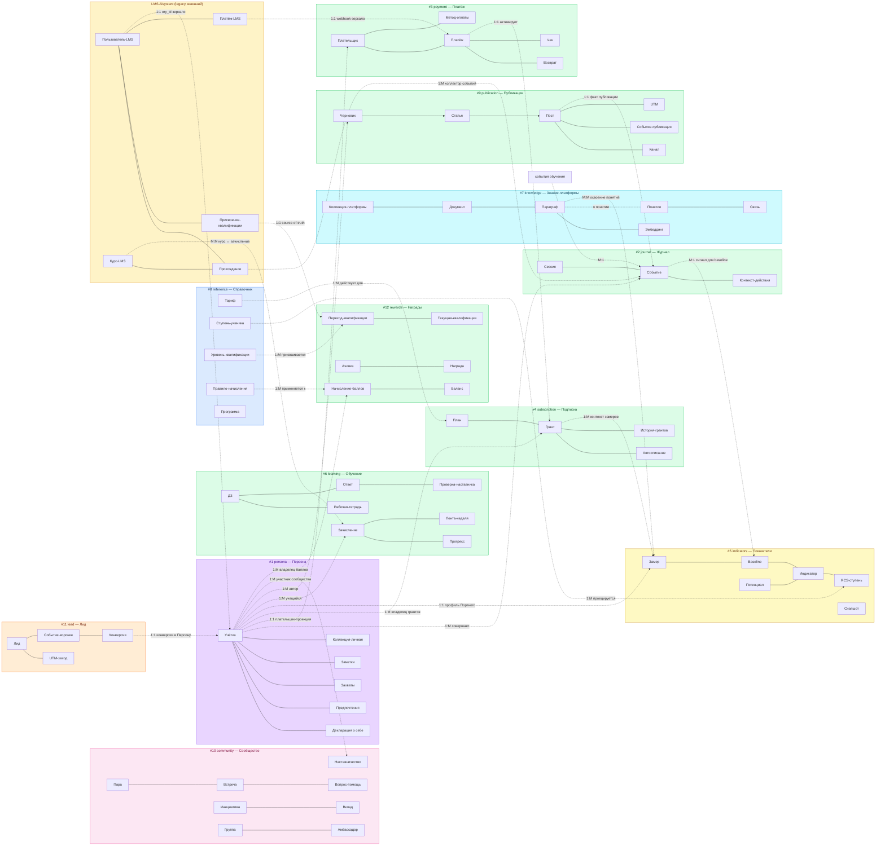

**Легенда цветов кластеров:**
- **Фиолетовый** — Персона (writer = пользователь, owner = Git + Neon projection)
- **Зелёный** — Память.Observed (writer = платформа, событийная)
- **Жёлтый** — Память.Derived (writer = расчётный engine)
- **Розовый** — Relational (связи между персонами)
- **Голубой-светлый** — Catalog/Reference (writer = админ)
- **Голубой-тёмный** — Platform-knowledge (проекция общей онтологии)
- **Оранжевый-светлый** — Proto-Persona (до Ory)
- **Оранжевый-тёмный** — Legacy external (LMS Aisystant)

**Легенда кратностей** (ER-стиль): **1:1** (один-к-одному), **1:M** (один-ко-многим), **M:1** (много-к-одному), **M:M** (много-ко-многим). Внутри кластера кратности опущены для читаемости — показаны в §3 ERD по каждой БД через нотацию `||--o{`.

---

## 3. ERD по каждой БД

> **Методологическое основание:** `DP.METHOD.040` §1 — концептуальная ER только объекты физ.мира. HD «ER ≠ Физ.схема», «Объект ≠ Отношение» (distinctions.md). Детальная физ.схема с колонками, типами и FK **[документ не создан, планируется в WP-253 Ф2 как `DP.ARCH.004-physical-schema.md`]**. Не показаны: `*_log`, `*_cache`, `*_state`, `*_snapshot`, `*_staging`, промежуточные M:N без атрибутов.

### 3.1 #1 persona — Персона

**Категория WP-257:** Персона. **Writer:** пользователь через любой интерфейс (VS Code, бот, веб, CLI) + personal-indexer (эмбеддинги PACK-personal и DS-my-strategy Git-репо). **Owner:** Git пользователя, Neon хранит проекцию.

**BC:** Personal Declaration & Personal Knowledge Projection.

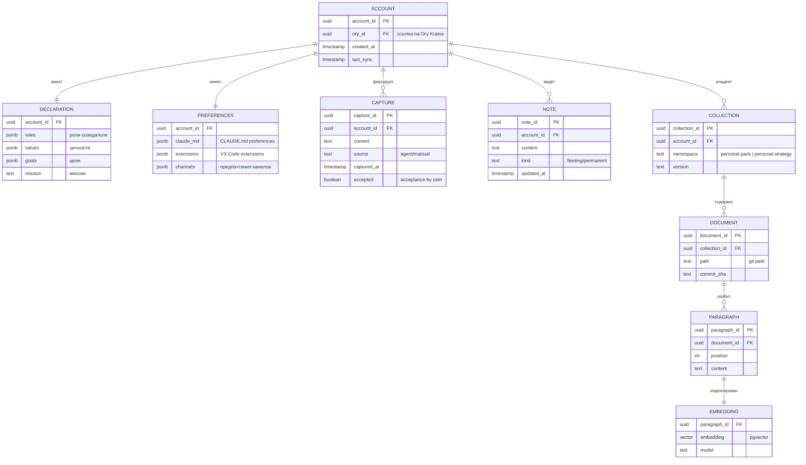

**Инвариант:** каждая запись в `account` соответствует одной записи в Ory Kratos (1:1 через `ory_id`). Удаление учётки в Neon ≠ удаление в Ory (Ory — внешняя система, см. Д1).

**Проекции:** таблицы `document`/`paragraph`/`embedding` — проекции Git-репо пользователя, rebuildable при `git pull` + reindex.

### 3.2 #2 journal — Журнал

**Категория WP-257:** Память.Observed. **Writer:** единый event-коллектор (бот, веб, VS Code, CLI шлют события через gateway). **Owner:** Neon.

**BC:** User Actions Event Stream.

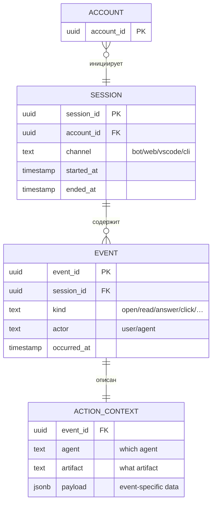

**Инвариант:** append-only (события не редактируются после записи). Retention: 90 дней в hot-path, архив в cold-storage по политике §7.

**Связи кросс-БД:** события из `#6 learning`, `#9 publication`, `#11 lead` могут проецироваться как `EVENT` в `#2 journal` через outbox-pattern (для единой ленты действий пользователя).

### 3.3 #3 payment — Платёж

**Категория WP-257:** Память.Observed. **Writer:** billing-webhook (ЮKassa, Telegram Stars), админ через Directus. **Owner:** Neon.

**BC:** Billing & Payment Reception.

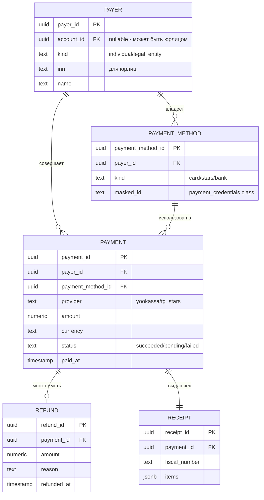

**Инвариант:** `PAYMENT.payer_id` — не `account_id` напрямую (плательщик ≠ персона 1:1; юрлицо может оплачивать за сотрудника-ученика). Связь с Персоной — через `PAYER.account_id` (nullable).

**Класс чувствительности:** `PAYMENT_METHOD.masked_id` = `payment_credentials` (строже PII — см. HD «PII ≠ payment_credentials»). Логирование строго запрещено, хранение только зашифрованным.

### 3.4 #4 subscription — Подписка

**Категория WP-257:** Память.Observed. **Writer:** subscription-service (создание грантов, продление, отмена, пауза). **Owner:** Neon.

**BC:** Subscription Rights & Lifecycle.

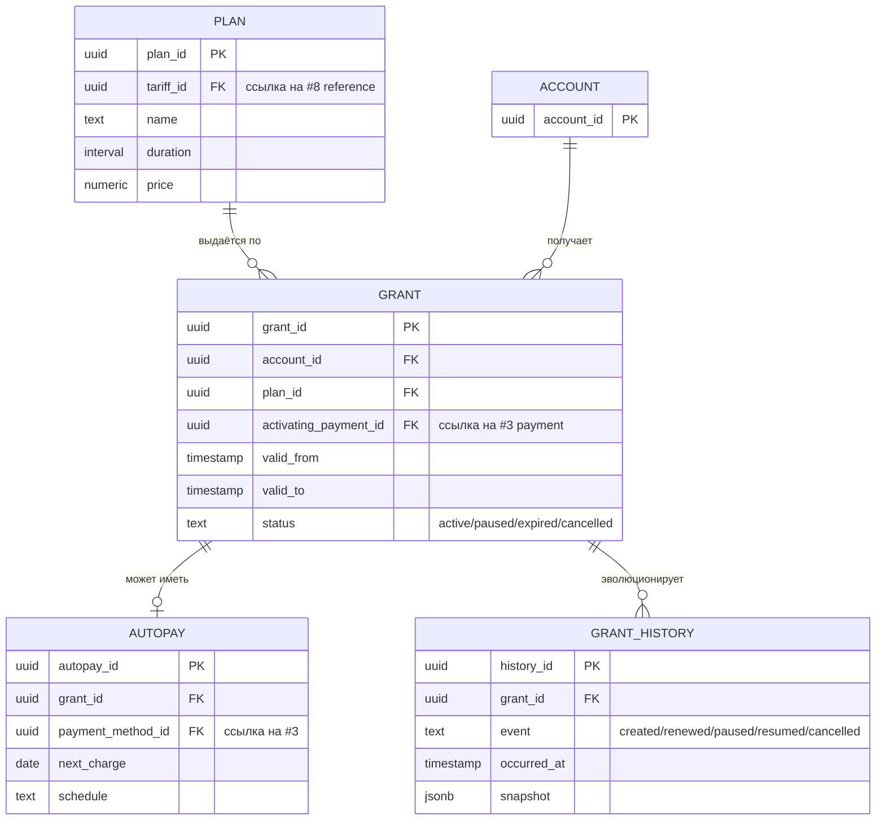

**Инвариант:** у одного `account_id` может быть несколько активных грантов (семейный тариф, gift-подписки), но только один `primary` на каждый тип программы (ЛР/РР). Период `[valid_from, valid_to)` — полуоткрытый.

### 3.5 #5 indicators — Показатели

**Категория WP-257:** Память.Derived. **Writer:** Портной-engine (расчёт baseline, potential, индикаторов, RCS-ступени, проекций). **Owner:** Neon.

**BC:** Derived User Profile (было «ЦД» в v1).

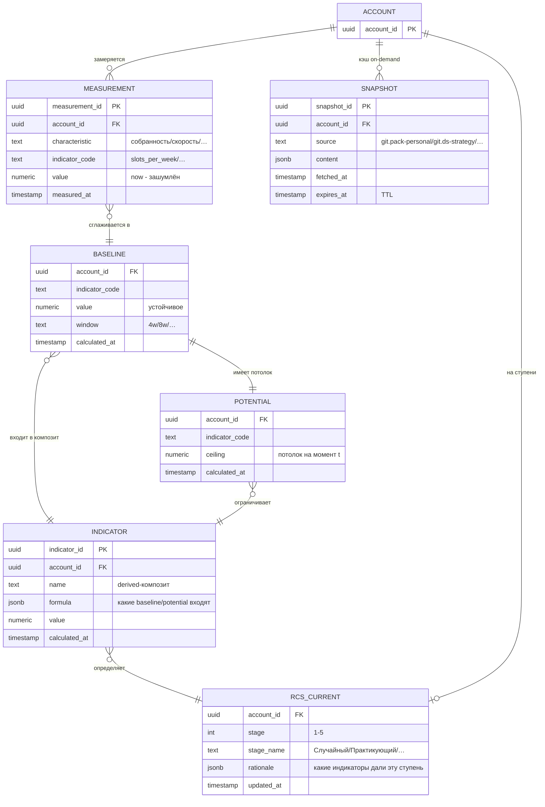

**Инвариант:** `BASELINE.value` — результат расчёта по окну `MEASUREMENT.value` (скользящее среднее/медиана); `POTENTIAL.ceiling` — не мгновенное, а целевой уровень с учётом фундаментального развития (годы). `RCS_CURRENT.stage` — derived-проекция из `INDICATOR` (не writable снаружи Портного).

**Решение WP-257 Ф2:** таблица называется `rcs_current` (не `stage`), чтобы не путалась с уровнем квалификации в `#12 rewards.qualification_current` (разные шкалы, разные писатели). См. HD «Характеристика ≠ Показатель ≠ Значение ≠ Потенциал».

**SNAPSHOT — кэш on-demand:** Портной не должен лазить в Git пользователя каждый расчёт. `SNAPSHOT` = cache pull-данных из Git с TTL. При просрочке → invalidate → re-fetch.

### 3.6 #6 learning — Обучение

**Категория WP-257:** Память.Observed + Derived. **Writer:** learning-service, наставники через Directus, scheduler лент/дайджестов. **Owner:** Neon.

**BC:** Learning Progress & Mentorship Workflow.

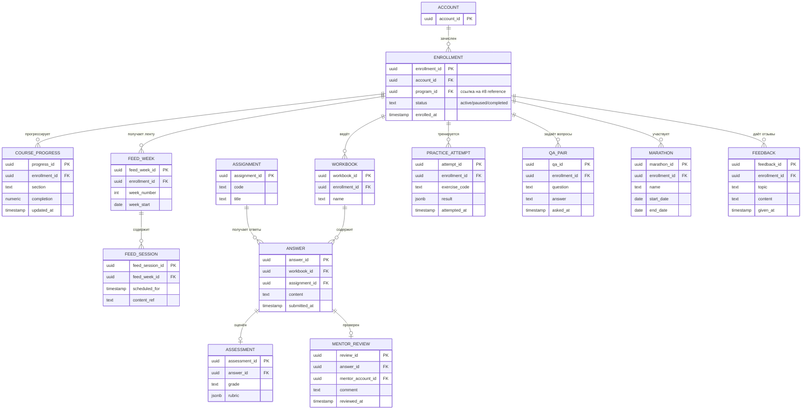

**Инвариант:** `MENTOR_REVIEW.mentor_account_id` ссылается на `ACCOUNT` с активным `MENTORSHIP` в `#10 community` (наставник — это роль, не атрибут учётки).

**Legacy source:** таблицы `COURSE_PROGRESS`, `WORKBOOK`, `ANSWER` во время миграции читают из LMS Aisystant через bridge (`coursepassing`/`taskanswer`), до WP-254 Ф5.

### 3.7 #7 knowledge — Знание-платформы

**Категория WP-257:** Platform-knowledge (projection). **Writer:** knowledge-mcp индексатор (читает платформенные Pack Git-репо и эмбеддит). **Owner:** Neon (как проекция Git).

**BC:** Platform Ontology Projection.

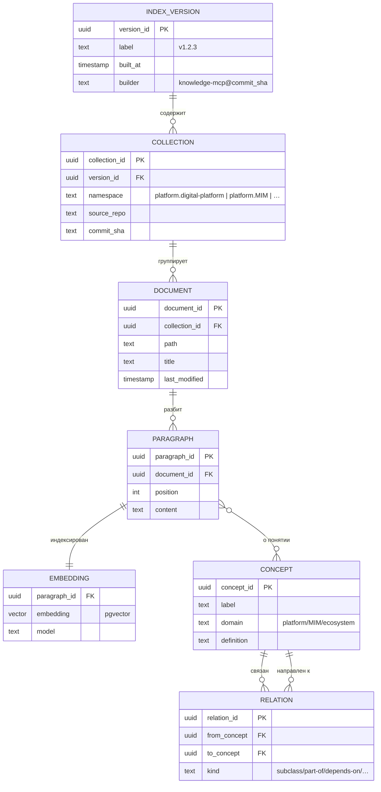

**Инвариант:** `COLLECTION.namespace` префиксом отделяет платформенные коллекции (`platform.*`) от личных (`personal.*` — живут в `#1 persona`). Переиндексация новой `INDEX_VERSION` не ломает активные запросы (старая версия доступна до переключения).

**Concept graph:** 3503 рёбер / 1180 понятий / 344 переведено — актуальная статистика на 22 апр 2026 (WP-242).

### 3.8 #8 reference — Справочник

**Категория WP-257:** Catalog/Reference. **Writer:** админ через Directus (редкие правки, source-of-truth = реестры + решения Методсовета). **Owner:** Neon.

**BC:** Platform Reference Data.

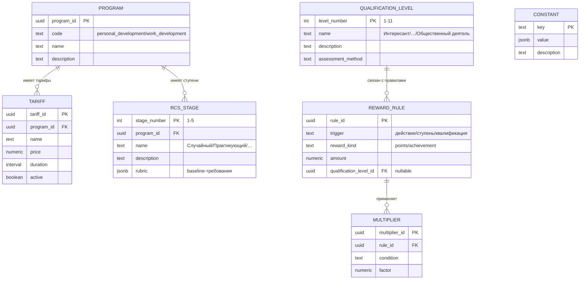

**Инвариант:** справочник обновляется редко и только админом. Все таблицы имеют `valid_from` / `valid_to` для историзации (temporal validity как перпендикулярный атрибут, WP-257).

### 3.9 #9 publication — Публикации

**Категория WP-257:** Память.Observed. **Writer:** content-pipeline (создание → публикация → каналы). **Owner:** Neon.

**BC:** Content Publishing Pipeline.

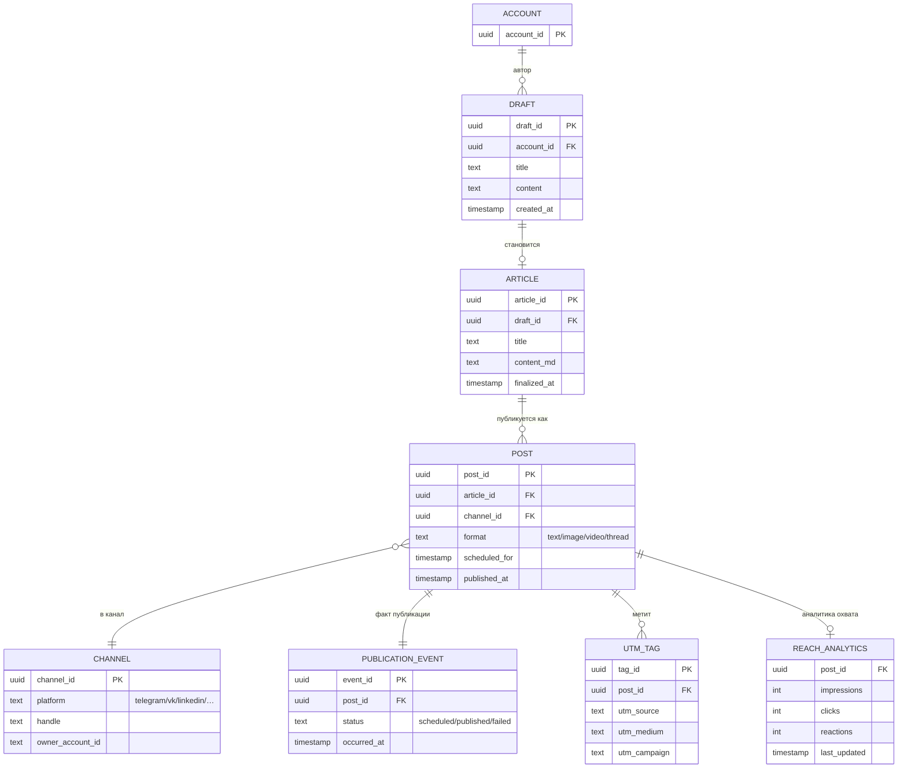

**Инвариант:** `ARTICLE.draft_id` — 1:1 с черновиком после финализации. `POST` может иметь несколько публикаций одного `ARTICLE` в разные каналы (мультиканальный publisher, WP-129).

### 3.10 #10 community — Сообщество

**Категория WP-257:** Relational (связи Persona↔Persona). **Writer:** matching-engine (Random Coffee), mentorship-service, referral-tracker, амбассадорский учёт, event-organizer, initiative-coordinator. **Owner:** Neon.

**BC:** Community Relations & Mutual Support.

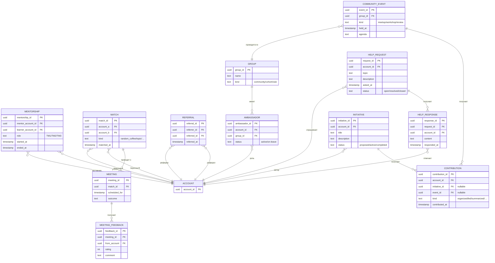

**Инвариант:** `MENTORSHIP.mentor_account_id` — это `ACCOUNT`, у которого есть активный `GRANT` на роль наставника (право проверять ДЗ), подтверждаемое через Keto policy. `MATCH` не превращается в `MEETING` автоматически — нужно действие пользователя (accept).

### 3.11 #11 lead — Лид

**Категория WP-257:** Proto-Persona. **Writer:** landing (форма регистрации), acquisition-funnel (UTM-трекер, веб-аналитика). **Owner:** Neon. **После claim** — учётка переезжает в `#1 persona`.

**BC:** Pre-Ory Acquisition.

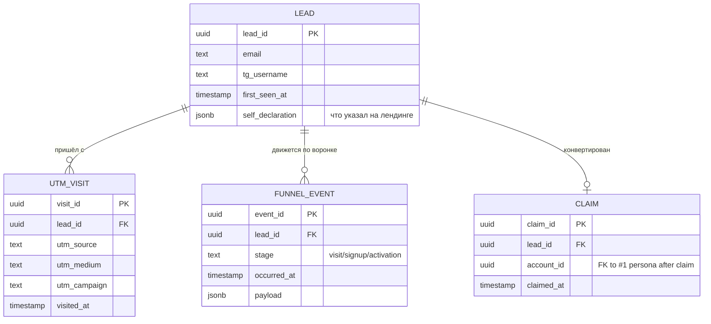

**Инвариант:** `LEAD` существует без `account_id` (до регистрации в Ory). `CLAIM` — одноразовое событие конверсии; после него PII-данные лида мигрируют в `#1 persona.account`, остальное остаётся в `#11` для аналитики воронки.

### 3.12 #12 rewards — Награды

**Категория WP-257:** Память.Observed + Derived. **Writer:** rewards-engine (начисление по правилам из `#8 reference`), Методсовет (присвоение квалификации через Directus). **Owner:** Neon.

**BC:** Points, Achievements, Qualifications.

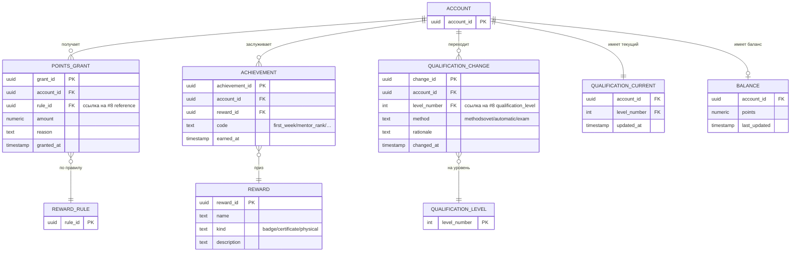

**Инвариант:** `QUALIFICATION_CURRENT` — проекция (derived) последнего `QUALIFICATION_CHANGE`. Перестраивается при каждом change. `BALANCE` — агрегат `POINTS_GRANT` минус списания. Отличие от RCS-ступени в `#5 indicators.rcs_current`: RCS двигает Портной (расчёт), квалификацию двигает Методсовет (решение).

### 3.13 External: LMS Aisystant (legacy)

**Категория WP-257:** вне пользовательской модели (внешняя система). **Writer:** LMS-команда (Дима). **Owner:** отдельная БД LMS (не Neon платформы). **Наше отношение:** read-only через bridges для миграции исторических данных.

**BC:** Legacy Learning Management (источник истории, зеркалится в #6, #12, #3).

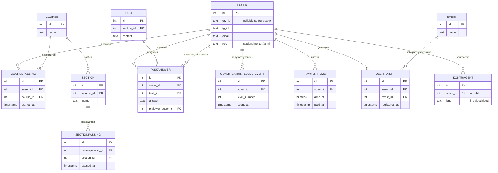

**Роль в миграции:** LMS остаётся source-of-truth до WP-254 (миграция 9 учебных объектов). `QUALIFICATION_LEVEL_EVENT` — единственный source-of-truth квалификаций до эстафеты в `#12 rewards.qualification_change`. Bridge — read-only, writes блокированы.

---

## 4. Связи между БД (межкластерные)

| Связь | От (БД.Объект) | К (БД.Объект) | Кратность | Тип | Комментарий |
|---|---|---|---|---|---|
| Пользовательская идентичность | #1.ACCOUNT.ory_id | Ory Kratos (внешняя) | 1:1 | FK | Persona layer, Д1 |
| Плательщик-Персона | #3.PAYER.account_id | #1.ACCOUNT | M:1 (nullable) | FK | Юрлицо может платить за другого |
| Активация гранта | #3.PAYMENT | #4.GRANT | 1:1 | FK | `activating_payment_id` |
| Грант-Персона | #4.GRANT.account_id | #1.ACCOUNT | M:1 | FK | |
| Тариф плана | #4.PLAN.tariff_id | #8.TARIFF | M:1 | FK | Справочник |
| Замер-Персона | #5.MEASUREMENT.account_id | #1.ACCOUNT | M:1 | FK | |
| Grant → контекст замеров | #4.GRANT | #5.MEASUREMENT | 1:M | логическая | Замер имеет смысл в контексте активного гранта |
| Baseline ← события | #2.EVENT | #5.BASELINE | M:1 | агрегация | Портной читает события, пишет baseline |
| RCS-ступень ← справочник | #5.RCS_CURRENT.stage | #8.RCS_STAGE | M:1 | FK | |
| Зачисление-Персона | #6.ENROLLMENT.account_id | #1.ACCOUNT | M:1 | FK | |
| Программа зачисления | #6.ENROLLMENT.program_id | #8.PROGRAM | M:1 | FK | |
| Наставник в проверке | #6.MENTOR_REVIEW.mentor_account_id | #1.ACCOUNT (+ #10.MENTORSHIP) | M:1 | FK + Keto | |
| События обучения → Журнал | #6.* (events) | #2.EVENT | 1:1 | outbox projection | |
| Коллекция платформы | #7.COLLECTION.namespace | PACK-* (Git) | M:1 | проекция | |
| Параграф → Понятие | #7.PARAGRAPH | #7.CONCEPT | M:M | |  |
| Авторство Публикации | #9.DRAFT.account_id | #1.ACCOUNT | M:1 | FK | |
| Событие Публикации → Журнал | #9.PUBLICATION_EVENT | #2.EVENT | 1:1 | outbox | |
| Сообщество-Персона | #10.* | #1.ACCOUNT | M:M | через роли | Mentorship, Match, Ambassador — все через FK |
| Конверсия Лида | #11.CLAIM.account_id | #1.ACCOUNT | 1:1 | FK | После claim |
| Правило начисления | #12.POINTS_GRANT.rule_id | #8.REWARD_RULE | M:1 | FK | |
| Уровень квалификации | #12.QUALIFICATION_CHANGE.level_number | #8.QUALIFICATION_LEVEL | M:1 | FK | |
| Баланс-Персона | #12.BALANCE.account_id | #1.ACCOUNT | 1:1 | FK | |

### Цветовая схема типов связей

- **FK** — прямая внешнеключевая связь в БД
- **Проекция** — rebuildable данные из другого источника
- **Outbox** — асинхронное копирование события в стрим
- **Агрегация** — writer читает источник, вычисляет, пишет результат
- **Логическая** — смысловая связь, не обязательно enforced на уровне БД (cross-DB)
- **Keto** — авторизация через политики Keto (Ory)

---

## 5. Потоки

### 5.1 Поток идентичности и доступа

От первого касания на лендинге до активной подписки.

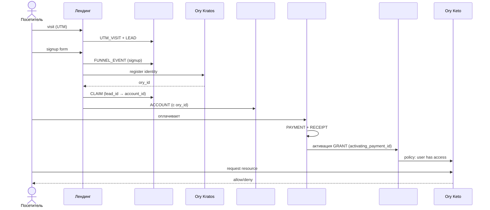

### 5.2 Поток событий → Показатели (Память.Observed → Память.Derived)

Как первичные действия превращаются в baseline и RCS-ступень.

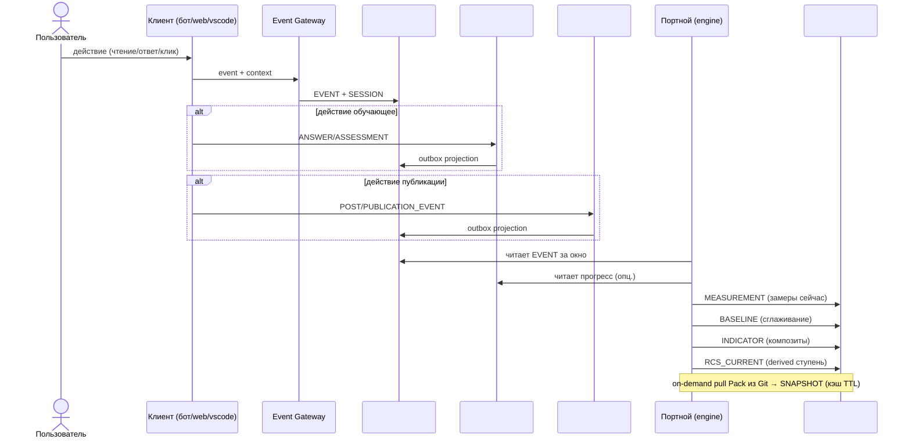

### 5.3 Поток содержания → Публикации

От черновика до многоканальной публикации.

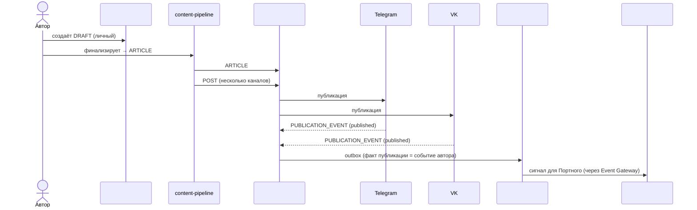

---

## 6. Писатели и читатели по БД

| БД | Пишут | Читают |
|---|---|---|
| #1 persona | пользователь (через VS Code/бот/веб/CLI), personal-indexer | Портной, Навигатор, Оркестратор, все клиент-интерфейсы, knowledge-search |
| #2 journal | event-gateway (от всех клиентов), outbox из #6/#9/#11 | Портной, Аналитика (Metabase view), Navigator |
| #3 payment | billing-webhook (ЮKassa, Stars), admin (Directus) | #4 subscription, отчёты, админка |
| #4 subscription | subscription-service | gateway-mcp (проверка прав), Keto (policy), бот, Персона flow |
| #5 indicators | Портной-engine | Навигатор, Оркестратор, Диагност, бот (progress bar), Оценщик |
| #6 learning | learning-service, Directus (наставники), scheduler | бот (ленты), Портной (сигналы), Metabase |
| #7 knowledge | knowledge-mcp indexer | gateway-mcp, все агенты (retrieval), content-pipeline |
| #8 reference | admin (Directus) | все сервисы, которые используют константы/тарифы/квалификации |
| #9 publication | content-pipeline | бот (анонсы), аналитика охвата, auth-proxy к каналам |
| #10 community | matching-engine, mentorship-service, referral-tracker, event-organizer | бот (анонсы встреч), Metabase, Навигатор |
| #11 lead | landing, acquisition-funnel | marketing analytics, Директор-УС (CRM), админка |
| #12 rewards | rewards-engine, Методсовет (Directus) | бот (баланс, ачивки), Персона (статус), публикации, Navigator |

---

## 7. Что осталось вне Neon (и почему)

| Не БД Neon | Причина | Где живёт |
|---|---|---|
| **Activity Hub (старый)** | был контейнер-смесь, не домен (Д11: событие ≠ хранилище) | распущен между #2/#3/#9/#11/#12 |
| **Health / Uptime** | SaaS закрывает задачу (Д2) | Better Uptime / Statuspage.io |
| **Metabase** | аналитический инструмент, не домен (Д2) | поверх #1-#12 через read-replica |
| **Ory identity** | внешняя система (Д1) | Ory Kratos, у нас только `ory_id` FK |
| **Ory Keto policies** | внешняя система | Ory Keto, у нас ссылки на relation_tuples |
| **FSM-state бота, message cache** | runtime-состояние, ephemeral | Redis / in-memory |
| **Pack пользователя (PACK-personal)** | Git пользователя, не Neon | GitHub, проекция → #1 |
| **Pack платформы (PACK-digital-platform, PACK-MIM, ZP, FPF, SOTA)** | Git команды, не Neon | GitHub, проекция → #7 |
| **On-demand pull Pack-состояния** | слой «Контекст» WP-257, runtime-сборка | не хранится; кэш → #5 `snapshot` |
| **LMS Aisystant** | legacy внешняя система | отдельная БД LMS, read-only bridge |
| **Langfuse traces** | observability SaaS | Langfuse cloud |
| **WakaTime activity** | 3rd-party tracking | WakaTime cloud, pull → #2 journal (projection) |

---

## 8. Миграция 9 → 12 БД (эстафета в WP-253)

Планируется в **WP-253 (DP.ROADMAP.001)** — мастер-план фаз с gating-критериями. WP-228 Ф25 утверждает целевую карту, WP-253 Ф1 строит фазы.

### 8.1 Таблица переходов

| Текущая БД (9) | Целевая БД (12) | Действие | Зависимость РП |
|---|---|---|---|
| `platform` (#1 в v1) | Персона #1 + Подписка #4 + Справочник #8 | расщепить по writer/owner | WP-227, WP-253 |
| `knowledge` (#2 в v1) | Персона #1 (личные коллекции) + Знание-платформы #7 (платформенные) | расщепить по владельцу | WP-187 |
| `activity-hub` (#3 в v1) | Журнал #2 + Публикации #9 + Лид #11 + Награды #12 | распустить (Д11) | WP-253 |
| `payment-registry` (#4 в v1) | Платёж #3 + Награды #12 (баллы) | расщепить | WP-246 |
| `digital-twin` (#5 в v1) | Показатели #5 | переименовать (v1 → canonical) | WP-227 |
| `aist-bot` (#6 в v1) | Обучение #6 + Журнал #2 (events) + runtime (FSM → Redis) | расщепить по слоям | WP-254 |
| `metabase` (#7 в v1) | — | убрать (Д2, read-replica над другими) | WP-244 |
| `health` (#8 в v1) | — | убрать (Д2, внешний SaaS) | WP-244 |
| `content-pipeline` (#9 в v1) | Публикации #9 | переименовать | WP-155 |
| (новая) | Сообщество #10 | создать (extract из PMB-1 + WP-256) | WP-256 |
| (новая) | Лид #11 | создать (extract из v1 #3/#4) | WP-188 |
| (новая) | Награды #12 | создать (консолидация баллов + ачивок + квалификаций) | WP-253 |

### 8.2 Порядок миграции (ориентировочно)

1. **Подготовка** — DP.ROADMAP.001 (WP-253 Ф1): утвердить целевые имена, проверить занятость имён в Neon, подготовить DDL.
2. **Низкорискованные переименования** — `digital-twin → indicators`, `content-pipeline → publication` (WP-155 / WP-227).
3. **Расщепление `platform`** — вынести Подписку и Справочник в отдельные БД (WP-253 Ф2).
4. **Расщепление `knowledge`** — личные коллекции в #1, платформенные в #7 (WP-187).
5. **Роспуск `activity-hub`** — outbox projections в #2, #9, #11, #12.
6. **Миграция `aist-bot`** — учебные объекты → #6 learning (WP-254), runtime FSM → Redis.
7. **Создание новых БД** — #10 community (WP-256), #11 lead, #12 rewards.
8. **Снятие лишних** — вывести из production `metabase` DB, `health` DB.

### 8.3 Gating-критерии (уточняются в WP-253 Ф1)

Каждая фаза завершается, только если:
- DDL применён без потери данных (`COUNT` до/после совпадают)
- Все зависимые сервисы читают новую БД (env vars + code updated)
- Retention и PII-классификация соблюдены (WP-212 B7.3)
- Roll-back план задокументирован

---

## 9. Верификация (три чеклиста)

### 9.1 Чеклист SPF.SPEC.005 — выбор БД

Применение B.0 + B1-B4 + N1-N5 к каждой из 12 БД. Все клетки должны быть `✅` или `-` (не применимо).

| БД | B.0 категория | B1 единый writer-owner | B2 свой инвариант | B3 blast-radius | B4 свой словарь | N1 noun-area | N2 central entity | N3 no tech markers | N4 RU concept | N5 lowercase |
|---|---|---|---|---|---|---|---|---|---|---|
| #1 persona | Персона ✅ | пользователь ✅ | Git ↔ Neon consistency ✅ | ✅ независима | словарь Персоны ✅ | persona ✅ | ACCOUNT ✅ | ✅ | Персона ✅ | ✅ |
| #2 journal | Память.Observed ✅ | event-gateway ✅ | append-only ✅ | ✅ deletable | события ✅ | journal ✅ | EVENT ✅ | ✅ | Журнал ✅ | ✅ |
| #3 payment | Память.Observed ✅ | billing-webhook ✅ | идемпотентность платежей ✅ | ✅ (queue on outage) | биллинг ✅ | payment ✅ | PAYMENT ✅ | ✅ | Платёж ✅ | ✅ |
| #4 subscription | Память.Observed ✅ | subscription-service ✅ | период-FK к гранту ✅ | ✅ cached JWT | подписка ✅ | subscription ✅ | GRANT ✅ | ✅ | Подписка ✅ | ✅ |
| #5 indicators | Память.Derived ✅ | Портной ✅ | rebuildable из #2 ✅ | ✅ (Портной = single writer) | показатели ✅ | indicators ✅ | INDICATOR ✅ | ✅ | Показатели ✅ | ✅ |
| #6 learning | Память.Observed+Derived ⚠️ (множественные writers) | learning-service + mentors ⚠️ | наставник-ученик целостность ✅ | ✅ degraded OK | обучение ✅ | learning ✅ | ENROLLMENT ✅ | ✅ | Обучение ✅ | ✅ |
| #7 knowledge | Platform-knowledge ✅ | knowledge-mcp indexer ✅ | Git ↔ эмбеддинг consistency ✅ | ✅ stale OK | онтология ✅ | knowledge ✅ | CONCEPT ✅ | ✅ | Знание-платформы ⚠️ (составное имя) | ✅ |
| #8 reference | Catalog ✅ | admin (Directus) ✅ | temporal validity ✅ | ✅ read-heavy | справочник ✅ | reference ✅ | PROGRAM/TARIFF ✅ | ✅ | Справочник ✅ | ✅ |
| #9 publication | Память.Observed ✅ | content-pipeline ✅ | pipeline draft→article→post ✅ | ✅ retry safe | публикации ✅ | publication ✅ | POST ✅ | ✅ | Публикации ✅ | ✅ |
| #10 community | Relational ✅ | matching+mentorship+events ⚠️ (множественные) | симметричность связей ✅ | ✅ degraded OK | сообщество ✅ | community ✅ | MENTORSHIP/MATCH ✅ | ✅ | Сообщество ✅ | ✅ |
| #11 lead | Proto-Persona ✅ | landing+funnel ✅ | pre-Ory identity ✅ | ✅ standalone | лид ✅ | lead ✅ | LEAD ✅ | ✅ | Лид ✅ | ✅ |
| #12 rewards | Память.Observed+Derived ⚠️ | rewards-engine + Методсовет ⚠️ | баланс = Σ начислений ✅ | ✅ (stale OK) | награды ✅ | rewards ✅ | POINTS_GRANT ✅ | ✅ | Награды ✅ | ✅ |

**Замечания:**
- **#6, #10, #12 — множественные writers.** По B1 строго требуется один семантический writer. Здесь принято сознательное решение: `#6 learning` имеет один BC «Learning Progress», внутри которого writer'ы делят разные аспекты (learner пишет ANSWER, mentor — REVIEW, scheduler — FEED_WEEK); аналогично `#10` и `#12`. Альтернатива — расщеплять каждый на 2-3 БД — признана преждевременной (Post-MVP decision).
- **#7 N4 составное имя** — «Знание-платформы» через дефис. N5 lowercase `knowledge` — ок. Альтернатива «Онтология» отвергнута (размывает: онтология включает и личную).

### 9.2 Замечания Андрея Д1-Д12 (Ф24 ревью 21 апр)

| # | Замечание | Где учтено в 12 БД |
|---|---|---|
| **Д1** | Очистить ядро Platform Core: Созидатель + права доступа (Ory — внешняя) | #1 persona = только декларация + preferences; Ory = `ory_id` FK, никаких собственных identity-таблиц |
| **Д2** | Убрать Health и Metabase из Neon | §7 — выведены на SaaS / read-replica |
| **Д3** | Субагент-исследование кода LMS Димы | §3.13 LMS ERD + bridge-контракт в §8 |
| **Д4** | Payment: плательщик, платёж, начисление, получатель, тарифы, методы оплаты + баллы | #3 payment (плательщик/платёж/метод/чек) + #12 rewards (баллы) + #8 reference (тарифы) + #4 subscription (получатель через грант). Расщеплено вместо одной «перегруженной» payment-registry |
| **Д5** | Knowledge универсальный: коллекция/документ/chunk отделены от concept/мем | #7 knowledge ERD: `COLLECTION → DOCUMENT → PARAGRAPH → EMBEDDING` отделено от `CONCEPT ↔ RELATION`. Личные коллекции — в #1 persona с той же структурой |
| **Д6** | Digital Twin: +пользователь, +квалификация, проверить JSON-модель | #5 indicators с явным `account_id` FK на все замеры; квалификация вынесена в #12 (по HD: квалификация — формальное присвоение, не замер) |
| **Д7+Д8+Д9** | Связи между ОБЪЕКТАМИ (не кластерами) + кратности + названия | §2 карта — все межкластерные стрелки object→object с кратностями 1:1/1:M/M:1/M:M и подписями; §4 таблица связей |
| **Д10** | Ревизия «объект ≠ атрибут» (множитель квалификации, уровень и т.п.) | §3 ERD — все ранее-ошибочные узлы свёрнуты в атрибуты (множитель — колонка `factor` в #8.MULTIPLIER, текущий уровень — derived в #12.QUALIFICATION_CURRENT) |
| **Д11** | Activity Hub: базовый объект «событие» | `activity-hub` БД распущен; central object «СОБЫТИЕ» живёт в #2 journal, узкие типы событий — в #9/#11/#12 outbox-проекциями |
| **Д12** | Созвон с Димой: Payment + LMS (какие объекты нужно отразить) | §3.13 LMS ERD отражает 10+ физ.объектов LMS; WP-228 Ф24 lms-audit — отдельный документ. Bridge-чекпоинт в §8 |

**Все 12 правок Андрея учтены.**

### 9.3 Полнота по категориям WP-257

| Категория WP-257 | Покрыто | Комментарий |
|---|---|---|
| **Персона** (writer=пользователь, owner=Git) | ✅ #1 persona | Центральная БД пользователя; Git-проекция индексируется в Neon |
| **Память.Observed** (writer=платформа, event-based) | ✅ #2 #3 #4 #9 | Журнал как универсальный event-stream; домен-специфичные события в #3/#4/#9 |
| **Память.Derived** (writer=engine, расчётный) | ✅ #5 | Портной владеет всеми расчётами (RCS, baseline, potential, индикаторы) |
| **Память.Observed+Derived** (смешанные writers) | ⚠️ #6 #12 | #6 learning и #12 rewards имеют наблюдаемые (ответ, платёж) и расчётные (оценка, квалификация) таблицы вместе — сознательное решение, BC един |
| **Platform-knowledge** (проекция онтологии) | ✅ #7 | knowledge-mcp индексирует платформенные Pack; личные — в #1 |
| **Catalog/Reference** (writer=admin) | ✅ #8 | Тарифы, ступени, уровни квалификации, правила |
| **Relational** (связи Persona↔Persona) | ✅ #10 | Полный цикл: matching → поддержка → события → развитие |
| **Proto-Persona** (до Ory) | ✅ #11 | Лид → claim → Персона |
| **Service/Ops** | ❌ 0 БД | Вынесено на SaaS (Д2) |
| **Контекст** (runtime, не хранится) | ❌ не БД | Runtime промпт-сборка, кэш on-demand → #5 SNAPSHOT |

**Покрытие полное за вычетом Service/Ops (сознательный отказ Д2) и Контекст (не storage-категория).**

### 9.4 Применённые различения (проверка)

| Различение (HD / distinctions.md) | Где применено в архитектуре |
|---|---|
| Персона ≠ Память ≠ Контекст (DP.D.052, HD #27) | §1 сводная таблица — категория WP-257 для каждой БД |
| Событие ≠ Хранилище-контейнер (Р-W17-1, Д11) | Activity Hub распущен (§8), `#2 journal.EVENT` — единственное место всех событий |
| Объект ≠ Атрибут (Д10) | Все ERD в §3 — множители/коды/lookup как атрибуты, не узлы |
| Система ≠ Роль (D.141 PD) | `#1.ACCOUNT` = система; mentorship/ambassador в `#10` = роли через связи |
| Характеристика ≠ Показатель ≠ Значение ≠ Потенциал (D.140) | `#5 indicators` — `MEASUREMENT` (значение-сейчас) + `BASELINE` (устойчивое значение) + `POTENTIAL` + `INDICATOR` (композит); `CHARACTERISTIC` определяется в Pack, не в БД |
| RCS-ступень ≠ Уровень квалификации | `#5.RCS_CURRENT` (derived Портным, 5 ступеней) vs `#12.QUALIFICATION_CURRENT` (formal Методсовет, 11 уровней) |
| Объект ≠ Отношение (WP-228 19 апр, Andrey) | ERD показывают только объекты с именами собственными; служебные M:N без атрибутов — на физ.схеме |
| PII ≠ payment_credentials | `#3.PAYMENT_METHOD.masked_id` явно помечен `payment_credentials` — строже PII |
| Рабочий документ ≠ Публикация | `#1.NOTES` + `#1.CAPTURES` (черновое) vs `#9.PUBLICATION_EVENT` (факт публикации) |
| Бесплатный Gateway ≠ Полный Gateway (DP.SC.112) | #1 персональные коллекции доступны подписчикам; #7 платформенные — всем аутентифицированным |
| ER ≠ Физ.схема | §3 — концептуальная ER; физ.схема с индексами/партициями — в WP-253 Ф2 |

**Все ключевые различения применены.**

---

## 10. Открытые вопросы

### 10.1. Расщепление #6/#10/#12 (множественные writers)

B1 проход `⚠️` у трёх БД. Вопрос: нужен ли follow-up РП по строгой ревизии после MVP? Кандидат: **WP-258-post-mvp-db-split** (Q3 2026) — проанализировать, оправдано ли совмещение писателей, или BC надо расщеплять.

### 10.2. `#7 knowledge` N4 составное имя

«Знание-платформы» через дефис — не идеально по N4 (single-word в русском). Альтернатива «Онтология» отвергнута (включает личную). Текущее решение — записать в name_rationale: «двусоставное имя допустимо, когда русский single-word создаёт онтологический конфликт».

### 10.3. Пакетное переименование БД в prod

Не раньше DONE зависимых WP (WP-155, WP-246, WP-187, WP-254). Требует: DDL migration + env vars update + MCP tool names + bot handlers update. Эстафета — WP-253.

### 10.4. Сервисы Persona / Memory / Projection

Pack-сущности определены (DP.ARCH.005 Persona Entity, DP.ARCH.006 Memory Record, DP.ARCH.007 Projection — WP-257 Ф5, 22 апр 2026, заменили монолитный DP.ARCH.003). Выделение соответствующих runtime-сервисов (persona-mcp / memory-mcp / projection-service) — открытый вопрос реализации, решается в WP-253 мастер-плане по БД + будущих ArchGate.

### 10.5. Retention / GDPR политики

Временные окна для append-only таблиц (`#2.EVENT`, `#9.PUBLICATION_EVENT`, `#11.FUNNEL_EVENT`) не зафиксированы. WP-240 Retention policy — уточнить в Q2.

### 10.6. Plugin API L2 (WP-258)

Как внешние разработчики расширяют Персону и Показатели, не трогая L2 ядро? Design в Q3 (WP-258 из WP-250 Ф-F.4).

### 10.7. Контракт bridges с LMS

Формализовать: какие таблицы LMS read-only bridge vs писатель-мигратор. Фиксация в будущем `DP.ARCH.008-lms-bridge-contracts.md` (WP-254 Ф0; ID сдвинут — DP.ARCH.005/006/007 заняты под Persona/Memory/Projection в WP-257 Ф5).

---

## 11. Связанные артефакты

- **Карта данных (операционный трекер):** `DS-my-strategy/inbox/WP-228-neon-data-map.md`
- **Мастер-план миграции:** `PACK-digital-platform/.../DP.ROADMAP.001` (в WP-253 Ф1)
- **Аудит LMS:** `DS-my-strategy/inbox/WP-228-F24-lms-audit.md`
- **Правила границ:** `SPF/spec/SPF.SPEC.005-boundary-rules.md`
- **Метод ER-моделирования:** `PACK-digital-platform/.../DP.METHOD.040-er-modeling.md`
- **Канон Персона/Память/Контекст:** `memory/project_persona_memory_context.md` (DP.D.052)
- **Классификация данных (B7.3):** WP-212 B7.3.1 L2 Data Classification Map (в работе)

---

## 12. История версий

| Версия | Дата | Описание |
|---|---|---|
| v1 | 14 апр 2026 | Первая версия: 9 БД, монолитный «ЦД» в `digital-twin`, `activity-hub` как контейнер-смесь |
| v1.1 | 19 апр 2026 | +`content-pipeline` БД (9-я база); §7.0.2 реестр физ.объектов |
| v1.2 | 21 апр 2026 | Ф24 правки Андрея (Д1-Д12): очистка Platform Core, вынос Metabase/Health, роспуск Activity Hub подготовлен |
| **v2** | **22 апр 2026** | **Целевая карта 12 БД (Ф25): расщепление ЦД → Персона/Память/Контекст (WP-257); новые БД Сообщество/Лид/Награды; вынос SaaS; верификация по 3 чеклистам** |
