# DP.ARCH.004 — Архитектура данных Neon

---

<details open>
<summary><b>1. Контекст и статус</b></summary>

**Зачем этот документ:** мы проектируем новую архитектуру всех систем платформы Aisystant. Структура баз данных — фундамент: от неё зависит безопасность, независимость команд, масштабируемость и возможность замены отдельных сервисов. Этот документ — source-of-truth по тому, какие данные где живут, как сервисы связаны и какие проблемы ещё нужно решить.

**Текущее состояние (апр 2026):** все таблицы живут в одной базе `platform` в Neon. Разделение на 9 баз — следующий РП (~20-40h, не начат).

**Что зафиксировано:**
- Принципы разделения данных (7 инвариантных правил)
- Карта 9 баз + внешние системы и их связи
- ERD всех таблиц включая новые (audit log, trace_id, тиры, шифрование токенов)
- Принятые архитектурные решения по безопасности, наблюдаемости, масштабированию

---

**Как читать (для команды):**

Ссылка на документ: **https://github.com/TserenTserenov/PACK-digital-platform/blob/main/pack/digital-platform/02-domain-entities/DP.ARCH.004-neon-data-architecture.md**

**В браузере (GitHub):** разделы открываются кликом на заголовок ▶ / ▼.

**В VS Code:** открыть файл → нажать `Cmd+Shift+V` (Mac) или `Ctrl+Shift+V` (Windows/Linux) → откроется Markdown Preview с интерактивными спойлерами.

**Навигация:** §3 Карта баз — быстрый ориентир. Нужна конкретная таблица → §8 Справочник (Ctrl/Cmd+F по имени таблицы). Нужно понять связи — §4 Диаграмма или §6 кто читает/пишет.

</details>

---

<details open>
<summary><b>2. Принципы</b></summary>

**П1. 1 сервис = 1 база** (не схема)
Каждый сервис имеет собственную БД с собственными credentials. Это гарантирует, что компрометация одного сервиса не открывает данные других.

**П2. FK только внутри одной базы**
Ссылки между сервисами — только `ory_id`/`telegram_id` без FK constraint. Это позволяет деплоить и мигрировать каждую базу независимо.

**П3. Схема = namespace для роли-администратора**
Внутри базы схемы разграничивают доступ ролей (финансист видит `finance.*`), а не изолируют сервисы — чтобы не создавать ложное ощущение безопасности.

**П4. `ory_id` — глобальный ключ для платформ-сервисов**
Платформ-базы хранят `ory_id` без FK — Ory Kratos остаётся единственным source of truth идентичности. Бот до OAuth работает по `telegram chat_id`; разрешение `chat_id → ory_id` — через `activity-hub.IDENTITY_MAP` (WP-187).

**П5. Activity Hub — проектировать под замену**
OAuth-конфигурация (`USER_INTEGRATIONS`) хранится в `platform-core` — чтобы при смене движка событий (ClickHouse/TimescaleDB) не потерять настройки интеграций.

**П6. Платежи — изолированный реестр**
`payment-registry` — единственная база с финансовыми транзакциями. Metabase читает только через `metabase_reader` с RLS (агрегаты без PII), прямого доступа у других сервисов нет.

**П6.1. Классы чувствительности данных (→ WP-212 Ф9, B7.3)**

Для принятия решений о RLS, ролях и шифровании различать четыре класса:

| Класс | Примеры | Писатель | Читатель | Требования |
|-------|---------|----------|----------|-------------|
| `public` | агрегаты, справочники (каналы, валюты, статусы) | сервисы | все роли, Metabase | — |
| `PII` | email, telegram_id, ory_id, имя, чат | владеющий сервис | владелец + агрегаторы с обезличиванием | RLS по user_id; Metabase — только агрегаты |
| `payment_credentials` | `autopay_data` (payment_method_id YooKassa), токены рекуррентных списаний | `payment-scheduler` + `incremental-sync` (до cutover) | `payment-scheduler` (формирование запроса в YooKassa) | Строже PII: REVOKE для Metabase и Бота; аудит SELECT; рассмотреть шифрование at-rest; unlink + обнуление при отмене пользователем |
| `secrets` | API-ключи, webhook secrets, Ory client secrets | деплой | процесс, владеющий секретом | Не в Neon — в Railway/CF secrets |

**Правило класса `payment_credentials`:** зная значение + API-ключ провайдера (YooKassa), можно инициировать произвольное списание с карты. Поэтому: (1) writer и reader на уровне ролей явно ограничены; (2) никаких агрегаций/JOIN с участием этой колонки в Metabase; (3) при отмене автопродления пользователем — unlink токена в YooKassa + обнуление колонки в Neon. До cutover WP-246 Ф15 source-of-truth для `autopay_data` — LMS; после — Neon.

**П7. `SUBSCRIPTION_GRANTS` в `platform-core` — gateway-паттерн**
`payment-registry` синхронизирует гранты в `platform-core` через cron (push-based sync). Все сервисы проверяют права только здесь — единая точка авторизации, не дублирующая логику.

**Инвариант двойной проверки:** gateway-mcp выполняет `verifyJWT` + `checkSubscription` **до** фанаута в downstream MCP (knowledge-mcp, digital-twin-mcp и др.). Если хотя бы одна проверка не прошла — gateway отвечает 401/403 немедленно, не обращаясь к downstream сервисам. Downstream сервисы не реализуют собственную проверку подписки — это исключительная ответственность gateway.

</details>

---

<details open>
<summary><b>3. Карта баз данных</b></summary>

```
Neon Project: aisystant
│
├── DB #1: platform-core   ← USER_IDENTITIES + SUBSCRIPTION_GRANTS
│                             + GITHUB_CONNECTIONS + GOOGLE_CALENDAR_CONNECTIONS
│                             + USER_INTEGRATIONS + BACKEND_REGISTRY
│                             + PRODUCTS + MENTOR_ASSIGNMENTS
│                             + directus.* (~15 таблиц)
│
├── DB #2: digital-twin    ← DIGITAL_TWINS + POINT_TRANSACTIONS
│                             + LEARNER_CONCEPT_MASTERY
│
├── DB #3: knowledge       ← DOCUMENTS + CONCEPTS + CONCEPT_EDGES
│                             + CONCEPT_MISCONCEPTIONS + RETRIEVAL_FEEDBACK
│                             + GITHUB_INSTALLATIONS + USER_SOURCES
│
├── DB #4: activity-hub    ← RAW_EVENTS (partitioned) + USER_EVENTS
│                             + LEARNING_HISTORY (Gold)
│                             + IDENTITY_MAP + SYNC_LOG + QUARANTINED_EVENTS
│                             ⚠ кандидат на замену ClickHouse/TimescaleDB
│
├── DB #5: payment-registry ← FINANCE_PAYMENTS + FINANCE_PAYMENTS_AUDIT_LOG
│                             + PROCESSED_WEBHOOKS (WP-246)
│                             + PAYMENTS_SYNC_STATE + SUBSCRIPTION_GRANTS_SYNC_STATE
│                             + IMPORT_STAGING_PAYMENT + IMPORT_STAGING_CHARGEOFF
│
├── DB #6: aist-bot        ← 35+ таблиц (FSM, тренажёры, фид, марафоны,
│                             токены, публикации, оплаты, наблюдаемость)
│                             ⚠ 10 таблиц — кандидаты на миграцию в #1/#4/#5/#8
│                             Полный список → §8 #6
│
├── DB #7: metabase        ← ~171 служебная таблица Metabase
│                             читает payment-registry (metabase_reader + RLS)
│                             читает activity-hub (read-only)
│
└── DB #8: health          ← SERVICE_REGISTRY + UPTIME_CHECKS + UPTIME_INCIDENTS
                              + ANTHROPIC_STATUS_SNAPSHOTS
                              + ERROR_LOGS + REQUEST_TRACES + PENDING_FIXES
                              читает Grafana (read-only)

Вне Neon:
  Ory Kratos   ← идентичность, source of truth по ory_id
  Ory Keto     ← access control (роли/разрешения); данные в Neon не хранит
  Langfuse     ← AI observability (traces, evals); внешний сервис
  Grafana      ← дашборды мониторинга; читает #8 health (read-only)
  LMS          ← учебная платформа Aisystant; read-only, синхронизация через staging
  Club         ← сообщество; события → #4 activity-hub (source='club')
  Web App      ← Vue.js клиент; серверного state в Neon нет
  CF Workers   ← gateway-mcp, knowledge-mcp; stateless, пишут/читают в Neon по API
  Railway      ← хостинг сервисов; инфра-уровень, данных в Neon не хранит
  WakaTime     ← коллектор активности; события → #4 activity-hub (source='iwe')
  GitHub App   ← коллектор репо; установки → #3 GITHUB_INSTALLATIONS

⚠ Текущее состояние (апр 2026): все таблицы живут в одной базе `platform` в Neon.
  Разделение на 9 баз — следующий РП (~20-40h, не начат).
```

</details>

---

<details open>
<summary><b>4. Архитектура Neon и связи с системами</b></summary>

**Структура раздела:**
- **4.0** — обзорная диаграмма: все системы и базы в одном виде
- **4.1** — 9 баз и внешние системы (что куда пишет/читает)
- **4.2** — реестр всех систем (таблица)
- **4.3** — поток идентичности (Ory → Gateway → platform-core)
- **4.4** — поток событий → ЦД → персональное руководство
- **4.5** — связи между базами данных (только межбазовый граф)

Все стрелки — API / события / cron, не FK.

---

### 4.0 Обзорная диаграмма

> Все внешние системы, **9 баз Neon** и агенты/читатели в одном виде. Сплошная стрелка = запись, пунктир = чтение (RO). Детали каждого потока — в 4.1–4.5.
>
> **Обновление 19 апр 2026 (WP-228 Ф7-Ф8):** добавлена БД #9 `content-pipeline` (WP-155). Картография по замечанию Андрея: каждая база = кластер с главными объектами физ.мира (см. §4.0.1).

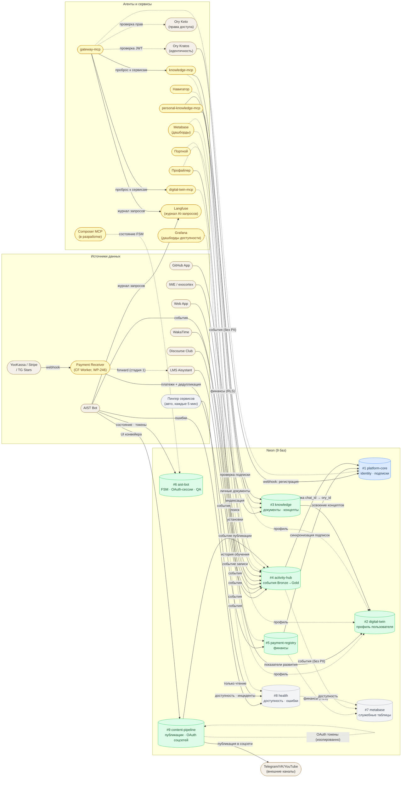

---

### 4.0.1 Карта кластеров — 9 БД × главные физ.объекты

> **По замечанию Андрея (ИТ-встреча 19 апр):** одна картинка со всеми базами, в каждой — ключевые сущности физ.мира, связи между БД. Детальные ER по каждой БД — §5. Правила построения — `DP.METHOD.040`.
>
> Принцип: на этой карте — **только объекты физ.мира** (человек, курс, платёж, сервер). Технические таблицы (audit_log, sessions, cache) — не показаны, они в §8.

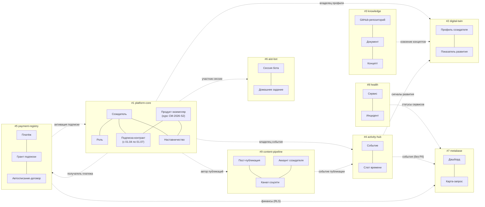

**Как читать:**
- Каждый кластер (`#N`) — отдельная БД Neon (внутри — 2-4 главных объекта физ.мира).
- Линии внутри кластера — связи объектов внутри одной БД (детальные ER в §5).
- Стрелки между кластерами — межбазовые связи (кто кого знает по внешнему ключу).
- Пунктир — read-only (аналитика, без перезаписи).

---

### 4.0.2 Физ.объекты по БД (реестр)

> **Цель:** исчерпывающий список объектов физ.мира для каждой из 9 БД. Основа для переделки §5 ERD (WP-228 Ф9).
>
> **Методология:** чек-лист `DP.METHOD.040 §4`. Критерии физ.объекта:
> 1. Экземпляру можно дать имя собственное («Созидатель Иванов», «Курс СМ-2026-S2», «Платёж P-12345»).
> 2. Можно «показать пальцем» на конкретный экземпляр.
> 3. Не техническая таблица (`*_log`, `*_session`, `*_cache`, `*_snapshot`).
> 4. Не M:N-связка без собственных атрибутов.
>
> **Источники:** Pack (01A-bounded-context, DP.D.050, DP.ROLE.001, DP.ECON.001, DP.ARCH.003, DP.D.034), DP.ARCH.004 §8 (таблицы), WP-155 (CP), WP-227 (ЦД), WP-151 (квалификация).
>
> **Колонки:** Физ.объект / Описание / Реализация (таблица или план) / Класс (✅ физ.объект, 🔗 связь с атрибутами, ⚠️ технический, ❓ спорное — нужен ревью) / Источник в Pack.

#### БД #1 platform-core

| Физ.объект | Описание | Реализация (таблица) | Класс | Источник |
|------------|----------|----------------------|-------|----------|
| **Созидатель** | Физ.лицо, участник экосистемы развития | USER_IDENTITIES | ✅ | 01A, DP.D.050, DP.ROLE.001 |
| **Роль-справочник** | T0-T4, TM1-TM3, TA1-TA4, TD1 — код + тип + описание | (нет таблицы, PK = code в Pack) | ✅ | DP.ROLE.001, DP.D.034 |
| **Продукт-экземпляр** | Конкретный курс/семинар/подписка-план с кодом (напр. «СМ-2026-S2», «Подписка-годовая-2026») | PRODUCTS | ✅ | DP.ECON.001 |
| **Подписка-контракт** | Конкретный грант доступа созидателю к продукту с датами действия | SUBSCRIPTION_GRANTS | ✅ | DP.ECON.001, WP-231 |
| **Наставник-назначение** | Привязка созидателя-наставника к продукту с ролью (TM1/TM2/TM3) | MENTOR_ASSIGNMENTS | ✅ | DP.ROLE.001 |
| **GitHub-подключение** | OAuth-связка созидателя с GitHub (installation_id) | GITHUB_CONNECTIONS | 🔗 связь «Созидатель ↔ GitHub» с атрибутами (токены, scope, expires_at) | WP-187 |
| **Google Calendar-подключение** | OAuth-связка созидателя с Google Calendar | GOOGLE_CALENDAR_CONNECTIONS | 🔗 связь | WP-232 |
| **WakaTime-интеграция** | OAuth-сессия для сбора метрик кода | USER_INTEGRATIONS | 🔗 связь | — |
| **Персональный MCP-бэкенд** | BYOB-сервер, зарегистрированный созидателем (backend_url, tool_prefix) | BACKEND_REGISTRY | ✅ | WP-189 |
| Событие смены тира | Факт перехода T0→T1 и т.д. | TIER_EVENTS | ⚠️ это **событие**, его место в #4 activity-hub (запланировано ⚠️ → activity-hub) | — |

#### БД #2 digital-twin

| Физ.объект | Описание | Реализация (таблица) | Класс | Источник |
|------------|----------|----------------------|-------|----------|
| **Цифровой двойник** | Модель-снимок созидателя, 3 слоя (базовые / вовлечённость / производные) | DIGITAL_TWINS | ✅ (один экземпляр на созидателя) | DP.ARCH.003, WP-227 |
| **Показатель развития** | Конкретный индикатор (IND.3.*) с значением в момент времени для конкретного созидателя | (колонки JSONB в DIGITAL_TWINS) | ✅ слабая сущность (существует в контексте двойника) | DP.ARCH.003 §5 |
| **Стадия развития** | Вычисленное состояние созидателя (Random/Practicing/Systematic/Disciplined/Proactive) на дату | (колонка stage в DIGITAL_TWINS) | ✅ | DP.D.050 |
| **Освоение концепта** | Факт: созидатель освоил концепт с вероятностью p(known) | LEARNER_CONCEPT_MASTERY | 🔗 связь «Созидатель ↔ Концепт» с атрибутами (mastery 0.0-1.0, confidence) | WP-151, WP-208 |
| Транзакция баллов | Начисление/списание баллов | POINT_TRANSACTIONS | ⚠️ это **событие/платёж**, логически ближе к #5 payment-registry | DP.ECON.001 |

#### БД #3 knowledge

| Физ.объект | Описание | Реализация (таблица) | Класс | Источник |
|------------|----------|----------------------|-------|----------|
| **Документ** | Конкретный текст в векторной БД (с путём, эмбеддингом, метаданными) | DOCUMENTS | ✅ | knowledge-mcp |
| **Концепт** | Конкретное понятие (напр. «Экзокортекс», «BKT», «Systems Thinking») | CONCEPTS | ✅ | WP-170, 01A |
| **Концептное заблуждение** | Типовая ошибка понимания концепта | CONCEPT_MISCONCEPTIONS | ✅ | CAT.001 |
| **GitHub-установка** | Конкретная GitHub App installation для индексации репо | GITHUB_INSTALLATIONS | ✅ | WP-187 |
| **Источник индексации** | Конкретный репо/URL, подключённый созидателем для ingest | USER_SOURCES | ✅ | knowledge-mcp |
| Ребро графа концептов | prerequisite / related / part_of / contradicts | CONCEPT_EDGES | 🔗 связь «Концепт ↔ Концепт» с типом | — |
| Обратная связь релевантности | Оценка созидателем релевантности документа в поиске | RETRIEVAL_FEEDBACK | ⚠️ это **событие**, не объект | knowledge-mcp |

#### БД #4 activity-hub

| Физ.объект | Описание | Реализация (таблица) | Класс | Источник |
|------------|----------|----------------------|-------|----------|
| **Сырое событие (Bronze)** | Неконсолидированный факт от внешней системы (LMS/Club/WakaTime) с атрибутами источника | RAW_EVENTS | ✅ | WP-109 |
| **Событие созидателя (Silver)** | Нормализованное событие с атрибуцией конкретного созидателя | USER_EVENTS | ✅ | WP-109 |
| **Факт обучения (Gold)** | Агрегированный факт для профайлера (концепт, корректность, длительность) | LEARNING_HISTORY | ✅ | миграция 007 |
| Идентичность-маппинг | chat_id ↔ ory_id (связка до OAuth) | IDENTITY_MAP | 🔗 связь «Telegram-id ↔ Созидатель», слабая идентификация | WP-109 |
| Запись карантина | Событие, не прошедшее валидацию | QUARANTINED_EVENTS | ⚠️ **технический** sink | — |
| Журнал запусков коллекторов | Старт/финиш/статус синхронизации | SYNC_LOG | ⚠️ **технический** лог | — |

#### БД #5 payment-registry

| Физ.объект | Описание | Реализация (таблица) | Класс | Источник |
|------------|----------|----------------------|-------|----------|
| **Платёж** | Конкретная транзакция с суммой, валютой, источником (YooKassa/Stripe/TG Stars/Paybox) | FINANCE_PAYMENTS | ✅ | WP-183 |
| **Оплата семинара** | Конкретная покупка семинара через бота | SEMINAR_PAYMENTS | ✅ (будет перенесена) | aist-bot (⚠️ → #5) |
| **Оплата воркшопа** | Конкретная покупка воркшопа | WORKSHOP_PAYMENTS | ✅ (будет перенесена) | aist-bot (⚠️ → #5) |
| **Автосписание-договор** | Сохранённый `payment_method_id` + график автосписаний для созидателя | AUTOPAY, AUTOPAY_DATA | ✅ контракт-объект (класс payment_credentials) | WP-246, §2 П6.1 |
| Ватермарк импорта | Позиция инкрементальной синхронизации | PAYMENTS_SYNC_STATE, SUBSCRIPTION_GRANTS_SYNC_STATE | ⚠️ **технический** state | WP-183, WP-231 |
| Webhook-дедупликация | event_id обработанных webhook'ов | PROCESSED_WEBHOOKS | ⚠️ **технический** idempotency | WP-246 |
| Landing zone | Временное хранение для импорта | IMPORT_STAGING_PAYMENT, IMPORT_STAGING_CHARGEOFF | ⚠️ **технический** | WP-183 |
| Аудит-запись изменений статуса | Append-only лог | FINANCE_PAYMENTS_AUDIT_LOG | ⚠️ **технический** лог (показать на ER нельзя, только на физ.схеме) | WP-237 |
| Событие конверсии | Факт шага воронки созидателя | CONVERSION_EVENTS | ⚠️ это **событие**, ближе к #4 activity-hub | — |

#### БД #6 aist-bot

| Физ.объект | Описание | Реализация (таблица) | Класс | Источник |
|------------|----------|----------------------|-------|----------|
| **Пользователь бота** | Созидатель как клиент бота (telegram_id, ory_id) | USERS | ✅ проекция «Созидатель в контексте бота» | — |
| **Ответ на задание** | Конкретный ответ созидателя на задачу | ANSWERS | ✅ | — |
| **Оценка** | Конкретная самооценка или внешняя оценка | ASSESSMENTS | ✅ | — |
| **Попытка тренажёра** | Один проход тренажёра (мемы, задания) с score | TRAINING_ATTEMPTS | ✅ | — |
| **Элемент марафона** | Конкретный урок/задание марафона | MARATHON_CONTENT | ✅ | — |
| **QA-пара** | Вопрос созидателя и ответ консультанта/бота | QA_HISTORY | ✅ | WP-132 |
| **Участник сообщества** | Созидатель в Telegram-сообществе (chat_id, permissions) | COMMUNITY_MEMBERS | ✅ | — |
| **Мониторируемый Telegram-канал** | Конкретный TG-канал, за которым следит бот | CHANNEL_MONITORS | ✅ | — |
| Напоминание | Конкретная запись расписания | REMINDERS | 🔗 связь «Созидатель ↔ Триггер» с атрибутами | — |
| Feedback-запись | Отзыв созидателя из бота | FEEDBACK_TRIAGE | ✅ | — |
| Недельный цикл ленты | Feed-неделя для созидателя | FEED_WEEKS | ✅ | — |
| Сессия ленты | Отдельный просмотр feed | FEED_SESSIONS | 🔗 связь «Созидатель ↔ Feed-неделя» | — |
| Прогресс тренажёра | Состояние пользователя по тренажёру | TRAINING_PROGRESS | ⚠️ **state-файл**, не физ.объект (WP-217 distinction) | — |
| FSM-состояние | Текущая позиция в автомате aiogram | FSM_STATES, USER_STATE | ⚠️ **технический** state | — |
| Кеш контента LMS | Буферизованные уроки | CONTENT_CACHE | ⚠️ **технический** кеш | — |
| OAuth-state ожидания | Временный код во время OAuth flow | OAUTH_PENDING_STATES | ⚠️ **технический** | — |
| Сессия пользователя | Chat-сессия | USER_SESSIONS | ⚠️ **технический** (связь) | — |
| Ory OAuth-токены | Encrypted access/refresh | ORY_TOKENS | ⚠️ **технический** (носитель авторизации) | WP-209, WP-234 |
| DT OAuth-токены | Encrypted DT-токены | DT_TOKENS | ⚠️ **технический** | WP-82, WP-234 |
| Уведомление | Отправленное созидателю сообщение | NOTIFICATION_LOG | ⚠️ **лог** | WP-232 |
| Лог активности | Действие в боте | ACTIVITY_LOG | ⚠️ **лог** | — |
| Лог ошибок | Ошибки бота | ERROR_LOGS | ⚠️ **лог** (копия → #8) | — |
| Трейс запроса | OTel trace | REQUEST_TRACES | ⚠️ **лог** (копия → #8) | — |
| Лог упоминаний | Упоминание в TG-канале | CHANNEL_MENTIONS_LOG | ⚠️ **лог** | — |
| Задание auto-fix | Диагноз Claude в очереди | PENDING_FIXES | ⚠️ **state** (копия → #8) | — |
| Telegram Stars подписка | Бот-уровень Stars-подписка | BOT_SUBSCRIPTIONS | ❓ спорное — либо отдельный физ.объект, либо экземпляр Подписки-контракта из #1 | — |

#### БД #7 metabase

| Физ.объект | Описание | Реализация (таблица) | Класс | Источник |
|------------|----------|----------------------|-------|----------|
| **Дашборд** | Конкретный дашборд (напр. «Финансы 2026 Q2») | METABASE_DASHBOARDS | ✅ | WP-183 |
| **Карта-запрос** | Конкретный SQL-запрос на дашборде | METABASE_CARDS | ✅ | WP-183 |
| **Коллекция дашбордов** | Папка (напр. «Финансы», «Обучение») | METABASE_COLLECTIONS | ✅ | WP-183 |
| **Аналитик** | Пользователь Metabase (не-Ory, с email + паролем) | METABASE_USERS | ✅ | — |

*(~167 других служебных таблиц Metabase — все технические, на ER не показывать.)*

#### БД #8 health

| Физ.объект | Описание | Реализация (таблица) | Класс | Источник |
|------------|----------|----------------------|-------|----------|
| **Сервис** | Конкретный мониторируемый сервис (aist-bot, gateway-mcp, knowledge-mcp, etc.) | SERVICE_REGISTRY | ✅ | WP-244 |
| **Инцидент** | Конкретный сбой с началом/концом/severity | UPTIME_INCIDENTS | ✅ | WP-244 |
| **Задание auto-fix** | Ожидающее исправление (approve/reject) | PENDING_FIXES | ✅ | WP-45 |
| Пинг (uptime check) | Один замер доступности | UPTIME_CHECKS | ⚠️ **лог** (TTL 90d) | WP-244 |
| Снимок статуса Anthropic | Слепок status.anthropic.com | ANTHROPIC_STATUS_SNAPSHOTS | ⚠️ **снимок** (не экземпляр объекта) | WP-244 |
| Ошибка сервиса | Структурированная ошибка | ERROR_LOGS | ⚠️ **лог** | WP-45 |
| Трейс запроса | OTel trace | REQUEST_TRACES | ⚠️ **лог** | WP-45 |

#### БД #9 content-pipeline

| Физ.объект | Описание | Реализация (таблица, план WP-155) | Класс | Источник |
|------------|----------|------------------------------------|-------|----------|
| **Задание-публикация (Job)** | Единица конвейера: черновик → одобрение → рендер → публикация (draft/approved/rendering/published) | PUBLICATION_JOBS | ✅ | WP-155 Ф1 |
| **Публикация (Post)** | Опубликованный пост в конкретный канал (URL, дата, контент) | PUBLISHED_POSTS (перенос из aist-bot) | ✅ | WP-155 |
| **Канал соцсети** | Конкретный канал/аккаунт в платформе (TG-канал «@aist_me», YouTube-канал «IWE») | CHANNELS | ✅ | WP-155 |
| **Аккаунт созидателя в канале** | OAuth-связка созидателя с каналом (токены в шифре) | CHANNEL_ACCOUNTS (перенос DISCOURSE_ACCOUNTS) | 🔗 связь «Созидатель ↔ Канал» с токенами (payment_credentials класс) | WP-155, §2 П6.1 |
| **Ассет** | Файл (видео/аудио/обложка) с URL и метаданными | ASSETS | ✅ | WP-155 Ф0.5 |
| **Расписание публикации** | Запланированный слот публикации | SCHEDULES (перенос SCHEDULED_PUBLICATIONS) | ✅ | WP-155 |
| Событие публикации | Факт успеха/неудачи публикации | PUBLICATION_EVENTS | ⚠️ **событие**, дублируется в #4 activity-hub | WP-155 |

---

**Итого физ.объектов для ER-диаграмм (§5):**

| БД | ✅ физ.объекты | 🔗 связи | ⚠️ технические | ❓ спорные |
|----|--------------|---------|---------------|----------|
| #1 platform-core | 5 | 3 | 1 | 0 |
| #2 digital-twin | 3 | 1 | 1 | 0 |
| #3 knowledge | 5 | 1 | 1 | 0 |
| #4 activity-hub | 3 | 1 | 2 | 0 |
| #5 payment-registry | 4 | 0 | 5 | 0 |
| #6 aist-bot | 11 | 2 | 13 | 1 |
| #7 metabase | 4 | 0 | (~167 служебных) | 0 |
| #8 health | 3 | 0 | 4 | 0 |
| #9 content-pipeline | 5 | 1 | 1 | 0 |
| **Всего** | **43** | **9** | **28+** | **1** |

**Спорные случаи (нужен ревью):**
1. `BOT_SUBSCRIPTIONS` (#6) — Telegram Stars подписка: отдельный физ.объект или экземпляр Подписки-контракта из #1?

**Pack ↔ БД расхождения (для Ф15 обсуждения):**
- `TIER_EVENTS` записан в #1, по смыслу (событие) — в #4.
- `POINT_TRANSACTIONS` записан в #2, по смыслу — в #5 (платёж баллами) или #4 (событие начисления).
- `CONVERSION_EVENTS` записан в #5, по смыслу (событие воронки) — в #4.
- Публикации (`PUBLISHED_POSTS`, `SCHEDULED_PUBLICATIONS`, `DISCOURSE_ACCOUNTS`) сейчас в #6, по новому решению — в #9.
- `LEARNING_HISTORY`, `USER_EVENTS` дублируются в #6 и #4 (перенос запланирован).

---

### 4.1 Девять баз и внешние системы

Какие внешние системы пишут в каждую базу и читают из неё.

```
Внешние системы              База Neon             Читают из базы
─────────────────────────    ──────────────────    ─────────────────────

Ory Kratos (webhook) ───────→ #1 platform-core ←── gateway-mcp (подписка)
Ory Keto (RBAC) ────────────→    USER_IDENTITIES    AIST Bot (права)
subscription-sync (из #5) ──→    SUBSCRIPTION_GRANTS
OAuth callbacks ────────────→    GITHUB_CONNECTIONS

digital-twin-mcp ───────────→ #2 digital-twin  ←── AIST Bot /twin
Профайлер R28 (из #4) ──────→    DIGITAL_TWINS      Навигатор
LMS (степень DEG, ручная) ──→    LEARNER_CONCEPT_    Портной
                                 MASTERY

knowledge-mcp ingest ───────→ #3 knowledge     ←── knowledge-mcp search
GitHub App webhook ─────────→    DOCUMENTS          IWE / Claude Code
                                 CONCEPTS

LMS + Club + WakaTime ──────→ #4 activity-hub  ←── Профайлер R28
AIST Bot + IWE/exocortex ───→    RAW_EVENTS         Metabase (без PII)
transform-worker ───────────→    USER_EVENTS
                                 LEARNING_HISTORY

Payment Receiver (CF Worker)→ #5 payment-reg.  ←── Metabase (RLS)
  (webhook от YooKassa/     →    FINANCE_PAYMENTS   subscription-sync cron
   Stripe/TG Stars/Paybox)  →    PROCESSED_WEBHOOKS
incremental-sync (Aisystant)→    (стадия 2: только сверка)
Directus (ручные правки) ───→

AIST Bot (только бот) ──────→ #6 aist-bot      ←── AIST Bot
                                 USER_STATE          Composer MCP
                                 ORY_TOKENS

Metabase internal ──────────→ #7 metabase      ←── Metabase UI
                                 ~171 служебных     (дашборды читают #5, #4)

uptime-collector (GHA) ─────→ #8 health        ←── Grafana (read-only)
AIST Bot (error_handler) ───→    SERVICE_REGISTRY   алерты → TG bot
Anthropic Status API ───────→    UPTIME_CHECKS
                                 ERROR_LOGS
                                 REQUEST_TRACES

AIST Bot (UI конвейера) ────→ #9 content-pipe. ←── Bot (пуск заданий)
ContentPipeline Worker ─────→    PUBLICATION_JOBS   Metabase (RO аналитика)
OAuth callbacks соцсетей ───→    CHANNEL_ACCOUNTS
                                 PUBLISHED_POSTS
                                 ASSETS
                                 SCHEDULES
```

---

### 4.2 Реестр всех систем

> **Легенда:** ✅ наша инфраструктура · ✅ внешний — сторонний сервис (данные в Neon не хранит) · 🟡 в разработке · 🔲 запланировано

| Система | Статус | Читает из Neon | Пишет в Neon |
|---------|--------|---------------|-------------|
| Web App | ✅ | DT, KN (через GW) | events → AH |
| AIST Bot | ✅ | PC, DT, AB, PR | AB, AH, PR, DT, HL |
| IWE / Claude Code | ✅ | KN, DT (через GW) | KN |
| gateway-mcp | ✅ | PC (subscription), KN (github_installations, user_sources) | KN (GitHub App OAuth → github_installations, user_sources) |
| knowledge-mcp | ✅ | KN | KN |
| digital-twin-mcp | ✅ | DT | DT |
| personal-knowledge-mcp | ✅ | KN | KN |
| Профайлер R28 | ✅ | AH | DT (IND.3.*) |
| Навигатор | ✅ | DT | — |
| Портной | ✅ | DT | — |
| ДЗ-чекер | ✅ | — | AH, DT |
| Directus (CRM UI) | ✅ | PR | PR (ручные правки) |
| Metabase (BI) | ✅ | PR, AH (RO) | — |
| Ory Kratos | ✅ внешний | PC (sync) | PC (identity) |
| Ory Keto | ✅ внешний | — | — (own store) |
| LMS Aisystant | ✅ внешний | — | AH, DT (DEG) |
| Discourse Club | ✅ внешний | — | AH |
| WakaTime | ✅ внешний | — | AH |
| Stripe / YooKassa / TG Stars | ✅ внешний | — | → Payment Receiver |
| Payment Receiver (CF Worker) | 🔲 WP-246 | — | PR (finance_payments, processed_webhooks) |
| ContentPipeline Worker (CF Worker) | 🟡 WP-155 | CP (jobs, channels, accounts) | CP (publications, events) |
| Langfuse | ✅ внешний | — | — (own store) |
| Nudge / Уведомления | 🟡 | DT, AH | AH |
| Composer MCP (FSM) | 🟡 | AB | AB |
| Epistemic Graph | 🔲 | KN | KN |
| CRM (сервис) | 🔲 | PC, PR | AH |
| Event Bus / Dispatcher | 🔲 | AH | AH |
| AI Training Pipeline | 🔲 | AH, KN | — |
| Team Service | 🔲 | PC | AH |
| uptime-collector | 🔲 | — | HL (доступность + инциденты) |
| Grafana | ✅ внешний | HL (read-only) | — |

---

### 4.3 Поток идентичности и доступа

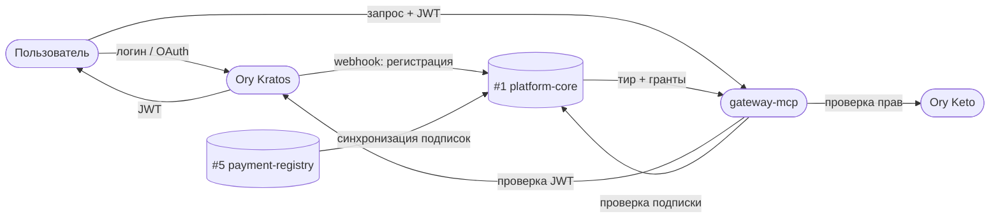

---

### 4.4 Поток событий → ЦД → персональное руководство


> Степень DEG назначается вручную методсоветом МИМ — не через поток событий.

---

### 4.5 Связи между базами данных

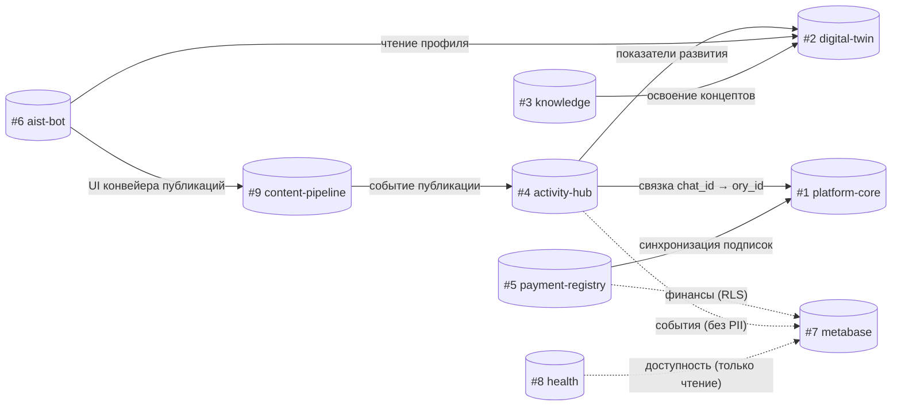

> Сплошная = запись. Пунктир = чтение (RO).

</details>

---

<details>
<summary><b>5. ERD по базам данных</b></summary>

> Связи между базами помечены `(API)` с указанием целевой базы.

---

### DB #1: platform-core

Ядро платформы: идентичность, подписки, OAuth-соединения, реестр персональных MCP.
Gateway-паттерн: все сервисы проверяют права только здесь.

```mermaid
erDiagram
    USER_IDENTITIES {
        uuid        ory_id          PK  "source: Ory Kratos"
        bigint      telegram_id     UK
        bigint      lms_id
        text        region          "ru|world"
        text        tier            "T0|T1|T2|T3|T4 — конфигурация доступа к платформе (DP.D.050)"
        text        mentor_tier     "NULL|TM1|TM2|TM3"
        text        admin_tier      "NULL|TA1|TA2|TA3|TA4"
        bool        is_developer    "TD1"
        timestamptz created_at
    }

    TIER_EVENTS {
        bigserial   id              PK
        uuid        ory_id          "→ USER_IDENTITIES"
        text        from_tier
        text        to_tier
        text        reason          "ory_registration|subscription|dt_complete|github_connect|manual"
        timestamptz created_at
        text        note            "платформенный лог переходов тиров (DP.ARCH.002)"
    }

    SUBSCRIPTION_GRANTS {
        uuid        id              PK
        uuid        ory_id          "→ USER_IDENTITIES"
        bigint      telegram_id
        text        product         "br = Бесконечное развитие"
        text        source          "payment|manual|marketing|trial"
        timestamptz valid_from
        timestamptz valid_until
        timestamptz revoked_at
        text        note            "поддерживается payment-registry subscription-sync cron"
    }

    GITHUB_CONNECTIONS {
        serial      id              PK
        uuid        ory_id          "→ USER_IDENTITIES"
        bigint      telegram_id
        text        github_username
        bytea       access_token    "Fernet-encrypted (WP-234)"
        bytea       refresh_token   "Fernet-encrypted (WP-234)"
        text        token_nonce
        text        knowledge_repo
        text        strategy_repo
        text        default_branch
        timestamptz connected_at
        text        note            "dual-write: токен также в USER_INTEGRATIONS для коллекторов"
    }

    GOOGLE_CALENDAR_CONNECTIONS {
        serial      id              PK
        uuid        ory_id          "→ USER_IDENTITIES"
        bigint      telegram_id
        bytea       access_token    "Fernet-encrypted (WP-234)"
        bytea       refresh_token   "Fernet-encrypted (WP-234)"
        text        token_nonce
        text        calendar_id
        text        email
        timestamptz connected_at
    }

    USER_INTEGRATIONS {
        serial      id              PK
        uuid        user_uuid       "→ USER_IDENTITIES"
        text        service         "github|wakatime|google_calendar"
        bytea       access_token    "Fernet-encrypted (WP-234)"
        bytea       refresh_token   "Fernet-encrypted (WP-234)"
        text        token_nonce
        timestamptz token_expires_at
        text        scope
        jsonb       metadata
        timestamptz connected_at
        text        note            "source of truth для activity-hub collectors; GitHub: dual-write из GITHUB_CONNECTIONS"
    }

    BACKEND_REGISTRY {
        serial      id              PK
        uuid        ory_id          "→ USER_IDENTITIES"
        text        backend_url     "validated: https only, no RFC1918, max 512 chars (WP-239)"
        text        tool_prefix
        text        name
        text        status          "pending_validation|active|failed"
        text        knowledge_gate_result "pending|passed|partial|failed"
        timestamptz created_at
    }

    PRODUCTS {
        text        code            PK  "S1, R1, SE, OD, open-endedness-m-1000, …"
        text        type            "subscription|program|seminar"
        text        title
        text        description
        text        format          "practicum|residency|research_seminar|review (только program)"
        decimal     price_rub
        int         price_stars
        text        currency        "RUB"
        bool        is_free
        bool        installment_ok
        text        speaker
        bigint      tg_chat_id      "Telegram-группа продукта"
        text        video_url
        date        event_date      "для семинаров"
        text        duration
        bool        active
        bool        show_in_catalog
        int         sort_order
        text        source          "manual|aisystant"
        text        source_id
        jsonb       metadata        "tilda_uid, seminar_chat_id, masterskaya_chat_id и др."
        timestamptz created_at
        timestamptz updated_at
        text        note            "единый каталог продуктов; замена SEMINARS, привязка к FINANCE_PAYMENTS по code"
    }

    MENTOR_ASSIGNMENTS {
        serial      id              PK
        uuid        ory_id          "ref→USER_IDENTITIES"
        bigint      telegram_id
        text        product_code    FK  "→ PRODUCTS"
        text        role            "lead|assistant|reviewer"
        text        display_name
        bool        active
        date        valid_from
        date        valid_until
        timestamptz created_at
        text        note            "привязка наставников к программам; per-product-code"
    }

    USER_IDENTITIES ||--o{ SUBSCRIPTION_GRANTS : "has"
    USER_IDENTITIES ||--o{ GITHUB_CONNECTIONS : "connects GitHub"
    USER_IDENTITIES ||--o{ GOOGLE_CALENDAR_CONNECTIONS : "connects GCal"
    USER_IDENTITIES ||--o{ USER_INTEGRATIONS : "service integrations"
    USER_IDENTITIES ||--o{ BACKEND_REGISTRY : "personal MCPs"
    USER_IDENTITIES ||--o{ TIER_EVENTS : "tier history"
    USER_IDENTITIES ||--o{ MENTOR_ASSIGNMENTS : "mentors"
    PRODUCTS ||--o{ MENTOR_ASSIGNMENTS : "assigned mentors"
```

---

### DB #2: digital-twin

Цифровой двойник пользователя. Writers: dt-mcp, profiler cron, бот (только через DT-MCP API).

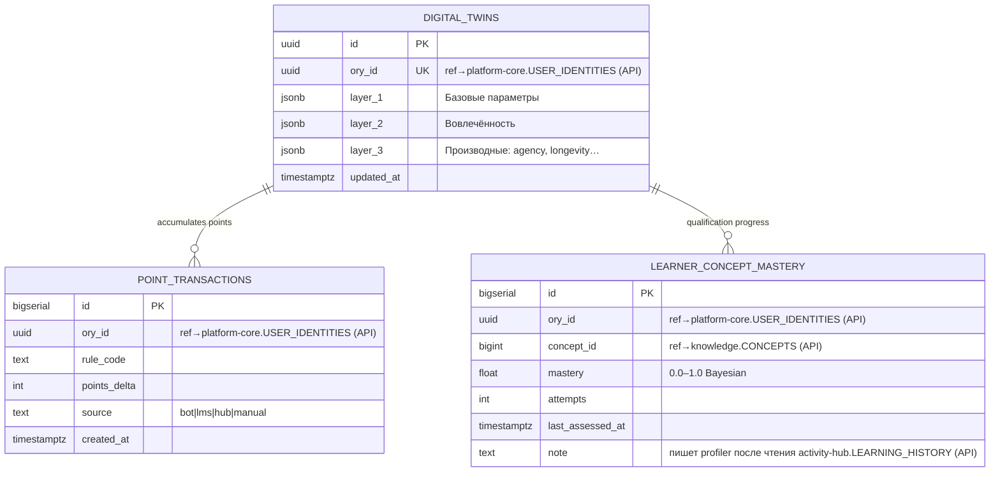

---

### DB #3: knowledge

Документы платформы и пользователей, граф концептов, источники для индексации.

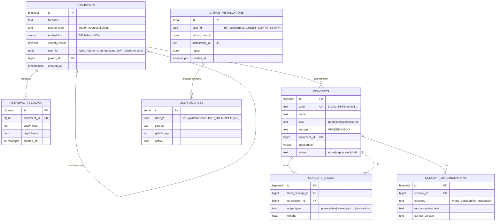

---

### DB #4: activity-hub

Medallion-архитектура: Bronze (raw) → Silver (user_events) → Gold (learning_history).
Кандидат на замену ClickHouse/TimescaleDB при росте объёма.


---

### DB #5: payment-registry

Единственная база с финансовыми транзакциями.
Metabase читает через `metabase_reader` (RLS, только агрегаты без PII).

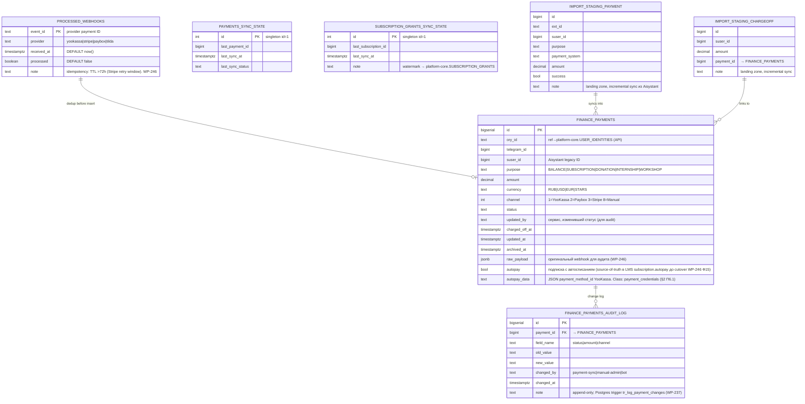

#### Autopay subsystem (подсистема автосписаний)

**Что это.** Автоматическое списание с сохранённой карты пользователя при истечении подписки, без его участия в момент списания. Используется YooKassa-механизм `save_payment_method=true` + повторный POST `/v3/payments` с сохранённым `payment_method_id`.

**Текущее состояние (промежуточное, owner — LMS):**

1. **Источники данных:** LMS таблица `subscription` (колонка `autopay boolean`) — флаг автопродления. Таблица `payment` (колонка `autopay_data varchar(1023)`) — JSON `{"type":"bank_card","payment_method_id":"...","card.last4":"1234"}`, сохранённый при первом платеже.
2. **Триггер:** `PaymentSchedulerService.autopayCheck10/21` — Spring `@Scheduled` cron 10:00 и 21:00 МСК.
3. **Отбор:** `subscriptionRepository.findAllByToDateAndAutopay(today, true)` — подписки, истекающие сегодня.
4. **Списание:** `PaymentUtil.createAutoPaymentForSubscription` → POST `/v3/payments` с `payment_method_id` + `capture:true` + `save_payment_method:true`. Merchant — один на всю систему (`Keys.getYoAuth()`, ИП).
5. **Подтверждение:** webhook `/yoo/hook` + polling `updateYooPayments` каждые 30 мин. При `succeeded` → `processPayment` продлевает подписку.
6. **Нотификации:** `paymentNotificationsCheck` шлёт письма за 7/3/1 день до списания + `sendPaymentAutoExtendMessage` после успеха. При провале письма нет.
7. **Отмена:** `POST /disable-autopay` ставит `subscription.autopay=false`. YooKassa unlink API **не вызывается** — токен остаётся действительным на стороне YooKassa.
8. **Зеркало в `payment-registry`:** `incremental-sync.sh` каждые 10 мин копирует `payment.autopay` и `payment.autopay_data` в `finance_payments` (пока read-only, не используется на чтение).

**Целевое состояние (после миграции, owner — мы):**

Подсистема **портируется**, не проектируется заново. Механизм рабочий; меняется только место исполнения:

| LMS (текущее) | Наш стек (целевое) |
|---|---|
| `PaymentSchedulerService.@Scheduled` | CF Worker `payment-scheduler` (Cloudflare Cron Triggers) |
| LMS Postgres `subscription` + `payment` | Neon `subscription_grants` + `finance_payments.autopay_data` |
| `Keys.getYoAuth()` в LMS env | CF Secrets — **те же ключи** (merchant не меняется, токены валидны) |
| `YooWebHook → updateYooPayments` | `payment-receiver` CF Worker (Ф1 WP-246 DONE) |
| `MailService.sendPayment*Message` | Email-провайдер бота |
| `POST /disable-autopay` (без unlink) | Новый endpoint + `DELETE /v3/payment_methods/{id}` (добавляем unlink) |

**Критичное операционное условие:** merchant-аккаунт YooKassa у LMS и у нас — один и тот же (ИП). Сохранённые `payment_method_id` остаются валидными при переезде. Пользователи перепривязывать карту не должны. В день cutover LMS cron отключается (`@Scheduled` комментируется в `PaymentSchedulerService.java:121-130`), наш включается. Два cron'а одновременно = двойное списание.

**Обработка `payment_credentials` (класс доступа §2 П6.1):** `autopay_data` содержит `payment_method_id` + `card.last4`. Зная эти данные плюс YooKassa API-ключ, можно инициировать произвольное списание. Поэтому: writer — только `payment-scheduler` и `incremental-sync`; reader — только `payment-scheduler` (для формирования запроса); Metabase и Бот — `REVOKE`; при отмене пользователем — вызов YooKassa unlink API + обнуление колонки; рассмотреть шифрование at-rest на Ф11 WP-246.

**Миграция:** → WP-246 Стадия 3 (Ф10–Ф16, ~14h). Gap-фиксы по ходу портирования: письмо при провале списания, retry-логика, unlink API.

---

### DB #6: aist-bot

Только бот. Telegram-first: основной ключ — `chat_id`. 35+ таблиц, разбиты на 3 ERD по доменам. ⚠️ 10 таблиц — кандидаты на миграцию (помечены).

#### 6a. Ядро бота, токены и доступ

USERS → USER_STATE — центральная ось. Все остальные таблицы привязаны через `chat_id`.

```mermaid
erDiagram
    USERS {
        bigserial   id              PK
        bigint      telegram_id     UK
        text        ory_id
        text        role
        timestamptz created_at
    }

    USER_STATE {
        bigint      chat_id         PK  "Telegram chat_id"
        text        current_state   "FSM state"
        jsonb       data            "FSM context"
        bool        is_inactive     "true если нет активности >90 дней (WP-240)"
        timestamptz trial_started_at
        timestamptz last_active_date
        int         active_days_total
        text        note            "тир — в platform-core.USER_IDENTITIES (не здесь)"
    }

    FSM_STATES {
        text        key             PK  "aiogram FSM key"
        jsonb       state
        jsonb       data
        text        note            "aiogram persistence между редеплоями"
    }

    USER_SESSIONS {
        bigserial   id              PK
        bigint      chat_id         FK
        timestamptz started_at
        timestamptz ended_at
    }

    OAUTH_PENDING_STATES {
        text        state           PK  "OAuth state code"
        bigint      chat_id
        text        provider        "github|google"
        timestamptz created_at
        text        note            "TTL: до завершения OAuth flow"
    }

    ORY_TOKENS {
        bigint      chat_id         PK  "Telegram chat_id"
        bytea       access_token    "Fernet-encrypted (WP-234)"
        bytea       refresh_token   "Fernet-encrypted (WP-234)"
        text        token_nonce
        timestamptz expires_at
        text        ory_id
        timestamptz updated_at
        text        note            "персистентность Ory OAuth-сессии; refresh каждые 10 мин"
    }

    DT_TOKENS {
        bigint      chat_id         PK  "Telegram chat_id"
        bytea       access_token    "Fernet-encrypted (WP-234)"
        bytea       refresh_token   "Fernet-encrypted (WP-234)"
        text        token_nonce
        timestamptz expires_at
        text        dt_user_id
        timestamptz updated_at
        text        note            "персистентность DT OAuth-сессии; refresh каждые 10 мин"
    }

    BOT_SUBSCRIPTIONS {
        bigserial   id              PK
        bigint      chat_id
        text        status          "active|inactive"
        text        telegram_payment_charge_id
        int         stars_amount
        timestamptz started_at
        timestamptz expires_at
        text        note            "Telegram Stars billing (бот-уровень); платформ-подписка → platform-core"
    }

    SERVICE_USAGE {
        bigserial   id              PK
        bigint      user_id         "Telegram ID"
        text        service_id
        timestamptz created_at
    }

    USER_ACCESS {
        bigserial   id              PK
        bigint      user_id         "Telegram ID"
        text        access_type
        text        resource_id
        timestamptz expires_at
        text        note            "возможно неиспользуемая (миграция 002)"
    }

    TIER_EVENTS {
        bigserial   id              PK
        bigint      chat_id         FK
        text        from_tier       "T0|T1|T2|T3|T4"
        text        to_tier
        text        reason          "ory_registration|subscription|dt_complete|github_connect|manual"
        timestamptz created_at
        text        note            "⚠️ кандидат → platform-core"
    }

    USERS ||--|| USER_STATE : "1:1"
    USER_STATE ||--o{ USER_SESSIONS : "sessions"
    USER_STATE ||--|| ORY_TOKENS : "auth"
    USER_STATE ||--|| DT_TOKENS : "auth"
    USER_STATE ||--o{ BOT_SUBSCRIPTIONS : "TG Stars"
    USER_STATE ||--o{ TIER_EVENTS : "tier history"
```

#### 6b. Обучение и коммуникация

Тренажёры, лента, марафоны, QA, уведомления, фидбек. Все привязаны к `chat_id` через USER_STATE.

```mermaid
erDiagram
    TRAINING_PROGRESS {
        bigserial   id              PK
        bigint      chat_id         FK
        text        training_type
        jsonb       progress
        timestamptz updated_at
    }

    TRAINING_CHILDREN {
        bigserial   id              PK
        bigint      parent_id       FK
        text        child_type
        jsonb       data
    }

    TRAINING_ATTEMPTS {
        bigserial   id              PK
        bigint      chat_id         FK
        text        training_type
        int         score
        jsonb       answers
        timestamptz created_at
    }

    TRAINING_SETTINGS {
        bigint      chat_id         PK
        jsonb       settings
        timestamptz updated_at
    }

    FEED_SESSIONS {
        bigserial   id              PK
        bigint      chat_id         FK
        timestamptz started_at
        timestamptz ended_at
        jsonb       data
    }

    FEED_WEEKS {
        bigserial   id              PK
        bigint      chat_id         FK
        int         week_number
        jsonb       data
        timestamptz created_at
    }

    MARATHON_CONTENT {
        bigserial   id              PK
        text        content_type
        jsonb       data
        timestamptz created_at
    }

    ANSWERS {
        bigserial   id              PK
        bigint      chat_id         FK
        text        question_id
        jsonb       answer
        int         score
        timestamptz created_at
    }

    ASSESSMENTS {
        bigserial   id              PK
        bigint      chat_id         FK
        text        assessment_type
        jsonb       data
        timestamptz created_at
    }

    CONTENT_CACHE {
        text        cache_key       PK
        jsonb       content
        timestamptz expires_at
        text        note            "кеш LMS-контента; TTL по scheduler"
    }

    QA_HISTORY {
        bigserial   id              PK
        bigint      chat_id         FK
        text        question
        text        answer
        bool        helpful
        jsonb       mcp_sources
        timestamptz created_at
        text        note            "TTL 180 дней (WP-240)"
    }

    NOTIFICATION_LOG {
        bigserial   id              PK
        bigint      chat_id
        text        notification_type
        text        idempotency_key UK
        jsonb       payload
        timestamptz created_at
        text        note            "TTL 30 дней (WP-240)"
    }

    FEEDBACK_TRIAGE {
        bigserial   id              PK
        bigint      chat_id
        text        category
        text        status          "new|classified|resolved"
        text        source          "bot"
        timestamptz created_at
        text        note            "только бот-фидбек; кросс-канальный → activity-hub"
    }

    FEEDBACK_REPORTS {
        bigserial   id              PK
        bigint      chat_id         FK
        text        report_type
        jsonb       data
        timestamptz created_at
    }

    REMINDERS {
        bigserial   id              PK
        bigint      chat_id         FK
        text        reminder_type
        timestamptz scheduled_at
        bool        sent
    }

    COMMUNITY_MEMBERS {
        bigserial   id              PK
        bigint      telegram_id
        bigint      chat_id
        text        username
        timestamptz joined_at
        timestamptz left_at
    }

    TRAINING_PROGRESS ||--o{ TRAINING_CHILDREN : "children"
    TRAINING_PROGRESS ||--o{ TRAINING_ATTEMPTS : "attempts"
    FEED_SESSIONS ||--o{ FEED_WEEKS : "weeks"
```

#### 6c. Публикации, платежи и наблюдаемость

Таблицы-кандидаты на миграцию (⚠️) и наблюдаемость бот-уровня.

```mermaid
erDiagram
    %% ── Публикации и каналы (⚠️ → activity-hub) ──

    PUBLISHED_POSTS {
        bigserial   id              PK
        bigint      chat_id         FK
        text        platform        "discourse|telegram"
        text        external_id
        timestamptz published_at
        text        note            "⚠️ кандидат → activity-hub"
    }

    SCHEDULED_PUBLICATIONS {
        bigserial   id              PK
        bigint      chat_id         FK
        text        platform
        jsonb       content
        timestamptz scheduled_at
        text        status          "pending|published|failed"
        text        note            "⚠️ кандидат → activity-hub"
    }

    DISCOURSE_ACCOUNTS {
        bigserial   id              PK
        bigint      chat_id         FK
        text        discourse_username
        text        api_key
        text        note            "⚠️ кандидат → activity-hub"
    }

    CHANNEL_MONITORS {
        bigserial   id              PK
        bigint      channel_id
        text        channel_name
        bool        active
        timestamptz created_at
    }

    CHANNEL_MENTIONS_LOG {
        bigserial   id              PK
        bigint      channel_id      FK
        text        mention_text
        timestamptz created_at
    }

    %% ── Платежи бот-уровня (⚠️ → payment-registry) ──

    WORKSHOP_PAYMENTS {
        bigserial   id              PK
        bigint      chat_id         FK
        text        workshop_code
        int         amount
        timestamptz created_at
        text        note            "⚠️ кандидат → payment-registry"
    }

    SEMINAR_PAYMENTS {
        bigserial   id              PK
        bigint      chat_id         FK
        text        seminar_code
        int         amount
        timestamptz created_at
        text        note            "⚠️ кандидат → payment-registry"
    }

    CONVERSION_EVENTS {
        bigserial   id              PK
        bigint      chat_id         FK
        text        event_type
        jsonb       data
        timestamptz created_at
        text        note            "⚠️ кандидат → payment-registry"
    }

    %% ── Наблюдаемость бот-уровня (⚠️ копии → #8 health) ──

    ACTIVITY_LOG {
        bigserial   id              PK
        bigint      chat_id         FK
        text        action
        jsonb       data
        timestamptz created_at
    }

    ERROR_LOGS {
        bigserial   id              PK
        text        category
        text        severity
        text        message
        jsonb       context
        timestamptz created_at
        text        note            "⚠️ копия → #8 health. TTL 180д"
    }

    REQUEST_TRACES {
        bigserial   id              PK
        text        trace_id
        text        span
        int         latency_ms
        timestamptz created_at
        text        note            "⚠️ копия → #8 health. TTL 30д"
    }

    PENDING_FIXES {
        bigserial   id              PK
        text        diagnosis
        text        status          "pending|approved|rejected"
        jsonb       context
        timestamptz created_at
        text        note            "⚠️ копия → #8 health. TTL 90д"
    }

    SCHEDULED_PUBLICATIONS ||--o{ PUBLISHED_POSTS : "published"
    CHANNEL_MONITORS ||--o{ CHANNEL_MENTIONS_LOG : "mentions"
```

---

### DB #7: metabase

Служебные таблицы Metabase BI (~171 таблица). Не хранит прикладные данные платформы.

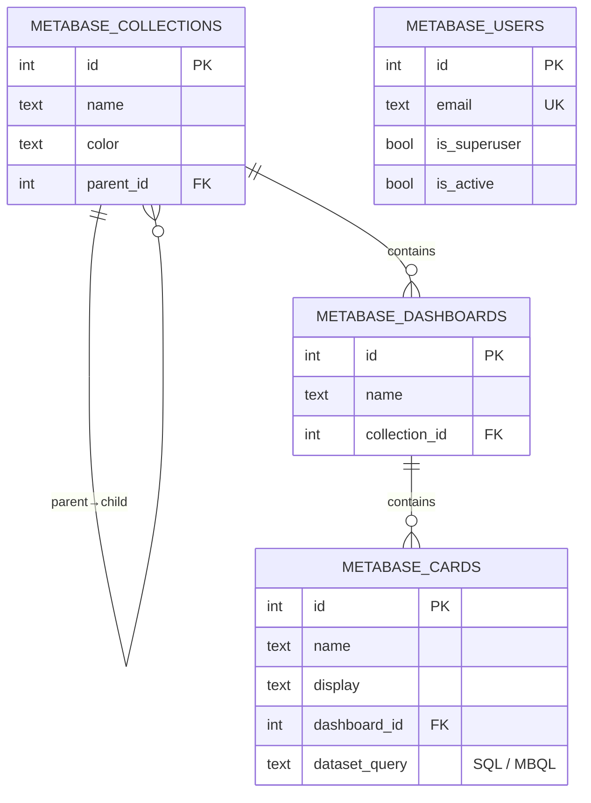

---

### DB #8: health

Операционное здоровье платформы. Cross-cutting данные — не принадлежат ни одному продуктовому сервису.
Writers: uptime-collector (GHA cron), AIST Bot error_handler. Readers: Grafana (RO), алерты → TG.

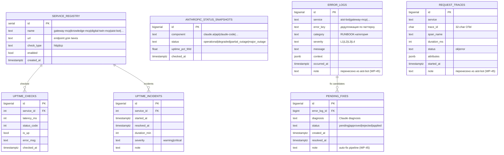

</details>

---

<details>
<summary><b>6. Кто читает / кто пишет</b></summary>

| База | Writers | Readers |
|------|---------|---------|
| #1 platform-core | Бот (`aist_me_bot_writer`): identity sync + OAuth flows + триал, `sync-subscriptions.sh` cron (из #5 → SUBSCRIPTION_GRANTS), Directus (ручные гранты), миграции (PRODUCTS, MENTOR_ASSIGNMENTS) | gateway-mcp (`gateway_reader`): авторизация каждого запроса, Metabase (`metabase_reader`), activity-hub (identity resolver) |
| #2 digital-twin | Бот dt_sync (`aist_bot_writer`): `2_collected`, Профайлер R28: `3_derived`, knowledge-mcp: LEARNER_CONCEPT_MASTERY (WP-208 TBD), LMS (DEG вручную методсовет МИМ) | dt-mcp (профиль), tailor-mcp (`1_declarative`+`3_derived`), knowledge-mcp (learner_progress, RLS), *бот /twin через gateway→dt-mcp* |
| #3 knowledge | knowledge-mcp ingest (платформенный и персональный контент), gateway-mcp: GITHUB_INSTALLATIONS + USER_SOURCES (GitHub App OAuth, RLS) | knowledge-mcp search, *бот через gateway→knowledge-mcp*, gateway-mcp (список подключённых репо) |
| #4 activity-hub | collectors: LMS + Club + WakaTime + IWE/exocortex + Bot (RAW_EVENTS), transform-worker (RAW→USER→LEARNING) | transform-worker, Профайлер R28 (LEARNING_HISTORY → IND.3.*), Бот dt_sync (USER_EVENTS → ЦД), *Навигатор/Портной: LEARNING_HISTORY*, Metabase (RO, без PII) |
| #5 payment-registry | **Payment Receiver** CF Worker (`payment_receiver_writer`: INSERT finance_payments + processed_webhooks, WP-246), `incremental-sync.sh` cron (стадия 2: только сверка), бот (seminar/workshop записи) | Бот: has_seminar_access/has_access_to_chat, Metabase (`metabase_reader` + RLS, только агрегаты), `sync-subscriptions.sh` cron (FINANCE_PAYMENTS → SUBSCRIPTION_GRANTS в #1) |
| #6 aist-bot | только AIST Bot (44 таблицы: FSM, тренажёры, фид, марафоны, токены, публикации, оплаты, наблюдаемость). ⚠️ 10 таблиц — кандидаты на миграцию: 3→activity-hub, 3→payment-registry, 3→platform-core/#8 health | AIST Bot; Composer MCP (состояние FSM) |
| #7 metabase | Metabase internal (служебные таблицы) | Metabase UI, дашборды читают #5 и #4 напрямую (не через #7) |
| #8 health | uptime-collector cron (GHA, UPTIME_CHECKS + INCIDENTS), AIST Bot error_handler (ERROR_LOGS, REQUEST_TRACES, PENDING_FIXES) | Grafana (RO, дашборды здоровья), Бот (error_classifier, autofix), алерты → TG bot |

</details>

---

<details>
<summary><b>7. Пояснения</b></summary>

### USER_INTEGRATIONS vs GITHUB_CONNECTIONS

Обе таблицы хранят GitHub OAuth-токен одного пользователя — намеренный **dual-write**.

| | GITHUB_CONNECTIONS (platform-core) | USER_INTEGRATIONS (platform-core) |
|---|---|---|
| **Назначение** | Конфигурация публикации: target_repo, notes_path, branches | OAuth-конфиг для коллекторов: WakaTime, IWE Adapter |
| **Потребитель** | Бот-издатель заметок | activity-hub collectors |

`WAKATIME` — только в `USER_INTEGRATIONS`. `GOOGLE_CALENDAR` — только в `GOOGLE_CALENDAR_CONNECTIONS`.

---

### ORY_TOKENS и DT_TOKENS в aist-bot

Это **персистентность бот-сессий**, а не кеш платформы:
- Ключ — `chat_id` (Telegram): бот работает в Telegram-контексте
- Хранятся для переживания редеплоев бота
- `ory_tokens` — токены для вызова Gateway MCP (Ory OAuth)
- `dt_tokens` — токены для вызова DT API
- Токены **зашифрованы** (Fernet, WP-234), в открытом виде в БД не хранятся

---

### LEARNING_HISTORY vs LEARNER_CONCEPT_MASTERY

| | LEARNING_HISTORY (activity-hub) | LEARNER_CONCEPT_MASTERY (digital-twin) |
|---|---|---|
| **Что хранит** | Факты: "прошёл мем X, score 0.8" | Агрегат: "освоен концепт ZP.001 на 85%" |
| **Кто пишет** | transform-worker из USER_EVENTS | profiler (читает LEARNING_HISTORY через API) |

Поток: RAW_EVENTS → USER_EVENTS → LEARNING_HISTORY → profiler API → LEARNER_CONCEPT_MASTERY.
Квалификация "Ученик" и уровни до неё — автоматически из mastery. Выше — методсовет МИМ (ручное).

---

### Кеш авторизации gateway-mcp

`checkSubscription()` в gateway-mcp не обращается к Neon на каждый запрос — результат кешируется в **Cloudflare KV** с TTL 5 мин (WP-235). JWKS также кешируется in-memory в Workers isolate.

Порядок проверок в gateway (до фанаута):
1. `verifyJWT` — проверка подписи токена (JWKS, кеш in-memory)
2. `checkSubscription` — проверка активного гранта в `SUBSCRIPTION_GRANTS` (KV кеш TTL 5 мин)
3. Только при успехе обоих → фанаут в downstream MCP

Отказ на шаге 1 или 2 → немедленный 401/403, downstream не вызывается.

</details>

---

<details>
<summary><b>8. Справочник таблиц</b></summary>

> **Статус:** ✅ Существует в `platform` (единая база, WP-232) | ⚠️ Перенести при разделении | 🆕 Создать
>
> **Writers / Readers** — кто пишет и читает каждую таблицу (Ф2 WP-228, 16 апр 2026). Роль в скобках = DB role. Курсив = непрямой доступ (через MCP/API).

### #1 platform-core

| Таблица | Назначение | Writers | Readers | Статус | Источник |
|---------|-----------|---------|---------|--------|----------|
| USER_IDENTITIES | Маппинг ory_id ↔ telegram_id ↔ lms_id. Только то, чего Ory не знает. | Бот (`aist_me_bot_writer`): OAuth callback + LMS sync | gateway-mcp (`gateway_reader`), activity-hub (identity resolver) | ✅ | `public.user_identities`, WP-232 |
| SUBSCRIPTION_GRANTS | Реестр активных прав подписки. Gateway для всех сервисов. | sync-subscriptions.sh cron (`aist_me_bot_writer`), бот: триал через /start, Directus: ручные гранты | gateway-mcp (`gateway_reader`): проверка на каждый запрос, Metabase (`metabase_reader`) | ✅ | `public.subscription_grants`, WP-231 |
| GITHUB_CONNECTIONS | GitHub OAuth + конфиг публикации (репо, ветки). | Бот (`aist_me_bot_writer`): OAuth flow | Бот: чтение токенов для публикации | ✅ | `public.github_connections`, WP-187 |
| GOOGLE_CALENDAR_CONNECTIONS | Google Calendar OAuth для бота. | Бот (`aist_me_bot_writer`): Google OAuth callback | Бот: чтение токенов для calendar sync | ✅ | `public.google_calendar_connections`, WP-232 |
| USER_INTEGRATIONS | OAuth-конфиг для activity-hub collectors (GitHub, WakaTime). | Бот (`aist_me_bot_writer`): OAuth callbacks | Бот, activity-hub: чтение токенов для API | ⚠️ Перенести | Сейчас в `development.user_integrations` |
| BACKEND_REGISTRY | Реестр персональных MCP-бэкендов пользователей. | gateway-mcp: регистрация BYOB (WP-189, TBD) | gateway-mcp: fan-out маршрутизация | ✅ | `knowledge.backend_registry`, WP-187/189 |
| TIER_EVENTS | Лог переходов тиров (T0→T1 при регистрации и т.д.). Платформенный. | Бот (`aist_me_bot_writer`): core/tier_detector, fire-and-forget | Metabase (аналитика) | 🆕 Перенести из aist-bot | Сейчас в `development.tier_events` (aist-bot) |
| PRODUCTS | Единый каталог продуктов: подписки, программы, семинары. PK = code. | Миграции (`neondb_owner`): seed, Directus: CMS | Бот: метаданные семинаров/программ, Directus | ✅ | `public.products`, WP-228 |
| MENTOR_ASSIGNMENTS | Привязка наставников к продуктам по product_code. | Миграции, Directus | Бот: lookup наставников | ✅ | `public.mentor_assignments`, WP-228 |

### #2 digital-twin

| Таблица | Назначение | Writers | Readers | Статус | Источник |
|---------|-----------|---------|---------|--------|----------|
| DIGITAL_TWINS | Цифровой двойник: 3 слоя (базовые / вовлечённость / производные). | Бот dt_sync (`aist_bot_writer`): `2_collected` (cron 04:30), Profiler R28: `3_derived` (standalone) | dt-mcp: профиль по API, tailor-mcp: `1_declarative`+`3_derived`, *бот /twin через gateway→dt-mcp* | ✅ | `public.digital_twins`, WP-227 |
| POINT_TRANSACTIONS | Лог начислений/списаний баллов активности. Append-only. | Бот (`aist_bot_writer`): calculate_points (WP-121 Ф2, TBD) | gateway_reader: баланс (TBD) | ✅ | `points.point_transactions`, WP-121 |
| LEARNER_CONCEPT_MASTERY | Степень освоения концептов (0.0–1.0). Основа для квалификации "Ученик". | knowledge-mcp: analyze_verbalization (RLS, WP-208 TBD) | knowledge-mcp: learner_progress (RLS по user_id) | ✅ | `concept_graph.learner_concept_mastery`, WP-151 |

### #3 knowledge

| Таблица | Назначение | Writers | Readers | Статус | Источник |
|---------|-----------|---------|---------|--------|----------|
| DOCUMENTS | Документы + векторные эмбеддинги для semantic search. | knowledge-mcp ingest + /reindex webhook (RLS) | knowledge-mcp: hybrid search, *бот через gateway→knowledge-mcp* | ✅ | `knowledge.documents`, knowledge-mcp |
| RETRIEVAL_FEEDBACK | Обратная связь по релевантности документов. | knowledge-mcp: recordFeedback tool (RLS) | knowledge-mcp: feedback_stats | ✅ | `knowledge.retrieval_feedback`, knowledge-mcp |
| CONCEPTS | Граф концептов платформы (ZP, FPF, Pack, курсы). | knowledge-mcp ingest-concepts.ts (без RLS, платформенные) | knowledge-mcp: analyze_verbalization, graph_stats, *бот через gateway* | ✅ | `concept_graph.concepts`, WP-170 |
| CONCEPT_EDGES | Рёбра графа: prerequisite, related, part_of, contradicts. | knowledge-mcp ingest-concepts.ts | knowledge-mcp: graph_stats, edge coverage | ✅ | `concept_graph.concept_edges` |
| CONCEPT_MISCONCEPTIONS | Типовые заблуждения по концептам. | knowledge-mcp ingest-concepts.ts (из CAT.001) | knowledge-mcp: analyze_verbalization (LLM-detection) | ✅ | `concept_graph.concept_misconceptions` |
| GITHUB_INSTALLATIONS | GitHub App installations для индексации репо. | gateway-mcp: GitHub App OAuth (WP-187, RLS) | gateway-mcp: список подключённых репо | ✅ | `knowledge.github_installations`, WP-187 |
| USER_SOURCES | Источники индексации (GitHub репо, активные/нет). | knowledge-mcp миграция 004 + gateway-mcp webhook (RLS) | knowledge-mcp: resolve user_id при ingest, gateway-mcp: UI источников | ✅ | `knowledge.user_sources`, knowledge-mcp |

### #4 activity-hub

| Таблица | Назначение | Writers | Readers | Статус | Источник |
|---------|-----------|---------|---------|--------|----------|
| RAW_EVENTS | Bronze: сырые события, партиционированы по (source, fetched_at). TTL 30д. | activity-hub adapters (`aist_bot_writer`): write_raw, ON CONFLICT DO NOTHING | activity-hub transform-worker: _fetch_pending, integrity checks | ✅ | `development.raw_events`, WP-109 Ф8.1 |
| USER_EVENTS | Silver: нормализованные события с атрибуцией пользователя. TTL 90д. | activity-hub: (1) hub.py ingest_event direct INSERT, (2) transform-worker upsert, (3) ingest_batch bulk | activity-hub: rate_limit check, бот dt_sync: агрегация для ЦД | ✅ | `development.user_events`, WP-109 |
| LEARNING_HISTORY | Gold: факты обучения. Читается profiler. Archive в S3 после 5 лет. | Бот: DB-триггер на user_events INSERT (миграция 007), backfill (миграция 010) | Бот dt_sync: BKT-расчёты, Навигатор: 7-дневное окно, *Портной: depths_by_direction* | ⚠️ Перенести | Сейчас в aist_bot (миграция 007) |
| IDENTITY_MAP | chat_id → ory_id; NULL до OAuth. | activity-hub runner.py: populate_bot/csv/lms_identity | activity-hub hub.py: resolve_user_uuid, бот dt_sync: LMS qualification mapping | ✅ | `development.identity_map`, WP-109 |
| SYNC_LOG | Журнал запусков коллекторов. TTL 30д. | activity-hub runner.py: log_sync после каждого запуска | activity-hub: мониторинг, Metabase (TBD) | ✅ | `development.sync_log`, WP-109 |
| QUARANTINED_EVENTS | Карантин для невалидных событий. | activity-hub: hub.py _quarantine (validation fail), transform-worker (parse fail) | Ручной разбор (write-only sink) | ✅ | `development.quarantined_events`, WP-109 |
| PUBLISHED_POSTS | Опубликованные посты (Discourse, Telegram). | Бот: db/queries/discourse, clients/publisher | Бот: db/queries/discourse | ⚠️ Перенести из aist-bot | Сейчас в aist_bot |
| SCHEDULED_PUBLICATIONS | Запланированные публикации. | Бот: db/queries/discourse, clients/publisher | Бот: db/queries/discourse, core/scheduler | ⚠️ Перенести из aist-bot | Сейчас в aist_bot |
| DISCOURSE_ACCOUNTS | Аккаунты Discourse для публикации. | Бот: db/queries/discourse | Бот: db/queries/discourse | ⚠️ Перенести из aist-bot | Сейчас в aist_bot |

### #5 payment-registry

| Таблица | Назначение | Writers | Readers | Статус | Источник |
|---------|-----------|---------|---------|--------|----------|
| FINANCE_PAYMENTS | Реестр всех транзакций. Permanent. `raw_payload JSONB` (WP-246). | Payment Receiver CF Worker (`payment_receiver_writer`), incremental-sync.sh cron (`aist_me_bot_writer`), бот showcase handler | Бот: has_seminar_access/has_access_to_chat, Metabase (`metabase_reader`), sync-subscriptions.sh: → SUBSCRIPTION_GRANTS | ✅ | `public.finance_payments`, WP-183 |
| PROCESSED_WEBHOOKS | Idempotency-дедупликация webhook'ов. PK = event_id. TTL >72h. | Payment Receiver (`payment_receiver_writer`): isDuplicate + markProcessed | Payment Receiver: проверка дубликатов | 🆕 Создать | `public.processed_webhooks`, WP-246 |
| FINANCE_PAYMENTS_AUDIT_LOG | Append-only лог изменений статуса. 7 лет. | (WP-237, TBD) | (WP-237, TBD) | 🆕 Создать | WP-237 |
| PAYMENTS_SYNC_STATE | Ватермарк импорта из Aisystant. | incremental-sync.sh (`aist_me_bot_writer`) | incremental-sync.sh, Metabase: sync health | ✅ | `public.finance_payments_sync_state`, WP-183 |
| SUBSCRIPTION_GRANTS_SYNC_STATE | Ватермарк синхронизации грантов. | sync-subscriptions.sh (`aist_me_bot_writer`) | sync-subscriptions.sh: read boundary | ✅ | WP-231 |
| IMPORT_STAGING_PAYMENT | Landing zone импорта платежей из Aisystant. | incremental-sync.sh: TRUNCATE + COPY | incremental-sync.sql: transform → finance_payments | ✅ | WP-183 (миграция 005) |
| IMPORT_STAGING_CHARGEOFF | Landing zone списаний. | incremental-sync.sh: TRUNCATE + COPY | incremental-sync.sql: transform → UPDATE linked | ✅ | WP-183 (миграция 005) |
| WORKSHOP_PAYMENTS | Оплаты воркшопов через бота. | Бот: db/queries/workshop, handlers/workshop | Бот: db/queries/workshop | ⚠️ Перенести из aist-bot | Сейчас в aist_bot |
| SEMINAR_PAYMENTS | Оплаты семинаров через бота. | Бот: handlers/payments, db/queries/showcase | Бот: db/queries/showcase | ⚠️ Перенести из aist-bot | Сейчас в aist_bot |
| CONVERSION_EVENTS | События конверсионной воронки. | Бот: db/queries/conversion, core/scheduler | Бот: db/queries/conversion, db/queries/analytics | ⚠️ Перенести из aist-bot | Сейчас в aist_bot |

### #6 aist-bot

> **WP-228 Ф2 (16 апр):** расширен с 11 до 44 таблиц. Таблицы-кандидаты на миграцию помечены ⚠️ с целевой базой.

| Таблица | Назначение | Writers | Readers | Статус | Источник |
|---------|-----------|---------|---------|--------|----------|
| **Ядро бота (FSM, сессии, идентичность)** | | | | | |
| USERS | Локальные пользователи бота (telegram_id, ory_id, роли). | handlers/onboarding, core/ory_register | core/\*, handlers/\*, db/queries/\* | ✅ | Первая миграция |
| USER_STATE | FSM-состояние бота + счётчик активных дней, триал. ⚠️ Колонки tier/mentor_tier убрать после переноса. | handlers/onboarding, states/\*, core/scheduler, core/machine | handlers/\*, states/\*, core/machine | ✅ | `development.user_state` |
| FSM_STATES | Хранилище FSM aiogram (персистентность между редеплоями). | core/storage (aiogram) | core/storage | ✅ | aiogram FSM |
| USER_SESSIONS | Сессии пользователей. | db/queries/sessions | db/queries/analytics | ✅ | Миграция бота |
| OAUTH_PENDING_STATES | Ожидающие OAuth state-коды (GitHub, Google). TTL: до завершения flow. | db/queries/oauth_states, handlers/github | db/queries/oauth_states | ✅ | Миграция бота |
| **Обучение (тренажёры, фид, марафоны)** | | | | | |
| TRAINING_PROGRESS | Прогресс тренажёров (мемы, задания). | db/queries/training, states/training/\* | db/queries/training, states/training/\* | ✅ | Миграция бота |
| TRAINING_CHILDREN | Дочерние элементы тренажёров. | db/queries/training | db/queries/training | ✅ | Миграция бота |
| TRAINING_ATTEMPTS | Попытки прохождения (score, ответы). | db/queries/training, states/training/\* | db/queries/training | ✅ | Миграция бота |
| TRAINING_SETTINGS | Пользовательские настройки тренажёров. | db/queries/training, handlers/settings | db/queries/training | ✅ | Миграция бота |
| FEED_SESSIONS | Сессии ленты обучения. | db/queries/feed, states/feed/\* | db/queries/feed, db/queries/answers | ✅ | Миграция бота |
| FEED_WEEKS | Недельные циклы ленты. | db/queries/feed, states/feed/\* | db/queries/feed, db/queries/answers | ✅ | Миграция бота |
| MARATHON_CONTENT | Контент марафонов (уроки, задания). | db/queries/marathon, core/scheduler | db/queries/marathon, states/lesson | ✅ | Миграция бота |
| ANSWERS | Ответы пользователей на задания. | db/queries/answers, states/task | db/queries/answers, db/queries/profile | ✅ | Миграция бота |
| ASSESSMENTS | Оценки (самооценка, внешняя). | db/queries/assessment, states/assessment/\* | db/queries/assessment, db/queries/dev_stats | ✅ | Миграция бота |
| CONTENT_CACHE | Кеш контента LMS (уроки, задания). TTL: по scheduler. | db/queries/cache, core/scheduler | db/queries/cache, states/lesson, states/task | ✅ | Миграция бота |
| **Коммуникация и фидбек** | | | | | |
| QA_HISTORY | История вопросов/ответов. TTL 180д. | db/queries/qa, states/consultation | db/queries/analytics, handlers/twin | ✅ | `public.qa_history`, WP-132 |
| NOTIFICATION_LOG | Журнал уведомлений с idempotency_key. TTL 30д. | db/queries/notifications, core/scheduler | db/queries/notifications | ✅ | `public.notification_log`, WP-232 |
| FEEDBACK_TRIAGE | Фидбек из бота (source='bot'). | core/feedback_triage, handlers/feedback | core/feedback_triage, db/queries/feedback | ✅ | Миграция 008 |
| FEEDBACK_REPORTS | Отчёты по фидбеку (агрегированные). | db/queries/feedback, handlers/feedback | db/queries/feedback | ✅ | Миграция бота |
| REMINDERS | Расписание напоминаний. | core/scheduler | core/scheduler | ✅ | Миграция бота |
| **Подписки и доступ** | | | | | |
| BOT_SUBSCRIPTIONS | Telegram Stars подписки (бот-уровень). | db/queries/subscription, handlers/subscription | db/queries/subscription, core/tier_detector | ⚠️ Уточнить | Возможно заменена `public.subscriptions` |
| SERVICE_USAGE | Счётчик использования сервисов бота. | db/queries/activity | db/queries/analytics, db/queries/dev_stats | ✅ | Миграция 003 |
| USER_ACCESS | Временные права (выданные ботом, с expiry). | (не найден активный writer) | (не найден активный reader) | ⚠️ Уточнить | Миграция 002, возможно неиспользуемая |
| COMMUNITY_MEMBERS | Участники Telegram-сообщества. | db/queries/workshop, handlers/workshop | db/queries/workshop | ✅ | Миграция 009 |
| **Токены и интеграции** | | | | | |
| ORY_TOKENS | Ory OAuth-токены бота. Зашифрованы Fernet. | db/queries/ory_tokens, handlers/ory_register | db/queries/ory_tokens | ✅ | `public.ory_tokens`, WP-209. ⚠️ plaintext → WP-234 |
| DT_TOKENS | DT OAuth-токены бота. Зашифрованы Fernet. | db/queries/dt_tokens, handlers/connect | db/queries/dt_tokens, core/scheduler | ✅ | `public.dt_tokens`, WP-82. ⚠️ plaintext → WP-234 |
| **Публикации и каналы** | | | | | |
| PUBLISHED_POSTS | Опубликованные посты (Discourse, Telegram). | db/queries/discourse, clients/publisher | db/queries/discourse | ⚠️ → activity-hub | Миграция бота |
| SCHEDULED_PUBLICATIONS | Запланированные публикации. | db/queries/discourse, clients/publisher | db/queries/discourse, core/scheduler | ⚠️ → activity-hub | Миграция бота |
| DISCOURSE_ACCOUNTS | Аккаунты Discourse для публикации. | db/queries/discourse | db/queries/discourse | ⚠️ → activity-hub | Миграция бота |
| CHANNEL_MONITORS | Мониторинг Telegram-каналов. | db/queries/channels, handlers/channels | db/queries/channels | ✅ | Миграция бота |
| CHANNEL_MENTIONS_LOG | Лог упоминаний в каналах. | db/queries/channels, handlers/channels | db/queries/channels | ✅ | Миграция бота |
| **Платежи (бот-уровень)** | | | | | |
| WORKSHOP_PAYMENTS | Оплаты воркшопов через бота. | db/queries/workshop, handlers/workshop | db/queries/workshop | ⚠️ → payment-registry | Миграция бота |
| SEMINAR_PAYMENTS | Оплаты семинаров через бота. | handlers/payments, db/queries/showcase | db/queries/showcase | ⚠️ → payment-registry | Миграция бота |
| CONVERSION_EVENTS | События конверсионной воронки. | db/queries/conversion, core/scheduler | db/queries/conversion, db/queries/analytics | ⚠️ → payment-registry | Миграция бота |
| ~~SEMINARS~~ | ~~Каталог семинаров~~ → заменена PRODUCTS в platform-core. | — | — | ❌ Удалена | Заменена `public.products` |
| **Наблюдаемость (бот-уровень)** | | | | | |
| ACTIVITY_LOG | Лог активности пользователей в боте. | db/queries/activity, core/scheduler | db/queries/activity, db/queries/analytics | ✅ | Миграция бота |
| ERROR_LOGS | Ошибки бота (категория, severity). TTL 180д. | core/error_handler | core/error_classifier, db/queries/analytics | ✅ | Миграция бота. ⚠️ Копия → #8 health |
| REQUEST_TRACES | Трейсы запросов бота. TTL 30д. | core/tracing | db/queries/analytics | ✅ | Миграция бота. ⚠️ Копия → #8 health |
| PENDING_FIXES | Очередь auto-fix (Claude диагноз). TTL 90д. | db/queries/autofix, core/autofix | db/queries/autofix | ✅ | Миграция бота. ⚠️ Копия → #8 health |
| **Платформенные таблицы (в aist-bot DB, target: другая база)** | | | | | |
| TIER_EVENTS | Лог переходов тиров. | core/tier_detector | core/tier_detector, Metabase | ⚠️ → platform-core | `development.tier_events` |
| LEARNING_HISTORY | Gold-факты обучения (DB-триггер на user_events). | DB-триггер (миграция 007), backfill (миграция 010) | Бот dt_sync: BKT, Навигатор: 7д окно | ⚠️ → activity-hub | Миграция 007 |
| USER_EVENTS | Нормализованные события (дублирует #4). | db/queries/events, core/scheduler | db/queries/dt_sync, db/queries/events | ⚠️ → activity-hub | Бот-копия, target: #4 |

### #7 metabase

| Таблица | Назначение | Writers | Readers | Статус | Источник |
|---------|-----------|---------|---------|--------|----------|
| METABASE_COLLECTIONS | Папки дашбордов. | Metabase internal | Metabase UI | ✅ | Управляется Metabase (~171 таблица) |
| METABASE_DASHBOARDS | Дашборды (финансы, события). | Metabase internal | Metabase UI, дашборды читают #5 и #4 напрямую | ✅ | WP-183 (2 дашборда) |
| METABASE_CARDS | Questions (8 штук). | Metabase internal | Metabase UI | ✅ | WP-183 |
| METABASE_USERS | Пользователи Metabase (не Ory). | Metabase internal | Metabase internal | ✅ | Управляется Metabase |

### #8 health

| Таблица | Назначение | Writers | Readers | Статус | Источник |
|---------|-----------|---------|---------|--------|----------|
| SERVICE_REGISTRY | Реестр сервисов для мониторинга (name, url, check_type). | uptime-collector (GHA cron) | Grafana (RO) | 🆕 Создать | WP-244 |
| UPTIME_CHECKS | Результаты пингов (latency_ms, status_code, is_up). TTL 90d. | uptime-collector (GHA cron) | Grafana (RO), алерты → TG | 🆕 Создать | WP-244 |
| UPTIME_INCIDENTS | Агрегированные инциденты (started_at, resolved_at, severity). Permanent. | uptime-collector (агрегация) | Grafana (RO), алерты → TG | 🆕 Создать | WP-244 |
| ANTHROPIC_STATUS_SNAPSHOTS | Снапшоты status.anthropic.com API по компонентам. TTL 90d. | uptime-collector (GHA cron) | Grafana (RO) | 🆕 Создать | WP-244 |
| ERROR_LOGS | Структурированные ошибки сервисов (категория, severity, дедупликация). TTL 180d. | Бот error_handler (сейчас в aist_bot), будущее: все сервисы | Grafana (RO), core/error_classifier | 🆕 Перенести | WP-45 (сейчас в `platform`) |
| REQUEST_TRACES | Трейсы запросов (OTel trace_id, span, latency). TTL 30d. | Бот core/tracing (сейчас в aist_bot), будущее: все сервисы | Grafana (RO) | 🆕 Перенести | WP-45 (сейчас в `platform`) |
| PENDING_FIXES | Очередь auto-fix (диагноз Claude, статус approve/reject). TTL 90d. | Бот core/autofix (сейчас в aist_bot) | Бот db/queries/autofix, Grafana | 🆕 Перенести | WP-45 (сейчас в `platform`) |

</details>

---

<details>
<summary><b>9. Архитектурные решения</b></summary>

> Принятые решения по проблемам, выявленным при ArchGate-ревью. Все изменения уже отражены в ERD выше (раздел 5) и справочнике таблиц (раздел 8).

---

### WP-234 — Шифрование OAuth-токенов (aist-bot)

**Проблема:** `access_token` и `refresh_token` в ORY_TOKENS, DT_TOKENS, GITHUB_CONNECTIONS, USER_INTEGRATIONS хранились как TEXT. При компрометации базы — все OAuth-сессии утекают. Подтверждено в коде: `cryptography` отсутствует в `requirements.txt`.

**Решение:** Python Fernet (AES-128-CBC + HMAC-SHA256). Тип колонок: TEXT → BYTEA. Добавлена колонка `token_nonce TEXT`. Ключ `FERNET_KEY` из env (Railway secrets). Scheduler проверяет `updated_at < now() - 10 min` → принудительный refresh.

**Трудозатраты:** ~16h. Приоритет: критический.

---

### WP-235 — Кеш авторизации (gateway-mcp)

**Проблема:** `checkSubscription()` в `gateway-mcp/src/index.ts` делает SELECT в Neon на каждый запрос. Подтверждено в коде. При 10k пользователей = тысячи DB-запросов в минуту.

**Решение:** Cloudflare KV с TTL 5 мин. In-memory Map не подходит (Workers stateless, разные isolates → cache miss 80%+). При отзыве подписки — явная инвалидация `kv.delete(key)`.

**Отклонённая альтернатива: подписка в JWT.** Предложение — положить `subscription: active` в JWT и убрать SELECT совсем. Отклонено по двум причинам: (1) JWT выдаёт Ory Kratos, который не знает о биллинге — добавление бизнес-данных нарушает разделение ответственности (Ory = идентичность, не биллинг); (2) при отзыве подписки JWT остаётся валидным до истечения TTL — задержка такая же как у KV cache, но без возможности явной инвалидации. KV cache даёт тот же TTL 5 мин с возможностью немедленного отзыва через `kv.delete(key)`.

**Трудозатраты:** ~12h. Приоритет: высокий.

---

### WP-236 — Correlation ID в activity-hub

**Проблема:** RAW_EVENTS, USER_EVENTS, LEARNING_HISTORY не имели `trace_id`. Нельзя проследить путь события bronze→silver→gold. Подтверждено в миграциях.

**Решение:** OpenTelemetry trace_id (CHAR(32), 128-bit hex). Генерируется при ingestion в RAW_EVENTS, propagated transform-worker в USER_EVENTS и LEARNING_HISTORY. Интегрируется с Langfuse.

**Трудозатраты:** ~20h. Приоритет: высокий.

---

### WP-237 — Audit trail для FINANCE_PAYMENTS

**Проблема:** Нет истории изменений статуса платежа. Нельзя ответить кто и когда изменил статус.

**Решение:** Новая таблица `FINANCE_PAYMENTS_AUDIT_LOG` + Postgres trigger `tr_log_payment_changes`. Срабатывает на UPDATE, пишет в лог автоматически. `changed_by` = имя сервиса. Retention: 7 лет (compliance).

**Трудозатраты:** ~14h. Приоритет: высокий.

---

### WP-238 — RLS для Metabase

**Проблема:** Metabase читала FINANCE_PAYMENTS без ограничений. При компрометации — все финансовые данные открыты.

**Решение:** Роль `metabase_reader` + агрегированные views без PII. `REVOKE ALL ON FINANCE_PAYMENTS FROM metabase_reader`. RLS policy `USING (FALSE)` блокирует прямой доступ к таблице.

**Трудозатраты:** ~8h. Приоритет: средний.

---

### WP-239 — SSRF защита BACKEND_REGISTRY

**Проблема:** Пользователи регистрируют кастомные MCP-URL без валидации → SSRF риск.

**Решение:** Валидация при записи: только `https://`, запрет RFC1918 (127.x, 10.x, 172.16-31.x, 192.168.x, 169.254.x), запрет портов 22/23/25/135/139/445/3389, максимум 512 символов. Отражено в note поля `backend_url` в ERD.

**Трудозатраты:** ~10h. Приоритет: средний.

---

### WP-240 — Retention policy

**Проблема:** Таблицы растут бесконечно. GDPR требует права на удаление данных.

**Решение:** pg_partman DROP для RAW_EVENTS (TTL 30д). Daily cron для остальных. Retention по таблицам:

| Таблица | TTL | Механизм |
|---------|-----|----------|
| RAW_EVENTS | 30 дней | pg_partman DROP |
| USER_EVENTS | 90 дней | DELETE cron |
| LEARNING_HISTORY | Постоянно | Archive S3 после 5 лет |
| FINANCE_PAYMENTS | Постоянно | Annual archive |
| FINANCE_PAYMENTS_AUDIT_LOG | 7 лет | Archive (compliance) |
| QA_HISTORY | 180 дней | DELETE cron |
| PROCESSED_WEBHOOKS | 7 дней | DELETE cron (TTL >72h Stripe retry, запас до 7д) |
| NOTIFICATION_LOG | 30 дней | DELETE cron |
| SYNC_LOG | 30 дней | DELETE cron |
| USER_STATE (неактивные) | 90 дней | soft-delete (is_inactive=true) |

**Трудозатраты:** ~16h. Приоритет: средний.

---

### WP-244 — DB #8 health: операционный мониторинг платформы

**Проблема:** Нет систематического учёта здоровья сервисов. Инциденты обнаруживаются случайно или с задержкой (WP-183: 4.5h без детекции). Таблицы WP-45 (`error_logs`, `request_traces`, `pending_fixes`) не размещены ни в одну целевую базу — «бесхозные» в целевой архитектуре. Нет корреляции деградации наших сервисов с Anthropic API.

**Решение:** Отдельная DB #8 `health` — cross-cutting операционные данные, не принадлежащие ни одному продуктовому сервису. ArchGate пройден: варианты obs.* в platform-core (❌ нарушает П1, смешивает с identity-данными) и obs.* в aist-bot (❌ бот = клиент, не хранилище платформенных данных) отклонены. DB #8 изолирует credentials: компрометация коллектора не открывает PII.

**Таблицы:** SERVICE_REGISTRY, UPTIME_CHECKS, UPTIME_INCIDENTS, ANTHROPIC_STATUS_SNAPSHOTS (новые) + ERROR_LOGS, REQUEST_TRACES, PENDING_FIXES (перенос из WP-45).

**Writer:** uptime-collector (GHA cron, каждые 5 мин) + AIST Bot error_handler. **Reader:** Grafana (RO).

**Трудозатраты:** ~20h. Приоритет: средний.

---

### WP-246 — Payment Receiver (прямые платежи)

**Проблема:** Все платежи проходят через Aisystant (pull-sync каждые 5-15 мин). Aisystant = единая точка отказа; задержка 10-40 мин от оплаты до начисления подписки. При недоступности Aisystant платежи теряются в окне.

**Решение:** Payment Receiver — Cloudflare Worker, принимает webhook от провайдеров (YooKassa, Stripe, Paybox, Tilda, TG Stars) и пишет напрямую в Neon. 3-стадийная модель перехода (Strangler Fig):
- **Стадия 0 (текущая):** ch1-5 через Aisystant pull-sync
- **Стадия 1 (переходная):** Payment Receiver принимает webhook → INSERT в Neon + forward в Aisystant (Дима продолжает работать)
- **Стадия 2 (целевая):** Aisystant читает из Neon (SSOT). Forward-proxy убирается, incremental-sync → только reconciliation

**Новые артефакты в Neon:** таблица `PROCESSED_WEBHOOKS` (idempotency), колонка `raw_payload JSONB` в FINANCE_PAYMENTS (аудит webhook), роль `payment_receiver_writer` (INSERT finance_payments + processed_webhooks).

**Волны миграции:** ch6 (YooKassa-бот) → ch3 (Stripe) → ch1,2,4,5 (YooKassa-LMS).

**Трудозатраты:** ~33h. Приоритет: высокий. ArchGate: 6✅/1⚠️. Концепция: DP.CONCEPT.004. SC: DP.SC.120.

---

### WP-241 — Backup / DR

**Проблема:** Не определены RPO/RTO. Neon PITR 7 дней недостаточно для payment-registry (compliance).

**Решение:** Neon PITR per-database + pg_dump в S3 через unpooled endpoint.

| База | RPO | RTO | Механизм |
|------|-----|-----|----------|
| platform-core | 1h | 15 мин | PITR 7d + S3 daily |
| payment-registry | 15 мин | 30 мин | PITR **30d** (upgrade) + S3 каждые 6h |
| digital-twin | 1h | 30 мин | PITR 7d + S3 daily |
| activity-hub | 24h | 1h | PITR 7d (события воспроизводимы) |
| knowledge | 7 дней | 2h | S3 weekly (знания в git) |
| aist-bot | 24h | 2h | PITR 7d |

**Трудозатраты:** ~18h. Приоритет: средний.

</details>

---

<details open>
<summary><b>10. Сводная таблица РП</b></summary>

> Все перечисленные РП **ещё не выполнены** — это план работ, необходимый для перехода к целевой архитектуре. Текущее состояние: одна база `platform` (WP-232). Разделение и реализация решений ниже — следующие шаги.

| РП | Что нужно сделать | Оценка | Приоритет |
|----|------------------|--------|-----------|
| WP-234 | Зашифровать OAuth-токены в #6 aist-bot (Fernet, BYTEA) | 16h | критический |
| WP-235 | Добавить кеш авторизации в gateway-mcp (Cloudflare KV, TTL 5 мин) | 8h | высокий |
| WP-236 | Добавить trace_id в #4 activity-hub (RAW→USER→LEARNING, OTel) | 12h | высокий |
| WP-237 | Создать audit trail для #5 payment-registry (таблица + Postgres trigger) | 10h | высокий |
| WP-238 | Настроить RLS для Metabase → #5 payment-registry (роль + views без PII) | 6h | средний |
| WP-239 | Добавить валидацию URL в #1 platform-core BACKEND_REGISTRY (SSRF защита) | 6h | средний |
| WP-240 | Настроить retention policy для всех баз (pg_partman + cron + S3 archive) | 16h | средний |
| WP-241 | Настроить backup / DR (PITR per-database + pg_dump → S3) | 14h | средний |
| WP-244 | Создать DB #8 health: SERVICE_REGISTRY, UPTIME_CHECKS, UPTIME_INCIDENTS, ANTHROPIC_STATUS_SNAPSHOTS + перенести ERROR_LOGS/REQUEST_TRACES/PENDING_FIXES из WP-45 | ~20h | средний |
| WP-246 | Payment Receiver (CF Worker): прямой приём webhook от провайдеров → Neon. 3-стадийный Strangler Fig (pull → push+forward → Neon SSOT). Новая таблица PROCESSED_WEBHOOKS, роль payment_receiver_writer | ~33h | высокий |
| WP-215 | Разделение инфраструктуры мир/Россия: реализовать эту схему в двух инстансах, найти альтернативу Neon для РФ-контура (Neon — US-hosted, GDPR/152-ФЗ), определить стратегию синхронизации | ~40h | высокий |
| | **Итого** | **~181h** | |

**Критический путь:**
1. WP-234 + WP-235 — безопасность и авторизация (параллельно, ~2 нед)
2. WP-236 + WP-237 + WP-238 + WP-239 — данные и compliance (параллельно, ~2 нед)
3. WP-240 + WP-241 — операционная надёжность (~1 нед)
4. WP-215 — региональное разделение (блокирует production для РФ-пользователей)

</details>
