# DP.ARCH.004 — Архитектура данных Neon

## Принципы (решены 14 апр 2026)

**П1. 1 сервис = 1 база** (не схема)
Каждый сервис имеет собственную БД с собственными credentials. Другие сервисы не ходят в неё напрямую — только через API.

**П2. FK только внутри одной базы**
Ссылки между сервисами — только `ory_id`/`telegram_id` без FK constraint. Консистентность через API или Saga.

**П3. Схема = namespace для роли-администратора**
Внутри базы схемы разграничивают доступ ролей (финансист видит `finance.*`). Не для изоляции сервисов.

**П4. `ory_id` — глобальный ключ**
Каждая база хранит `ory_id` как обычную колонку без FK. Ory Kratos — source of truth идентичности. `user_identities` хранит только то, чего Ory не знает: `telegram_id`, `lms_id`, `region`.

**П5. Activity Hub — проектировать под замену**
Events — кандидат на ClickHouse/TimescaleDB при масштабировании. Именно поэтому отдельная база.

**П6. Платежи — максимальная изоляция**
`finance_payments` без FK наружу. Бот проверяет подписку через `subscription_grants` в `platform-core`, не через прямой доступ к базе платежей.

## Карта баз данных

```
Neon Project: aisystant
│
├── DB: platform-core      ← USER_IDENTITIES + SUBSCRIPTION_GRANTS
│                             + GITHUB_CONNECTIONS + GOOGLE_CALENDAR_CONNECTIONS
│                             + ORY_TOKENS + DT_TOKENS + BACKEND_REGISTRY
│                             + directus.* (схема Directus CMS, ~15 таблиц)
│
├── DB: digital-twin       ← DIGITAL_TWINS + POINT_TRANSACTIONS
│                             + LEARNER_CONCEPT_MASTERY
│
├── DB: knowledge          ← DOCUMENTS + CONCEPTS + CONCEPT_EDGES
│                             + CONCEPT_MISCONCEPTIONS + RETRIEVAL_FEEDBACK
│                             + GITHUB_INSTALLATIONS + USER_SOURCES
│
├── DB: activity-hub       ← RAW_EVENTS (partitioned) + USER_EVENTS
│                             + IDENTITY_MAP + SYNC_LOG + QUARANTINED_EVENTS
│                             (⚠ кандидат на замену ClickHouse/TimescaleDB)
│
├── DB: payment-registry   ← FINANCE_PAYMENTS + PAYMENTS_SYNC_STATE
│                             + SUBSCRIPTION_GRANTS_SYNC_STATE
│
├── DB: aist-bot           ← USER_STATE + QA_HISTORY + NOTIFICATION_LOG
│                             + BOT_SUBSCRIPTIONS + SEMINARS + SEMINAR_PAYMENTS
│                             + COMMUNITY_MEMBERS + SERVICE_USAGE + USER_ACCESS
│
└── DB: metabase           ← служебные таблицы Metabase (~171 таблица)
                              dashboards, questions, users, collections…
                              читает payment-registry.finance_payments (read-only conn)
                              ⚠ НЕ хранит прикладные данные платформы

Вне Neon:
  Ory Kratos (отдельный сервис) ← идентичность, source of truth по ory_id
```

## ERD предметной области

> Жирные линии — FK внутри базы. Пунктир — API-ссылки (только id, без FK).

```mermaid
erDiagram
    %% ╔══════════════════════════════════════════════╗
    %% ║  DB: platform-core                           ║
    %% ╚══════════════════════════════════════════════╝

    USER_IDENTITIES {
        uuid        ory_id          PK  "source: Ory Kratos"
        bigint      telegram_id     UK
        bigint      lms_id
        text        region          "ru|world"
        timestamptz created_at
    }

    SUBSCRIPTION_GRANTS {
        uuid        id              PK
        uuid        ory_id          "→ USER_IDENTITIES"
        bigint      telegram_id     "→ USER_IDENTITIES"
        text        product         "br = Бесконечное развитие"
        text        source          "payment|manual|marketing|trial"
        timestamptz valid_from
        timestamptz valid_until
        timestamptz revoked_at
    }

    USER_IDENTITIES ||--o{ SUBSCRIPTION_GRANTS : "has"

    GITHUB_CONNECTIONS {
        serial      id              PK
        uuid        ory_id          "→ USER_IDENTITIES"
        bigint      telegram_id
        text        github_username
        text        access_token
        text        refresh_token
        text        knowledge_repo
        text        strategy_repo
        timestamptz connected_at
    }

    GOOGLE_CALENDAR_CONNECTIONS {
        serial      id              PK
        uuid        ory_id          "→ USER_IDENTITIES"
        bigint      telegram_id
        text        access_token
        text        refresh_token
        text        calendar_id
        timestamptz connected_at
    }

    ORY_TOKENS {
        serial      id              PK
        uuid        ory_id          "→ USER_IDENTITIES"
        bigint      telegram_id
        text        access_token
        text        refresh_token
        timestamptz expires_at
    }

    DT_TOKENS {
        serial      id              PK
        uuid        ory_id          "→ USER_IDENTITIES"
        bigint      telegram_id
        text        token_value
        timestamptz expires_at
    }

    BACKEND_REGISTRY {
        serial      id              PK
        uuid        ory_id          "→ USER_IDENTITIES"
        text        backend_url
        text        tool_prefix
        text        status          "pending|active|failed"
    }

    BACKEND_REGISTRY {
        serial      id              PK
        uuid        ory_id          "ref→USER_IDENTITIES (API)"
        text        backend_url
        text        tool_prefix
        text        name
        text        status          "pending_validation|active|failed"
        text        knowledge_gate_result "pending|passed|partial|failed"
        timestamptz created_at
    }

    USER_IDENTITIES ||--o{ GITHUB_CONNECTIONS : "connects GitHub"
    USER_IDENTITIES ||--o{ GOOGLE_CALENDAR_CONNECTIONS : "connects GCal"
    USER_IDENTITIES ||--o{ ORY_TOKENS : "SSO session"
    USER_IDENTITIES ||--o{ DT_TOKENS : "DT access"
    USER_IDENTITIES ||--o{ BACKEND_REGISTRY : "personal MCPs"

    %% ╔══════════════════════════════════════════════╗
    %% ║  DB: digital-twin                            ║
    %% ║  Writers: dt-mcp, profiler, бот через API   ║
    %% ╚══════════════════════════════════════════════╝

    DIGITAL_TWINS {
        uuid        id              PK
        uuid        ory_id          UK  "ref→USER_IDENTITIES (API)"
        jsonb       layer_1         "Базовые параметры"
        jsonb       layer_2         "Вовлечённость"
        jsonb       layer_3         "Производные: agency, longevity…"
        timestamptz updated_at
    }

    POINT_TRANSACTIONS {
        bigserial   id              PK
        uuid        ory_id          "ref→USER_IDENTITIES (API)"
        text        rule_code
        int         points_delta
        text        source          "bot|lms|hub|manual"
        timestamptz created_at
    }

    LEARNER_CONCEPT_MASTERY {
        bigserial   id              PK
        uuid        ory_id          "ref→USER_IDENTITIES (API)"
        bigint      concept_id      "ref→CONCEPTS (API)"
        float       mastery         "0.0–1.0 Bayesian"
        int         attempts
        timestamptz last_assessed_at
    }

    DIGITAL_TWINS ||--o{ POINT_TRANSACTIONS : "accumulates"
    DIGITAL_TWINS ||--o{ LEARNER_CONCEPT_MASTERY : "qualification progress"

    %% ╔══════════════════════════════════════════════╗
    %% ║  DB: knowledge                               ║
    %% ╚══════════════════════════════════════════════╝

    DOCUMENTS {
        bigserial   id              PK
        text        filename
        text        source
        text        source_type     "platform|personal|github"
        vector      embedding       "1024-dim HNSW"
        tsvector    search_vector
        uuid        user_id         "NULL=platform, set=personal"
        bigint      parent_id       FK  "self-ref: parent→chunks"
        timestamptz created_at
    }

    DOCUMENTS ||--o{ DOCUMENTS : "parent→chunks"

    RETRIEVAL_FEEDBACK {
        bigserial   id              PK
        bigint      document_id     FK
        text        query_hash
        bool        helpfulness
        timestamptz created_at
    }

    DOCUMENTS ||--o{ RETRIEVAL_FEEDBACK : "feedback"

    CONCEPTS {
        bigserial   id              PK
        text        code            UK  "ZP.001, FPF.MIM.001…"
        text        name
        text        level           "zp|fpf|pack|guide|course"
        text        domain          "MIM|DP|PD|ECO"
        bigint      document_id     FK
        vector      embedding
        text        status          "active|deprecated|draft"
    }

    DOCUMENTS ||--o{ CONCEPTS : "sourced from"

    CONCEPT_EDGES {
        bigserial   id              PK
        bigint      from_concept_id FK
        bigint      to_concept_id   FK
        text        edge_type       "prerequisite|related|part_of|contradicts"
        float       weight
    }

    CONCEPTS ||--o{ CONCEPT_EDGES : "from"
    CONCEPTS ||--o{ CONCEPT_EDGES : "to"

    CONCEPT_MISCONCEPTIONS {
        bigserial   id              PK
        bigint      concept_id      FK
        text        category        "wrong_concept|folk_substitution"
        text        misconception_text
        text        correct_version
    }

    CONCEPTS ||--o{ CONCEPT_MISCONCEPTIONS : "has"

    GITHUB_INSTALLATIONS {
        serial      id              PK
        uuid        user_id         "ref→USER_IDENTITIES (API)"
        bigint      github_user_id
        text        installation_id UK
        jsonb       repos
        timestamptz created_at
    }

    USER_SOURCES {
        serial      id              PK
        uuid        user_id         "ref→USER_IDENTITIES (API)"
        text        source
        text        github_repo
        bool        active
    }

    GITHUB_INSTALLATIONS ||--o{ USER_SOURCES : "enables sources"

    %% ╔══════════════════════════════════════════════╗
    %% ║  DB: activity-hub                            ║
    %% ║  Medallion: Landing → Silver                 ║
    %% ║  Кандидат на замену ClickHouse при росте     ║
    %% ╚══════════════════════════════════════════════╝

    RAW_EVENTS {
        bigserial   id              PK
        text        source          "lms|bot|club|iwe"
        text        external_id
        jsonb       payload         "сырой, без трансформаций"
        timestamptz fetched_at
        text        transform_status "pending|done|failed|skipped"
    }

    USER_EVENTS {
        bigserial   id              PK
        text        source
        text        external_id     UK
        text        event_type
        uuid        user_uuid       "ref→USER_IDENTITIES (API)"
        jsonb       payload
        timestamptz occurred_at
    }

    RAW_EVENTS ||--o{ USER_EVENTS : "transform (silver)"

    IDENTITY_MAP {
        bigserial   id              PK
        text        source
        text        external_id
        uuid        user_uuid       "ref→USER_IDENTITIES (API)"
    }

    QUARANTINED_EVENTS {
        bigserial   id              PK
        text        source
        text        reason
        jsonb       payload
        timestamptz created_at
    }

    SYNC_LOG {
        bigserial   id              PK
        text        source
        text        status          "success|partial|failed"
        int         events_fetched
        int         events_written
        timestamptz started_at
        timestamptz finished_at
    }

    USER_INTEGRATIONS {
        serial      id              PK
        uuid        user_uuid       "ref→USER_IDENTITIES (API)"
        text        service         "github|wakatime|google_calendar"
        text        access_token
        text        refresh_token
        timestamptz token_expires_at
        text        scope
        jsonb       metadata
        timestamptz connected_at
    }

    RAW_EVENTS ||--o{ QUARANTINED_EVENTS : "invalid→quarantine"
    USER_INTEGRATIONS }o--|| IDENTITY_MAP : "resolves user"

    %% ╔══════════════════════════════════════════════╗
    %% ║  DB: payment-registry                        ║
    %% ║  Изолирован. Другие сервисы — только API.    ║
    %% ╚══════════════════════════════════════════════╝

    FINANCE_PAYMENTS {
        bigserial   id              PK
        text        ory_id          "ref→USER_IDENTITIES (API)"
        bigint      telegram_id     "ref→USER_IDENTITIES (API)"
        bigint      suser_id        "Aisystant legacy ID"
        text        purpose         "BALANCE|SUBSCRIPTION|DONATION|INTERNSHIP|WORKSHOP"
        decimal     amount
        text        currency        "RUB|USD|EUR|STARS"
        int         channel         "1=YooKassa 2=Paybox 3=Stripe 8=Manual"
        text        status
        timestamptz charged_off_at
        timestamptz archived_at
    }

    PAYMENTS_SYNC_STATE {
        int         id              PK  "singleton id=1"
        bigint      last_payment_id
        timestamptz last_sync_at
    }

    SUBSCRIPTION_GRANTS_SYNC_STATE {
        int         id              PK  "singleton id=1"
        bigint      last_subscription_id
        timestamptz last_sync_at
    }

    IMPORT_STAGING_PAYMENT {
        bigint      id
        text        ext_id
        bigint      suser_id
        text        purpose
        text        payment_system
        decimal     amount
        bool        success
        text        note            "⚙ operational: landing zone for incremental sync"
    }

    IMPORT_STAGING_CHARGEOFF {
        bigint      id
        bigint      suser_id
        decimal     amount
        bigint      payment_id      "links to finance_payments"
        text        note            "⚙ operational: landing zone for incremental sync"
    }

    IMPORT_STAGING_PAYMENT ||--o{ FINANCE_PAYMENTS : "syncs into"
    IMPORT_STAGING_CHARGEOFF ||--o{ FINANCE_PAYMENTS : "links to"

    %% ╔══════════════════════════════════════════════╗
    %% ║  DB: aist-bot                                ║
    %% ║  ТОЛЬКО бот. Telegram-first (chat_id).       ║
    %% ╚══════════════════════════════════════════════╝

    USER_STATE {
        bigint      chat_id         PK  "Telegram chat_id"
        text        current_state   "FSM state"
        jsonb       data            "FSM context"
        timestamptz trial_started_at
        timestamptz last_active_date
        int         active_days_total
    }

    QA_HISTORY {
        bigserial   id              PK
        bigint      chat_id         "ref→USER_STATE"
        text        question
        text        answer
        bool        helpful
        jsonb       mcp_sources
        timestamptz created_at
    }

    NOTIFICATION_LOG {
        bigserial   id              PK
        bigint      chat_id
        text        notification_type
        text        idempotency_key UK
        jsonb       payload
        timestamptz created_at
    }

    BOT_SUBSCRIPTIONS {
        bigserial   id              PK
        bigint      chat_id
        text        status          "active|inactive"
        text        telegram_payment_charge_id
        int         stars_amount
        timestamptz started_at
        timestamptz expires_at
    }

    SEMINARS {
        serial      id              PK
        text        title
        decimal     price_rub
        int         price_stars
        bigint      tg_group_id     "Telegram group"
        date        event_date
    }

    SEMINAR_PAYMENTS {
        bigserial   id              PK
        bigint      telegram_id
        int         seminar_id      FK
        decimal     amount
        text        currency        "RUB|STARS"
        text        status
        timestamptz paid_at
    }

    COMMUNITY_MEMBERS {
        bigserial   id              PK
        bigint      telegram_id
        bigint      chat_id
        text        username
        timestamptz joined_at
        timestamptz left_at
    }

    SERVICE_USAGE {
        bigserial   id              PK
        bigint      user_id         "Telegram ID"
        text        service_id
        timestamptz created_at
    }

    USER_ACCESS {
        bigserial   id              PK
        bigint      user_id         "Telegram ID"
        text        access_type
        text        resource_id
        timestamptz expires_at
    }

    WORKSHOP_PAYMENTS {
        bigserial   id              PK
        bigint      telegram_id
        text        aisystant_id    "optional cross-ref"
        decimal     amount
        text        status          "pending|success"
        text        source          "bot|web"
        timestamptz paid_at
    }

    LEARNING_HISTORY {
        bigserial   id              PK
        bigint      user_id         "Telegram ID"
        uuid        user_uuid       "ref→USER_IDENTITIES (API)"
        bigint      event_id        UK  "ref→USER_EVENTS (activity-hub, API)"
        text        element_id
        text        element_type    "meme|practice|cell"
        int         area            "1-5"
        float       score
        bool        passed
        int         schema_version  "1=legacy, 2=current"
        timestamptz created_at
    }

    FEEDBACK_TRIAGE {
        bigserial   id              PK
        bigint      chat_id
        text        category
        text        status          "new|classified|resolved"
        text        source          "bot|club|manual"
        timestamptz created_at
    }

    USER_STATE ||--o{ QA_HISTORY : "conversation"
    USER_STATE ||--o{ NOTIFICATION_LOG : "notifications"
    USER_STATE ||--o{ BOT_SUBSCRIPTIONS : "TG Stars billing"
    USER_STATE ||--o{ LEARNING_HISTORY : "learning progress"
    SEMINARS ||--o{ SEMINAR_PAYMENTS : "paid by"

    %% ╔══════════════════════════════════════════════╗
    %% ║  DB: metabase  (в Neon, отдельная база)      ║
    %% ║  Служебные таблицы Metabase BI.              ║
    %% ║  НЕ хранит прикладные данные платформы.      ║
    %% ║  Читает payment-registry через DB connection.║
    %% ╚══════════════════════════════════════════════╝

    METABASE_DASHBOARDS {
        int     id          PK
        text    name
        text    description
        int     collection_id
    }

    METABASE_CARDS {
        int     id              PK
        text    name
        text    display
        int     dashboard_id    FK
        text    dataset_query   "SQL / MBQL"
    }

    METABASE_USERS {
        int     id          PK
        text    email       UK
        text    first_name
        text    last_name
        bool    is_active
    }

    METABASE_DASHBOARDS ||--o{ METABASE_CARDS : "contains"
```



## Кто читает / кто пишет

| База | Writers | Readers |
|------|---------|---------|
| platform-core | Ory callback, OAuth flows, gateway-mcp | Все сервисы (через API), gateway-mcp (авторизация) |
| digital-twin | dt-mcp, profiler cron, бот (через DT-MCP API) | dt-mcp, бот `/twin`, knowledge-mcp |
| knowledge | knowledge-mcp ingest, GitHub webhook | knowledge-mcp search, dt-mcp рекомендации |
| activity-hub | collectors (lms/bot/club/iwe), transform-worker | transform-worker, Metabase analytics |
| payment-registry | incremental-sync.sh cron, Directus API | Metabase (RO), subscription-sync→platform-core |
| aist-bot | только бот | только бот |
| metabase | Metabase internal (~171 служебных таблиц) | Metabase UI; читает payment-registry RO |

## Статус миграции

> **Текущее состояние (14 апр 2026):** все таблицы физически живут в одной базе `platform` (результат WP-232).
> **Целевое состояние:** 6 отдельных баз по принципу database-per-service.
> **Решение принято:** встреча ИТ 8, 14 апр 2026.
> **Следующий шаг:** создать РП на миграцию `platform` → 6 баз (оценка ~20-40h).

Причина предыдущего решения (одна база): операционная простота на ранней стадии. Причина пересмотра: архитектор указал на риск монолита — скрытые FK между сервисами, невозможность замены типа БД для activity-hub, единый blast radius при взломе.
