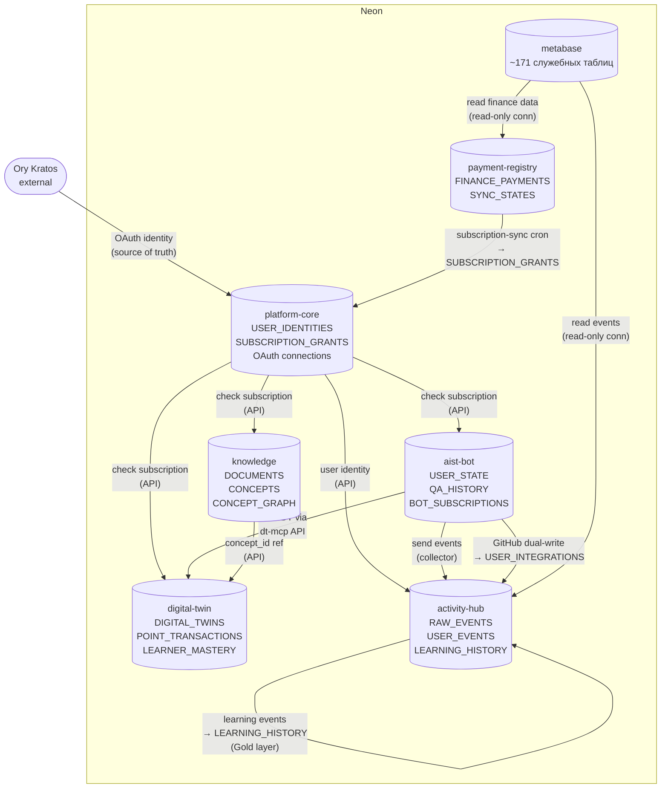
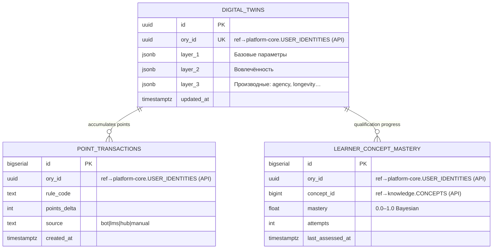
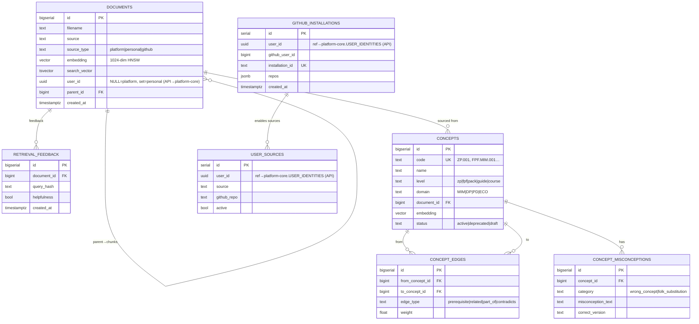
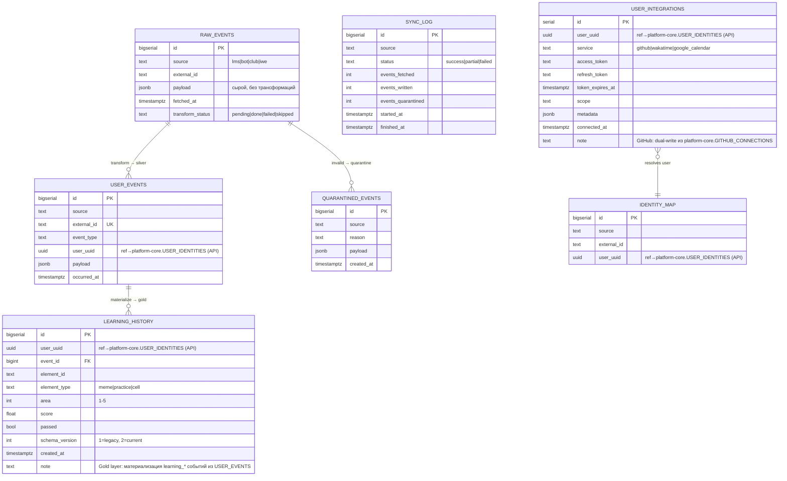
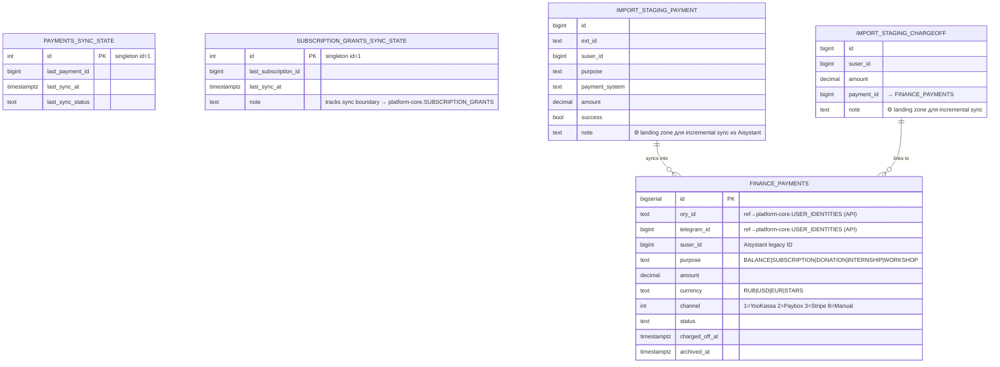
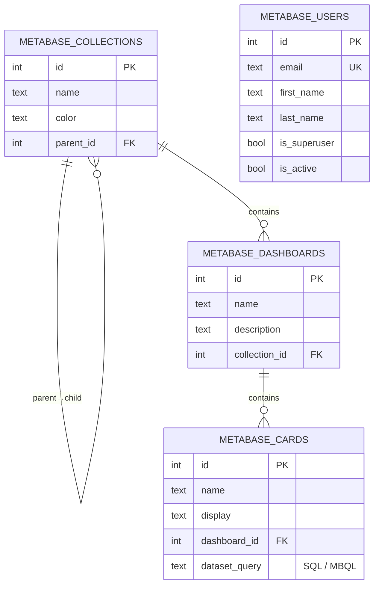

# DP.ARCH.004 — Архитектура данных Neon

> **Это целевая архитектура.** Текущее физическое состояние — одна база `platform` (WP-232). Разделение на отдельные базы — следующий РП.

## Принципы (решены 14 апр 2026)

**П1. 1 сервис = 1 база** (не схема)
Каждый сервис имеет собственную БД с собственными credentials. Другие сервисы не ходят в неё напрямую — только через API.

**П2. FK только внутри одной базы**
Ссылки между сервисами — только `ory_id`/`telegram_id` без FK constraint. Консистентность через API или Saga.

**П3. Схема = namespace для роли-администратора**
Внутри базы схемы разграничивают доступ ролей (финансист видит `finance.*`). Не для изоляции сервисов.

**П4. `ory_id` — глобальный ключ**
Каждая база хранит `ory_id` как обычную колонку без FK. Ory Kratos — source of truth идентичности. `user_identities` хранит только то, чего Ory не знает: `telegram_id`, `lms_id`, `region`.

**П5. Activity Hub — проектировать под замену**
Events — кандидат на ClickHouse/TimescaleDB при масштабировании. Именно поэтому отдельная база.

**П6. Платежи — максимальная изоляция**
`finance_payments` без FK наружу. Другие сервисы проверяют подписку через `subscription_grants` в `platform-core` (gateway), не через прямой доступ к базе платежей.

**П7. `SUBSCRIPTION_GRANTS` живёт в `platform-core` осознанно**
Gateway-паттерн: `payment-registry` синхронизирует гранты подписок в `platform-core` через `subscription-sync` cron. Другие сервисы читают авторизацию только из `platform-core` — единая точка проверки прав.

## Карта баз данных

```
Neon Project: aisystant
│
├── DB: platform-core      ← USER_IDENTITIES + SUBSCRIPTION_GRANTS
│                             + GITHUB_CONNECTIONS + GOOGLE_CALENDAR_CONNECTIONS
│                             + ORY_TOKENS + DT_TOKENS + BACKEND_REGISTRY
│                             + directus.* (схема Directus CMS ~15 таблиц)
│
├── DB: digital-twin       ← DIGITAL_TWINS + POINT_TRANSACTIONS
│                             + LEARNER_CONCEPT_MASTERY
│
├── DB: knowledge          ← DOCUMENTS + CONCEPTS + CONCEPT_EDGES
│                             + CONCEPT_MISCONCEPTIONS + RETRIEVAL_FEEDBACK
│                             + GITHUB_INSTALLATIONS + USER_SOURCES
│
├── DB: activity-hub       ← RAW_EVENTS (partitioned) + USER_EVENTS
│                             + LEARNING_HISTORY (Gold layer)
│                             + USER_INTEGRATIONS + IDENTITY_MAP
│                             + SYNC_LOG + QUARANTINED_EVENTS
│                             ⚠ кандидат на замену ClickHouse/TimescaleDB
│
├── DB: payment-registry   ← FINANCE_PAYMENTS + PAYMENTS_SYNC_STATE
│                             + SUBSCRIPTION_GRANTS_SYNC_STATE
│                             + IMPORT_STAGING_PAYMENT + IMPORT_STAGING_CHARGEOFF
│
├── DB: aist-bot           ← USER_STATE + QA_HISTORY + NOTIFICATION_LOG
│                             + BOT_SUBSCRIPTIONS + SEMINARS + SEMINAR_PAYMENTS
│                             + WORKSHOP_PAYMENTS + COMMUNITY_MEMBERS
│                             + SERVICE_USAGE + USER_ACCESS + FEEDBACK_TRIAGE
│
└── DB: metabase           ← служебные таблицы Metabase (~171 таблица)
                              dashboards, questions, users, collections…
                              читает payment-registry (read-only conn)
                              ⚠ НЕ хранит прикладные данные платформы

Вне Neon:
  Ory Kratos (отдельный сервис) ← идентичность, source of truth по ory_id
```

## Пояснение: USER_INTEGRATIONS vs GITHUB_CONNECTIONS

Обе таблицы хранят GitHub OAuth-токен одного и того же пользователя — это намеренный **dual-write**.

| | GITHUB_CONNECTIONS (platform-core) | USER_INTEGRATIONS (activity-hub) |
|---|---|---|
| **Кто пишет** | Бот (OAuth callback) | activity-hub (sync из github_connections) |
| **Назначение** | Конфигурация публикации: target_repo, notes_path, strategy_repo, branches | Server-side сбор данных: WakaTime sync, IWE Adapter |
| **Дополнительные поля** | knowledge_repo, strategy_repo, default_branch | scope, metadata (generic) |
| **Потребитель** | Бот-издатель (публикация заметок) | activity-hub collectors |

`GOOGLE_CALENDAR_CONNECTIONS` — только в `platform-core` (бот), дублирования нет.
`WAKATIME` — только в `USER_INTEGRATIONS` (activity-hub collector), в боте нет.

---

## Общая диаграмма: связи между базами

Показывает потоки данных и API-зависимости между базами. Все стрелки — API-вызовы или cron-синхронизация, не FK.



---

## ERD по базам данных

> Связи между базами помечены `(API)` с указанием целевой базы.

---

### DB: platform-core

Ядро платформы: идентичность, подписки, OAuth-соединения, реестр персональных MCP.
**Gateway-паттерн:** все сервисы проверяют права только здесь, не идут напрямую в payment-registry.

```mermaid
erDiagram
    USER_IDENTITIES {
        uuid        ory_id          PK  "source: Ory Kratos"
        bigint      telegram_id     UK
        bigint      lms_id
        text        region          "ru|world"
        timestamptz created_at
    }

    SUBSCRIPTION_GRANTS {
        uuid        id              PK
        uuid        ory_id          "→ USER_IDENTITIES"
        bigint      telegram_id     "→ USER_IDENTITIES"
        text        product         "br = Бесконечное развитие"
        text        source          "payment|manual|marketing|trial"
        timestamptz valid_from
        timestamptz valid_until
        timestamptz revoked_at
        text        note            "синхронизируется из payment-registry cron"
    }

    GITHUB_CONNECTIONS {
        serial      id              PK
        uuid        ory_id          "→ USER_IDENTITIES"
        bigint      telegram_id
        text        github_username
        text        access_token
        text        refresh_token
        text        knowledge_repo
        text        strategy_repo
        text        default_branch
        timestamptz connected_at
        text        note            "dual-write: токен также в activity-hub.USER_INTEGRATIONS"
    }

    GOOGLE_CALENDAR_CONNECTIONS {
        serial      id              PK
        uuid        ory_id          "→ USER_IDENTITIES"
        bigint      telegram_id
        text        access_token
        text        refresh_token
        text        calendar_id
        text        email
        timestamptz connected_at
    }

    ORY_TOKENS {
        serial      id              PK
        uuid        ory_id          "→ USER_IDENTITIES"
        bigint      telegram_id
        text        access_token
        text        refresh_token
        timestamptz expires_at
    }

    DT_TOKENS {
        serial      id              PK
        uuid        ory_id          "→ USER_IDENTITIES"
        bigint      telegram_id
        text        token_value
        timestamptz expires_at
    }

    BACKEND_REGISTRY {
        serial      id              PK
        uuid        ory_id          "→ USER_IDENTITIES"
        text        backend_url
        text        tool_prefix
        text        name
        text        status          "pending_validation|active|failed"
        text        knowledge_gate_result "pending|passed|partial|failed"
        timestamptz created_at
    }

    USER_IDENTITIES ||--o{ SUBSCRIPTION_GRANTS : "has"
    USER_IDENTITIES ||--o{ GITHUB_CONNECTIONS : "connects GitHub"
    USER_IDENTITIES ||--o{ GOOGLE_CALENDAR_CONNECTIONS : "connects GCal"
    USER_IDENTITIES ||--o{ ORY_TOKENS : "SSO session"
    USER_IDENTITIES ||--o{ DT_TOKENS : "DT access"
    USER_IDENTITIES ||--o{ BACKEND_REGISTRY : "personal MCPs"
```



---

### DB: digital-twin

Цифровой двойник пользователя. Writers: dt-mcp, profiler cron, бот (только через DT-MCP API).



---

### DB: knowledge

Документы платформы и пользователей, граф концептов, источники для индексации.



---

### DB: activity-hub

Medallion-архитектура: Landing (raw) → Silver (user_events) → Gold (learning_history).
Кандидат на замену ClickHouse/TimescaleDB при росте объёма событий.



---

### DB: payment-registry

Реестр всех платежей. Максимальная изоляция: другие сервисы не имеют прямого доступа к базе.
Синхронизирует `SUBSCRIPTION_GRANTS` в `platform-core` через cron `subscription-sync`.



---

### DB: aist-bot

Только бот. Telegram-first: основной ключ — `chat_id`. Не содержит платформенных данных.

```mermaid
erDiagram
    USER_STATE {
        bigint      chat_id         PK  "Telegram chat_id"
        text        current_state   "FSM state"
        jsonb       data            "FSM context"
        timestamptz trial_started_at
        timestamptz last_active_date
        int         active_days_total
    }

    QA_HISTORY {
        bigserial   id              PK
        bigint      chat_id         FK
        text        question
        text        answer
        bool        helpful
        jsonb       mcp_sources
        timestamptz created_at
    }

    NOTIFICATION_LOG {
        bigserial   id              PK
        bigint      chat_id
        text        notification_type
        text        idempotency_key UK
        jsonb       payload
        timestamptz created_at
    }

    BOT_SUBSCRIPTIONS {
        bigserial   id              PK
        bigint      chat_id
        text        status          "active|inactive"
        text        telegram_payment_charge_id
        int         stars_amount
        timestamptz started_at
        timestamptz expires_at
    }

    SEMINARS {
        serial      id              PK
        text        title
        decimal     price_rub
        int         price_stars
        bigint      tg_group_id     "Telegram group"
        date        event_date
    }

    SEMINAR_PAYMENTS {
        bigserial   id              PK
        bigint      telegram_id
        int         seminar_id      FK
        decimal     amount
        text        currency        "RUB|STARS"
        text        status
        timestamptz paid_at
    }

    WORKSHOP_PAYMENTS {
        bigserial   id              PK
        bigint      telegram_id
        text        aisystant_id    "ref→Aisystant LMS user (external, API)"
        decimal     amount
        text        status          "pending|success"
        text        source          "bot|web"
        timestamptz paid_at
    }

    COMMUNITY_MEMBERS {
        bigserial   id              PK
        bigint      telegram_id
        bigint      chat_id
        text        username
        timestamptz joined_at
        timestamptz left_at
    }

    SERVICE_USAGE {
        bigserial   id              PK
        bigint      user_id         "Telegram ID"
        text        service_id
        timestamptz created_at
    }

    USER_ACCESS {
        bigserial   id              PK
        bigint      user_id         "Telegram ID"
        text        access_type
        text        resource_id
        timestamptz expires_at
    }

    FEEDBACK_TRIAGE {
        bigserial   id              PK
        bigint      chat_id
        text        category
        text        status          "new|classified|resolved"
        text        source          "bot|club|manual"
        timestamptz created_at
    }

    USER_STATE ||--o{ QA_HISTORY : "conversation"
    USER_STATE ||--o{ NOTIFICATION_LOG : "notifications"
    USER_STATE ||--o{ BOT_SUBSCRIPTIONS : "TG Stars billing"
    SEMINARS ||--o{ SEMINAR_PAYMENTS : "paid by"
```



---

### DB: metabase

Служебные таблицы Metabase BI (~171 таблица). Не хранит прикладные данные платформы.
Читает `payment-registry` и `activity-hub` через отдельные read-only connections.



---

## Кто читает / кто пишет

| База | Writers | Readers |
|------|---------|---------|
| platform-core | Ory callback, OAuth flows, `subscription-sync` cron (из payment-registry) | gateway-mcp (авторизация каждого запроса), все сервисы через API |
| digital-twin | dt-mcp, profiler cron, бот (через DT-MCP API) | dt-mcp, бот `/twin`, knowledge-mcp (рекомендации) |
| knowledge | knowledge-mcp ingest, GitHub webhook | knowledge-mcp search, dt-mcp |
| activity-hub | collectors (lms/bot/club/iwe), transform-worker, бот (dual-write GitHub токена) | transform-worker, Metabase (RO) |
| payment-registry | `incremental-sync.sh` cron, Directus API | Metabase (RO), `subscription-sync` cron |
| aist-bot | только бот | только бот |
| metabase | Metabase internal | Metabase UI |

## Статус

> **Целевая архитектура.** Текущее состояние (14 апр 2026): все таблицы в одной базе `platform` (WP-232).
> Разделение на 7 баз — следующий РП (~20-40h).
> Решение принято: встреча ИТ 8, 14 апр 2026.
