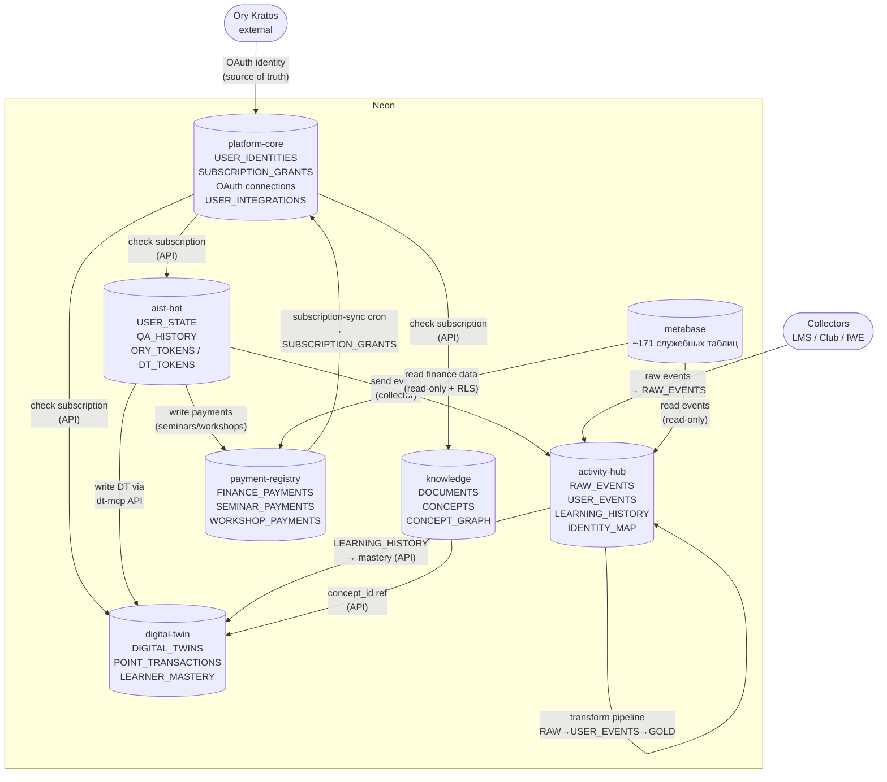
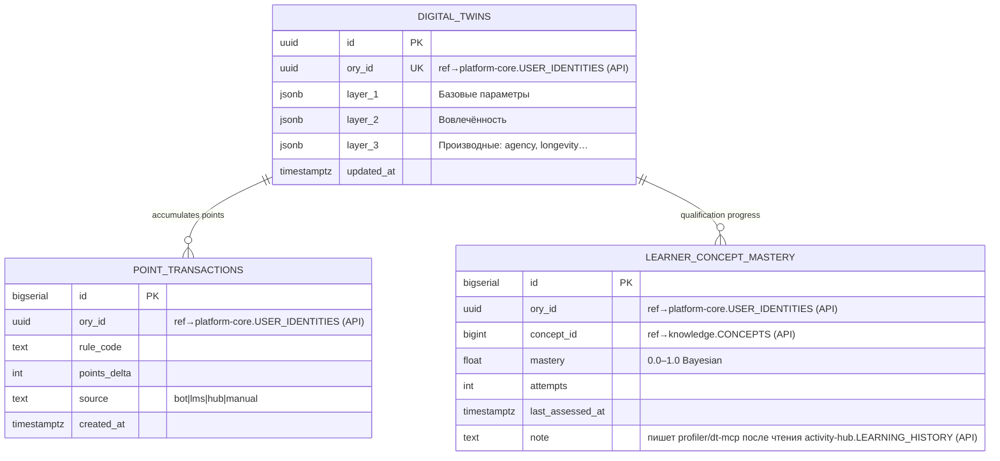
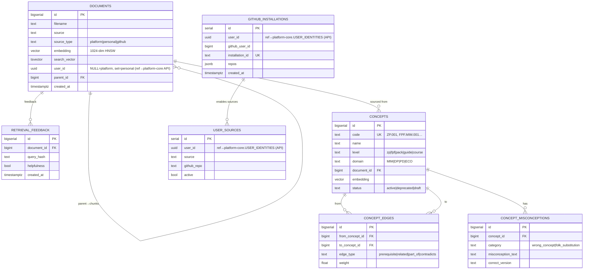
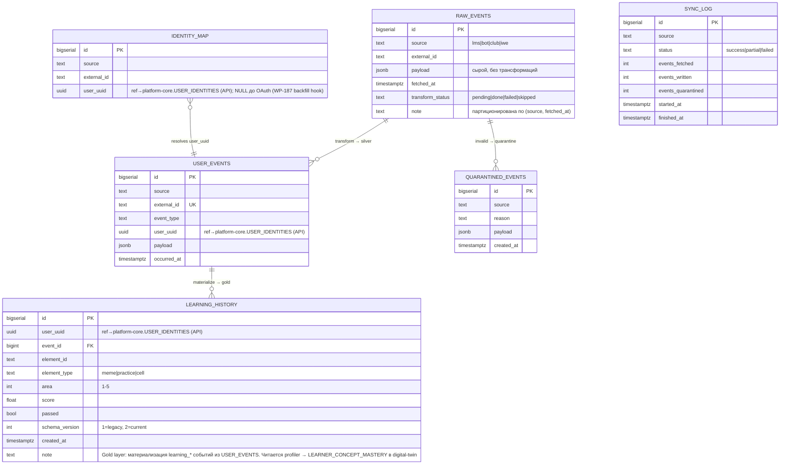
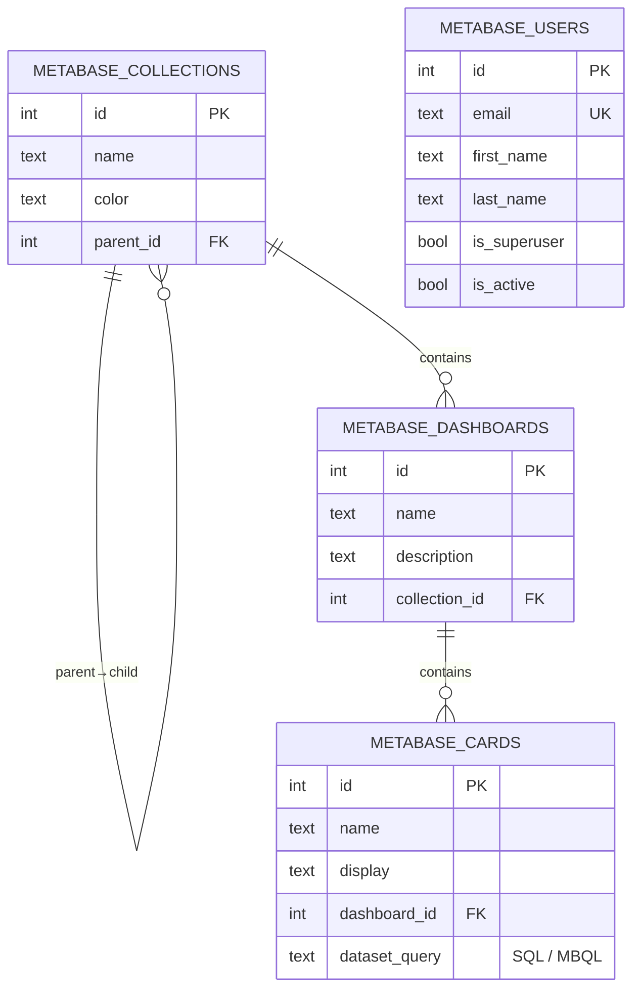

# DP.ARCH.004 — Архитектура данных Neon

> **Это целевая архитектура.** Текущее физическое состояние — одна база `platform` (WP-232). Разделение на отдельные базы — следующий РП.

## Принципы (решены 14 апр 2026)

**П1. 1 сервис = 1 база** (не схема)
Каждый сервис имеет собственную БД с собственными credentials. Другие сервисы не ходят в неё напрямую — только через API.

**П2. FK только внутри одной базы**
Ссылки между сервисами — только `ory_id`/`telegram_id` без FK constraint. Консистентность через API или Saga.

**П3. Схема = namespace для роли-администратора**
Внутри базы схемы разграничивают доступ ролей (финансист видит `finance.*`). Не для изоляции сервисов.

**П4. `ory_id` — глобальный ключ для платформ-сервисов**
Каждая платформ-база (digital-twin, knowledge, payment-registry) хранит `ory_id` как обычную колонку без FK. Ory Kratos — source of truth идентичности. `user_identities` хранит только то, чего Ory не знает: `telegram_id`, `lms_id`, `region`.
Бот использует `telegram chat_id` как локальный ключ — пользователи бота до OAuth не имеют `ory_id`. Разрешение `chat_id → ory_id` происходит в `activity-hub.IDENTITY_MAP` после OAuth callback (WP-187).

**П5. Activity Hub — проектировать под замену**
Events — кандидат на ClickHouse/TimescaleDB при масштабировании. Именно поэтому отдельная база. OAuth-конфигурация пользователей (`USER_INTEGRATIONS`) хранится в `platform-core`, а не в activity-hub — чтобы не потерять её при замене движка.

**П6. Платежи — изолированный реестр**
`payment-registry` — единственная база с финансовыми транзакциями. Другие сервисы не имеют прямого доступа к ней (кроме Metabase через read-only роль с RLS, см. П7). Все платежи платформы (YooKassa, Stripe, Telegram Stars, семинары, воркшопы) хранятся здесь.

**П7. `SUBSCRIPTION_GRANTS` в `platform-core` — gateway-паттерн**
`payment-registry` поддерживает `SUBSCRIPTION_GRANTS` актуальными через `subscription-sync` cron. Другие сервисы проверяют права только через `platform-core` — единая точка авторизации. Это **push-based sync**: payment-registry пишет в ядро, не наоборот.
Metabase читает `payment-registry` через отдельного read-only пользователя Postgres с Row-Level Security (видит агрегаты: суммы, статусы — не реквизиты). RLS-политики → WP-212 Ф9.

---

## Карта баз данных

```
Neon Project: aisystant
│
├── DB: platform-core      ← USER_IDENTITIES + SUBSCRIPTION_GRANTS
│                             + GITHUB_CONNECTIONS + GOOGLE_CALENDAR_CONNECTIONS
│                             + USER_INTEGRATIONS (OAuth-конфиг для коллекторов)
│                             + BACKEND_REGISTRY
│                             + directus.* (схема Directus CMS ~15 таблиц)
│
├── DB: digital-twin       ← DIGITAL_TWINS + POINT_TRANSACTIONS
│                             + LEARNER_CONCEPT_MASTERY
│
├── DB: knowledge          ← DOCUMENTS + CONCEPTS + CONCEPT_EDGES
│                             + CONCEPT_MISCONCEPTIONS + RETRIEVAL_FEEDBACK
│                             + GITHUB_INSTALLATIONS + USER_SOURCES
│
├── DB: activity-hub       ← RAW_EVENTS (partitioned) + USER_EVENTS
│                             + LEARNING_HISTORY (Gold layer)
│                             + IDENTITY_MAP + SYNC_LOG + QUARANTINED_EVENTS
│                             ⚠ кандидат на замену ClickHouse/TimescaleDB
│
├── DB: payment-registry   ← FINANCE_PAYMENTS + SEMINAR_PAYMENTS + WORKSHOP_PAYMENTS
│                             + PAYMENTS_SYNC_STATE + SUBSCRIPTION_GRANTS_SYNC_STATE
│                             + IMPORT_STAGING_PAYMENT + IMPORT_STAGING_CHARGEOFF
│
├── DB: aist-bot           ← USER_STATE + QA_HISTORY + NOTIFICATION_LOG
│                             + BOT_SUBSCRIPTIONS + SEMINARS + COMMUNITY_MEMBERS
│                             + SERVICE_USAGE + USER_ACCESS + FEEDBACK_TRIAGE
│                             + ORY_TOKENS + DT_TOKENS (персистентность бот-сессий)
│
└── DB: metabase           ← служебные таблицы Metabase (~171 таблица)
                              dashboards, questions, users, collections…
                              читает payment-registry и activity-hub (read-only + RLS)
                              ⚠ НЕ хранит прикладные данные платформы

Вне Neon:
  Ory Kratos (отдельный сервис) ← идентичность, source of truth по ory_id
```

---

## Пояснение: USER_INTEGRATIONS vs GITHUB_CONNECTIONS

Обе таблицы хранят GitHub OAuth-токен одного пользователя — это намеренный **dual-write**.

| | GITHUB_CONNECTIONS (platform-core) | USER_INTEGRATIONS (platform-core) |
|---|---|---|
| **Назначение** | Конфигурация публикации: target_repo, notes_path, strategy_repo, branches | OAuth-конфиг для коллекторов: WakaTime sync, IWE Adapter |
| **Дополнительные поля** | knowledge_repo, strategy_repo, default_branch | service, scope, metadata (generic) |
| **Потребитель** | Бот-издатель (публикация заметок) | activity-hub collectors |

`GOOGLE_CALENDAR_CONNECTIONS` — только в `platform-core`, дублирования нет.
`WAKATIME` — только в `USER_INTEGRATIONS`, в боте нет.

---

## Пояснение: ORY_TOKENS и DT_TOKENS в aist-bot

Это **персистентность бот-сессий**, а не кеш платформы:
- Бот переживает редеплои: токены восстанавливаются из БД при старте
- Ключ — `chat_id` (Telegram), не `ory_id` — потому что бот работает в Telegram-контексте
- `ory_tokens` — токены для вызова Gateway MCP (Ory OAuth, proactive refresh каждые 10 мин)
- `dt_tokens` — токены для вызова DT API (Digital Twin OAuth callback)
- Хранятся в aist-bot, потому что нужны только боту. Не платформ-данные.

---

## Пояснение: LEARNING_HISTORY vs LEARNER_CONCEPT_MASTERY

Два разных предмета одного домена обучения:

| | LEARNING_HISTORY (activity-hub) | LEARNER_CONCEPT_MASTERY (digital-twin) |
|---|---|---|
| **Что хранит** | Сырые факты: "прошёл мем X, score 0.8" | Агрегированный статус: "освоен концепт ZP.001 на 85%" |
| **Кто пишет** | transform-worker из USER_EVENTS | dt-mcp / profiler (читает LEARNING_HISTORY через API) |
| **Слой** | Gold (события) | Производная (state) |

Поток: LEARNING_HISTORY (activity-hub) → API → profiler/dt-mcp → LEARNER_CONCEPT_MASTERY (digital-twin).
Квалификация "Ученик" и уровни до неё — автоматически из mastery. Выше — методсовет МИМ (ручное).

---

## Общая диаграмма: связи между базами

Показывает потоки данных и API-зависимости между базами. Все стрелки — API-вызовы или cron-синхронизация, не FK.



---

## ERD по базам данных

> Связи между базами помечены `(API)` с указанием целевой базы.

---

### DB: platform-core

Ядро платформы: идентичность, подписки, OAuth-соединения, реестр персональных MCP.
**Gateway-паттерн:** все сервисы проверяют права только здесь, не идут напрямую в payment-registry.

```mermaid
erDiagram
    USER_IDENTITIES {
        uuid        ory_id          PK  "source: Ory Kratos"
        bigint      telegram_id     UK
        bigint      lms_id
        text        region          "ru|world"
        timestamptz created_at
    }

    SUBSCRIPTION_GRANTS {
        uuid        id              PK
        uuid        ory_id          "→ USER_IDENTITIES"
        bigint      telegram_id     "→ USER_IDENTITIES"
        text        product         "br = Бесконечное развитие"
        text        source          "payment|manual|marketing|trial"
        timestamptz valid_from
        timestamptz valid_until
        timestamptz revoked_at
        text        note            "поддерживается payment-registry subscription-sync cron"
    }

    GITHUB_CONNECTIONS {
        serial      id              PK
        uuid        ory_id          "→ USER_IDENTITIES"
        bigint      telegram_id
        text        github_username
        text        access_token
        text        refresh_token
        text        knowledge_repo
        text        strategy_repo
        text        default_branch
        timestamptz connected_at
        text        note            "dual-write: токен также в USER_INTEGRATIONS для коллекторов"
    }

    GOOGLE_CALENDAR_CONNECTIONS {
        serial      id              PK
        uuid        ory_id          "→ USER_IDENTITIES"
        bigint      telegram_id
        text        access_token
        text        refresh_token
        text        calendar_id
        text        email
        timestamptz connected_at
    }

    USER_INTEGRATIONS {
        serial      id              PK
        uuid        user_uuid       "→ USER_IDENTITIES"
        text        service         "github|wakatime|google_calendar"
        text        access_token
        text        refresh_token
        timestamptz token_expires_at
        text        scope
        jsonb       metadata
        timestamptz connected_at
        text        note            "source of truth для activity-hub collectors; GitHub: dual-write из GITHUB_CONNECTIONS"
    }

    BACKEND_REGISTRY {
        serial      id              PK
        uuid        ory_id          "→ USER_IDENTITIES"
        text        backend_url
        text        tool_prefix
        text        name
        text        status          "pending_validation|active|failed"
        text        knowledge_gate_result "pending|passed|partial|failed"
        timestamptz created_at
    }

    USER_IDENTITIES ||--o{ SUBSCRIPTION_GRANTS : "has"
    USER_IDENTITIES ||--o{ GITHUB_CONNECTIONS : "connects GitHub"
    USER_IDENTITIES ||--o{ GOOGLE_CALENDAR_CONNECTIONS : "connects GCal"
    USER_IDENTITIES ||--o{ USER_INTEGRATIONS : "service integrations"
    USER_IDENTITIES ||--o{ BACKEND_REGISTRY : "personal MCPs"
```



---

### DB: digital-twin

Цифровой двойник пользователя. Writers: dt-mcp, profiler cron, бот (только через DT-MCP API).



---

### DB: knowledge

Документы платформы и пользователей, граф концептов, источники для индексации.



---

### DB: activity-hub

Medallion-архитектура: Landing (raw) → Silver (user_events) → Gold (learning_history).
Кандидат на замену ClickHouse/TimescaleDB при росте объёма событий.



---

### DB: payment-registry

Единственная база с финансовыми транзакциями. Хранит все виды платежей платформы.
Синхронизирует `SUBSCRIPTION_GRANTS` в `platform-core` через cron `subscription-sync`.
Metabase читает через отдельного read-only пользователя с RLS (→ WP-212 Ф9).

```mermaid
erDiagram
    FINANCE_PAYMENTS {
        bigserial   id              PK
        text        ory_id          "ref→platform-core.USER_IDENTITIES (API)"
        bigint      telegram_id     "ref→platform-core.USER_IDENTITIES (API)"
        bigint      suser_id        "Aisystant legacy ID"
        text        purpose         "BALANCE|SUBSCRIPTION|DONATION|INTERNSHIP|WORKSHOP"
        decimal     amount
        text        currency        "RUB|USD|EUR|STARS"
        int         channel         "1=YooKassa 2=Paybox 3=Stripe 8=Manual"
        text        status
        timestamptz charged_off_at
        timestamptz archived_at
    }

    SEMINAR_PAYMENTS {
        bigserial   id              PK
        bigint      telegram_id     "ref→platform-core.USER_IDENTITIES (API)"
        int         seminar_id      "ref→aist-bot.SEMINARS (API)"
        decimal     amount
        text        currency        "RUB|STARS"
        text        status
        timestamptz paid_at
        text        note            "оплата семинаров через бот; бот пишет сюда через payment API"
    }

    WORKSHOP_PAYMENTS {
        bigserial   id              PK
        bigint      telegram_id     "ref→platform-core.USER_IDENTITIES (API)"
        text        aisystant_id    "ref→Aisystant LMS user (external API)"
        decimal     amount
        text        status          "pending|success"
        text        source          "bot|web"
        timestamptz paid_at
        text        note            "оплата воркшопов; бот пишет сюда через payment API"
    }

    PAYMENTS_SYNC_STATE {
        int         id              PK  "singleton id=1"
        bigint      last_payment_id
        timestamptz last_sync_at
        text        last_sync_status
    }

    SUBSCRIPTION_GRANTS_SYNC_STATE {
        int         id              PK  "singleton id=1"
        bigint      last_subscription_id
        timestamptz last_sync_at
        text        note            "watermark → platform-core.SUBSCRIPTION_GRANTS"
    }

    IMPORT_STAGING_PAYMENT {
        bigint      id
        text        ext_id
        bigint      suser_id
        text        purpose
        text        payment_system
        decimal     amount
        bool        success
        text        note            "landing zone для incremental sync из Aisystant"
    }

    IMPORT_STAGING_CHARGEOFF {
        bigint      id
        bigint      suser_id
        decimal     amount
        bigint      payment_id      "→ FINANCE_PAYMENTS"
        text        note            "landing zone для incremental sync"
    }

    IMPORT_STAGING_PAYMENT ||--o{ FINANCE_PAYMENTS : "syncs into"
    IMPORT_STAGING_CHARGEOFF ||--o{ FINANCE_PAYMENTS : "links to"
```



---

### DB: aist-bot

Только бот. Telegram-first: основной ключ — `chat_id`. Не содержит платформенных данных и финансовых транзакций.

```mermaid
erDiagram
    USER_STATE {
        bigint      chat_id         PK  "Telegram chat_id"
        text        current_state   "FSM state"
        jsonb       data            "FSM context"
        timestamptz trial_started_at
        timestamptz last_active_date
        int         active_days_total
    }

    QA_HISTORY {
        bigserial   id              PK
        bigint      chat_id         FK
        text        question
        text        answer
        bool        helpful
        jsonb       mcp_sources
        timestamptz created_at
    }

    NOTIFICATION_LOG {
        bigserial   id              PK
        bigint      chat_id
        text        notification_type
        text        idempotency_key UK
        jsonb       payload
        timestamptz created_at
    }

    BOT_SUBSCRIPTIONS {
        bigserial   id              PK
        bigint      chat_id
        text        status          "active|inactive"
        text        telegram_payment_charge_id
        int         stars_amount
        timestamptz started_at
        timestamptz expires_at
        text        note            "Telegram Stars billing (бот-уровень); платформ-подписка в platform-core.SUBSCRIPTION_GRANTS"
    }

    SEMINARS {
        serial      id              PK
        text        title
        decimal     price_rub
        int         price_stars
        bigint      tg_group_id     "Telegram group"
        date        event_date
        text        note            "каталог семинаров; оплата → payment-registry.SEMINAR_PAYMENTS"
    }

    COMMUNITY_MEMBERS {
        bigserial   id              PK
        bigint      telegram_id
        bigint      chat_id
        text        username
        timestamptz joined_at
        timestamptz left_at
    }

    SERVICE_USAGE {
        bigserial   id              PK
        bigint      user_id         "Telegram ID"
        text        service_id
        timestamptz created_at
    }

    USER_ACCESS {
        bigserial   id              PK
        bigint      user_id         "Telegram ID"
        text        access_type
        text        resource_id
        timestamptz expires_at
    }

    FEEDBACK_TRIAGE {
        bigserial   id              PK
        bigint      chat_id
        text        category
        text        status          "new|classified|resolved"
        text        source          "bot"
        timestamptz created_at
        text        note            "только бот-фидбек (source='bot'); кросс-канальный feedback → activity-hub"
    }

    ORY_TOKENS {
        bigint      chat_id         PK  "Telegram chat_id"
        text        access_token
        text        refresh_token
        timestamptz expires_at
        text        ory_id
        timestamptz updated_at
        text        note            "персистентность Ory OAuth-сессии бота; восстанавливается при редеплое"
    }

    DT_TOKENS {
        bigint      chat_id         PK  "Telegram chat_id"
        text        access_token
        text        refresh_token
        timestamptz expires_at
        text        dt_user_id
        timestamptz updated_at
        text        note            "персистентность Digital Twin OAuth-сессии бота; восстанавливается при редеплое"
    }

    USER_STATE ||--o{ QA_HISTORY : "conversation"
    USER_STATE ||--o{ NOTIFICATION_LOG : "notifications"
    USER_STATE ||--o{ BOT_SUBSCRIPTIONS : "TG Stars billing"
    SEMINARS }o--o{ COMMUNITY_MEMBERS : "members"
```



---

### DB: metabase

Служебные таблицы Metabase BI (~171 таблица). Не хранит прикладные данные платформы.
Читает `payment-registry` и `activity-hub` через отдельные read-only connections с RLS.



---

## Кто читает / кто пишет

| База | Writers | Readers |
|------|---------|---------|
| platform-core | Ory callback, OAuth flows, `subscription-sync` cron (из payment-registry) | gateway-mcp (авторизация каждого запроса), все сервисы через API |
| digital-twin | dt-mcp, profiler cron (читает activity-hub.LEARNING_HISTORY через API) | dt-mcp, бот `/twin`, knowledge-mcp (рекомендации) |
| knowledge | knowledge-mcp ingest, GitHub webhook | knowledge-mcp search, dt-mcp |
| activity-hub | collectors (lms/bot/club/iwe), transform-worker, бот (события) | transform-worker, profiler (LEARNING_HISTORY), Metabase (RO) |
| payment-registry | `incremental-sync.sh` cron, бот (seminar/workshop payments через API) | Metabase (RO + RLS), `subscription-sync` cron |
| aist-bot | только бот | только бот |
| metabase | Metabase internal | Metabase UI |

---

## Справочник таблиц

### platform-core

| Таблица | Назначение |
|---------|-----------|
| USER_IDENTITIES | Маппинг идентичностей: ory_id ↔ telegram_id ↔ lms_id. Хранит только то, чего Ory не знает. Source of truth для связывания пользователей между системами. |
| SUBSCRIPTION_GRANTS | Реестр активных прав подписки. Gateway-паттерн: все сервисы проверяют права здесь. Поддерживается payment-registry через cron. |
| GITHUB_CONNECTIONS | GitHub OAuth-токены и конфигурация публикации (репозитории, ветки). Потребитель — бот-издатель заметок. |
| GOOGLE_CALENDAR_CONNECTIONS | Google Calendar OAuth-токены для интеграции бота с календарём пользователя. |
| USER_INTEGRATIONS | OAuth-конфигурация для activity-hub коллекторов: GitHub (WakaTime), Google Calendar. Source of truth для collectors; переживает замену движка activity-hub. |
| BACKEND_REGISTRY | Реестр персональных MCP-бэкендов пользователей (экзокортекс). Статус валидации и knowledge gate. |

### digital-twin

| Таблица | Назначение |
|---------|-----------|
| DIGITAL_TWINS | Цифровой двойник пользователя. 3 слоя: базовые параметры, вовлечённость, производные показатели (agency, longevity и др.). |
| POINT_TRANSACTIONS | Лог начислений/списаний баллов активности. Каждое событие — отдельная строка с rule_code и источником. |
| LEARNER_CONCEPT_MASTERY | Агрегированная степень освоения концептов (0.0–1.0). Вычисляется profiler из LEARNING_HISTORY. Основа для автоматической квалификации "Ученик". |

### knowledge

| Таблица | Назначение |
|---------|-----------|
| DOCUMENTS | Документы платформы и персональные документы пользователей. Чанки с векторными эмбеддингами для semantic search. |
| RETRIEVAL_FEEDBACK | Обратная связь по релевантности документов при поиске. Используется для дообучения ранжирования. |
| CONCEPTS | Граф концептов платформы (ZP, FPF, Pack, курсы). Каждый концепт — именованная единица знания с уровнем и доменом. |
| CONCEPT_EDGES | Рёбра графа концептов: prerequisite, related, part_of, contradicts. Основа для графовых рекомендаций. |
| CONCEPT_MISCONCEPTIONS | Типовые ошибки и заблуждения по концептам. Используются для адаптивного обучения. |
| GITHUB_INSTALLATIONS | GitHub App installations пользователей. Даёт боту доступ к репозиториям для индексации. |
| USER_SOURCES | Источники индексации для каждого пользователя (GitHub репозитории, активные/неактивные). |

### activity-hub

| Таблица | Назначение |
|---------|-----------|
| RAW_EVENTS | Landing zone. Сырые события из всех источников (LMS, бот, club, IWE) без трансформаций. Партиционирована по source и fetched_at. Bronze-слой медальонной архитектуры. |
| USER_EVENTS | Silver-слой. Нормализованные события с атрибуцией пользователя (user_uuid), дедуплицированные по external_id. |
| LEARNING_HISTORY | Gold-слой. Материализация learning-событий: факты обучения (мемы, практики, ячейки) с оценками. Читается profiler для вычисления mastery. |
| IDENTITY_MAP | Маппинг внешних ID (chat_id, lms_id) на ory_id для атрибуции событий. user_uuid = NULL до OAuth-связывания. |
| SYNC_LOG | Журнал запусков коллекторов: статус, количество событий, время. Используется для мониторинга и дебага. |
| QUARANTINED_EVENTS | Карантин для событий, не прошедших валидацию. Хранятся для ручного разбора и повторной обработки. |

### payment-registry

| Таблица | Назначение |
|---------|-----------|
| FINANCE_PAYMENTS | Основной реестр всех финансовых транзакций платформы. YooKassa, Stripe, ручные платежи. Источник данных для Metabase и subscription-sync. |
| SEMINAR_PAYMENTS | Платежи за семинары (через бот). Отдельная таблица для отчётности по семинарскому направлению. |
| WORKSHOP_PAYMENTS | Платежи за воркшопы (через бот или web). Содержит aisystant_id для связки с LMS. |
| PAYMENTS_SYNC_STATE | Singleton-ватерmarк инкрементального импорта из Aisystant. Хранит last_payment_id для безопасного возобновления. |
| SUBSCRIPTION_GRANTS_SYNC_STATE | Singleton-ватерmarк синхронизации грантов подписок в platform-core. |
| IMPORT_STAGING_PAYMENT | Landing zone для инкрементального импорта платежей из Aisystant API. Временные данные до верификации и merge. |
| IMPORT_STAGING_CHARGEOFF | Landing zone для списаний из Aisystant. Связывается с FINANCE_PAYMENTS по payment_id. |

### aist-bot

| Таблица | Назначение |
|---------|-----------|
| USER_STATE | FSM-состояние пользователя в боте. Текущий шаг диалога, контекст, счётчик активных дней, триал. |
| QA_HISTORY | История вопросов и ответов пользователя в боте с флагом полезности и источниками MCP. |
| NOTIFICATION_LOG | Журнал отправленных уведомлений с idempotency_key для защиты от дублей. |
| BOT_SUBSCRIPTIONS | Telegram Stars подписки (бот-уровень). Не связаны с платформенной подпиской (та — в platform-core.SUBSCRIPTION_GRANTS). |
| SEMINARS | Каталог семинаров: название, цена, дата, Telegram-группа. Оплата → payment-registry.SEMINAR_PAYMENTS. |
| COMMUNITY_MEMBERS | Участники Telegram-сообщества: join/leave события. |
| SERVICE_USAGE | Счётчик использования сервисов бота по пользователю. |
| USER_ACCESS | Временные права доступа к ресурсам (выданные ботом, с expiry). |
| FEEDBACK_TRIAGE | Фидбек пользователей из бота: категория, статус обработки. Только source='bot'. |
| ORY_TOKENS | Ory OAuth-токены бота (access + refresh). Хранятся для переживания редеплоев. Ключ — chat_id. |
| DT_TOKENS | Digital Twin OAuth-токены бота (access + refresh). Хранятся для переживания редеплоев. Ключ — chat_id. |

### metabase

| Таблица | Назначение |
|---------|-----------|
| METABASE_COLLECTIONS | Иерархические коллекции дашбордов и вопросов (папки в Metabase). |
| METABASE_DASHBOARDS | Дашборды: финансы, события, активность. Читают из payment-registry и activity-hub. |
| METABASE_CARDS | Отдельные вопросы (questions): SQL или MBQL-запросы к данным. |
| METABASE_USERS | Пользователи Metabase (аналитики, финансисты). Не связаны с Ory-пользователями платформы. |

---

## Открытые вопросы

| Вопрос | Владелец | Статус |
|--------|---------|--------|
| Retention policy всех таблиц (TTL, архивирование, GDPR right-to-be-forgotten) | WP-214 (Data Governance) + новая фаза WP-228 | pending |
| Backup / DR: RPO, RTO, PITR по каждой базе | WP-212 Ф5 + новая фаза WP-228 | pending |
| RLS-политики для Metabase read-only connections к payment-registry | WP-212 Ф9 | pending |
| Partitioning strategy для USER_EVENTS, LEARNING_HISTORY, POINT_TRANSACTIONS | WP-228 Ф1 | pending |

---

## Статус

> **Целевая архитектура.** Текущее состояние (14 апр 2026): все таблицы в одной базе `platform` (WP-232).
> Разделение на 7 баз — следующий РП (~20-40h).
> Решение принято: встреча ИТ 8, 14 апр 2026.
