# DP.ARCH.004 — Архитектура данных Neon

Архитектура данных платформы: 9 баз Neon, какие физ.объекты живут в каждой, как базы связаны между собой, кто пишет и читает. Ниже — три ключевые диаграммы: **карта 9 БД** (в каждой базе — объекты физ.мира: человек, курс, платёж, событие), **ERD по каждой БД** (концептуальные ER-диаграммы сущностей и связей) и **обзорная** (все системы + 9 баз + агенты в одном виде). Контекст, принципы, реестр таблиц и принятые решения — в разделах после диаграмм.

---

<details>
<summary><b>1. Карта БД (7 на карте + LMS legacy + #7/#8 вне карты)</b></summary>

В каждом кластере — все физ.объекты этой БД по реестру §7.0.2 (узел = объект физ.мира, которому можно дать имя собственное). Сплошная линия внутри кластера — связь двух объектов. Пунктирная с подписью — связь 🔗 с атрибутами (наставничество, OAuth): это ребро, а не узел. Стрелка `-->` — поток трансформации (Job→Post в #9). Стрелки между кластерами `-.->` — межбазовые связи и read-only аналитика. Технические таблицы (`*_log`, `*_session`, `*_cache`, `*_state`, `*_snapshot`) не показаны — они в §10. Правила построения — `DP.METHOD.040`.

> **Ревизия 21 апр (замечание Андрея):** БД #7 metabase и #8 health временно убраны с карты, чтобы уместить всё на одном экране. Это инфраструктурные БД, не домен; их ERD и реестр остаются в §2 и §7.0.2. Возврат на карту — после MVP.
>
> **LMS Aisystant (21 апр, замечание Андрея «добавить LMS со всеми объектами»):** отдельный кластер оранжевого цвета — внешняя legacy-система. Показаны 9 физ.объектов LMS по аудиту (`DS-my-strategy/inbox/WP-228-F24-lms-audit.md`). Межкластерные стрелки от LMS к #1/#2/#4/#5 отражают: где LMS уже source-of-truth (квалификация), где дублирование будет разрешено миграцией (биллинг, CRM, события). Детали — §2 «External: LMS» и §7.0.2 «LMS Aisystant».

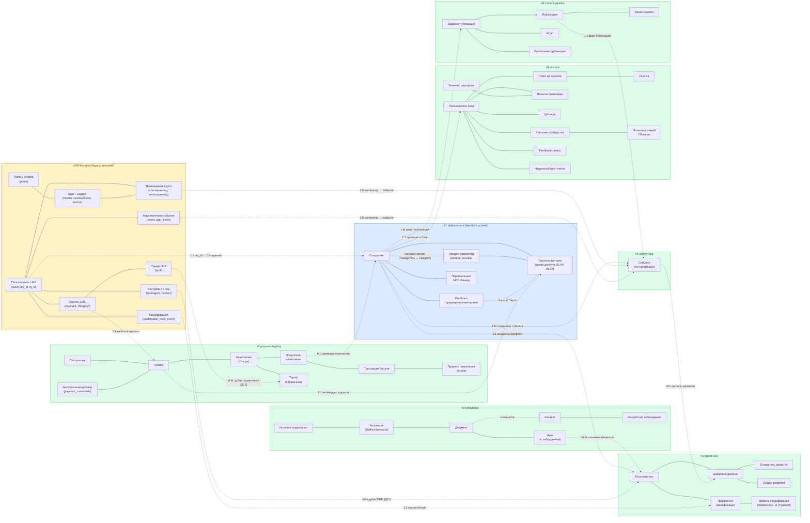

**Легенда кратностей** (ER-стиль, применена к межкластерным связям карты):

- **1:1** — один-к-одному (напр. Созидатель ↔ Пользователь профиль, Платёж ↔ Подписка-контракт активация).
- **1:M** — один-ко-многим (напр. Созидатель совершает много событий, автор порождает много публикаций).
- **M:1** — много-к-одному (напр. много получателей начисления проецируются на одного Созидателя).
- **M:M** — много-ко-многим (напр. чанки ↔ концепты через освоение, дубли справочников LMS↔наши).

Внутри кластера кратности опущены для читаемости — их показывают ERD в §2 (ER-нотация `||--o{`).

</details>

---

<details open>
<summary><b>2. ERD по базам данных</b></summary>

> Концептуальная ER: только объекты физ.мира (`DP.METHOD.040` §1, HD «ER ≠ Физ.схема», «Объект ≠ Отношение»). Реестр физ.объектов — §7.0.2. Физ.схема с колонками и FK — §10. Связи между БД — §7.5. Не показаны технические таблицы (`*_log`, `*_session`, `*_cache`, `*_snapshot`, `*_state`, `*_staging`), промежуточные M:N-связки без атрибутов и копии/проекции — о них примечание после каждой ER.
>
> **Ревизия «объект ≠ атрибут» (Д10, 21 апр, замечание Андрея).** Пройдены все ERD на предмет ошибки «атрибут показан как объект». Результаты:
> - #2 `МНОЖИТЕЛЬ_КВАЛИФИКАЦИИ` → свёрнут в атрибут `множитель_баллов` + `daily_cap` у `УРОВЕНЬ_КВАЛИФИКАЦИИ` (справочник).
> - #4 Medallion-слои (raw/normalized/aggregated) → свёрнуты в атрибут `слой` у `СОБЫТИЕ` (Д11).
> - #1 `Баланс баллов (кеш)` → агрегат, не объект (перенос в #5 + кеш-статус).
> - #1 `Текущий тир созидателя` → проекция, не объект (колонка `current_tier` в SUBSCRIPTION_GRANTS).
> - #2 `ПОКАЗАТЕЛЬ_РАЗВИТИЯ`, `СТАДИЯ_РАЗВИТИЯ` — слабые сущности в контексте двойника (хранятся JSONB / колонкой), сохранены на ERD по §7.0.2 критериям («код + значение» даёт имя собственное).
> - #4 `ВНЕШНЯЯ_СИСТЕМА` — enum-источник; сохранена как ссылка (каждый источник — конкретный сервер: LMS Aisystant, System School Bot, WakaTime).
> - #9 `РАСПИСАНИЕ_ПУБЛИКАЦИИ` — слабая сущность (timestamp + bool), сохранена.
>
> Открытый аудит: JSON-структура ЦД (`layer_1/2/3`) — логика заполнения слоёв; вопрос на Д12 с Димой.

### DB #1: platform-core

Ядро платформы: **идентичность + права доступа**. После ревизии 21 апр (замечание Андрея «оставить только Созидатель и права доступа»): квалификации — в #2 digital-twin (Д6), баллы и платёжная модель — в #5 payment-registry (Д4). В ядре остаются только идентичность, права доступа (подписка-контракт, Pre-Grant, наставничество), справочник продуктов (целевой объект прав) и BYOB-бэкенд.

**BC:** Identity & Access (subscriptions + pre-grants + mentor assignments).

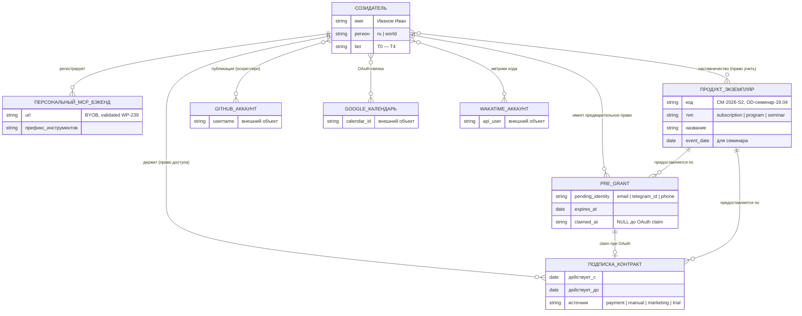

**Примечания.**
- **Ревизия 21 апр (замечание Андрея):** «В ядре оставить только Созидателя и права доступа; остальное убрать». Вынесены: квалификации (Д6 → #2), баллы — Правило начисления + Транзакция баллов (Д4 → #5). В ядре остаются: идентичность (Созидатель) + права доступа (Подписка-контракт, Pre-Grant, Наставник-назначение) + справочник продуктов (целевой объект прав) + BYOB-бэкенд + OAuth-связки.
- **Продукт-экземпляр** — справочник-каталог, цель для прав. Оставлен в #1, т.к. на него ссылаются Подписка-контракт и Pre-Grant; выделение в отдельный «catalog» BC — отложено (MVP-компромисс).
- **Персональный MCP-бэкенд** — BYOB-регистрация (WP-239). Не право, но user-owned ресурс в границах identity. Кандидат на вынесение в #3 knowledge (как «источник индексации») — решение на post-MVP.
- ⚠️ `TIER_EVENTS` (событие смены тира) концептуально принадлежит #4 activity-hub — не показан на этой ER (PMB-кандидат).
- 🔗 «Наставничество» = связь Созидатель(наставник)↔Продукт с атрибутом роли (lead/assistant/reviewer), **право учить**; на физ.схеме — `MENTOR_ASSIGNMENTS`.
- 🔗 Три внешних OAuth-связки (GitHub/GCal/WakaTime) — связи с внешними физ.объектами, не узлы домена. Показаны прямоугольниками с пометкой «внешний объект» для читаемости Mermaid.
- ❌ Удалены из #1 (21 апр): `ТРАНЗАКЦИЯ_БАЛЛОВ`, `ПРАВИЛО_НАЧИСЛЕНИЯ_БАЛЛОВ`, `ПРИСВОЕНИЕ_КВАЛИФИКАЦИИ`, `УРОВЕНЬ_КВАЛИФИКАЦИИ`, `МНОЖИТЕЛЬ_КВАЛИФИКАЦИИ`, `Баланс баллов (кеш)`.

---

### DB #2: digital-twin

Модель человека: сам пользователь (полный профиль), его цифровой двойник (снимок в трёх слоях), история квалификаций и освоения концептов. В ядре (#1) остаётся только идентичность + права (ранее квалификации жили там — перенесены сюда 21 апр).

**BC:** Digital Twin + Qualification History.

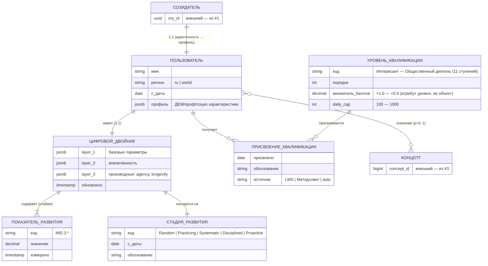

**Примечания.**
- 🔗 «Освоение концепта» = связь Пользователь↔Концепт с атрибутами (mastery 0.0-1.0, confidence, attempts, last_assessed_at); на физ.схеме — `LEARNER_CONCEPT_MASTERY`. Пишет knowledge-mcp (через API →#3).
- **Пользователь** — полный профиль человека (имя, регион, демография, соц-проф характеристики). Отличается от **Созидателя** в #1: там только Ory-идентичность + tier + права доступа (минимум для auth/ACL). Переход 21 апр: «модель человека» выведена из ядра в digital-twin.
- **Показатель развития** — слабая сущность: живёт только в контексте двойника, хранится в колонках JSONB. PK составной (twin_id + код).
- **Стадия развития** — слабая сущность в контексте двойника (хранится колонкой `stage` в DIGITAL_TWINS); показана отдельно по §7.0.2 (✅ физ.объект — конкретная позиция пользователя на шкале зрелости).
- **Уровень квалификации** — справочник 11 ступеней (от Интересант до Общественный деятель). `множитель_баллов` и `daily_cap` — атрибуты уровня, не отдельный объект (ревизия 21 апр, замечание Андрея: «Множитель квалификации — не объект, а характеристика уровня»).
- **Присвоение квалификации** — событие-факт: пользователю присвоен уровень с датой, обоснованием, источником. Перенесено из #1 21 апр.
- ⚠️ `profiling_runs` (запуск профайлера, WP-218 план) = технический лог, не физ.объект; PMB-7.
- ❓ **Открытый вопрос (Д12 с Димой):** JSON-модель ЦД (layer_1/2/3) — уточнить логику работы профайлера и как заполняются слои. Замечание Андрея 21 апр: «проверить про json и логику работы ЦД».

---

### DB #3: knowledge

Два слоя знаний: **универсальный слой хранения** (Коллекция → Документ → Чанк, работает для любого текстового корпуса — Pack, личное, внешние источники) и **семантический слой** (Концепт над документами — граф понятий, заблуждения). Ревизия 21 апр (замечание Андрея): «Knowledge база может быть универсальной, нужно отделить уровни работы со знанием».

**BC:** Knowledge Base (universal storage + semantic layer).

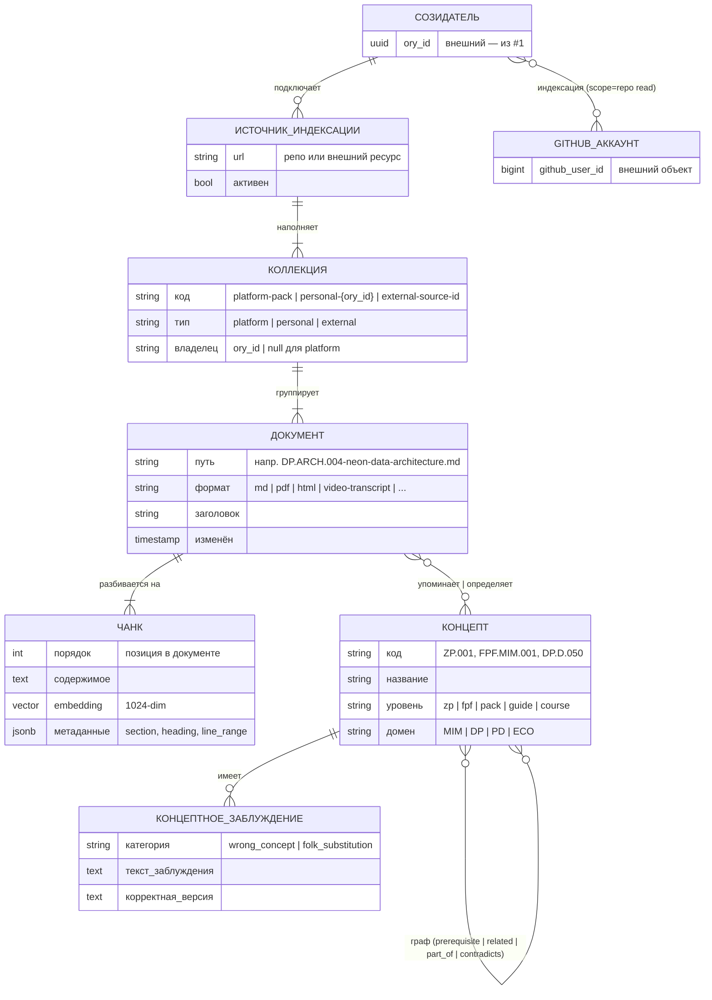

**Примечания.**
- **Два уровня работы со знанием** (21 апр, замечание Андрея):
  - **Уровень 1 — универсальное хранение:** Коллекция → Документ → Чанк. Любой текстовый корпус можно положить в эту структуру: Pack-файлы, личные заметки, внешние книги/статьи, транскрипты, репо. Работает как универсальная векторная БД для RAG/поиска.
  - **Уровень 2 — семантический:** Концепт + граф + заблуждения. Накладывается поверх универсального слоя. Один Документ может упоминать N Концептов; один Концепт определяется одним Документом-источником (канонический) + упоминается во многих других.
- **Коллекция** — физ.объект (новый 21 апр): namespace документов. Три типа: `platform` (Pack, ZP, FPF — общая для всех), `personal` (личные заметки конкретного Созидателя, RLS), `external` (внешний источник, напр. книга или GitHub-репо).
- **Документ** — физ.объект (конкретный .md-файл, страница PDF, запись видео с путём, заголовком). Раньше эмбеддинг хранился в документе — теперь перенесён в Чанк (правильный уровень: эмбеддинг = свойство куска, не всего документа).
- **Чанк** — физ.объект (новый 21 апр): кусок документа с эмбеддингом. Разбиение на чанки — стандартная RAG-практика; на ERD выделено как отдельная сущность, т.к. чанк имеет собственные атрибуты (позиция, эмбеддинг, метаданные) и используется отдельно в поиске.
- **Концепт↔Концепт** = связь с атрибутом `edge_type`, на физ.схеме — `CONCEPT_EDGES`.
- 🔗 «Упоминание концепта» = связь Документ↔Концепт M:N (документ может упоминать N концептов; концепт упоминается в M документах). Атрибут — «определяет» (канонический источник) vs «упоминает».
- 🔗 «Индексация» = связь Созидатель↔GitHub-аккаунт scope=repo(read), с атрибутом installation_id; на физ.схеме — `GITHUB_INSTALLATIONS`.
- ⚠️ `RETRIEVAL_FEEDBACK` = событие (факт оценки релевантности), не объект; не показан (→ #4 activity-hub).

---

### DB #4: activity-hub

Поток событий созидателей из всех внешних систем. Один физ.объект — Событие (факт, что произошло). Medallion-слои (raw/normalized/aggregated) — техническая декомпозиция хранения, не доменная модель.

**BC:** Activity & Events.

**Ревизия 21 апр (замечание Андрея):** «Activity Hub — простое событие, остальное убрать». Убрана трёхслойная Medallion-модель (Bronze/Silver/Gold) с уровня физ.объектов. Остаётся один физ.объект — **Событие**. Medallion-слои (сырое / нормализованное / агрегат) — техническая декомпозиция хранения, не разные сущности (как снимки БД, колонки JSONB, агрегаты). На ER выражается атрибутами `слой` и `trace_id`, не отдельными узлами.

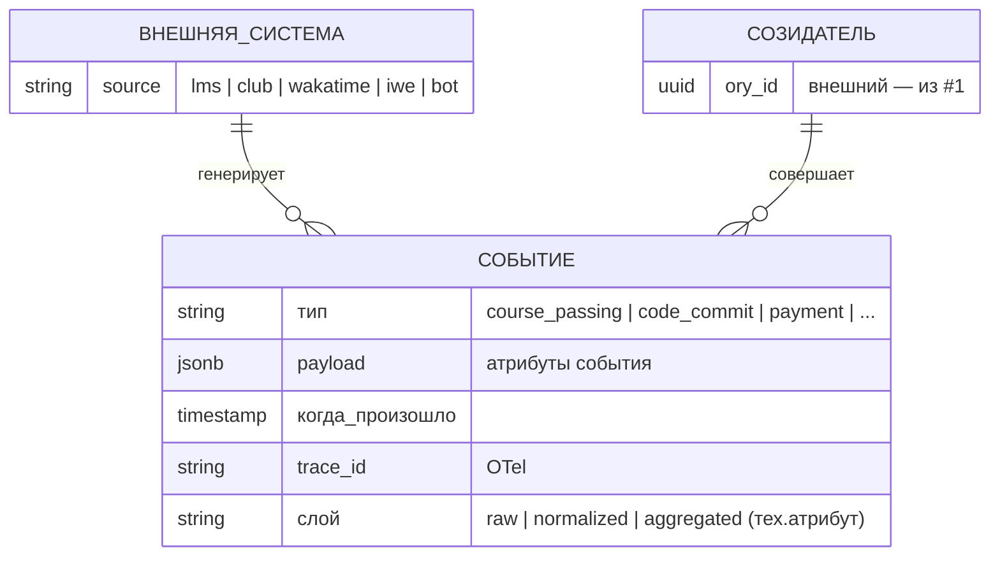

**Примечания.**
- **Событие** — единственный физ.объект Activity Hub. Факт, который произошёл: пройден курс, закоммичен код, совершён платёж, проведена помидорка. У каждого события — источник (внешняя система) и созидатель-совершитель.
- **Medallion-слои (raw/normalized/aggregated)** — стадии жизни одного события, не три разные сущности. Выражаются атрибутом `слой` или колонками JSONB в одной таблице. Это **техническая декомпозиция** хранения, не доменная модель (HD «ER ≠ Физ.схема»).
- 🔗 `IDENTITY_MAP` = связь «внешний идентификатор (chat_id / lms_id) ↔ Созидатель», слабая идентификация до OAuth. Отражается как процесс нормализации, не узел.
- ⚠️ `QUARANTINED_EVENTS` = технический sink (события, не прошедшие валидацию) — не на ER.
- ⚠️ `SYNC_LOG` = технический лог запусков коллекторов — не на ER.
- ✅ `CONVERSION_EVENTS` — принято 20 апр: тип События (не отдельная сущность) в #4 activity-hub.

---

### DB #5: payment-registry

Финансовые транзакции + начисления + баллы. Единственная БД платформы с платёжной информацией. Биллинг — **внешний** (YooKassa/Stripe/Tg Stars), мы — приёмник webhooks и хранитель registry. Ревизия 21 апр (замечание Андрея): выделены 4 объекта биллинг-домена (Плательщик, Платёж, Начисление, Получатель начисления) + справочник Тарифов + перенос Баллов из ядра.

**BC:** Payments + Charges + Points Economy.

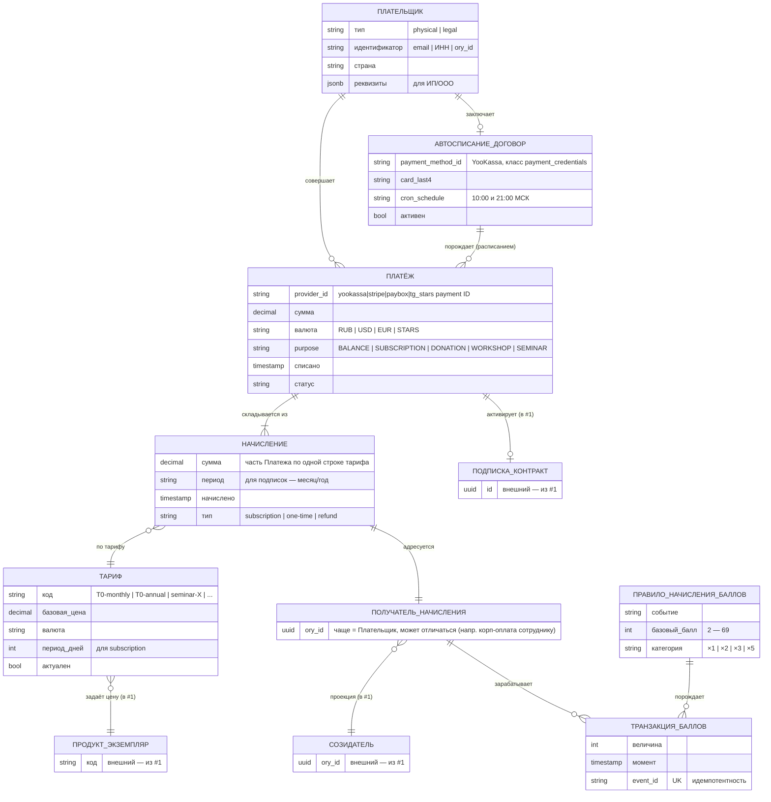

**Примечания.**
- **Плательщик** (новый объект, 21 апр) — субъект, с чьего счёта списываются деньги. Может отличаться от получателя услуги: ИП Тсеренов платит за Общее дело, ООО платит за сотрудника, родитель за ребёнка. Тип — physical/legal, идентификатор — email/ИНН/ory_id.
- **Платёж** — физ.объект (конкретная транзакция с ID провайдера, суммой, датой). Физ.реализация в трёх таблицах — `FINANCE_PAYMENTS` (основная), `SEMINAR_PAYMENTS`, `WORKSHOP_PAYMENTS` (кандидаты на миграцию из #6).
- **Начисление** (новый объект, 21 апр) — строка в счёте: что именно оплачивается в рамках Платежа по какому Тарифу. Платёж может состоять из нескольких Начислений (месяц подписки + одноразовый семинар). Это отражает биллинг-логику: Платёж = транзакция денег, Начисление = начисление в счёте.
- **Получатель начисления** (новый объект, 21 апр) — кому адресовано начисление (кто получает доступ к продукту/услуге). Чаще совпадает с Плательщиком, но разделены для поддержки корп-оплаты и подарков. Проекция на Созидателя в #1.
- **Тариф** (новый объект, 21 апр) — справочник цен: для подписок (T0/T1/T2 × месяц/год), семинаров, воркшопов. Вопрос на Д12: у Димы в LMS есть таблица `tariff` — портируем или создаём свою? ⚠️ **Замечание Андрея:** «Биллинг — внешний, не свой». Тариф-справочник у нас, но биллинг-провайдер (YooKassa/Stripe) — внешний.
- **Правило начисления баллов** + **Транзакция баллов** — перенос из #1 platform-core (21 апр, замечание Андрея: «Баллы перенести в платёж»). Баллы — часть денежной (экономической) модели, не ядра прав доступа. На ER #1 больше не показаны.
- **Автосписание-договор** — контракт-объект между плательщиком и платформой на регулярное списание с сохранённой карты. Класс данных — `payment_credentials` (§5 П6.1), строже PII.
- 🔗 Активация подписки — факт: успешный Платёж с `purpose=SUBSCRIPTION` создаёт `SUBSCRIPTION_GRANT` в #1 через `sync-subscriptions.sh`. На ER показано связью «активирует» с внешней сущностью.
- ⚠️ `PROCESSED_WEBHOOKS` = технический idempotency-механизм, не узел ER.
- ⚠️ `FINANCE_PAYMENTS_AUDIT_LOG` = лог изменений статуса (WP-237), на ER не узел (только на физ.схеме §10).
- ⚠️ `IMPORT_STAGING_*`, `*_SYNC_STATE` = landing zone и watermark — технические.
- ✅ `CONVERSION_EVENTS` — принято 20 апр: событие воронки → #4 activity-hub (не #5).
- ❓ **Открытый вопрос (Д12 с Димой):** как устроен микро-биллинг в LMS (`tariff` / `subscription` / `payment` / `chargeoff`) и что портировать vs создать с нуля. LMS-аудит → `DS-my-strategy/inbox/WP-228-F24-lms-audit.md`.

#### Autopay subsystem (подсистема автосписаний)

**Что это.** Автоматическое списание с сохранённой карты пользователя при истечении подписки, без его участия в момент списания. Используется YooKassa-механизм `save_payment_method=true` + повторный POST `/v3/payments` с сохранённым `payment_method_id`.

**Текущее состояние (промежуточное, owner — LMS):**

1. **Источники данных:** LMS таблица `subscription` (колонка `autopay boolean`) — флаг автопродления. Таблица `payment` (колонка `autopay_data varchar(1023)`) — JSON `{"type":"bank_card","payment_method_id":"...","card.last4":"1234"}`, сохранённый при первом платеже.
2. **Триггер:** `PaymentSchedulerService.autopayCheck10/21` — Spring `@Scheduled` cron 10:00 и 21:00 МСК.
3. **Отбор:** `subscriptionRepository.findAllByToDateAndAutopay(today, true)` — подписки, истекающие сегодня.
4. **Списание:** `PaymentUtil.createAutoPaymentForSubscription` → POST `/v3/payments` с `payment_method_id` + `capture:true` + `save_payment_method:true`. Merchant — один на всю систему (`Keys.getYoAuth()`, ИП).
5. **Подтверждение:** webhook `/yoo/hook` + polling `updateYooPayments` каждые 30 мин. При `succeeded` → `processPayment` продлевает подписку.
6. **Нотификации:** `paymentNotificationsCheck` шлёт письма за 7/3/1 день до списания + `sendPaymentAutoExtendMessage` после успеха. При провале письма нет.
7. **Отмена:** `POST /disable-autopay` ставит `subscription.autopay=false`. YooKassa unlink API **не вызывается** — токен остаётся действительным на стороне YooKassa.
8. **Зеркало в `payment-registry`:** `incremental-sync.sh` каждые 10 мин копирует `payment.autopay` и `payment.autopay_data` в `finance_payments` (пока read-only, не используется на чтение).

**Целевое состояние (после миграции, owner — мы):**

Подсистема **портируется**, не проектируется заново. Механизм рабочий; меняется только место исполнения:

| LMS (текущее) | Наш стек (целевое) |
|---|---|
| `PaymentSchedulerService.@Scheduled` | CF Worker `payment-scheduler` (Cloudflare Cron Triggers) |
| LMS Postgres `subscription` + `payment` | Neon `subscription_grants` + `finance_payments.autopay_data` |
| `Keys.getYoAuth()` в LMS env | CF Secrets — **те же ключи** (merchant не меняется, токены валидны) |
| `YooWebHook → updateYooPayments` | `payment-receiver` CF Worker (Ф1 WP-246 DONE) |
| `MailService.sendPayment*Message` | Email-провайдер бота |
| `POST /disable-autopay` (без unlink) | Новый endpoint + `DELETE /v3/payment_methods/{id}` (добавляем unlink) |

**Критичное операционное условие:** merchant-аккаунт YooKassa у LMS и у нас — один и тот же (ИП). Сохранённые `payment_method_id` остаются валидными при переезде. Пользователи перепривязывать карту не должны. В день cutover LMS cron отключается (`@Scheduled` комментируется в `PaymentSchedulerService.java:121-130`), наш включается. Два cron'а одновременно = двойное списание.

**Обработка `payment_credentials` (класс доступа §5 П6.1):** `autopay_data` содержит `payment_method_id` + `card.last4`. Зная эти данные плюс YooKassa API-ключ, можно инициировать произвольное списание. Поэтому: writer — только `payment-scheduler` и `incremental-sync`; reader — только `payment-scheduler` (для формирования запроса); Metabase и Бот — `REVOKE`; при отмене пользователем — вызов YooKassa unlink API + обнуление колонки; рассмотреть шифрование at-rest на Ф11 WP-246.

**Миграция:** → WP-246 Стадия 3 (Ф10–Ф16, ~14h). Gap-фиксы по ходу портирования: письмо при провале списания, retry-логика, unlink API.

---

### DB #6: aist-bot

Telegram-first среда обучения и коммуникации. 35+ физ.таблиц, но на концептуальном уровне — ~10 физ.объектов: всё остальное (FSM-state, токены, кеш, логи, проекции) — технические.

**BC:** Bot Learning & Community. **Замечание:** многие объекты (публикация, платёж, концепт) здесь — проекции из других БД. В §10 физ.схема разбита на 3 подраздела (6a/6b/6c) — на концептуальной ER оставляем одну диаграмму.

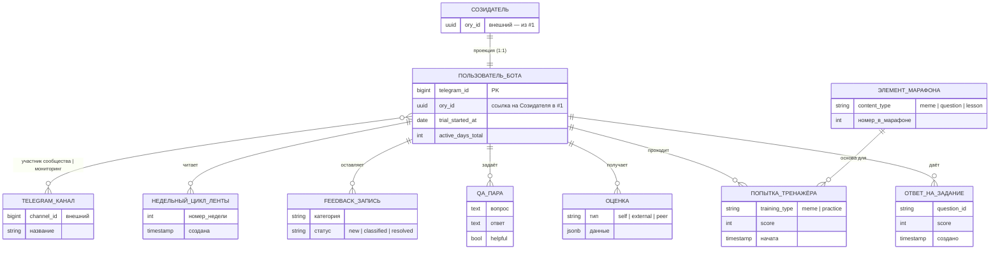

**Примечания.**
- **Пользователь бота** ≠ Созидатель: это проекция Созидателя в контексте Telegram-клиента (локальные атрибуты триала, счётчик активных дней). Связь 1:1 по `ory_id`.
- 🔗 «Участник сообщества» (`COMMUNITY_MEMBERS`) и «Мониторируемый канал» (`CHANNEL_MONITORS`) — связи Пользователь↔Канал с разным scope (участие vs слежение ботом). На ER — одно ребро «участник сообщества | мониторинг» с Telegram-каналом.
- 🔗 «Напоминание» (`REMINDERS`) = связь Пользователь↔Триггер с атрибутами (тип, время); на физ.схеме есть таблица, на концептуальной ER — не узел (реестр §7.0.2 относит к 🔗).
- **Сессия ленты** (`FEED_SESSIONS`) = связь Пользователь↔Недельный цикл (факт захода в конкретную неделю); не показана как узел.
- ⚠️ Технические (не показаны на ER): `USER_STATE`, `FSM_STATES` (FSM-состояние), `USER_SESSIONS`, `ORY_TOKENS`, `DT_TOKENS` (OAuth-носители), `OAUTH_PENDING_STATES`, `CONTENT_CACHE`, `TRAINING_PROGRESS` (state-файл), `ACTIVITY_LOG`, `ERROR_LOGS`, `REQUEST_TRACES` (копии → #8), `PENDING_FIXES` (перенесено → #8 WP-244), `NOTIFICATION_LOG`, `CHANNEL_MENTIONS_LOG`, `SERVICE_USAGE`.
- ⚠️ Кандидаты на миграцию (остаются физ.таблицами в #6 до миграции, концептуально принадлежат другим БД):
  - `PUBLISHED_POSTS`, `SCHEDULED_PUBLICATIONS`, `DISCOURSE_ACCOUNTS` → #9 content-pipeline
  - `SEMINAR_PAYMENTS`, `WORKSHOP_PAYMENTS` → #5 payment-registry
  - `CONVERSION_EVENTS` → #4 activity-hub
  - `TIER_EVENTS` → #4 (или #1)
  - `BOT_SUBSCRIPTIONS` → проекция/кеш из #1 `SUBSCRIPTION_GRANTS`
- ⚠️ `USER_ACCESS`, `FEEDBACK_REPORTS` — требуют аудита владельца (Ф13).

---

### DB #7: metabase

BI-инструмент Metabase. Сам прикладных данных не хранит — читает #5 и #4 через RLS.

**BC:** BI & Analytics. 4 пользовательских физ.объекта из ~171 служебной таблицы Metabase.

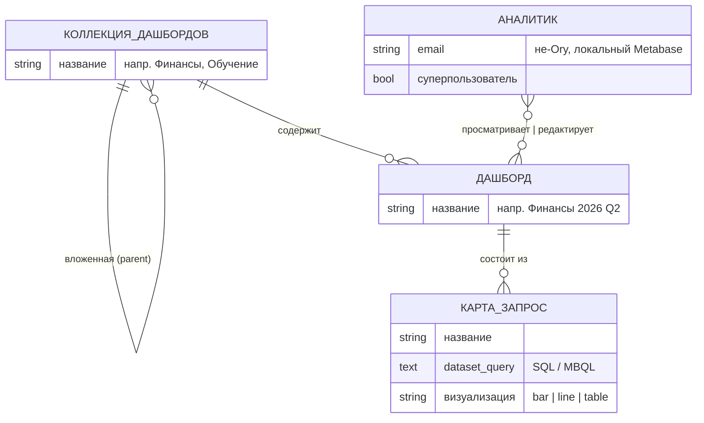

**Примечания.**
- «Данные» дашбордов живут в #5 (финансы) и #4 (события), Metabase их только визуализирует через SQL-запросы с RLS. На концептуальной ER #7 эти связи не показаны (они — между БД, не внутри #7).
- ⚠️ ~167 других служебных таблиц (`metabase_field`, `metabase_query_execution`, `metabase_session`, etc.) — технические, не на ER.

---

### DB #8: health

Операционное здоровье платформы. Cross-cutting — не принадлежит ни одному продуктовому сервису.

**BC:** Platform Health & Observability. Физ.объекты — инфраструктурные, не доменные.

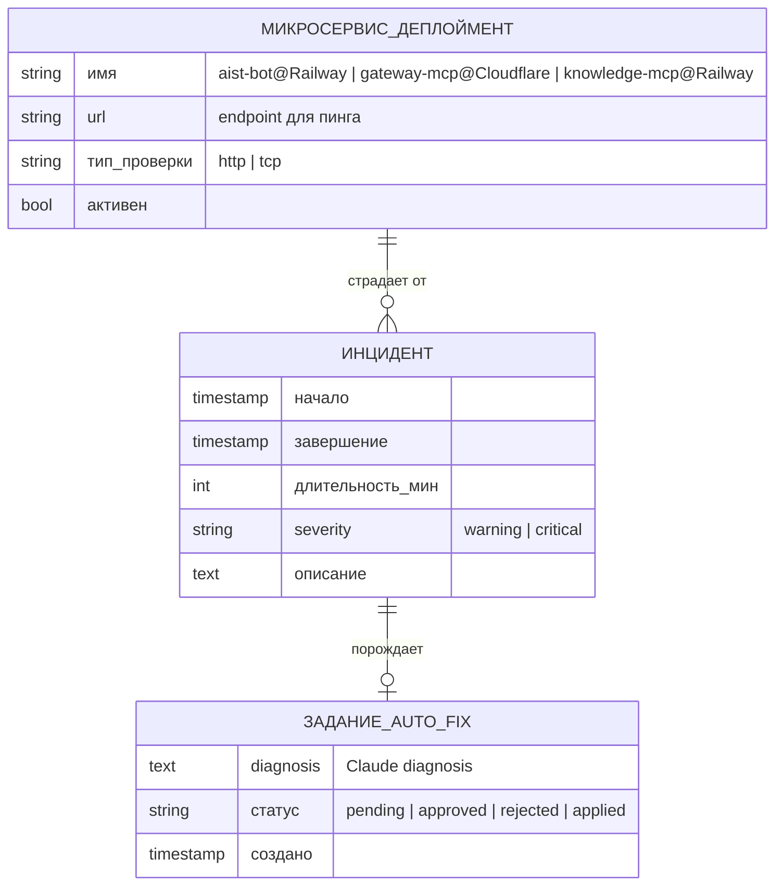

**Примечания.**
- **Микросервис-деплоймент** — инфраструктурный физ.объект: конкретный запущенный экземпляр сервиса на конкретной платформе. Экземпляру можно дать имя («aist-bot production» на Railway) и показать пальцем (URL endpoint).
- ⚠️ Технические сущности (лог/снимок, не показаны): `UPTIME_CHECKS` (пинги, TTL 90d), `ANTHROPIC_STATUS_SNAPSHOTS` (снимки чужого status page), `ERROR_LOGS` (перенесено из #6 WP-45), `REQUEST_TRACES` (OTel).
- **Источник истины** для status.anthropic.com — внешний. Снимки — периодический fetch, не физ.объект домена.

---

### DB #9: content-pipeline

Конвейер публикаций: черновик → одобрение → рендер → публикация в соцсети. Единственная БД с мульти-канальными публикациями. Токены соц.сетей — класс `payment_credentials` (строгая изоляция).

**BC:** Content Pipeline. Референс: `WP-155`, `DP.SC.121` (TBD).

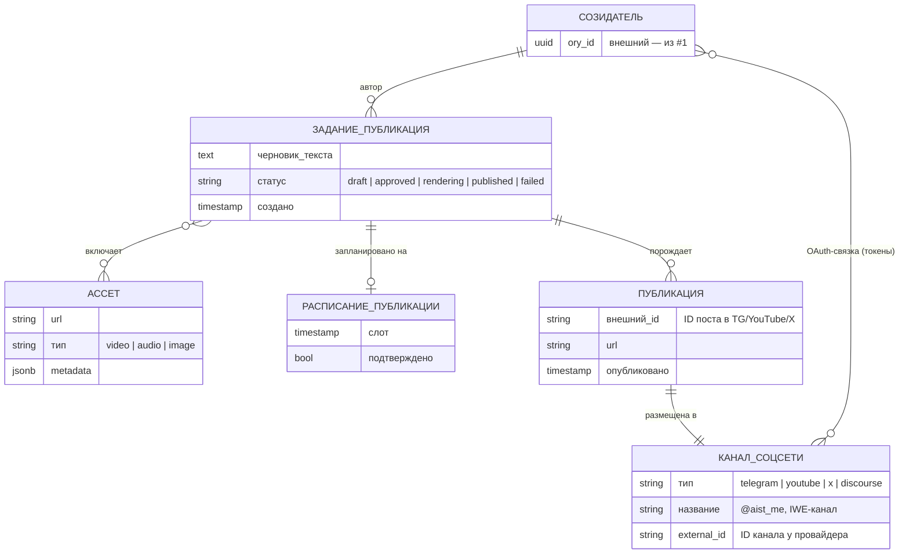

**Примечания.**
- **Задание-публикация (Job)** — физ.объект жизненного цикла (от черновика до финала). Не «сообщение», а контракт на публикацию с возможностью предварительного одобрения.
- **Публикация (Post)** — результат успешного Job: уже опубликованный пост в конкретный канал с URL. Один Job может породить несколько Публикаций (кросс-постинг в несколько каналов).
- 🔗 «OAuth-связка Созидатель↔Канал» = связь с атрибутами (токены, scope); на физ.схеме — `CHANNEL_ACCOUNTS`. Класс `payment_credentials` (§5 П6.1).
- ⚠️ `PUBLICATION_EVENTS` (факт успеха/неудачи) = событие, дублируется в #4 activity-hub через API.
- **Мульти-тенант** (PMB-4): структура подразумевает одного владельца (tenant=Tseren) в MVP; мульти-тенант — после 24 апр.

---

### External: LMS Aisystant (legacy)

Внешняя legacy-система (Java 8 / Spring / Hibernate, PostgreSQL, 48 таблиц, 89 миграций Liquibase, февраль 2020 → апрель 2026). Source: `DS-IT-systems/aisystant` ⛔ READ-ONLY. Полный аудит: [WP-228-F24-lms-audit.md](../../../../DS-my-strategy/inbox/WP-228-F24-lms-audit.md).

**BC:** Learning & Enrollment + Micro-Billing + CRM-лиды. Показана как отдельный кластер по замечанию Андрея 21 апр («добавить LMS со всеми объектами»). Приведены только **9 физ.объектов**, которые пересекаются с нашей архитектурой или мигрируют. Служебные таблицы LMS (sessiontoken, tg_log_entry, parse_result, группы сообщений, issue\*) — в аудите, не на ER.

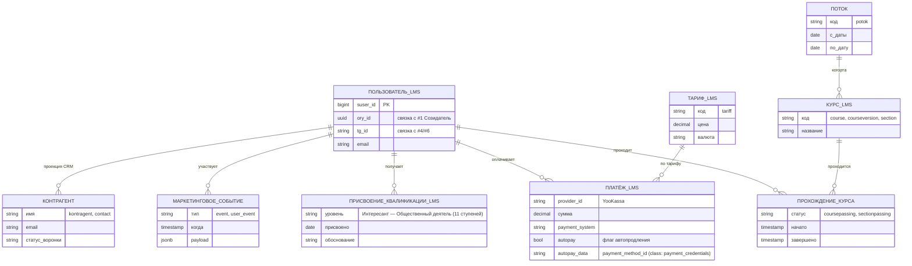

**Примечания / соответствия на нашей карте.**

| Физ.объект LMS | Проекция / миграция | Решение |
|----------------|---------------------|---------|
| **Пользователь LMS** (suser с ory_id, tg_id) | `#1 Созидатель` (suser = legacy writer через Ory sync) | Ory — source-of-truth идентичности, suser = проекция |
| **Курс + раздел** (course, courseversion, section) | `#1 Продукт-экземпляр` | LMS — writer через миграцию каталога (WP-253 роадмап) |
| **Прохождение курса** (coursepassing, sectionpassing) | `#11 learning` (post-MVP, WP-254) или `#4 activity-hub` как событие | Пока только события в #4; полноценный LEARNING_RECORD — после 24 апр |
| **Присвоение квалификации** (qualification_level_event) | `#2 digital-twin.qualification_events` | LMS — **source-of-truth** (WP-151 Ф7a: 67/67 смаплено), #2 — проекция |
| **Контрагент / лид** (kontragent, contact) | `#2 digital-twin.Пользователь` (CRM-профиль) | ❓ Д12 с Димой: LMS source-of-truth или миграция в #2? |
| **Тариф LMS** (tariff) | `#5 payment-registry.Тариф` | ❓ Д12: портируем справочник или создаём свой? |
| **Платёж-LMS** (payment, chargeoff) | `#5 payment-registry.Платёж` (writer через зеркало) | Двойной слой перед внешним билл.: LMS legacy + наш registry (WP-246) |
| **Автосписание-данные** (autopay, autopay_data) | `#5 АВТОСПИСАНИЕ_ДОГОВОР` | Портируется как есть (WP-246 Стадия 3, merchant не меняется) |
| **Маркетинговое событие** (event, user_event) | `#4 activity-hub.Событие` (writer) | LMS → RAW_EVENTS через коллектор |
| **Поток / когорта** (potok) | ❓ `#1 Продукт-экземпляр` (потоковая версия продукта) **или** `#11 learning` (группа учащихся) | Д12 с Димой: семантика «когорты» определяет БД-владельца |

**Критические пересечения (требуют решения Д12).**

1. **Биллинг:** у Димы в LMS полноценный микро-биллинг (`tariff` + `subscription` + `payment` + `chargeoff`). У нас на карте — `#1 SUBSCRIPTION_CONTRACT` + `#5 FINANCE_PAYMENTS`. Решение Андрея: «биллинг внешний, не свой». → два слоя перед YooKassa/Stripe: LMS legacy (Дима) + наш payment-registry. LMS → writer в `#5 FINANCE_PAYMENTS` через webhook-зеркало; `#1 SUBSCRIPTION_CONTRACT` — source-of-truth доступа.
2. **CRM (kontragent/contact):** дублирование с `#2 Пользователь`. Варианты (Д12): (a) LMS source-of-truth, #2 = reader; (b) миграция LMS→#2, LMS = reader; (c) merge-план в WP-253 Ф4 (PROCESSES.md).
3. **Пользователь (suser + Ory-гибрид):** LMS `suser` хранит `ory_id` и `tg_id`. В нашей архитектуре — `#1 Созидатель` привязан к Ory. LMS = legacy writer `creator` через Ory sync. На карте: `suser` = проекция `#1 Созидатель`, не отдельная сущность.
4. **Поток (potok):** привязан к `courseversion`. Семантически — когорта обучения. Вопрос: объект `#1 Продукт-экземпляр` (версия курса на поток) или `#11 learning` (группа учащихся)?

**Вынесено из карты (служебное, в аудите, не физ.объекты):** sessiontoken, tg_log_entry, tildarequest, parse_result, group_message\*, issue\* — локальные лог / конфиг / FSM LMS.

**Миграционный горизонт.** LMS — legacy, часть объектов мигрирует: автосписания → WP-246 Стадия 3 (14h), каталог курсов → WP-253 роадмап (плейсхолдер), учебные объекты → WP-254 (post-MVP, 14h). Квалификация и суbscription — LMS остаётся source-of-truth до явного решения на Д12. CRM и тарифы — решение на Д12 с Димой.

</details>

---

<details>
<summary><b>3. Обзорная диаграмма</b></summary>

Сплошная стрелка = запись, пунктир = чтение (RO). Детали каждого потока — §7.1–7.5. Три параллельные колонки: слева — источники данных, в центре — 9 баз Neon, справа — агенты и сервисы-читатели.

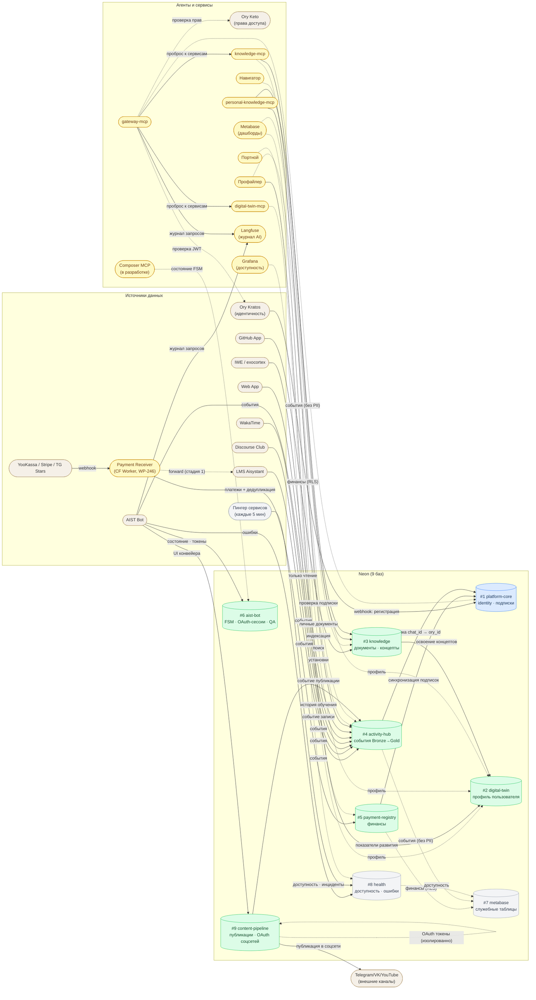

</details>

---

<details open>
<summary><b>4. Контекст и статус</b></summary>

**Зачем этот документ:** мы проектируем новую архитектуру всех систем платформы Aisystant. Структура баз данных — фундамент: от неё зависит безопасность, независимость команд, масштабируемость и возможность замены отдельных сервисов. Этот документ — source-of-truth по тому, какие данные где живут, как сервисы связаны и какие проблемы ещё нужно решить.

**Текущее состояние (апр 2026):** все таблицы живут в одной базе `platform` в Neon. Разделение на 9 баз — следующий РП (~20-40h, не начат).

**Что зафиксировано:**
- Принципы разделения данных (7 инвариантных правил)
- Карта 9 баз + внешние системы и их связи
- ERD всех таблиц включая новые (audit log, trace_id, тиры, шифрование токенов)
- Принятые архитектурные решения по безопасности, наблюдаемости, масштабированию

---

**Как читать (для команды):**

Ссылка на документ: **https://github.com/TserenTserenov/PACK-digital-platform/blob/main/pack/digital-platform/02-domain-entities/DP.ARCH.004-neon-data-architecture.md**

**В браузере (GitHub):** разделы открываются кликом на заголовок ▶ / ▼.

**В VS Code:** открыть файл → нажать `Cmd+Shift+V` (Mac) или `Ctrl+Shift+V` (Windows/Linux) → откроется Markdown Preview с интерактивными спойлерами.

**Навигация:** §6 Карта баз — быстрый ориентир. Нужна конкретная таблица → §10 Справочник (Ctrl/Cmd+F по имени таблицы). Нужно понять связи — §7 Диаграмма или §8 кто читает/пишет.

</details>

---

<details open>
<summary><b>5. Принципы</b></summary>

**П1. 1 сервис = 1 база** (не схема)
Каждый сервис имеет собственную БД с собственными credentials. Это гарантирует, что компрометация одного сервиса не открывает данные других.

**П2. FK только внутри одной базы**
Ссылки между сервисами — только `ory_id`/`telegram_id` без FK constraint. Это позволяет деплоить и мигрировать каждую базу независимо.

**П3. Схема = namespace для роли-администратора**
Внутри базы схемы разграничивают доступ ролей (финансист видит `finance.*`), а не изолируют сервисы — чтобы не создавать ложное ощущение безопасности.

**П4. `ory_id` — глобальный ключ для платформ-сервисов**
Платформ-базы хранят `ory_id` без FK — Ory Kratos остаётся единственным source of truth идентичности. Бот до OAuth работает по `telegram chat_id`; разрешение `chat_id → ory_id` — через `activity-hub.IDENTITY_MAP` (WP-187).

**П5. Activity Hub — проектировать под замену**
OAuth-конфигурация (`USER_INTEGRATIONS`) хранится в `platform-core` — чтобы при смене движка событий (ClickHouse/TimescaleDB) не потерять настройки интеграций.

**П6. Платежи — изолированный реестр**
`payment-registry` — единственная база с финансовыми транзакциями. Metabase читает только через `metabase_reader` с RLS (агрегаты без PII), прямого доступа у других сервисов нет.

**П6.1. Классы чувствительности данных (→ WP-212 Ф9, B7.3)**

Для принятия решений о RLS, ролях и шифровании различать четыре класса:

| Класс | Примеры | Писатель | Читатель | Требования |
|-------|---------|----------|----------|-------------|
| `public` | агрегаты, справочники (каналы, валюты, статусы) | сервисы | все роли, Metabase | — |
| `PII` | email, telegram_id, ory_id, имя, чат | владеющий сервис | владелец + агрегаторы с обезличиванием | RLS по user_id; Metabase — только агрегаты |
| `payment_credentials` | `autopay_data` (payment_method_id YooKassa), токены рекуррентных списаний | `payment-scheduler` + `incremental-sync` (до cutover) | `payment-scheduler` (формирование запроса в YooKassa) | Строже PII: REVOKE для Metabase и Бота; аудит SELECT; рассмотреть шифрование at-rest; unlink + обнуление при отмене пользователем |
| `secrets` | API-ключи, webhook secrets, Ory client secrets | деплой | процесс, владеющий секретом | Не в Neon — в Railway/CF secrets |

**Правило класса `payment_credentials`:** зная значение + API-ключ провайдера (YooKassa), можно инициировать произвольное списание с карты. Поэтому: (1) writer и reader на уровне ролей явно ограничены; (2) никаких агрегаций/JOIN с участием этой колонки в Metabase; (3) при отмене автопродления пользователем — unlink токена в YooKassa + обнуление колонки в Neon. До cutover WP-246 Ф15 source-of-truth для `autopay_data` — LMS; после — Neon.

**П7. `SUBSCRIPTION_GRANTS` в `platform-core` — gateway-паттерн**
`payment-registry` синхронизирует гранты в `platform-core` через cron (push-based sync). Все сервисы проверяют права только здесь — единая точка авторизации, не дублирующая логику.

**Инвариант двойной проверки:** gateway-mcp выполняет `verifyJWT` + `checkSubscription` **до** фанаута в downstream MCP (knowledge-mcp, digital-twin-mcp и др.). Если хотя бы одна проверка не прошла — gateway отвечает 401/403 немедленно, не обращаясь к downstream сервисам. Downstream сервисы не реализуют собственную проверку подписки — это исключительная ответственность gateway.

**П8. Health-данные отделены от системы**

Данные о здоровье системы (логи ошибок, pending-фиксы, метрики аптайма, инциденты, трассы) хранятся в **БД #8 health**, а не в самой системе, которая их генерирует.

**Причины:**
- **Диагностика при отказе.** Если система упала, её БД тоже недоступна → диагностика из неё невозможна. #8 — независимый контур.
- **Разный lifecycle.** Health-данные append-only, высокий объём, редкое чтение из production-пути. Смешивать с domain-данными = засорять рабочую БД.
- **OwnerIntegrity.** Владелец health-домена — БД #8, не система-источник. Смешение = нарушение bounded context.

**Применимо ко всем системам:** бот (#6), gateway-mcp, knowledge-mcp (#3), content-pipeline (#9), digital-twin (#2), activity-hub (#4), platform-core (#1), payment-registry (#5), metabase (#7).

**Контрпример (нарушение):** PENDING_FIXES жил в aist-bot (#6) как очередь авто-фиксов — сломанный бот не мог обрабатывать свою же очередь. Перенесено в #8 (WP-244).

**Операционное следствие:** При проектировании нового сервиса — НЕ добавлять `*_errors` / `*_health` / `*_incidents` / `*_fixes` таблицы в его БД. Отправлять в #8 через writer-паттерн (или прямой SQL в #8 из error_classifier).

</details>

---

<details open>
<summary><b>6. Карта баз данных</b></summary>

```
Neon Project: aisystant
│
├── DB #1: platform-core   ← USER_IDENTITIES + SUBSCRIPTION_GRANTS
│                             + GITHUB_CONNECTIONS + GOOGLE_CALENDAR_CONNECTIONS
│                             + USER_INTEGRATIONS + BACKEND_REGISTRY
│                             + PRODUCTS + MENTOR_ASSIGNMENTS
│                             + points.point_transactions + points.points_rules
│                             + points.points_multipliers (Points Engine schema)
│                             + directus.* (~15 таблиц)
│
├── DB #2: digital-twin    ← DIGITAL_TWINS + LEARNER_CONCEPT_MASTERY
│
├── DB #3: knowledge       ← DOCUMENTS + CONCEPTS + CONCEPT_EDGES
│                             + CONCEPT_MISCONCEPTIONS
│                             + GITHUB_INSTALLATIONS + USER_SOURCES
│
├── DB #4: activity-hub    ← RAW_EVENTS (partitioned) + USER_EVENTS
│                             + LEARNING_HISTORY (Gold)
│                             + IDENTITY_MAP + SYNC_LOG + QUARANTINED_EVENTS
│                             ⚠ кандидат на замену ClickHouse/TimescaleDB
│
├── DB #5: payment-registry ← FINANCE_PAYMENTS + FINANCE_PAYMENTS_AUDIT_LOG
│                             + PROCESSED_WEBHOOKS (WP-246)
│                             + PAYMENTS_SYNC_STATE + SUBSCRIPTION_GRANTS_SYNC_STATE
│                             + IMPORT_STAGING_PAYMENT + IMPORT_STAGING_CHARGEOFF
│
├── DB #6: aist-bot        ← 35+ таблиц (FSM, тренажёры, фид, марафоны,
│                             токены, публикации, оплаты, наблюдаемость)
│                             ⚠ 10 таблиц — кандидаты на миграцию в #1/#4/#5/#8
│                             Полный список → §10 #6
│
├── DB #7: metabase        ← ~171 служебная таблица Metabase
│                             читает payment-registry (metabase_reader + RLS)
│                             читает activity-hub (read-only)
│
└── DB #8: health          ← SERVICE_REGISTRY + UPTIME_CHECKS + UPTIME_INCIDENTS
                              + ANTHROPIC_STATUS_SNAPSHOTS
                              + ERROR_LOGS + REQUEST_TRACES + PENDING_FIXES
                              читает Grafana (read-only)

Вне Neon:
  Ory Kratos   ← идентичность, source of truth по ory_id
  Ory Keto     ← access control (роли/разрешения); данные в Neon не хранит
  Langfuse     ← AI observability (traces, evals); внешний сервис
  Grafana      ← дашборды мониторинга; читает #8 health (read-only)
  LMS          ← учебная платформа Aisystant; read-only, синхронизация через staging
  Club         ← сообщество; события → #4 activity-hub (source='club')
  Web App      ← Vue.js клиент; серверного state в Neon нет
  CF Workers   ← gateway-mcp, knowledge-mcp; stateless, пишут/читают в Neon по API
  Railway      ← хостинг сервисов; инфра-уровень, данных в Neon не хранит
  WakaTime     ← коллектор активности; события → #4 activity-hub (source='iwe')
  GitHub App   ← коллектор репо; установки → #3 GITHUB_INSTALLATIONS

⚠ Текущее состояние (апр 2026): все таблицы живут в одной базе `platform` в Neon.
  Разделение на 9 баз — следующий РП (~20-40h, не начат).
```

</details>

---

<details open>
<summary><b>7. Архитектура Neon и связи с системами</b></summary>

**Структура раздела:**
- **7.0.2** — реестр физ.объектов по БД (основа для ERD вверху документа)
- **7.1** — 9 баз и внешние системы (что куда пишет/читает)
- **7.2** — реестр всех систем (таблица)
- **7.3** — поток идентичности (Ory → Gateway → platform-core)
- **7.4** — поток событий → ЦД → персональное руководство
- **7.5** — связи между базами данных (только межбазовый граф)

Все стрелки — API / события / cron, не FK. Обзорная диаграмма, карта 9 БД и ERD по базам — в начале документа.

---

### 7.0.2 Физ.объекты по БД (реестр)

> **Цель:** исчерпывающий список объектов физ.мира для каждой из 9 БД. Основа для ERD (раздел вверху документа, WP-228 Ф9).
>
> **Методология:** чек-лист `DP.METHOD.040 §4`. Критерии физ.объекта:
> 1. Экземпляру можно дать имя собственное («Созидатель Иванов», «Курс СМ-2026-S2», «Платёж P-12345»).
> 2. Можно «показать пальцем» на конкретный экземпляр.
> 3. Не техническая таблица (`*_log`, `*_session`, `*_cache`, `*_snapshot`).
> 4. Не M:N-связка без собственных атрибутов.
>
> **Источники:** Pack (01A-bounded-context, DP.D.050, DP.ROLE.001, DP.ECON.001, DP.ARCH.003, DP.D.034), DP.ARCH.004 §10 (таблицы), WP-155 (CP), WP-227 (ЦД), WP-151 (квалификация).
>
> **Колонки:** Физ.объект / Описание / Реализация (таблица или план) / Класс (✅ физ.объект, 🔗 связь с атрибутами, ⚠️ технический, ❓ спорное — нужен ревью) / Источник в Pack.

#### БД #1 platform-core

> **Ревизия 21 апр (замечание Андрея):** «В ядре оставить только Созидателя и права доступа». BC сужен до **Identity & Access**. Вынесено: квалификации → #2 (Д6), баллы (Правило + Транзакция) → #5 (Д4). Текущий тир — проекция (не источник истины). Баланс — кеш.

| Физ.объект | Описание | Реализация (таблица) | Класс | Источник |
|------------|----------|----------------------|-------|----------|
| **Созидатель** | Физ.лицо, участник экосистемы развития. Минимум для auth/ACL: ory_id + tier + права | USER_IDENTITIES | ✅ | 01A, DP.D.050, DP.ROLE.001 |
| **Продукт-экземпляр** | Конкретный курс/семинар/подписка-план с кодом (напр. «СМ-2026-S2», «Подписка-годовая-2026»). Каталог — цель прав | PRODUCTS | ✅ (оставлен как целевой объект прав; выделение в отдельный catalog-BC — post-MVP) | DP.ECON.001 |
| **Подписка-контракт** | **Право доступа**: грант созидателю к продукту с датами действия | SUBSCRIPTION_GRANTS | ✅ | DP.ECON.001, WP-231 |
| **Предварительное право (Pre-Grant)** | Право доступа к продукту ДО регистрации Ory (pending-identity = email / telegram_id / phone). Claim flow: при OAuth регистрации связывается с ory_id → создаётся subscription_grants | PRE_GRANTS (🆕 создать) | ✅ (повышено 21 апр: из 🔗 в отдельный физ.объект — это право, пусть и pending) | Решение Р-W17-2 |
| **Персональный MCP-бэкенд** | BYOB-сервер, зарегистрированный созидателем (backend_url, tool_prefix) | BACKEND_REGISTRY | ✅ (кандидат на вынесение в #3 knowledge как «источник индексации» — post-MVP) | WP-189 |
| Наставник-назначение | Привязка созидателя-наставника к продукту с ролью (TM1/TM2/TM3). **Право учить** продукту | MENTOR_ASSIGNMENTS | 🔗 связь «Созидатель(наставник) ↔ Продукт» с атрибутом role | DP.ROLE.001 |
| GitHub-подключение (публикация) | OAuth-связка созидателя с GitHub для публикации (бот пишет в репо) | GITHUB_CONNECTIONS | 🔗 связь «Созидатель ↔ GitHub-аккаунт» scope=repo(write), токены | WP-187 |
| Google Calendar-подключение | OAuth-связка созидателя с Google Calendar | GOOGLE_CALENDAR_CONNECTIONS | 🔗 связь | WP-232 |
| WakaTime-интеграция | OAuth-сессия для сбора метрик кода | USER_INTEGRATIONS | 🔗 связь | — |
| Текущий тир созидателя | Runtime feature-gating уровень (T0/T1/...). Производное от истории событий | колонка `current_tier` в SUBSCRIPTION_GRANTS | проекция (источник — события #4) | Решение Р-W17-1 |

**Перенесено (21 апр):**
- ❌ `ПРИСВОЕНИЕ_КВАЛИФИКАЦИИ`, `УРОВЕНЬ_КВАЛИФИКАЦИИ`, `МНОЖИТЕЛЬ_КВАЛИФИКАЦИИ` → #2 digital-twin (Д6; множитель стал атрибутом уровня, Д10).
- ❌ `ПРАВИЛО_НАЧИСЛЕНИЯ_БАЛЛОВ`, `ТРАНЗАКЦИЯ_БАЛЛОВ`, `Баланс баллов (кеш)` → #5 payment-registry (Д4, «баллы — часть экономической модели»).

#### БД #2 digital-twin

| Физ.объект | Описание | Реализация (таблица) | Класс | Источник |
|------------|----------|----------------------|-------|----------|
| **Пользователь** | Полный профиль человека: имя, регион, демография, соц-проф характеристики (отдельно от Созидателя в #1 — там только Ory-идентичность + tier + права) | USERS (целевое, создать) | ✅ (перенос 21 апр: «модель человека» из ядра в digital-twin) | замечание Андрея 21 апр |
| **Цифровой двойник** | Модель-снимок пользователя, 3 слоя (базовые / вовлечённость / производные) | DIGITAL_TWINS | ✅ (один экземпляр на пользователя) | DP.ARCH.003, WP-227 |
| **Показатель развития** | Конкретный индикатор (IND.3.*) с значением в момент времени для конкретного пользователя | (колонки JSONB в DIGITAL_TWINS) | ✅ слабая сущность (существует в контексте двойника) | DP.ARCH.003 §5 |
| **Стадия развития** | Вычисленное состояние пользователя (Random/Practicing/Systematic/Disciplined/Proactive) на дату | (колонка stage в DIGITAL_TWINS) | ✅ | DP.D.050 |
| **Присвоение квалификации** | Событие: пользователю присвоен уровень шкалы (Интересант→…→Общественный деятель) с датой, обоснованием, экзаменатором | `digital-twin.qualification_events` (целевое, перенос из #1 21 апр; источник LMS `qualification_level_event`, WP-151 Ф7a смаплено 67/67) | ✅ событие-факт (перенос из #1 21 апр) | WP-151, LMS, замечание Андрея |
| **Уровень квалификации-справочник** | 11 ступеней шкалы с кодом, порядком, множителем баллов (×1.0-×5.0), daily_cap (100-1000) | `digital-twin.qualification_levels` (целевое, перенос из #1) | ✅ справочник (Множитель квалификации — атрибут, не отдельный объект, ревизия Д10) | WP-151, system-school.ru/qualification |
| Освоение концепта | Факт: пользователь освоил концепт с вероятностью p(known) | LEARNER_CONCEPT_MASTERY | 🔗 связь «Пользователь ↔ Концепт» с атрибутами (mastery 0.0-1.0, confidence) | WP-151, WP-208 |
| Запуск профайлера | Факт прогона обновления ЦД: дата, вход, дельта показателей, результат | `digital-twin.profiling_runs` (план) | ⚠️ технический лог в MVP; вынесение в домен-событие — **PMB-7** | WP-218 |

> **Открытый вопрос (Д12 с Димой):** JSON-модель ЦД (layer_1/2/3) — уточнить логику работы профайлера и как заполняются слои. Замечание Андрея 21 апр: «проверить про json и логику работы ЦД».

#### БД #3 knowledge

> **Два уровня работы со знанием** (ревизия 21 апр, замечание Андрея):
> **Уровень 1 — универсальное хранение** (Коллекция → Документ → Чанк): любой текстовый корпус.
> **Уровень 2 — семантический** (Концепт над документами): граф понятий, заблуждения.

| Физ.объект | Описание | Реализация (таблица) | Класс | Источник |
|------------|----------|----------------------|-------|----------|
| **Коллекция** | Namespace документов: `platform` (Pack/ZP/FPF, общая), `personal` (личные, RLS по ory_id), `external` (внешний источник, книга/репо) | COLLECTIONS (целевое, создать) | ✅ (новый объект 21 апр, уровень 1) | Замечание Андрея 21 апр |
| **Документ** | Конкретный текст в коллекции (.md, PDF-страница, транскрипт видео, HTML-страница), с путём, заголовком, форматом | DOCUMENTS | ✅ (уровень 1) | knowledge-mcp |
| **Чанк** | Кусок документа с эмбеддингом (1024-dim) + метаданные (позиция, section, heading). Уровень хранения эмбеддинга (ранее в DOCUMENTS — некорректно) | CHUNKS (целевое, создать / выделить из DOCUMENTS) | ✅ (новый объект 21 апр, уровень 1) | Замечание Андрея 21 апр |
| **Концепт** | Конкретное понятие (напр. «Экзокортекс», «BKT», «Systems Thinking») | CONCEPTS | ✅ (уровень 2) | WP-170, 01A |
| **Концептное заблуждение** | Типовая ошибка понимания концепта | CONCEPT_MISCONCEPTIONS | ✅ (уровень 2) | CAT.001 |
| **Источник индексации** | Конкретный репо/URL, подключённый созидателем для ingest; наполняет коллекции | USER_SOURCES | ✅ | knowledge-mcp |
| GitHub-установка (индексация) | Конкретная GitHub App installation для индексации репо | GITHUB_INSTALLATIONS | 🔗 связь «Созидатель ↔ GitHub-аккаунт» scope=repo(read), для ingest | WP-187 |
| Упоминание концепта | Связь Документ↔Концепт: документ упоминает или канонически определяет концепт | DOCUMENT_CONCEPTS (целевое, создать) | 🔗 связь M:N с атрибутом «упоминает/определяет» | Замечание Андрея 21 апр |
| Ребро графа концептов | prerequisite / related / part_of / contradicts | CONCEPT_EDGES | 🔗 связь «Концепт ↔ Концепт» с типом | — |
| Обратная связь релевантности | Оценка созидателем релевантности документа в поиске | RETRIEVAL_FEEDBACK | ⚠️ это **событие**, не объект (→ #4 activity-hub) | knowledge-mcp |

#### БД #4 activity-hub

> **Ревизия 21 апр (замечание Андрея):** «Activity Hub — простое событие, остальное убрать». Единственный физ.объект — **Событие**. Medallion-слои (raw/normalized/aggregated) — техническая декомпозиция хранения, не разные сущности. Типы событий (обучение, конверсия, снимок метрик) — атрибут `тип`, не разные объекты.

| Физ.объект | Описание | Реализация (таблица) | Класс | Источник |
|------------|----------|----------------------|-------|----------|
| **Событие** | Факт, что произошло: пройден курс, закоммичен код, совершён платёж, пройдена конверсия, снят ежедневный снимок. Атрибуты: тип, payload, когда произошло, trace_id, слой (raw/normalized/aggregated — тех.атрибут хранения) | EVENTS (целевое: одна таблица с партиционированием по `тип` или `слой`, либо `RAW_EVENTS` + `USER_EVENTS` + агрегатные VIEW — решение физ.схемы, не ER) | ✅ (единственный физ.объект после ревизии 21 апр) | Замечание Андрея 21 апр |
| Идентичность-маппинг | chat_id ↔ ory_id (связка до OAuth) | IDENTITY_MAP | 🔗 связь «Telegram-id ↔ Созидатель», слабая идентификация | WP-109 |
| Запись карантина | Событие, не прошедшее валидацию | QUARANTINED_EVENTS | ⚠️ **технический** sink | — |
| Журнал запусков коллекторов | Старт/финиш/статус синхронизации | SYNC_LOG | ⚠️ **технический** лог | — |

> **Физ.схема** (§10) остаётся многотабличной: `RAW_EVENTS` / `USER_EVENTS` / `LEARNING_HISTORY` / `IWE_DAILY_METRICS` / `CONVERSION_EVENTS` — это разные стадии и типы одного физ.объекта **Событие**, не разные сущности домена. Это соответствует HD «ER (объекты физ.мира) ≠ Физ.схема (таблицы PostgreSQL)».

#### БД #5 payment-registry

| Физ.объект | Описание | Реализация (таблица) | Класс | Источник |
|------------|----------|----------------------|-------|----------|
| **Плательщик** | Субъект, с чьего счёта списываются деньги (physical/legal). Может отличаться от получателя услуги: ИП Тсеренов → Общее дело, корп-оплата сотруднику, родитель→ребёнок | PAYERS (целевое, создать) | ✅ (новый объект 21 апр, замечание Андрея) | Замечание Андрея 21 апр |
| **Платёж** | Конкретная транзакция с суммой, валютой, источником (YooKassa/Stripe/TG Stars/Paybox), типом (seminar/workshop/subscription) | FINANCE_PAYMENTS, SEMINAR_PAYMENTS, WORKSHOP_PAYMENTS | ✅ | WP-183 |
| **Начисление** | Строка в счёте: что именно оплачивается (Платёж может состоять из нескольких Начислений — месяц подписки + разовый семинар) | CHARGES (целевое, создать) | ✅ (новый объект 21 апр, замечание Андрея) | Замечание Андрея 21 апр |
| **Получатель начисления** | Кому адресовано начисление (получает доступ к услуге). Проекция на Созидателя в #1; чаще = Плательщик, но разделены | CHARGE_RECIPIENTS (целевое, создать) | ✅ (новый объект 21 апр, замечание Андрея) | Замечание Андрея 21 апр |
| **Тариф** | Справочник цен: подписки (T0/T1/T2 × месяц/год), семинары, воркшопы. Биллинг — внешний (YooKassa/Stripe), справочник — у нас | TARIFFS (целевое, создать) | ✅ справочник (новый объект 21 апр) | Замечание Андрея 21 апр, LMS `tariff` |
| **Автосписание-договор** | Сохранённый `payment_method_id` + график автосписаний для плательщика | AUTOPAY, AUTOPAY_DATA | ✅ контракт-объект (класс payment_credentials) | WP-246, §5 П6.1 |
| **Правило начисления баллов** | Справочник: какое событие → сколько базовых баллов (2-69) × категория (×1/×2/×3/×5) | `payment.points.point_rules` (перенос из #1 21 апр) | ✅ справочник (перенос из #1) | DP.ECON.001, WP-121, замечание Андрея 21 апр |
| **Транзакция баллов** | Append-only факт начисления/списания баллов за событие | `payment.points.point_transactions` (UNIQUE event_id, перенос из #1) | ✅ событие-факт (перенос из #1) | DP.ECON.001, WP-121, замечание Андрея 21 апр |
| Ватермарк импорта | Позиция инкрементальной синхронизации | PAYMENTS_SYNC_STATE, SUBSCRIPTION_GRANTS_SYNC_STATE | ⚠️ **технический** state | WP-183, WP-231 |
| Webhook-дедупликация | event_id обработанных webhook'ов | PROCESSED_WEBHOOKS | ⚠️ **технический** idempotency | WP-246 |
| Landing zone | Временное хранение для импорта | IMPORT_STAGING_PAYMENT, IMPORT_STAGING_CHARGEOFF | ⚠️ **технический** | WP-183 |
| Аудит-запись изменений статуса | Append-only лог | FINANCE_PAYMENTS_AUDIT_LOG | ⚠️ **технический** лог (показать на ER нельзя, только на физ.схеме) | WP-237 |
| Событие конверсии | Факт шага воронки созидателя | CONVERSION_EVENTS | ✅ Принято 20 апр: CONVERSION_EVENTS → #4 activity-hub (не платёж: chat_id, trigger_type C1-C7, milestone, action shown/clicked/dismissed) | Решение 20 апр 2026 (Р3) |

> **Открытый вопрос (Д12 с Димой):** микро-биллинг LMS (`tariff` / `subscription` / `payment` / `chargeoff`) — портируем или проектируем? LMS-аудит → `DS-my-strategy/inbox/WP-228-F24-lms-audit.md`.

#### БД #6 aist-bot

| Физ.объект | Описание | Реализация (таблица) | Класс | Источник |
|------------|----------|----------------------|-------|----------|
| **Пользователь бота** | Созидатель как клиент бота (telegram_id, ory_id) | USERS | ✅ проекция «Созидатель в контексте бота» | — |
| **Ответ на задание** | Конкретный ответ созидателя на задачу | ANSWERS | ✅ | — |
| **Оценка** | Конкретная самооценка или внешняя оценка | ASSESSMENTS | ✅ | — |
| **Попытка тренажёра** | Один проход тренажёра (мемы, задания) с score | TRAINING_ATTEMPTS | ✅ | — |
| **Элемент марафона** | Конкретный урок/задание марафона | MARATHON_CONTENT | ✅ | — |
| **QA-пара** | Вопрос созидателя и ответ консультанта/бота | QA_HISTORY | ✅ | WP-132 |
| **Участник сообщества** | Созидатель в Telegram-сообществе (chat_id, permissions) | COMMUNITY_MEMBERS | ✅ | — |
| **Мониторируемый Telegram-канал** | Конкретный TG-канал, за которым следит бот | CHANNEL_MONITORS | ✅ | — |
| **Детский-трек** | Конкретный учебный детский трек | TRAINING_CHILDREN | ✅ (добавлен 20 апр, Р9) | — |
| Напоминание | Конкретная запись расписания | REMINDERS | 🔗 связь «Созидатель ↔ Триггер» с атрибутами | — |
| ~~Права доступа~~ | ~~Временные права, выданные ботом~~ → перенесено в #1 как Pre-Grant | — | ❌ удалена из #6, см. §7.0.2 #1 «Предварительное право» | Решение Р-W17-2 (20 апр 2026) |
| Настройка трека | Пользовательские настройки тренажёров | TRAINING_SETTINGS | 🔗 связь «Созидатель ↔ Настройка-трека» (добавлено 20 апр, Р9) | — |
| Feedback-запись | Отзыв созидателя из бота | FEEDBACK_TRIAGE | ✅ | — |
| Недельный цикл ленты | Feed-неделя для созидателя | FEED_WEEKS | ✅ | — |
| Сессия ленты | Отдельный просмотр feed | FEED_SESSIONS | 🔗 связь «Созидатель ↔ Feed-неделя» | — |
| Прогресс тренажёра | Состояние пользователя по тренажёру | TRAINING_PROGRESS | ⚠️ **state-файл**, не физ.объект (WP-217 distinction) | — |
| FSM-состояние | Текущая позиция в автомате aiogram | FSM_STATES, USER_STATE | ⚠️ **технический** state | — |
| Кеш контента LMS | Буферизованные уроки | CONTENT_CACHE | ⚠️ **технический** кеш | — |
| OAuth-state ожидания | Временный код во время OAuth flow | OAUTH_PENDING_STATES | ⚠️ **технический** | — |
| Сессия пользователя | Chat-сессия | USER_SESSIONS | ⚠️ **технический** (связь) | — |
| Ory OAuth-токены | Encrypted access/refresh | ORY_TOKENS | ⚠️ **технический** (носитель авторизации) | WP-209, WP-234 |
| DT OAuth-токены | Encrypted DT-токены | DT_TOKENS | ⚠️ **технический** | WP-82, WP-234 |
| Уведомление | Отправленное созидателю сообщение | NOTIFICATION_LOG | ⚠️ **лог** | WP-232 |
| Лог активности | Действие в боте | ACTIVITY_LOG | ⚠️ **лог** | — |
| Лог ошибок | Ошибки бота | ERROR_LOGS | ⚠️ **лог** (копия → #8) | — |
| Трейс запроса | OTel trace | REQUEST_TRACES | ⚠️ **лог** (копия → #8) | — |
| Лог упоминаний | Упоминание в TG-канале | CHANNEL_MENTIONS_LOG | ⚠️ **лог** | — |
| Telegram Stars подписка | Бот-уровень Stars-подписка (проекция из #1 с `source=telegram_stars`) | BOT_SUBSCRIPTIONS | 🔵 проекция/кеш — source-of-truth = SUBSCRIPTION_GRANTS в #1 | — |

#### БД #7 metabase

| Физ.объект | Описание | Реализация (таблица) | Класс | Источник |
|------------|----------|----------------------|-------|----------|
| **Дашборд** | Конкретный дашборд (напр. «Финансы 2026 Q2») | METABASE_DASHBOARDS | ✅ | WP-183 |
| **Карта-запрос** | Конкретный SQL-запрос на дашборде | METABASE_CARDS | ✅ | WP-183 |
| **Коллекция дашбордов** | Папка (напр. «Финансы», «Обучение») | METABASE_COLLECTIONS | ✅ | WP-183 |
| **Аналитик** | Пользователь Metabase (не-Ory, с email + паролем) | METABASE_USERS | ✅ | — |

*(~167 других служебных таблиц Metabase — все технические, на ER не показывать.)*

#### БД #8 health

| Физ.объект | Описание | Реализация (таблица) | Класс | Источник |
|------------|----------|----------------------|-------|----------|
| **Микросервис-деплоймент** | Конкретный запущенный экземпляр сервиса («aist-bot @ Railway prod», «gateway-mcp @ Cloudflare», «knowledge-mcp @ Railway»). Инфраструктурный физ.объект (не-доменный) | SERVICE_REGISTRY | ✅ (инфраструктурный) | WP-244 |
| **Инцидент** | Конкретный сбой с началом/концом/severity | UPTIME_INCIDENTS | ✅ | WP-244 |
| **Задание auto-fix** | Ожидающее исправление (approve/reject) | PENDING_FIXES | ✅ | WP-45 |
| Пинг (uptime check) | Один замер доступности | UPTIME_CHECKS | ⚠️ **лог** (TTL 90d) | WP-244 |
| Снимок статуса Anthropic | Слепок status.anthropic.com | ANTHROPIC_STATUS_SNAPSHOTS | ⚠️ **снимок** (не экземпляр объекта) | WP-244 |
| Ошибка сервиса | Структурированная ошибка | ERROR_LOGS | ⚠️ **лог** | WP-45 |
| Трейс запроса | OTel trace | REQUEST_TRACES | ⚠️ **лог** | WP-45 |

#### БД #9 content-pipeline

| Физ.объект | Описание | Реализация (таблица, план WP-155) | Класс | Источник |
|------------|----------|------------------------------------|-------|----------|
| **Задание-публикация (Job)** | Единица конвейера: черновик → одобрение → рендер → публикация (draft/approved/rendering/published) | PUBLICATION_JOBS | ✅ | WP-155 Ф1 |
| **Публикация (Post)** | Опубликованный пост в конкретный канал (URL, дата, контент) | PUBLISHED_POSTS | ✅ | WP-155 |
| **Канал соцсети** | Конкретный канал/аккаунт в платформе (TG-канал «@aist_me», YouTube-канал «IWE») | CHANNELS | ✅ | WP-155 |
| **Ассет** | Файл (видео/аудио/обложка) с URL и метаданными | ASSETS | ✅ | WP-155 Ф0.5 |
| **Расписание публикации** | Запланированный слот публикации | SCHEDULES, PUBLICATION_JOBS, SCHEDULED_PUBLICATIONS (legacy из бота, перенос в #9) | ✅ | WP-155 |
| Аккаунт созидателя в канале | OAuth-связка созидателя с каналом (токены в шифре) | CHANNEL_ACCOUNTS, DISCOURSE_ACCOUNTS (legacy из бота, перенос в #9) | 🔗 связь «Созидатель ↔ Канал» с токенами (payment_credentials класс) | WP-155, §5 П6.1 |
| Событие публикации | Факт успеха/неудачи публикации | PUBLICATION_EVENTS | ⚠️ **событие**, дублируется в #4 activity-hub | WP-155 |

#### LMS Aisystant (внешняя, legacy)

> **Источник:** `DS-IT-systems/aisystant` ⛔ READ-ONLY. Полный аудит (48 таблиц, 89 Liquibase миграций, стек Java 8 / Spring / Hibernate) — [WP-228-F24-lms-audit.md](../../../../DS-my-strategy/inbox/WP-228-F24-lms-audit.md). Здесь — только 9 физ.объектов, пересекающихся с нашей архитектурой. Добавлено 21 апр по замечанию Андрея «добавить LMS со всеми объектами».

| Физ.объект LMS | Описание | Реализация (таблица LMS) | Класс | Проекция на нашу карту |
|----------------|----------|--------------------------|-------|-------------------------|
| **Пользователь LMS** | suser: hybrid ory_id + tg_id + email. Легаси-writer `#1 Созидатель` через Ory sync | `suser` | ✅ проекция `#1 Созидатель` | #1 platform-core (Ory — source-of-truth) |
| **Курс + раздел** | Учебный продукт: курс, версия, раздел, материал | `course, courseversion, section, link` | ✅ (LMS — writer каталога) | `#1 Продукт-экземпляр` (миграция: WP-253 роадмап) |
| **Прохождение курса** | Факт прохождения курса/раздела/статистика | `coursepassing, sectionpassing, coursepassing_statistic` | ✅ событие-факт | `#4 activity-hub.Событие` (MVP) → `#11 learning` (post-MVP, WP-254) |
| **Присвоение квалификации** | 11 ступеней шкалы (Интересант → Общественный деятель) | `qualification_level_event, qevent` | ✅ **source-of-truth** (WP-151 Ф7a: 67/67 смаплено) | `#2 digital-twin.qualification_events` = проекция |
| **Контрагент / лид (CRM)** | CRM-воронка: лид, контакт, этап | `kontragent, contact, crm_course_passing` | ⚠️ дубль с `#2 Пользователь` | ❓ Д12: LMS source-of-truth или миграция в #2 |
| **Поток / когорта** | Группа учащихся на версии курса | `potok, potok_lesson, lesson` | ✅ | ❓ Д12: `#1 Продукт-экземпляр` (потоковая версия) или `#11 learning` (группа) |
| **Тариф LMS** | Справочник цен LMS | `tariff` | ✅ справочник | ❓ Д12: портируем или создаём `#5 TARIFFS` |
| **Платёж-LMS** | Транзакции YooKassa + списания + промо | `payment, chargeoff, promocodeusage, subscription, courseaccess` | ✅ (двойной слой перед внешним билл.) | `#5 FINANCE_PAYMENTS` (writer через webhook-зеркало) |
| **Маркетинговое событие** | Маркетинг-событие, участие пользователя | `event, user_event` | ✅ событие-факт | `#4 activity-hub.Событие` (writer через коллектор) |
| Пользователь (ambassador) | Амбассадорский код, связь user↔ambassador | `ambassador_code, suser_ambassador` | 🔗 связь «Пользователь ↔ Амбассадор» | Новое — рассмотреть на Д12 (#1 или #4) |
| Сертификат курсанта | Свидетельство о прохождении | `coursant_certificate` | ✅ | Кандидат на `#1 Продукт-экземпляр` (артефакт) или `#4 Событие` |
| Обратная связь по курсу | Отзывы / рейтинги / жалобы | `feedback_record, search_request` | ✅ событие-факт | `#4 activity-hub.Событие` или `#6 FEEDBACK_TRIAGE` |
| Геймификация | Сессии обучения, награды, действия | `learning_session, reward, passing_action` | ✅ | `#11 learning` post-MVP (WP-254), **не** #5 Транзакция баллов |
| Демо-тест / вопрос | Задания, ответы, история | `question, task, checkboxanswer, filltableanswer, taskanswer, answer, demotest_answer` | ✅ | `#11 learning` post-MVP или `#4` как события |
| Интеграция Telegram | Связка user↔tg, журнал сообщений бота | `tg_link, tg_log_entry` | ⚠️ **технический** лог | — (не показан) |
| Вебхук Тильды | Входящий webhook от Tilda (маркетинг-форма) | `tildarequest, parse_result` | ⚠️ **технический** landing | — (не показан) |
| Помодоро / групповое сообщение / issue | Мелкие подсистемы | `pomodoro, group_message*, issue*, user_metric_ids` | ⚠️ **технические / служебные** | — (не показаны) |
| Токен сессии | Сессия пользователя LMS | `sessiontoken, permission, role` | ⚠️ **технический** | — (не показан) |

**Интеграции LMS (для §7.1/§7.5 полноты).**

- **Входящие (LMS читает):** Tilda webhook (`TildaIntegrationService`) · Telegram (`TgService`, user sync через `tg_id`) · Ory Identity (`suser.ory_id`) · GitHub (`GitHubService`).
- **Исходящие (LMS пишет):** Email (`MailService`) · Telegram bot (уведомления о прохождении) · Платёжные системы (`Payment.payment_system`: YooKassa / Stripe / Kassa).

**Критические решения на Д12 (созвон с Димой).**

1. **CRM source-of-truth:** LMS (kontragent) или `#2` (Пользователь)? См. §2 External LMS «Критические пересечения» п.2.
2. **Potok (поток):** `#1` Продукт-экземпляр (потоковая версия) или `#11` learning (группа)? От этого зависит, какая БД — владелец когорт после миграции.
3. **Тарифы-справочник:** портировать LMS `tariff` в `#5 TARIFFS` или создавать с нуля? Решение Андрея: «биллинг внешний, справочник у нас». Важно: где реально живёт цена во время переходного периода.

---

**Итого физ.объектов для ER-диаграмм:**

| БД | ✅ физ.объекты | 🔗 связи | ⚠️ технические |
|----|--------------|---------|---------------|
| #1 platform-core | 9 | 4 | 2 |
| #2 digital-twin | 3 | 1 | 1 |
| #3 knowledge | 4 | 2 | 1 |
| #4 activity-hub | 4 | 1 | 2 |
| #5 payment-registry | 2 | 0 | 4 |
| #6 aist-bot | 12 | 4 | 13 |
| #7 metabase | 4 | 0 | (~167 служебных) |
| #8 health | 3 | 0 | 4 |
| #9 content-pipeline | 5 | 1 | 1 |
| **Всего** | **46** | **13** | **28+** |

**Принятые решения (19 апр после ревью Tseren):**
- POINT_TRANSACTIONS, POINT_RULES, POINT_BALANCES, QUALIFICATION_MULTIPLIERS → **#1** (схема `points.*`, не #2). Ошибка ранее.
- BOT_SUBSCRIPTIONS — проекция/кеш из #1, не отдельный физ.объект.
- GITHUB_CONNECTIONS / GITHUB_INSTALLATIONS — обе 🔗 связи «Созидатель ↔ GitHub-аккаунт» с разным scope (публикация vs индексация).
- «Роль-справочник» убран из БД #1 — живёт в Pack (PK=code), не таблица.
- «Наставник-назначение» → 🔗 (связь Созидатель-наставник ↔ Продукт с атрибутом role).
- Интересант/Определяющийся/Первокурсник/Ученик/Работник и т.д. = единая шкала квалификаций (11 ступеней), не «Лид/Покупатель». Физ.объект: **Присвоение квалификации** в #1.
- «Сервис» → **Микросервис-деплоймент** (инфраструктурный, не доменный).

**Pack ↔ БД расхождения (Ф15 — остаются):**
- `TIER_EVENTS` записан в #1, по смыслу (событие) — в #4.
- `CONVERSION_EVENTS` — ✅ Принято 20 апр: → #4 activity-hub (было записано в #5; схема подтверждает: чистое событие воронки без payment_id/amount).
- `LEARNING_HISTORY`, `USER_EVENTS` дублируются в #6 и #4 (перенос запланирован → PMB-1).

**Пробелы в бэклог (после MVP) — см. `DS-my-strategy/inbox/WP-250-plan-2026.md` раздел «Post-MVP Backlog»:**
PMB-1 миграция учебных сущностей из #6 · PMB-2 Когорта · PMB-3 Профиль персонализации · PMB-4 Мульти-тенант #9 · PMB-5 Cedar-политики · PMB-6 Выявленный мем · PMB-7 Запуск профайлера · PMB-8 Событие аудита доступа.

---

### 7.1 Девять баз и внешние системы

Какие внешние системы пишут в каждую базу и читают из неё.

```
Внешние системы              База Neon             Читают из базы
─────────────────────────    ──────────────────    ─────────────────────

Ory Kratos (webhook) ───────→ #1 platform-core ←── gateway-mcp (подписка)
Ory Keto (RBAC) ────────────→    USER_IDENTITIES    AIST Bot (права)
subscription-sync (из #5) ──→    SUBSCRIPTION_GRANTS
OAuth callbacks ────────────→    GITHUB_CONNECTIONS

digital-twin-mcp ───────────→ #2 digital-twin  ←── AIST Bot /twin
Профайлер R28 (из #4) ──────→    DIGITAL_TWINS      Навигатор
LMS (степень DEG, ручная) ──→    LEARNER_CONCEPT_    Портной
                                 MASTERY

knowledge-mcp ingest ───────→ #3 knowledge     ←── knowledge-mcp search
GitHub App webhook ─────────→    DOCUMENTS          IWE / Claude Code
                                 CONCEPTS

LMS + Club + WakaTime ──────→ #4 activity-hub  ←── Профайлер R28
AIST Bot + IWE/exocortex ───→    RAW_EVENTS         Metabase (без PII)
transform-worker ───────────→    USER_EVENTS
                                 LEARNING_HISTORY

Payment Receiver (CF Worker)→ #5 payment-reg.  ←── Metabase (RLS)
  (webhook от YooKassa/     →    FINANCE_PAYMENTS   subscription-sync cron
   Stripe/TG Stars/Paybox)  →    PROCESSED_WEBHOOKS
incremental-sync (Aisystant)→    (стадия 2: только сверка)
Directus (ручные правки) ───→

AIST Bot (только бот) ──────→ #6 aist-bot      ←── AIST Bot
                                 USER_STATE          Composer MCP
                                 ORY_TOKENS

Metabase internal ──────────→ #7 metabase      ←── Metabase UI
                                 ~171 служебных     (дашборды читают #5, #4)

uptime-collector (GHA) ─────→ #8 health        ←── Grafana (read-only)
AIST Bot (error_handler) ───→    SERVICE_REGISTRY   алерты → TG bot
Anthropic Status API ───────→    UPTIME_CHECKS
                                 ERROR_LOGS
                                 REQUEST_TRACES

AIST Bot (UI конвейера) ────→ #9 content-pipe. ←── Bot (пуск заданий)
ContentPipeline Worker ─────→    PUBLICATION_JOBS   Metabase (RO аналитика)
OAuth callbacks соцсетей ───→    CHANNEL_ACCOUNTS
                                 PUBLISHED_POSTS
                                 ASSETS
                                 SCHEDULES
```

---

### 7.2 Реестр всех систем

> **Легенда:** ✅ наша инфраструктура · ✅ внешний — сторонний сервис (данные в Neon не хранит) · 🟡 в разработке · 🔲 запланировано

| Система | Статус | Читает из Neon | Пишет в Neon |
|---------|--------|---------------|-------------|
| Web App | ✅ | DT, KN (через GW) | events → AH |
| AIST Bot | ✅ | PC, DT, AB, PR | AB, AH, PR, DT, HL |
| IWE / Claude Code | ✅ | KN, DT (через GW) | KN |
| gateway-mcp | ✅ | PC (subscription), KN (github_installations, user_sources) | KN (GitHub App OAuth → github_installations, user_sources) |
| knowledge-mcp | ✅ | KN | KN |
| digital-twin-mcp | ✅ | DT | DT |
| personal-knowledge-mcp | ✅ | KN | KN |
| Профайлер R28 | ✅ | AH | DT (IND.3.*) |
| Навигатор | ✅ | DT | — |
| Портной | ✅ | DT | — |
| ДЗ-чекер | ✅ | — | AH, DT |
| Directus (CRM UI) | ✅ | PR | PR (ручные правки) |
| Metabase (BI) | ✅ | PR, AH (RO) | — |
| Ory Kratos | ✅ внешний | PC (sync) | PC (identity) |
| Ory Keto | ✅ внешний | — | — (own store) |
| LMS Aisystant | ✅ внешний | — | AH, DT (DEG) |
| Discourse Club | ✅ внешний | — | AH |
| WakaTime | ✅ внешний | — | AH |
| Stripe / YooKassa / TG Stars | ✅ внешний | — | → Payment Receiver |
| Payment Receiver (CF Worker) | 🔲 WP-246 | — | PR (finance_payments, processed_webhooks) |
| ContentPipeline Worker (CF Worker) | 🟡 WP-155 | CP (jobs, channels, accounts) | CP (publications, events) |
| Langfuse | ✅ внешний | — | — (own store) |
| Nudge / Уведомления | 🟡 | DT, AH | AH |
| Composer MCP (FSM) | 🟡 | AB | AB |
| Epistemic Graph | 🔲 | KN | KN |
| CRM (сервис) | 🔲 | PC, PR | AH |
| Event Bus / Dispatcher | 🔲 | AH | AH |
| AI Training Pipeline | 🔲 | AH, KN | — |
| Team Service | 🔲 | PC | AH |
| uptime-collector | 🔲 | — | HL (доступность + инциденты) |
| Grafana | ✅ внешний | HL (read-only) | — |

---

### 7.3 Поток идентичности и доступа


---

### 7.4 Поток событий → ЦД → персональное руководство

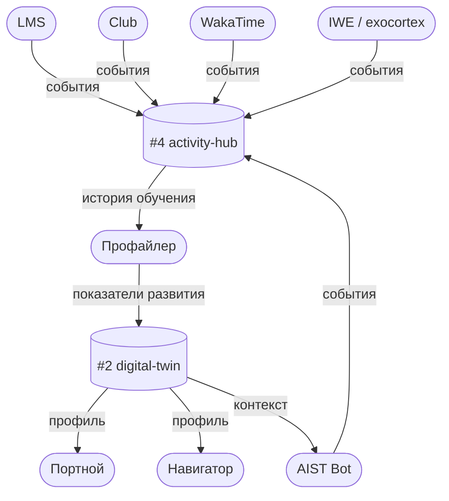

> Степень DEG назначается вручную методсоветом МИМ — не через поток событий.

---

### 7.5 Связи между базами данных

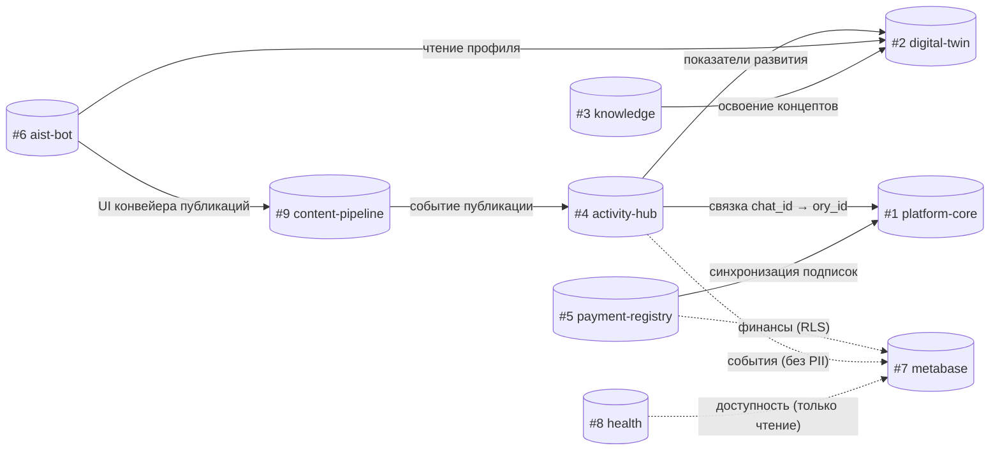

> Сплошная = запись. Пунктир = чтение (RO).

</details>

---

<details>
<summary><b>8. Кто читает / кто пишет</b></summary>

| База | Writers | Readers |
|------|---------|---------|
| #1 platform-core | Бот (`aist_me_bot_writer`): identity sync + OAuth flows + триал, `sync-subscriptions.sh` cron (из #5 → SUBSCRIPTION_GRANTS), Directus (ручные гранты), миграции (PRODUCTS, MENTOR_ASSIGNMENTS) | gateway-mcp (`gateway_reader`): авторизация каждого запроса, Metabase (`metabase_reader`), activity-hub (identity resolver) |
| #2 digital-twin | Бот dt_sync (`aist_bot_writer`): `2_collected`, Профайлер R28: `3_derived`, knowledge-mcp: LEARNER_CONCEPT_MASTERY (WP-208 TBD), LMS (DEG вручную методсовет МИМ) | dt-mcp (профиль), tailor-mcp (`1_declarative`+`3_derived`), knowledge-mcp (learner_progress, RLS), *бот /twin через gateway→dt-mcp* |
| #3 knowledge | knowledge-mcp ingest (платформенный и персональный контент), gateway-mcp: GITHUB_INSTALLATIONS + USER_SOURCES (GitHub App OAuth, RLS) | knowledge-mcp search, *бот через gateway→knowledge-mcp*, gateway-mcp (список подключённых репо) |
| #4 activity-hub | collectors: LMS + Club + WakaTime + IWE/exocortex + Bot (RAW_EVENTS), transform-worker (RAW→USER→LEARNING) | transform-worker, Профайлер R28 (LEARNING_HISTORY → IND.3.*), Бот dt_sync (USER_EVENTS → ЦД), *Навигатор/Портной: LEARNING_HISTORY*, Metabase (RO, без PII) |
| #5 payment-registry | **Payment Receiver** CF Worker (`payment_receiver_writer`: INSERT finance_payments + processed_webhooks, WP-246), `incremental-sync.sh` cron (стадия 2: только сверка), бот (seminar/workshop записи) | Бот: has_seminar_access/has_access_to_chat, Metabase (`metabase_reader` + RLS, только агрегаты), `sync-subscriptions.sh` cron (FINANCE_PAYMENTS → SUBSCRIPTION_GRANTS в #1) |
| #6 aist-bot | только AIST Bot (44 таблицы: FSM, тренажёры, фид, марафоны, токены, публикации, оплаты, наблюдаемость). ⚠️ 10 таблиц — кандидаты на миграцию: 3→activity-hub, 3→payment-registry, 3→platform-core/#8 health | AIST Bot; Composer MCP (состояние FSM) |
| #7 metabase | Metabase internal (служебные таблицы) | Metabase UI, дашборды читают #5 и #4 напрямую (не через #7) |
| #8 health | uptime-collector cron (GHA, UPTIME_CHECKS + INCIDENTS), AIST Bot error_handler (ERROR_LOGS, REQUEST_TRACES, PENDING_FIXES) | Grafana (RO, дашборды здоровья), Бот (error_classifier, autofix), алерты → TG bot |

</details>

---

<details>
<summary><b>9. Пояснения</b></summary>

### USER_INTEGRATIONS vs GITHUB_CONNECTIONS

Обе таблицы хранят GitHub OAuth-токен одного пользователя — намеренный **dual-write**.

| | GITHUB_CONNECTIONS (platform-core) | USER_INTEGRATIONS (platform-core) |
|---|---|---|
| **Назначение** | Конфигурация публикации: target_repo, notes_path, branches | OAuth-конфиг для коллекторов: WakaTime, IWE Adapter |
| **Потребитель** | Бот-издатель заметок | activity-hub collectors |

`WAKATIME` — только в `USER_INTEGRATIONS`. `GOOGLE_CALENDAR` — только в `GOOGLE_CALENDAR_CONNECTIONS`.

---

### ORY_TOKENS и DT_TOKENS в aist-bot

Это **персистентность бот-сессий**, а не кеш платформы:
- Ключ — `chat_id` (Telegram): бот работает в Telegram-контексте
- Хранятся для переживания редеплоев бота
- `ory_tokens` — токены для вызова Gateway MCP (Ory OAuth)
- `dt_tokens` — токены для вызова DT API
- Токены **зашифрованы** (Fernet, WP-234), в открытом виде в БД не хранятся

---

### LEARNING_HISTORY vs LEARNER_CONCEPT_MASTERY

| | LEARNING_HISTORY (activity-hub) | LEARNER_CONCEPT_MASTERY (digital-twin) |
|---|---|---|
| **Что хранит** | Факты: "прошёл мем X, score 0.8" | Агрегат: "освоен концепт ZP.001 на 85%" |
| **Кто пишет** | transform-worker из USER_EVENTS | profiler (читает LEARNING_HISTORY через API) |

Поток: RAW_EVENTS → USER_EVENTS → LEARNING_HISTORY → profiler API → LEARNER_CONCEPT_MASTERY.
Квалификация "Ученик" и уровни до неё — автоматически из mastery. Выше — методсовет МИМ (ручное).

---

### Кеш авторизации gateway-mcp

`checkSubscription()` в gateway-mcp не обращается к Neon на каждый запрос — результат кешируется в **Cloudflare KV** с TTL 5 мин (WP-235). JWKS также кешируется in-memory в Workers isolate.

Порядок проверок в gateway (до фанаута):
1. `verifyJWT` — проверка подписи токена (JWKS, кеш in-memory)
2. `checkSubscription` — проверка активного гранта в `SUBSCRIPTION_GRANTS` (KV кеш TTL 5 мин)
3. Только при успехе обоих → фанаут в downstream MCP

Отказ на шаге 1 или 2 → немедленный 401/403, downstream не вызывается.

</details>

---

<details>
<summary><b>10. Справочник таблиц</b></summary>

> **Статус:** ✅ Существует в `platform` (единая база, WP-232) | ⚠️ Перенести при разделении | 🆕 Создать
>
> **Writers / Readers** — кто пишет и читает каждую таблицу (Ф2 WP-228, 16 апр 2026). Роль в скобках = DB role. Курсив = непрямой доступ (через MCP/API).

### #1 platform-core

| Таблица | Назначение | Writers | Readers | Pack-сущность | DS-реализация | Статус | Источник |
|---------|-----------|---------|---------|---------------|---------------|--------|----------|
| USER_IDENTITIES | Маппинг ory_id ↔ telegram_id ↔ lms_id. Только то, чего Ory не знает. | Бот (`aist_me_bot_writer`): OAuth callback + LMS sync | gateway-mcp (`gateway_reader`), activity-hub (identity resolver) | §7.0.2 #1 «Созидатель» (DP.D.050, DP.ROLE.001) | aist_bot_newarchitecture/db/connection.py | ✅ | `public.user_identities`, WP-232 |
| SUBSCRIPTION_GRANTS | Реестр активных прав подписки. Gateway для всех сервисов. | sync-subscriptions.sh cron (`aist_me_bot_writer`), бот: триал через /start, Directus: ручные гранты | gateway-mcp (`gateway_reader`): проверка на каждый запрос, Metabase (`metabase_reader`) | §7.0.2 #1 «Подписка-контракт» (DP.ECON.001) | aist_bot_newarchitecture/db/queries/subscription.py, aist_bot_newarchitecture/core/access.py | ✅ | `public.subscription_grants`, WP-231 |
| GITHUB_CONNECTIONS | GitHub OAuth + конфиг публикации (репо, ветки). | Бот (`aist_me_bot_writer`): OAuth flow | Бот: чтение токенов для публикации | §7.0.2 #1 «GitHub-подключение (публикация)» — 🔗 связь (payment_credentials-класс токенов) | aist_bot_newarchitecture/db/queries/github.py, aist_bot_newarchitecture/clients/github_oauth.py | ✅ | `public.github_connections`, WP-187 |
| GOOGLE_CALENDAR_CONNECTIONS | Google Calendar OAuth для бота. | Бот (`aist_me_bot_writer`): Google OAuth callback | Бот: чтение токенов для calendar sync | §7.0.2 #1 «Google Calendar-подключение» — 🔗 связь | aist_bot_newarchitecture/db/queries/google_calendar.py, aist_bot_newarchitecture/clients/google_calendar_oauth.py | ✅ | `public.google_calendar_connections`, WP-232 |
| USER_INTEGRATIONS | OAuth-конфиг для activity-hub collectors (GitHub, WakaTime). | Бот (`aist_me_bot_writer`): OAuth callbacks | Бот, activity-hub: чтение токенов для API | §7.0.2 #1 «WakaTime-интеграция» — 🔗 связь | aist_bot_newarchitecture/db/queries/wakatime.py, aist_bot_newarchitecture/clients/wakatime_oauth.py | ⚠️ Перенести | Сейчас в `development.user_integrations` |
| BACKEND_REGISTRY | Реестр персональных MCP-бэкендов пользователей. | gateway-mcp: регистрация BYOB (WP-189, TBD) | gateway-mcp: fan-out маршрутизация | §7.0.2 #1 «Персональный MCP-бэкенд» (WP-189) | DS-MCP/gateway-mcp/src/backend-registry.ts, DS-MCP/gateway-mcp/scripts/backend-registry-schema.sql | ✅ | `knowledge.backend_registry`, WP-187/189 |
| ~~TIER_EVENTS~~ | ~~Лог переходов тиров~~ → разложена на `#4.user_events` (событие) + `#1.subscription_grants.current_tier` (проекция). | — | — | — | — | ❌ Удалена | Решение Р-W17-1 (20 апр 2026) |
| PRODUCTS | Единый каталог продуктов: подписки, программы, семинары. PK = code. | Миграции (`neondb_owner`): seed, Directus: CMS | Бот: метаданные семинаров/программ, Directus | §7.0.2 #1 «Продукт-экземпляр» (DP.ECON.001) | aist_bot_newarchitecture/db/queries/showcase.py | ✅ | `public.products`, WP-228 |
| MENTOR_ASSIGNMENTS | Привязка наставников к продуктам по product_code. | Миграции, Directus | Бот: lookup наставников | §7.0.2 #1 «Наставник-назначение» — 🔗 связь «Созидатель(наставник) ↔ Продукт» (DP.ROLE.001) | `DS-IT-systems/payment-registry/migrations/009-products-and-mentor-assignments.sql` (DDL), Directus CMS (runtime writer — ручные назначения); reader не реализован (TBD, запланировано в WP-246 или child-WP под WP-253) | ✅ | `public.mentor_assignments`, WP-228 |
| PRE_GRANTS | Предварительное право: доступ к продукту до регистрации Ory. Сценарий: гость оплатил семинар → запись по email/telegram_id → claim при регистрации. (pending_identity_type, pending_identity_value, product_code, expires_at, payment_id, claimed_at?, claimed_ory_id?) | `payment_receiver` CF Worker (оплата без ory_id), Directus (ручные гранты без оплаты) | `identity-resolver` (gateway-mcp / бот onboarding): SELECT unresolved pre_grants по email/telegram_id при регистрации → INSERT в subscription_grants | §7.0.2 #1 «Предварительное право (Pre-Grant)» — 🔗 pending-связь «Identity ↔ Продукт» | DS-MCP/payment-receiver/src/ (writer), DS-MCP/gateway-mcp/src/ (reader в claim flow) | 🆕 Создать | Решение Р-W17-2 (20 апр 2026). Заменяет orphan `USER_ACCESS` из #6 |

> **Перенесено 21 апр (замечание Андрея):** `qualification_events`, `qualification_levels` → #2 digital-twin («модель человека» из ядра в ЦД). `points.*`, `tariff` → #5 payment-registry («баллы — часть экономики, не ядра»).

### #2 digital-twin

| Таблица | Назначение | Writers | Readers | Pack-сущность | DS-реализация | Статус | Источник |
|---------|-----------|---------|---------|---------------|---------------|--------|----------|
| USERS | Полный профиль пользователя: имя, регион, демография, соц-проф характеристики. Отделён от Созидателя (#1) — там только Ory-идентичность и права доступа. | dt_sync / profiling-runs | tailor-mcp, dt-mcp, Metabase | §7.0.2 #2 «Пользователь» (перенос 21 апр из ядра) | планируется | 🆕 Создать | Замечание Андрея 21 апр |
| DIGITAL_TWINS | Цифровой двойник: 3 слоя (базовые / вовлечённость / производные). | Бот dt_sync (`aist_bot_writer`): `2_collected` (cron 04:30), Profiler R28: `3_derived` (standalone) | dt-mcp: профиль по API, tailor-mcp: `1_declarative`+`3_derived`, *бот /twin через gateway→dt-mcp* | §7.0.2 #2 «Цифровой двойник» (DP.D.036, DP.ARCH.003, WP-227) | aist_bot_newarchitecture/db/queries/dt_sync.py, DS-MCP/digital-twin-mcp/src/worker-sse.js, DS-MCP/tailor-mcp/src/queries.py | ✅ (❓ JSON-модель layer_1/2/3 — Д12 с Димой) | `public.digital_twins`, WP-227 |
| qualification_events | Событие присвоения квалификационного уровня (timeline, append-only). Перенос из #1 21 апр — «модель человека» в digital-twin. | LMS backend (через backend-registry), Методсовет (через Directus), recalculate_qualifications.py | Бот tier_detector, dt_sync (LMS→ЦД mapping), Metabase (когорты), `#1.points.point_transactions` (cross-DB FK) | §7.0.2 #2 «Присвоение квалификации» (WP-151, перенос 21 апр) | —, планируется (WP-151 Ф7a) | 🆕 Создать в #2 | WP-151 Ф7a, замечание Андрея 21 апр |
| qualification_levels | Справочник 11 ступеней шкалы (Интересант → Общественный деятель) + атрибуты `multiplier_points` (×1.0-×5.0), `daily_cap` (100-1000). Множитель — **атрибут уровня, не отдельный объект** (ревизия Д10). Перенос из #1 21 апр. | — (справочник, ручное наполнение через миграцию) | Все consumer'ы qualification_events, calculate_points | §7.0.2 #2 «Уровень квалификации-справочник» (WP-151) | —, планируется (WP-151 Ф7a) | 🆕 Создать в #2 | WP-151 Ф7a, замечание Андрея 21 апр |
| LEARNER_CONCEPT_MASTERY | Степень освоения концептов (0.0–1.0). Основа для квалификации "Ученик". Реализация 🔗-связи «Пользователь освоил Концепт» (DP.METHOD.040 §4: связь с атрибутами `mastery_level`, `last_reviewed_at`). | knowledge-mcp: analyze_verbalization (RLS, WP-208 TBD) | knowledge-mcp: learner_progress (RLS по user_id) | §7.0.2 #2 «Освоение концепта» — 🔗 связь «Пользователь ↔ Концепт» (WP-151, WP-208) | DS-MCP/knowledge-mcp/migrations/005-concept-graph.sql, DS-MCP/knowledge-mcp/src/index.ts | ✅ (физ.реализация 🔗) | `concept_graph.learner_concept_mastery`, WP-151 |

### #3 knowledge

> **Два уровня** (ревизия 21 апр): **Уровень 1 — универсальное хранение** (COLLECTIONS → DOCUMENTS → CHUNKS). **Уровень 2 — семантический** (CONCEPTS + CONCEPT_EDGES + CONCEPT_MISCONCEPTIONS над документами).

| Таблица | Назначение | Writers | Readers | Pack-сущность | DS-реализация | Статус | Источник |
|---------|-----------|---------|---------|---------------|---------------|--------|----------|
| **Уровень 1 — универсальный слой хранения** (любой текстовый корпус) | | | | | | | |
| COLLECTIONS | Namespace документов: `platform` (Pack/ZP/FPF, общая), `personal` (RLS по ory_id), `external` (книга/репо). | knowledge-mcp ingest (создание по типу источника) | knowledge-mcp: фильтр поиска по коллекции | §7.0.2 #3 «Коллекция» (новый объект 21 апр) | планируется | 🆕 Создать | Замечание Андрея 21 апр |
| DOCUMENTS | Документы в коллекции (.md, PDF, транскрипт). Ранее здесь хранился эмбеддинг — теперь в CHUNKS (правильный уровень). | knowledge-mcp ingest + /reindex webhook (RLS) | knowledge-mcp: hybrid search, *бот через gateway→knowledge-mcp* | §7.0.2 #3 «Документ» | DS-MCP/knowledge-mcp/src/index.ts, DS-MCP/knowledge-mcp/migrations/001-hybrid-search.sql | ⚠️ Рефактор: эмбеддинг → CHUNKS | `knowledge.documents`, knowledge-mcp |
| CHUNKS | Кусок документа с эмбеддингом (1024-dim) + метаданные (позиция, section). Уровень хранения эмбеддинга. | knowledge-mcp ingest (chunker) | knowledge-mcp: vector search | §7.0.2 #3 «Чанк» (новый объект 21 апр) | планируется (выделение из DOCUMENTS) | 🆕 Создать / выделить | Замечание Андрея 21 апр |
| DOCUMENT_CONCEPTS | M:N связь документа с концептами (упоминает/определяет). | knowledge-mcp ingest-concepts | knowledge-mcp: concept-based retrieval | §7.0.2 #3 «Упоминание концепта» — 🔗 связь | планируется | 🆕 Создать | Замечание Андрея 21 апр |
| **Уровень 2 — семантический слой** (над документами) | | | | | | | |
| RETRIEVAL_FEEDBACK | Обратная связь по релевантности документов. | knowledge-mcp: recordFeedback tool (RLS) | knowledge-mcp: feedback_stats | —, log (событие retrieval feedback) | DS-MCP/knowledge-mcp/src/index.ts, DS-MCP/knowledge-mcp/migrations/003-retrieval-feedback.sql | ⚠️ → activity-hub (событие retrieval feedback) | `knowledge.retrieval_feedback`, knowledge-mcp |
| CONCEPTS | Граф концептов платформы (ZP, FPF, Pack, курсы). | knowledge-mcp ingest-concepts.ts (без RLS, платформенные) | knowledge-mcp: analyze_verbalization, graph_stats, *бот через gateway* | §7.0.2 #3 «Концепт» | DS-MCP/knowledge-mcp/src/index.ts, DS-MCP/knowledge-mcp/migrations/005-concept-graph.sql | ✅ | `concept_graph.concepts`, WP-170 |
| CONCEPT_EDGES | Рёбра графа: prerequisite, related, part_of, contradicts. | knowledge-mcp ingest-concepts.ts | knowledge-mcp: graph_stats, edge coverage | 🔗 связь «Концепт ↔ Концепт» (§7.0.2 #3) | DS-MCP/knowledge-mcp/src/index.ts, DS-MCP/knowledge-mcp/migrations/005-concept-graph.sql | ✅ | `concept_graph.concept_edges` |
| CONCEPT_MISCONCEPTIONS | Типовые заблуждения по концептам. | knowledge-mcp ingest-concepts.ts (из CAT.001) | knowledge-mcp: analyze_verbalization (LLM-detection) | §7.0.2 #3 «Концептное заблуждение» | DS-MCP/knowledge-mcp/src/index.ts, DS-MCP/knowledge-mcp/migrations/005-concept-graph.sql | ✅ | `concept_graph.concept_misconceptions` |
| GITHUB_INSTALLATIONS | GitHub App installations для индексации репо. | gateway-mcp: GitHub App OAuth (WP-187, RLS) | gateway-mcp: список подключённых репо | §7.0.2 #3 «GitHub-установка (индексация)» — 🔗 связь «Созидатель ↔ GitHub-аккаунт» scope=repo(read) | DS-MCP/gateway-mcp/src/index.ts, DS-MCP/gateway-mcp/src/backend-registry.ts | ✅ | `knowledge.github_installations`, WP-187 |
| USER_SOURCES | Источники индексации (GitHub репо, активные/нет). | knowledge-mcp миграция 004 + gateway-mcp webhook (RLS) | knowledge-mcp: resolve user_id при ingest, gateway-mcp: UI источников | §7.0.2 #3 «Источник индексации» | DS-MCP/knowledge-mcp/src/index.ts, DS-MCP/knowledge-mcp/migrations/004-user-github-onboarding.sql, DS-MCP/gateway-mcp/src/index.ts | ✅ | `knowledge.user_sources`, knowledge-mcp |

### #4 activity-hub

| Таблица | Назначение | Writers | Readers | Pack-сущность | DS-реализация | Статус | Источник |
|---------|-----------|---------|---------|---------------|---------------|--------|----------|
| RAW_EVENTS | Bronze: сырые события, партиционированы по (source, fetched_at). TTL 30д. | activity-hub adapters (`aist_bot_writer`): write_raw, ON CONFLICT DO NOTHING | activity-hub transform-worker: _fetch_pending, integrity checks | §7.0.2 #4 «Сырое событие (Bronze)» | activity-hub/activity_hub/adapters/*.py, activity-hub/runner.py | ✅ | `development.raw_events`, WP-109 Ф8.1 |
| USER_EVENTS | Silver: нормализованные события с атрибуцией пользователя. TTL 90д. | activity-hub: (1) hub.py ingest_event direct INSERT, (2) transform-worker upsert, (3) ingest_batch bulk | activity-hub: rate_limit check, бот dt_sync: агрегация для ЦД | §7.0.2 #4 «Событие созидателя (Silver)» | activity-hub/activity_hub/core/, activity-hub/activity_hub/transforms/, aist_bot_newarchitecture/db/queries/dt_sync.py | ✅ | `development.user_events`, WP-109 |
| LEARNING_HISTORY | Gold: факты обучения. Читается profiler. Archive в S3 после 5 лет. | Бот: DB-триггер на user_events INSERT (миграция 007), backfill (миграция 010) | Бот dt_sync: BKT-расчёты, Навигатор: 7-дневное окно, *Портной: depths_by_direction* | §7.0.2 #4 «Факт обучения (Gold)» | aist_bot_newarchitecture/db/queries/dt_sync.py, aist_bot_newarchitecture/migrations/007-*.sql, DS-MCP/tailor-mcp/src/queries.py | ⚠️ Перенести | Сейчас в aist_bot (миграция 007) |
| IDENTITY_MAP | chat_id → ory_id; NULL до OAuth. | activity-hub runner.py: populate_bot/csv/lms_identity | activity-hub hub.py: resolve_user_uuid, бот dt_sync: LMS qualification mapping | §7.0.2 #4 «Идентичность-маппинг» — 🔗 связь «Telegram-id ↔ Созидатель» | activity-hub/runner.py, activity-hub/activity_hub/core/, aist_bot_newarchitecture/db/queries/dt_sync.py | ✅ | `development.identity_map`, WP-109 |
| SYNC_LOG | Журнал запусков коллекторов. TTL 30д. | activity-hub runner.py: log_sync после каждого запуска | activity-hub: мониторинг, Metabase (TBD) | —, log (журнал запусков) | activity-hub/runner.py, —, через UI (Metabase) | ✅ | `development.sync_log`, WP-109 |
| QUARANTINED_EVENTS | Карантин для невалидных событий. | activity-hub: hub.py _quarantine (validation fail), transform-worker (parse fail) | Ручной разбор (write-only sink) | —, log (технический sink) | activity-hub/activity_hub/core/, activity-hub/activity_hub/transforms/ | ✅ | `development.quarantined_events`, WP-109 |
| CONVERSION_EVENTS | События конверсионной воронки (chat_id, trigger_type C1-C7, milestone, action shown/clicked/dismissed). Чистое событие воронки, без payment_id / amount. | Бот: core/scheduler, conversion.py | Бот: cooldown check, Metabase (RO аналитика) | §7.0.2 #4 «Событие конверсии» (принято 20 апр: → #4) | aist_bot_newarchitecture/db/queries/conversion.py, aist_bot_newarchitecture/core/scheduler.py | ✅ (принято 20 апр: → #4) | Решение 20 апр 2026 (Р3): по смыслу событие воронки, не платёж |
| IWE_DAILY_METRICS | **Gold: append-only daily aggregates.** Ежедневный снимок метрик экзокортекса созидателя (date, ory_id, multiplier, budget_closed_h, wakatime_h, wp_in_progress/done/pending, registry_stats). Одна строка на (date, ory_id). Основа для period-queries (неделя/месяц/квартал) и Metabase-дашбордов мультипликатора. | `dt-collect.sh` (WP-139, через activity-hub ingest API, source='iwe') | Metabase (period queries), `/twin insights` (для weekly/monthly aggregates), WP-109 analytics | §7.0.2 #4 «Ежедневный снимок метрик созидателя (Gold)» | DS-my-strategy/scripts/dt-collect.sh, activity-hub/activity_hub/adapters/iwe.py | 🆕 Создать (эстафета от WP-139 snapshot → WP-109 timeline) | WP-228 Ф22.2 (20 апр 2026), §7.0.2 БД #4 |

### #5 payment-registry

| Таблица | Назначение | Writers | Readers | Pack-сущность | DS-реализация | Статус | Источник |
|---------|-----------|---------|---------|---------------|---------------|--------|----------|
| FINANCE_PAYMENTS | Реестр всех транзакций. Permanent. `raw_payload JSONB` (WP-246). | Payment Receiver CF Worker (`payment_receiver_writer`), incremental-sync.sh cron (`aist_me_bot_writer`), бот showcase handler | Бот: has_seminar_access/has_access_to_chat, Metabase (`metabase_reader`), sync-subscriptions.sh: → SUBSCRIPTION_GRANTS | §7.0.2 #5 «Платёж» | DS-MCP/payment-receiver/src/, DS-ecosystem-development/scripts/incremental-sync.sh, aist_bot_newarchitecture/db/queries/showcase.py | ✅ | `public.finance_payments`, WP-183 |
| PROCESSED_WEBHOOKS | Idempotency-дедупликация webhook'ов. PK = event_id. TTL >72h. | Payment Receiver (`payment_receiver_writer`): isDuplicate + markProcessed | Payment Receiver: проверка дубликатов | §7.0.2 #5 «Webhook-дедупликация» —, state | DS-MCP/payment-receiver/src/ | 🆕 Создать | `public.processed_webhooks`, WP-246 |
| FINANCE_PAYMENTS_AUDIT_LOG | Append-only лог изменений статуса. 7 лет. | (WP-237, TBD) | (WP-237, TBD) | §7.0.2 #5 «Аудит-запись изменений статуса» —, log | —, TBD (Ф15b.3), план WP-237 | 🆕 Создать | WP-237 |
| PAYMENTS_SYNC_STATE | Ватермарк импорта из Aisystant. | incremental-sync.sh (`aist_me_bot_writer`) | incremental-sync.sh, Metabase: sync health | §7.0.2 #5 «Ватермарк импорта» —, state | DS-ecosystem-development/scripts/incremental-sync.sh, —, через UI (Metabase) | ✅ | `public.finance_payments_sync_state`, WP-183 |
| SUBSCRIPTION_GRANTS_SYNC_STATE | Ватермарк синхронизации грантов. | sync-subscriptions.sh (`aist_me_bot_writer`) | sync-subscriptions.sh: read boundary | §7.0.2 #5 «Ватермарк импорта» —, state | DS-ecosystem-development/scripts/sync-subscriptions.sh | ✅ | WP-231 |
| IMPORT_STAGING_PAYMENT | Landing zone импорта платежей из Aisystant. | incremental-sync.sh: TRUNCATE + COPY | incremental-sync.sql: transform → finance_payments | §7.0.2 #5 «Landing zone» —, state | DS-ecosystem-development/scripts/incremental-sync.sh, DS-ecosystem-development/migrations/005-*.sql | ✅ | WP-183 (миграция 005) |
| IMPORT_STAGING_CHARGEOFF | Landing zone списаний. | incremental-sync.sh: TRUNCATE + COPY | incremental-sync.sql: transform → UPDATE linked | §7.0.2 #5 «Landing zone» —, state | DS-ecosystem-development/scripts/incremental-sync.sh, DS-ecosystem-development/migrations/005-*.sql | ✅ | WP-183 (миграция 005) |
| WORKSHOP_PAYMENTS | Оплаты воркшопов через бота. | Бот: db/queries/workshop, handlers/workshop | Бот: db/queries/workshop | §7.0.2 #5 «Платёж» (тип workshop) | aist_bot_newarchitecture/db/queries/workshop.py, aist_bot_newarchitecture/handlers/workshop.py | ⚠️ Перенести из aist-bot | Сейчас в aist_bot |
| SEMINAR_PAYMENTS | Оплаты семинаров через бота. | Бот: handlers/payments, db/queries/showcase | Бот: db/queries/showcase | §7.0.2 #5 «Платёж» (тип seminar) | aist_bot_newarchitecture/handlers/payments.py, aist_bot_newarchitecture/db/queries/showcase.py | ⚠️ Перенести из aist-bot | Сейчас в aist_bot |
| AUTOPAY | Договор автосписания с пользователем (payment_method_id YooKassa). | payment-receiver (`payment_receiver_writer`, WP-246) | autopay-executor, Бот (проверка статуса) | §7.0.2 #5 «Автосписание-договор» | DS-MCP/payment-receiver/src/, aist_bot_newarchitecture/db/queries/subscription.py | ✅ (план WP-246 Ф10-Ф16) | WP-246 Стадия 3 |
| AUTOPAY_DATA | Состояние/история автосписаний (попытки, ответы YooKassa, даты). | autopay-executor CF Worker | Бот, Metabase (RO, без payment_method_id) | §7.0.2 #5 «Автосписание-договор» (история, класс payment_credentials) | DS-MCP/payment-receiver/src/, —, через UI (Metabase) | ✅ (план WP-246 Ф10-Ф16) | WP-246 Стадия 3 |
| **Биллинг-домен** (новые таблицы 21 апр, замечание Андрея) | | | | | | | |
| PAYERS | Плательщики: физ/юр лица (email/ИНН/ory_id, страна, реквизиты). Плательщик ≠ Получатель услуги (корп-оплата, подарки). | payment-receiver | Бот, Directus, Metabase | §7.0.2 #5 «Плательщик» | планируется | 🆕 Создать | Замечание Андрея 21 апр |
| CHARGES | Начисление — строка в счёте (что оплачивается в рамках Платежа). Платёж может включать несколько Начислений. | payment-receiver | Metabase, Бот | §7.0.2 #5 «Начисление» | планируется | 🆕 Создать | Замечание Андрея 21 апр |
| CHARGE_RECIPIENTS | Получатель Начисления (кому идёт доступ). Проекция на Созидателя в #1. | payment-receiver | gateway-mcp (для активации подписки) | §7.0.2 #5 «Получатель начисления» | планируется | 🆕 Создать | Замечание Андрея 21 апр |
| TARIFFS | Справочник цен: подписки (T0/T1/T2 × месяц/год), семинары, воркшопы. Биллинг-провайдер (YooKassa/Stripe) — внешний. | Directus (ручное наполнение), миграции | payment-receiver, Бот showcase, Metabase | §7.0.2 #5 «Тариф» | планируется | 🆕 Создать | Замечание Андрея 21 апр, LMS `tariff` |
| **Баллы** (перенос из #1 21 апр, замечание Андрея «Баллы в платёж») | | | | | | | |
| points.point_transactions | Лог начислений/списаний баллов активности (append-only, FK на `#2.qualification_events` через cross-DB). | calculate_points (WP-121 Ф2, TBD) | gateway_reader: баланс, Metabase | §7.0.2 #5 «Транзакция баллов» (WP-121) | —, планируется (WP-121 Ф2) | 🆕 Перенести из #1 → #5 (21 апр) | WP-121, замечание Андрея 21 апр |
| points.point_rules | Правила начисления баллов по типу активности. | Методсовет (Directus/seed) | calculate_points (на каждой event) | §7.0.2 #5 «Правило начисления баллов» (WP-121) | —, планируется (WP-121) | 🆕 Создать в #5 | WP-121, замечание Андрея 21 апр |

### #6 aist-bot

> **WP-228 Ф2 (16 апр):** расширен с 11 до 44 таблиц. Таблицы-кандидаты на миграцию помечены ⚠️ с целевой базой.

| Таблица | Назначение | Writers | Readers | Pack-сущность | DS-реализация | Статус | Источник |
|---------|-----------|---------|---------|---------------|---------------|--------|----------|
| **Ядро бота (FSM, сессии, идентичность)** | | | | | | | |
| USERS | Локальные пользователи бота (telegram_id, ory_id, роли). | handlers/onboarding, core/ory_register | core/\*, handlers/\*, db/queries/\* | §7.0.2 #6 «Пользователь бота» (проекция «Созидатель в контексте бота») | aist_bot_newarchitecture/db/queries/users.py, aist_bot_newarchitecture/handlers/onboarding.py, aist_bot_newarchitecture/core/ory_register.py | ✅ | Первая миграция |
| USER_STATE | FSM-состояние бота + счётчик активных дней, триал. ⚠️ Колонки tier/mentor_tier убрать после переноса. | handlers/onboarding, states/\*, core/scheduler, core/machine | handlers/\*, states/\*, core/machine | §7.0.2 #6 «FSM-состояние» —, state | aist_bot_newarchitecture/handlers/onboarding.py, aist_bot_newarchitecture/states/, aist_bot_newarchitecture/core/scheduler.py | ✅ | `development.user_state` |
| FSM_STATES | Хранилище FSM aiogram (персистентность между редеплоями). | core/storage (aiogram) | core/storage | —, state (aiogram FSM) | aist_bot_newarchitecture/core/storage.py | ✅ | aiogram FSM |
| USER_SESSIONS | Сессии пользователей. | db/queries/sessions | db/queries/analytics | §7.0.2 #6 «Сессия пользователя» —, state | aist_bot_newarchitecture/db/queries/sessions.py, aist_bot_newarchitecture/db/queries/analytics.py | ✅ | Миграция бота |
| OAUTH_PENDING_STATES | Ожидающие OAuth state-коды (GitHub, Google). TTL: до завершения flow. | db/queries/oauth_states, handlers/github | db/queries/oauth_states | §7.0.2 #6 «OAuth-state ожидания» —, state | aist_bot_newarchitecture/db/queries/oauth_states.py, aist_bot_newarchitecture/handlers/github.py | ✅ | Миграция бота |
| **Обучение (тренажёры, фид, марафоны)** | | | | | | | |
| TRAINING_PROGRESS | Прогресс тренажёров (мемы, задания). | db/queries/training, states/training/\* | db/queries/training, states/training/\* | §7.0.2 #6 «Прогресс тренажёра» —, state | aist_bot_newarchitecture/db/queries/training.py, aist_bot_newarchitecture/states/training/ | ✅ | Миграция бота |
| TRAINING_CHILDREN | Детские учебные треки (физ.объект: конкретный Детский-трек). | db/queries/training | db/queries/training | §7.0.2 #6 «Детский-трек» | aist_bot_newarchitecture/db/queries/training.py | ✅ физ.объект «Детский-трек» (добавлен в §7.0.2 #6) | Миграция бота |
| TRAINING_ATTEMPTS | Попытки прохождения (score, ответы). | db/queries/training, states/training/\* | db/queries/training | §7.0.2 #6 «Попытка тренажёра» | aist_bot_newarchitecture/db/queries/training.py, aist_bot_newarchitecture/states/training/ | ✅ | Миграция бота |
| TRAINING_SETTINGS | Пользовательские настройки тренажёров. | db/queries/training, handlers/settings | db/queries/training | §7.0.2 #6 «Настройка трека» — 🔗 связь «Созидатель ↔ Настройка-трека» | aist_bot_newarchitecture/db/queries/training.py, aist_bot_newarchitecture/handlers/ | 🔗 связь «Созидатель ↔ Настройка-трека» | Миграция бота |
| FEED_SESSIONS | Сессии ленты обучения. | db/queries/feed, states/feed/\* | db/queries/feed, db/queries/answers | §7.0.2 #6 «Сессия ленты» — 🔗 связь «Созидатель ↔ Feed-неделя» | aist_bot_newarchitecture/db/queries/feed.py, aist_bot_newarchitecture/states/feed/ | ✅ | Миграция бота |
| FEED_WEEKS | Недельные циклы ленты. | db/queries/feed, states/feed/\* | db/queries/feed, db/queries/answers | §7.0.2 #6 «Недельный цикл ленты» | aist_bot_newarchitecture/db/queries/feed.py, aist_bot_newarchitecture/states/feed/ | ✅ | Миграция бота |
| MARATHON_CONTENT | Контент марафонов (уроки, задания). | db/queries/marathon, core/scheduler | db/queries/marathon, states/lesson | §7.0.2 #6 «Элемент марафона» | aist_bot_newarchitecture/db/queries/marathon.py, aist_bot_newarchitecture/core/scheduler.py, aist_bot_newarchitecture/states/ | ✅ | Миграция бота |
| ANSWERS | Ответы пользователей на задания. | db/queries/answers, states/task | db/queries/answers, db/queries/profile | §7.0.2 #6 «Ответ на задание» | aist_bot_newarchitecture/db/queries/answers.py, aist_bot_newarchitecture/states/, aist_bot_newarchitecture/db/queries/profile.py | ✅ | Миграция бота |
| ASSESSMENTS | Оценки (самооценка, внешняя). | db/queries/assessment, states/assessment/\* | db/queries/assessment, db/queries/dev_stats | §7.0.2 #6 «Оценка» | aist_bot_newarchitecture/db/queries/assessment.py, aist_bot_newarchitecture/states/, aist_bot_newarchitecture/db/queries/dev_stats.py | ✅ | Миграция бота |
| CONTENT_CACHE | Кеш контента LMS (уроки, задания). TTL: по scheduler. | db/queries/cache, core/scheduler | db/queries/cache, states/lesson, states/task | §7.0.2 #6 «Кеш контента LMS» —, proxy | aist_bot_newarchitecture/db/queries/cache.py, aist_bot_newarchitecture/core/scheduler.py | ✅ | Миграция бота |
| **Коммуникация и фидбек** | | | | | | | |
| QA_HISTORY | История вопросов/ответов. TTL 180д. | db/queries/qa, states/consultation | db/queries/analytics, handlers/twin | §7.0.2 #6 «QA-пара» | aist_bot_newarchitecture/db/queries/qa.py, aist_bot_newarchitecture/db/queries/analytics.py, aist_bot_newarchitecture/handlers/ | ✅ | `public.qa_history`, WP-132 |
| NOTIFICATION_LOG | Журнал уведомлений с idempotency_key. TTL 30д. | db/queries/notifications, core/scheduler | db/queries/notifications | §7.0.2 #6 «Уведомление» —, log | aist_bot_newarchitecture/db/queries/notifications.py, aist_bot_newarchitecture/core/scheduler.py | ✅ | `public.notification_log`, WP-232 |
| FEEDBACK_TRIAGE | Фидбек из бота (source='bot'). | core/feedback_triage, handlers/feedback | core/feedback_triage, db/queries/feedback | §7.0.2 #6 «Feedback-запись» | aist_bot_newarchitecture/core/feedback_triage.py, aist_bot_newarchitecture/handlers/, aist_bot_newarchitecture/db/queries/feedback.py | ✅ | Миграция 008 |
| FEEDBACK_REPORTS | Отчёты по фидбеку (агрегированные). | db/queries/feedback, handlers/feedback | db/queries/feedback | —, log (агрегат фидбеков) | aist_bot_newarchitecture/db/queries/feedback.py, aist_bot_newarchitecture/handlers/ | ⚠️ → activity-hub (событие feedback) | Миграция бота |
| REMINDERS | Расписание напоминаний. | core/scheduler | core/scheduler | §7.0.2 #6 «Напоминание» — 🔗 связь «Созидатель ↔ Триггер» | aist_bot_newarchitecture/core/scheduler.py | ✅ | Миграция бота |
| **Подписки и доступ** | | | | | | | |
| BOT_SUBSCRIPTIONS | 🔵 Проекция из #1 platform-core (SUBSCRIPTION_GRANTS) — read-cache для бота (Stars-подписки, бот-уровень). | db/queries/subscription, handlers/subscription | db/queries/subscription, core/tier_detector | §7.0.2 #6 «Telegram Stars подписка» —, proxy (source-of-truth = #1) | aist_bot_newarchitecture/db/queries/subscription.py, aist_bot_newarchitecture/handlers/, aist_bot_newarchitecture/core/tier_detector.py | 🔵 Проекция (source-of-truth = #1) | Проекция/кеш из `public.subscription_grants` |
| SERVICE_USAGE | Счётчик использования сервисов бота. | db/queries/activity | db/queries/analytics, db/queries/dev_stats | —, log (usage counter) | aist_bot_newarchitecture/db/queries/activity.py, aist_bot_newarchitecture/db/queries/analytics.py, aist_bot_newarchitecture/db/queries/dev_stats.py | ⚠️ → activity-hub (событие usage tracking) | Миграция 003 |
| ~~USER_ACCESS~~ | ~~Временные права~~ → заменена на `#1.pre_grants` (Pre-Grant для оплат до регистрации Ory). | — | — | — | — | ❌ Удалена | Решение Р-W17-2 (20 апр 2026). Миграция 002 rollback в PMB |
| COMMUNITY_MEMBERS | Участники Telegram-сообщества. | db/queries/workshop, handlers/workshop | db/queries/workshop | §7.0.2 #6 «Участник сообщества» | aist_bot_newarchitecture/db/queries/workshop.py, aist_bot_newarchitecture/handlers/ | ✅ | Миграция 009 |
| **Токены и интеграции** | | | | | | | |
| ORY_TOKENS | Ory OAuth-токены бота. Зашифрованы Fernet. | db/queries/ory_tokens, handlers/ory_register | db/queries/ory_tokens | §7.0.2 #6 «Ory OAuth-токены» —, state (класс payment_credentials) | aist_bot_newarchitecture/db/queries/ory_tokens.py, aist_bot_newarchitecture/handlers/ | ✅ | `public.ory_tokens`, WP-209. ⚠️ plaintext → WP-234 |
| DT_TOKENS | DT OAuth-токены бота. Зашифрованы Fernet. | db/queries/dt_tokens, handlers/connect | db/queries/dt_tokens, core/scheduler | §7.0.2 #6 «DT OAuth-токены» —, state (класс payment_credentials) | aist_bot_newarchitecture/db/queries/dt_tokens.py, aist_bot_newarchitecture/handlers/, aist_bot_newarchitecture/core/scheduler.py | ✅ | `public.dt_tokens`, WP-82. ⚠️ plaintext → WP-234 |
| **Публикации и каналы** | | | | | | | |
| PUBLISHED_POSTS | Опубликованные посты (Discourse, Telegram). | db/queries/discourse, clients/publisher | db/queries/discourse | §7.0.2 #9 «Публикация (Post)» (legacy, переносится) | aist_bot_newarchitecture/db/queries/discourse.py, aist_bot_newarchitecture/clients/ | ⚠️ → #9 content-pipeline (миграция WP-155) | Миграция бота, физически в `platform` |
| SCHEDULED_PUBLICATIONS | Запланированные публикации. | db/queries/discourse, clients/publisher | db/queries/discourse, core/scheduler | §7.0.2 #9 «Расписание публикации» (legacy, переносится) | aist_bot_newarchitecture/db/queries/discourse.py, aist_bot_newarchitecture/clients/, aist_bot_newarchitecture/core/scheduler.py | ⚠️ → #9 content-pipeline (миграция WP-155) | Миграция бота, физически в `platform` |
| DISCOURSE_ACCOUNTS | Аккаунты Discourse для публикации. | db/queries/discourse | db/queries/discourse | §7.0.2 #9 «Аккаунт созидателя в канале» (legacy, переносится) | aist_bot_newarchitecture/db/queries/discourse.py | ⚠️ → #9 content-pipeline (миграция WP-155) | Миграция бота, физически в `platform` |
| CHANNEL_MONITORS | Мониторинг Telegram-каналов. | db/queries/channels, handlers/channels | db/queries/channels | §7.0.2 #6 «Мониторируемый Telegram-канал» | aist_bot_newarchitecture/db/queries/channels.py, aist_bot_newarchitecture/handlers/ | ✅ | Миграция бота |
| CHANNEL_MENTIONS_LOG | Лог упоминаний в каналах. | db/queries/channels, handlers/channels | db/queries/channels | —, log | aist_bot_newarchitecture/db/queries/channels.py, aist_bot_newarchitecture/handlers/ | ✅ | Миграция бота |
| **Платежи (бот-уровень)** | | | | | | | |
| WORKSHOP_PAYMENTS | Оплаты воркшопов через бота. | db/queries/workshop, handlers/workshop | db/queries/workshop | §7.0.2 #5 «Платёж» (legacy, переносится в #5) | aist_bot_newarchitecture/db/queries/workshop.py, aist_bot_newarchitecture/handlers/ | ⚠️ → payment-registry | Миграция бота |
| SEMINAR_PAYMENTS | Оплаты семинаров через бота. | handlers/payments, db/queries/showcase | db/queries/showcase | §7.0.2 #5 «Платёж» (legacy, переносится в #5) | aist_bot_newarchitecture/handlers/, aist_bot_newarchitecture/db/queries/showcase.py | ⚠️ → payment-registry | Миграция бота |
| CONVERSION_EVENTS | События конверсионной воронки. | db/queries/conversion, core/scheduler | db/queries/conversion, db/queries/analytics | §7.0.2 #4 «Событие конверсии» (legacy, переносится в #4) | aist_bot_newarchitecture/db/queries/conversion.py, aist_bot_newarchitecture/core/scheduler.py, aist_bot_newarchitecture/db/queries/analytics.py | ⚠️ → activity-hub (принято 20 апр: Р3) | Миграция бота |
| ~~SEMINARS~~ | ~~Каталог семинаров~~ → заменена PRODUCTS в platform-core. | — | — | —, удалена (заменена §7.0.2 #1 «Продукт-экземпляр») | —, удалена | ❌ Удалена | Заменена `public.products` |
| **Наблюдаемость (бот-уровень)** | | | | | | | |
| ACTIVITY_LOG | Лог активности пользователей в боте. | db/queries/activity, core/scheduler | db/queries/activity, db/queries/analytics | §7.0.2 #6 «Лог активности» —, log | aist_bot_newarchitecture/db/queries/activity.py, aist_bot_newarchitecture/core/scheduler.py, aist_bot_newarchitecture/db/queries/analytics.py | ✅ | Миграция бота |
| ERROR_LOGS | Ошибки бота (категория, severity). TTL 180д. | core/error_handler | core/error_classifier, db/queries/analytics | §7.0.2 #6 «Лог ошибок» —, log (копия → #8) | aist_bot_newarchitecture/core/error_handler.py, aist_bot_newarchitecture/core/error_classifier.py, aist_bot_newarchitecture/db/queries/analytics.py | ✅ | Миграция бота. ⚠️ Копия → #8 health |
| REQUEST_TRACES | Трейсы запросов бота. TTL 30д. | core/tracing | db/queries/analytics | §7.0.2 #6 «Трейс запроса» —, log (копия → #8) | aist_bot_newarchitecture/core/tracing.py, aist_bot_newarchitecture/db/queries/traces.py, aist_bot_newarchitecture/db/queries/analytics.py | ✅ | Миграция бота. ⚠️ Копия → #8 health |
| **Платформенные таблицы (в aist-bot DB, target: другая база)** | | | | | | | |
| ~~TIER_EVENTS~~ | ~~Лог переходов тиров~~ → разложена на `#4.user_events.event_type='tier_transition'` (событие) + `#1.subscription_grants.current_tier` (проекция). | — | — | — | — | ❌ Удалена | Решение Р-W17-1 (20 апр 2026) |
| LEARNING_HISTORY | Gold-факты обучения (DB-триггер на user_events). | DB-триггер (миграция 007), backfill (миграция 010) | Бот dt_sync: BKT, Навигатор: 7д окно | §7.0.2 #4 «Факт обучения (Gold)» (legacy, target #4) | aist_bot_newarchitecture/migrations/007-*.sql, aist_bot_newarchitecture/migrations/010-*.sql, aist_bot_newarchitecture/db/queries/dt_sync.py | ⚠️ → activity-hub | Миграция 007 |
| USER_EVENTS | Нормализованные события (дублирует #4). | db/queries/events, core/scheduler | db/queries/dt_sync, db/queries/events | §7.0.2 #4 «Событие созидателя (Silver)» (legacy, target #4) | aist_bot_newarchitecture/db/queries/events.py, aist_bot_newarchitecture/core/scheduler.py, aist_bot_newarchitecture/db/queries/dt_sync.py | ⚠️ → activity-hub | Бот-копия, target: #4 |

### #7 metabase

| Таблица | Назначение | Writers | Readers | Pack-сущность | DS-реализация | Статус | Источник |
|---------|-----------|---------|---------|---------------|---------------|--------|----------|
| METABASE_COLLECTIONS | Папки дашбордов. | Metabase internal | Metabase UI | §7.0.2 #7 «Коллекция дашбордов» | —, Metabase internal | ✅ | Управляется Metabase (~171 таблица) |
| METABASE_DASHBOARDS | Дашборды (финансы, события). | Metabase internal | Metabase UI, дашборды читают #5 и #4 напрямую | §7.0.2 #7 «Дашборд» | —, Metabase internal | ✅ | WP-183 (2 дашборда) |
| METABASE_CARDS | Questions (8 штук). | Metabase internal | Metabase UI | §7.0.2 #7 «Карта-запрос» | —, Metabase internal | ✅ | WP-183 |
| METABASE_USERS | Пользователи Metabase (не Ory). | Metabase internal | Metabase internal | §7.0.2 #7 «Аналитик» | —, Metabase internal | ✅ | Управляется Metabase |

### #8 health

| Таблица | Назначение | Writers | Readers | Pack-сущность | DS-реализация | Статус | Источник |
|---------|-----------|---------|---------|---------------|---------------|--------|----------|
| SERVICE_REGISTRY | Реестр сервисов для мониторинга (name, url, check_type). | uptime-collector (GHA cron) | Grafana (RO) | §7.0.2 #8 «Микросервис-деплоймент» | —, TBD (Ф15b.3), план WP-244 (uptime-collector GHA cron) | 🆕 Создать | WP-244 |
| UPTIME_CHECKS | Результаты пингов (latency_ms, status_code, is_up). TTL 90d. | uptime-collector (GHA cron) | Grafana (RO), алерты → TG | §7.0.2 #8 «Пинг (uptime check)» —, log | —, TBD (Ф15b.3), план WP-244 (uptime-collector GHA cron) | 🆕 Создать | WP-244 |
| UPTIME_INCIDENTS | Агрегированные инциденты (started_at, resolved_at, severity). Permanent. | uptime-collector (агрегация) | Grafana (RO), алерты → TG | §7.0.2 #8 «Инцидент» | —, TBD (Ф15b.3), план WP-244 (uptime-collector агрегация) | 🆕 Создать | WP-244 |
| ANTHROPIC_STATUS_SNAPSHOTS | Снапшоты status.anthropic.com API по компонентам. TTL 90d. | uptime-collector (GHA cron) | Grafana (RO) | §7.0.2 #8 «Снимок статуса Anthropic» —, log | —, TBD (Ф15b.3), план WP-244 (uptime-collector GHA cron) | 🆕 Создать | WP-244 |
| ERROR_LOGS | Структурированные ошибки сервисов (категория, severity, дедупликация). TTL 180d. | Бот error_handler (сейчас в aist_bot), будущее: все сервисы | Grafana (RO), core/error_classifier | §7.0.2 #8 «Ошибка сервиса» —, log | aist_bot_newarchitecture/core/error_handler.py, aist_bot_newarchitecture/core/error_classifier.py (target: общий для всех сервисов) | 🆕 Перенести | WP-45 (сейчас в `platform`) |
| REQUEST_TRACES | Трейсы запросов (OTel trace_id, span, latency). TTL 30d. | Бот core/tracing (сейчас в aist_bot), будущее: все сервисы | Grafana (RO) | §7.0.2 #8 «Трейс запроса» —, log | aist_bot_newarchitecture/core/tracing.py, aist_bot_newarchitecture/db/queries/traces.py (target: общий для всех сервисов) | 🆕 Перенести | WP-45 (сейчас в `platform`) |
| PENDING_FIXES | Очередь auto-fix (диагноз Claude, статус approve/reject). TTL 90d. | Бот core/autofix | Бот db/queries/autofix, Grafana | §7.0.2 #8 «Задание auto-fix» | aist_bot_newarchitecture/core/autofix.py, aist_bot_newarchitecture/db/queries/autofix.py | ✅ Перенесено (WP-244) | WP-45 → WP-244 |

### #9 content-pipeline

| Таблица | Назначение | Writers | Readers | Pack-сущность | DS-реализация | Статус | Источник |
|---------|-----------|---------|---------|---------------|---------------|--------|----------|
| PUBLICATION_JOBS | Задание-публикация: план публикации в соцсеть (канал, контент, расписание) | ContentPipeline Worker (create + update statuses) | ContentPipeline Worker (scheduler), Metabase (RO) | §7.0.2 #9 «Задание-публикация (Job)» | —, TBD (Ф15b.3), план WP-155 Ф1 (ContentPipeline Worker) | 🆕 Создать | WP-155 Ф1 |
| PUBLISHED_POSTS | Опубликованный пост: факт публикации (URL, dates, metrics) | ContentPipeline Worker (social API callback handler) | Бот, ContentPipeline Worker (analytics), Metabase (RO) | §7.0.2 #9 «Публикация (Post)» | —, TBD (Ф15b.3), план WP-155 (миграция из aist_bot_newarchitecture/db/queries/discourse.py) | 🆕 Создать (миграция из #6) | WP-155 |
| CHANNELS | Канал/аккаунт соцсети (TG, YouTube, Discourse, etc.) | ContentPipeline Worker (onboarding flow) | ContentPipeline Worker (publisher), Metabase | §7.0.2 #9 «Канал соцсети» | —, TBD (Ф15b.3), план WP-155 (ContentPipeline Worker onboarding) | 🆕 Создать | WP-155 |
| ASSETS | Файл (видео/аудио/обложка) с URL и метаданными | ContentPipeline Worker (upload handler) | ContentPipeline Worker (publisher) | §7.0.2 #9 «Ассет» | —, TBD (Ф15b.3), план WP-155 Ф0.5 (ContentPipeline Worker upload) | 🆕 Создать | WP-155 Ф0.5 |
| SCHEDULES | Расписание публикации: запланированный слот (timezone, cadence) | ContentPipeline Worker (scheduler API) | ContentPipeline Worker (cron dispatcher) | §7.0.2 #9 «Расписание публикации» | —, TBD (Ф15b.3), план WP-155 (миграция SCHEDULED_PUBLICATIONS из aist_bot_newarchitecture/db/queries/discourse.py) | 🆕 Создать (миграция SCHEDULED_PUBLICATIONS из #6) | WP-155 |
| CHANNEL_ACCOUNTS | OAuth-связка созидателя с каналом (токены — class payment_credentials, зашифрованы) | ContentPipeline Worker (OAuth callback) | ContentPipeline Worker (publisher: decrypt+use) | §7.0.2 #9 «Аккаунт созидателя в канале» — 🔗 связь «Созидатель ↔ Канал» (класс payment_credentials) | —, TBD (Ф15b.3), план WP-155 (миграция DISCOURSE_ACCOUNTS из aist_bot_newarchitecture/db/queries/discourse.py) | 🆕 Создать (миграция DISCOURSE_ACCOUNTS из #6) | WP-155, §5 П6.1 |
| PUBLICATION_EVENTS | Факт успеха/неудачи публикации (дублируется в #4 activity-hub) | ContentPipeline Worker | activity-hub hub.py (raw events), Grafana | §7.0.2 #9 «Событие публикации» —, log (дублируется в #4) | —, TBD (Ф15b.3), план WP-155 (ContentPipeline Worker → activity-hub) | 🆕 Создать | WP-155 |

</details>

---

<details>
<summary><b>11. Архитектурные решения</b></summary>

> Принятые решения по проблемам, выявленным при ArchGate-ревью. Все изменения уже отражены в ERD выше (раздел 5) и справочнике таблиц (раздел 8).

---

### WP-234 — Шифрование OAuth-токенов (aist-bot)

**Проблема:** `access_token` и `refresh_token` в ORY_TOKENS, DT_TOKENS, GITHUB_CONNECTIONS, USER_INTEGRATIONS хранились как TEXT. При компрометации базы — все OAuth-сессии утекают. Подтверждено в коде: `cryptography` отсутствует в `requirements.txt`.

**Решение:** Python Fernet (AES-128-CBC + HMAC-SHA256). Тип колонок: TEXT → BYTEA. Добавлена колонка `token_nonce TEXT`. Ключ `FERNET_KEY` из env (Railway secrets). Scheduler проверяет `updated_at < now() - 10 min` → принудительный refresh.

**Трудозатраты:** ~16h. Приоритет: критический.

---

### WP-235 — Кеш авторизации (gateway-mcp)

**Проблема:** `checkSubscription()` в `gateway-mcp/src/index.ts` делает SELECT в Neon на каждый запрос. Подтверждено в коде. При 10k пользователей = тысячи DB-запросов в минуту.

**Решение:** Cloudflare KV с TTL 5 мин. In-memory Map не подходит (Workers stateless, разные isolates → cache miss 80%+). При отзыве подписки — явная инвалидация `kv.delete(key)`.

**Отклонённая альтернатива: подписка в JWT.** Предложение — положить `subscription: active` в JWT и убрать SELECT совсем. Отклонено по двум причинам: (1) JWT выдаёт Ory Kratos, который не знает о биллинге — добавление бизнес-данных нарушает разделение ответственности (Ory = идентичность, не биллинг); (2) при отзыве подписки JWT остаётся валидным до истечения TTL — задержка такая же как у KV cache, но без возможности явной инвалидации. KV cache даёт тот же TTL 5 мин с возможностью немедленного отзыва через `kv.delete(key)`.

**Трудозатраты:** 8h. Приоритет: высокий.

---

### WP-236 — Correlation ID в activity-hub

**Проблема:** RAW_EVENTS, USER_EVENTS, LEARNING_HISTORY не имели `trace_id`. Нельзя проследить путь события bronze→silver→gold. Подтверждено в миграциях.

**Решение:** OpenTelemetry trace_id (CHAR(32), 128-bit hex). Генерируется при ingestion в RAW_EVENTS, propagated transform-worker в USER_EVENTS и LEARNING_HISTORY. Интегрируется с Langfuse.

**Трудозатраты:** ~20h. Приоритет: высокий.

---

### WP-237 — Audit trail для FINANCE_PAYMENTS

**Проблема:** Нет истории изменений статуса платежа. Нельзя ответить кто и когда изменил статус.

**Решение:** Новая таблица `FINANCE_PAYMENTS_AUDIT_LOG` + Postgres trigger `tr_log_payment_changes`. Срабатывает на UPDATE, пишет в лог автоматически. `changed_by` = имя сервиса. Retention: 7 лет (compliance).

**Трудозатраты:** ~14h. Приоритет: высокий.

---

### WP-238 — RLS для Metabase

**Проблема:** Metabase читала FINANCE_PAYMENTS без ограничений. При компрометации — все финансовые данные открыты.

**Решение:** Роль `metabase_reader` + агрегированные views без PII. `REVOKE ALL ON FINANCE_PAYMENTS FROM metabase_reader`. RLS policy `USING (FALSE)` блокирует прямой доступ к таблице.

**Трудозатраты:** ~8h. Приоритет: средний.

---

### WP-239 — SSRF защита BACKEND_REGISTRY

**Проблема:** Пользователи регистрируют кастомные MCP-URL без валидации → SSRF риск.

**Решение:** Валидация при записи: только `https://`, запрет RFC1918 (127.x, 10.x, 172.16-31.x, 192.168.x, 169.254.x), запрет портов 22/23/25/135/139/445/3389, максимум 512 символов. Отражено в note поля `backend_url` в ERD.

**Трудозатраты:** ~10h. Приоритет: средний.

---

### WP-240 — Retention policy

**Проблема:** Таблицы растут бесконечно. GDPR требует права на удаление данных.

**Решение:** pg_partman DROP для RAW_EVENTS (TTL 30д). Daily cron для остальных. Retention по таблицам:

| Таблица | TTL | Механизм |
|---------|-----|----------|
| RAW_EVENTS | 30 дней | pg_partman DROP |
| USER_EVENTS | 90 дней | DELETE cron |
| LEARNING_HISTORY | Постоянно | Archive S3 после 5 лет |
| FINANCE_PAYMENTS | Постоянно | Annual archive |
| FINANCE_PAYMENTS_AUDIT_LOG | 7 лет | Archive (compliance) |
| QA_HISTORY | 180 дней | DELETE cron |
| PROCESSED_WEBHOOKS | 7 дней | DELETE cron (TTL >72h Stripe retry, запас до 7д) |
| NOTIFICATION_LOG | 30 дней | DELETE cron |
| SYNC_LOG | 30 дней | DELETE cron |
| USER_STATE (неактивные) | 90 дней | soft-delete (is_inactive=true) |

**Трудозатраты:** ~16h. Приоритет: средний.

---

### WP-244 — DB #8 health: операционный мониторинг платформы

**Проблема:** Нет систематического учёта здоровья сервисов. Инциденты обнаруживаются случайно или с задержкой (WP-183: 4.5h без детекции). Таблицы WP-45 (`error_logs`, `request_traces`, `pending_fixes`) не размещены ни в одну целевую базу — «бесхозные» в целевой архитектуре. Нет корреляции деградации наших сервисов с Anthropic API.

**Решение:** Отдельная DB #8 `health` — cross-cutting операционные данные, не принадлежащие ни одному продуктовому сервису. ArchGate пройден: варианты obs.* в platform-core (❌ нарушает П1, смешивает с identity-данными) и obs.* в aist-bot (❌ бот = клиент, не хранилище платформенных данных) отклонены. DB #8 изолирует credentials: компрометация коллектора не открывает PII.

**Таблицы:** SERVICE_REGISTRY, UPTIME_CHECKS, UPTIME_INCIDENTS, ANTHROPIC_STATUS_SNAPSHOTS (новые) + ERROR_LOGS, REQUEST_TRACES, PENDING_FIXES (перенос из WP-45).

**Writer:** uptime-collector (GHA cron, каждые 5 мин) + AIST Bot error_handler. **Reader:** Grafana (RO).

**Трудозатраты:** ~20h. Приоритет: средний.

---

### WP-246 — Payment Receiver (прямые платежи)

**Проблема:** Все платежи проходят через Aisystant (pull-sync каждые 5-15 мин). Aisystant = единая точка отказа; задержка 10-40 мин от оплаты до начисления подписки. При недоступности Aisystant платежи теряются в окне.

**Решение:** Payment Receiver — Cloudflare Worker, принимает webhook от провайдеров (YooKassa, Stripe, Paybox, Tilda, TG Stars) и пишет напрямую в Neon. 3-стадийная модель перехода (Strangler Fig):
- **Стадия 0 (текущая):** ch1-5 через Aisystant pull-sync
- **Стадия 1 (переходная):** Payment Receiver принимает webhook → INSERT в Neon + forward в Aisystant (Дима продолжает работать)
- **Стадия 2 (целевая):** Aisystant читает из Neon (SSOT). Forward-proxy убирается, incremental-sync → только reconciliation

**Новые артефакты в Neon:** таблица `PROCESSED_WEBHOOKS` (idempotency), колонка `raw_payload JSONB` в FINANCE_PAYMENTS (аудит webhook), роль `payment_receiver_writer` (INSERT finance_payments + processed_webhooks).

**Волны миграции:** ch6 (YooKassa-бот) → ch3 (Stripe) → ch1,2,4,5 (YooKassa-LMS).

**Трудозатраты:** ~33h. Приоритет: высокий. ArchGate: 6✅/1⚠️. Концепция: DP.CONCEPT.004. SC: DP.SC.120.

---

### WP-241 — Backup / DR

**Проблема:** Не определены RPO/RTO. Neon PITR 7 дней недостаточно для payment-registry (compliance).

**Решение:** Neon PITR per-database + pg_dump в S3 через unpooled endpoint.

| База | RPO | RTO | Механизм |
|------|-----|-----|----------|
| platform-core | 1h | 15 мин | PITR 7d + S3 daily |
| payment-registry | 15 мин | 30 мин | PITR **30d** (upgrade) + S3 каждые 6h |
| digital-twin | 1h | 30 мин | PITR 7d + S3 daily |
| activity-hub | 24h | 1h | PITR 7d (события воспроизводимы) |
| knowledge | 7 дней | 2h | S3 weekly (знания в git) |
| aist-bot | 24h | 2h | PITR 7d |

**Трудозатраты:** ~18h. Приоритет: средний.

---

### Р-W17-1 — TIER_EVENTS: разделить событие и состояние (20 апр 2026)

**Проблема.** Таблица `TIER_EVENTS` в #6 aist-bot смешивает две сущности: (а) событие перехода тира (T0→T1 в момент X — append-only log) и (б) текущий тир пользователя (one row per user — runtime feature-gating). §10 говорит «перенести в #1 platform-core», §7.0.2 #1 поддерживает. Но по ВДВ-инварианту (Ф22, различение «событие ≠ объект») события принадлежат #4 activity-hub, а состояния — платформенной БД.

**Решение.** Разделить на две сущности:

| Сущность | Где | Формат |
|----------|-----|--------|
| **Событие перехода тира** | `#4.user_events` (Silver) с `event_type='tier_transition'` | `{ory_id, from_tier, to_tier, reason, ts}`. TTL 90д как у всех user_events. Gold-агрегат — в Metabase views или отдельной Gold-таблице если понадобится |
| **Текущий тир** (runtime) | Колонка `current_tier TEXT` в `#1.subscription_grants` | 1 строка на ory_id (как сейчас grant). Быстрый lookup для бота. Upsert в момент записи события |

**Писатель:** `tier_detector` (в боте) при обнаружении перехода делает **две атомарные записи**:
1. POST `#4/ingest_event` с `event_type='tier_transition'` (fire-and-forget через activity-hub API)
2. UPDATE `#1.subscription_grants SET current_tier = ?, tier_updated_at = now() WHERE ory_id = ?`

**Читатели:**
- Бот feature-gating → `#1.subscription_grants.current_tier` (cache через kv)
- Metabase когорты, аналитика траекторий → `#4.user_events WHERE event_type='tier_transition'`
- /twin → может строить timeline из `#4.user_events`

**Следствия для §10:**
- Строка `TIER_EVENTS` в §10 #1 → **удалить** (не переносим таблицу, просто закрываем).
- Строка `TIER_EVENTS` в §10 #6 → помечаем ❌ «Удалена, разложена на `#4.user_events.tier_transition` + `#1.subscription_grants.current_tier`».
- Строка `TIER_EVENTS` в §7.0.2 #1 → **удалить**, заменить ссылкой из «Переход тира» → `#4` (событие) + `#1.subscription_grants.current_tier` (проекция).
- В `#1.subscription_grants` добавить колонку `current_tier` (следующая миграция).

**Применимые принципы:** П6 OwnerIntegrity (один факт — одно место: событие в #4, состояние в #1), П12 Layer-through-processing (Bronze→Silver→Gold), ВДВ (инвариант: событие → #4).

**Трудозатраты:** ~6h (миграция колонки + правка `tier_detector` + удаление таблицы). Приоритет: низкий (не блокер).

---

### Р-W17-2 — USER_ACCESS: заменить на Pre-Grant в #1 platform-core (20 апр 2026)

**Проблема.** Таблица `USER_ACCESS` в #6 aist-bot — orphan (миграция 002, без активных writer/reader). Но домен в §7.0.2 #6 фиксирует её как 🔗-связь «Созидатель ↔ Ресурс: права доступа». Сценарий реальный: **гость оплачивает семинар до регистрации Ory** → нужно связать платёж с будущим пользователем по email/telegram_id. При регистрации Ory — связать pending-право с новым ory_id.

**Решение.** Заменить `USER_ACCESS` на новую сущность **Pre-Grant** в #1 platform-core.

**Таблица `#1.pre_grants`:**

| Колонка | Тип | Описание |
|---------|-----|----------|
| `id` | UUID | PK |
| `pending_identity_type` | TEXT | `'email'` / `'telegram_id'` / `'phone'` |
| `pending_identity_value` | TEXT | email-адрес / telegram_id / phone (нормализованный) |
| `product_code` | TEXT | FK → `products.code` |
| `granted_at` | TIMESTAMPTZ | Момент создания pre-grant (обычно = момент оплаты) |
| `expires_at` | TIMESTAMPTZ | Окончание права (например, +3мес от оплаты) |
| `payment_id` | UUID | FK → `finance_payments.id` (nullable для ручных грантов через Directus) |
| `claimed_at` | TIMESTAMPTZ | NULL пока не связан; timestamp момента регистрации Ory |
| `claimed_ory_id` | UUID | NULL до регистрации; ory_id при claim |
| `created_at`, `updated_at` | TIMESTAMPTZ | Стандартные |

**Индексы:** `(pending_identity_type, pending_identity_value, claimed_at)` для быстрого lookup unresolved pre-grants при регистрации.

**Писатели:**
1. **`payment-receiver` CF Worker** при успешной оплате БЕЗ `ory_id` → создаёт `pre_grant(email/telegram_id, product_code, expires_at, payment_id)`.
2. **Directus** для ручных грантов (Методсовет выдаёт доступ конкретному email/phone без оплаты).

**Читатели:**
1. **`identity-resolver` (gateway-mcp / бот onboarding)** при регистрации Ory — SELECT pre_grants по известным identity (email из Ory, telegram_id из TG onboarding) с `claimed_at IS NULL`. Каждый найденный → создать соответствующую запись в `subscription_grants` + UPDATE `pre_grants SET claimed_at=now(), claimed_ory_id=?`.
2. **Бот checkout flow** — при показе «у тебя уже есть предоплата» лучше до регистрации (опционально).

**Claim flow (регистрация Ory):**
```
1. Пользователь регистрируется → Ory создаёт ory_id + привязывает email/phone
2. identity-resolver: SELECT * FROM pre_grants 
   WHERE pending_identity_value IN (email, telegram_id) 
   AND claimed_at IS NULL AND expires_at > now()
3. Для каждой строки → INSERT INTO subscription_grants (ory_id, product_code, granted_at, expires_at, source='pre_grant_claim', source_id=pre_grant.id)
4. UPDATE pre_grants SET claimed_at=now(), claimed_ory_id=ory_id WHERE id IN (...)
```

**RLS:**
- До claim: RLS по `pending_identity_value` — доступ через short-lived token (например, magic link в email о покупке). **Не** user-level политика, а token-gated.
- После claim: RLS по `claimed_ory_id` (уже не актуально, данные «замороженные»).

**Следствия:**
- §7.0.2 #6 «Права-доступа-тайм-бонд» (🔗-связь) → **удалить**.
- §10 #6 строка `USER_ACCESS` → ❌ «Удалена, заменена на `#1.pre_grants`».
- §7.0.2 #1 → добавить физ.объект «Предварительное право (Pre-Grant)» с DS-реализацией `#1.pre_grants`.
- §10 #1 → добавить строку `PRE_GRANTS`.
- Миграция 002 в #6 → rollback при следующей миграции (`DROP TABLE user_access`).
- Отдельный DP.D.NNN для сущности «Pre-Grant» — не обязательно, достаточно §7.0.2.

**Применимые принципы:** П6 OwnerIntegrity (права — в #1 рядом с `subscription_grants`), ВДВ-инвариант (таблица имеет writer/reader, не orphan), П9 Identity-before-ownership (владение ресурсом может предшествовать Ory-регистрации, pre_grants — мост).

**Связи:** WP-246 (Payment Receiver писатель), WP-231 (subscription_grants консумер в claim flow), WP-212 B9.2 (RLS token-gated — отдельная модель, не стандартная).

**Трудозатраты:** ~12h (миграция таблицы + payment-receiver писатель + identity-resolver в gateway-mcp/боте + тесты claim flow).  Приоритет: высокий (разблокирует приём платежей до Ory, сейчас блокер для прямых платежей от guest-users).

</details>

---

<details open>
<summary><b>12. Сводная таблица РП</b></summary>

> Все перечисленные РП **ещё не выполнены** — это план работ, необходимый для перехода к целевой архитектуре. Текущее состояние: одна база `platform` (WP-232). Разделение и реализация решений ниже — следующие шаги.

---

### 12.1. Эстафета WP-228 → WP-253 (20 апр 2026)

> **Различение:** «Целевое состояние ≠ Реализация перехода». WP-228 закрывает **целевое состояние** (spec, утверждённый дизайн). WP-253 открывается как **реализация** (мастер-план + фактическая миграция 9 БД). Применено рекурсивное правило, зафиксированное в `.claude/rules/distinctions.md` (AUTHOR-зона).

**Что передано от WP-228 (артефакты-входы для WP-253):**

| Артефакт | Где | Состояние |
|----------|------|-----------|
| Карта 9 БД (ER, обзорная, принципы) | §1–§6 этого документа | ✅ утверждено на встрече ИТ 14 апр + расширено 19–20 апр |
| Реестр 44 ✅ физических объекта | §7.0.2 | ✅ аудит ВДВ пройден (Ф22) |
| Справочник 99 строк таблиц (8 колонок: Pack-сущность + DS-реализация + статус) | §10 | ✅ 98/99 заполнены (1 reader TBD — см. ниже) |
| Кто читает (writers/readers) | §8 | ✅ завершено |
| Архитектурные решения (Р-W17-1 TIER_EVENTS split, Р-W17-2 USER_ACCESS → Pre-Grant, Р3 CONVERSION_EVENTS → #4, Р13 PENDING_FIXES → #8) | §11 | ✅ 4 решения зафиксированы |
| Метод `DP.METHOD.041-entity-binding.md` (связывание Pack↔БД↔DS) | `03-methods/` | ✅ |
| Метод `DP.METHOD.040-er-modeling.md` (правила ER) | `03-methods/` | ✅ |
| RLS-инвентарь 83 таблиц | `DS-my-strategy/inbox/WP-228-F6-rls-inventory.md` | ✅ передан в WP-212 Ф9 |
| Реестр gaps (15 покрытых РП + 5 кандидатов + 6 drift'ов) | `DS-my-strategy/inbox/WP-228-F5-gaps-decomposition.md` | ✅ C1-C4 + C7 уже закрыты; C5 ошибка аудита; C6 открытый вопрос |

**Кто принимает:**

- **WP-253 (мастер-план)** — создаёт `DP.ROADMAP.001-neon-migration.md` с фазами миграции, gating-критериями, rollback-стратегией. Координирует 6 child-WP.
- **Children:** WP-155 (#9 content-pipeline, new), WP-246 (#1 payment-receiver, in_progress), WP-244 (#8 health, pending), WP-187 (#3 knowledge-mcp, in_progress), WP-227 (#2 digital-twin, решение scope), **WP-254 (child для миграции 9 учебных объектов #6 → #11 learning, post-MVP)**.

**Открытые вопросы, переданные в WP-253:**

- **C6 FEEDBACK_REPORTS + SERVICE_USAGE** (§10 #6, помечены ⚠️ → activity-hub) — решение «событие → #4» vs «агрегат остаётся» принимается при написании PROCESSES.md activity-hub (WP-253 Ф5).
- **MENTOR_ASSIGNMENTS reader** (§10 #1, TBD) — конкретный читатель определится при планировании WP-246 (подбор наставника для пользователя) или отдельный child-WP под WP-253.
- **ContentPipeline MAP.002 sync** — перенесено в WP-253 Ф4 (dep: WP-155 Ф1 создание сервиса).
- **PROCESSES.md ×5 для систем-писателей** — перенесено в WP-253 Ф5 (пишутся после построения систем).
- **Drift-детектор Pack↔БД↔DS** — перенесено в WP-253 Ф6 (скрипт `check-entity-binding.py`).

**Статус WP-228 после эстафеты:** ✅ готов к закрытию (дизайн утверждён, артефакты переданы). Финализация в Day Close 20 апр.

---

### 12.2. Сводная таблица РП (продолжают быть валидными после эстафеты)

| РП | Что нужно сделать | Оценка | Приоритет |
|----|------------------|--------|-----------|
| **WP-253** | **Мастер-план миграции 9 БД** (DP.ROADMAP.001) + координация 6 child-WP + PROCESSES×5 + drift-детектор | **~10h** | **критический (эстафета)** |
| **WP-254** | **Миграция 9 учебных объектов #6 aist-bot → #11 learning** (child WP-253, post-MVP после 24 апр). Ф0 ArchGate: новая БД vs `learning.*` в #1 | **~14h** | **средний (post-MVP)** |
| WP-234 | Зашифровать OAuth-токены в #6 aist-bot (Fernet, BYTEA) | 16h | критический |
| WP-235 | Добавить кеш авторизации в gateway-mcp (Cloudflare KV, TTL 5 мин) | 8h | высокий |
| WP-236 | Добавить trace_id в #4 activity-hub (RAW→USER→LEARNING, OTel) | 12h | высокий |
| WP-237 | Создать audit trail для #5 payment-registry (таблица + Postgres trigger) | 10h | высокий |
| WP-238 | Настроить RLS для Metabase → #5 payment-registry (роль + views без PII) | 6h | средний |
| WP-239 | Добавить валидацию URL в #1 platform-core BACKEND_REGISTRY (SSRF защита) | 6h | средний |
| WP-240 | Настроить retention policy для всех баз (pg_partman + cron + S3 archive) | 16h | средний |
| WP-241 | Настроить backup / DR (PITR per-database + pg_dump → S3) | 14h | средний |
| WP-244 | Создать DB #8 health: SERVICE_REGISTRY, UPTIME_CHECKS, UPTIME_INCIDENTS, ANTHROPIC_STATUS_SNAPSHOTS + перенести ERROR_LOGS/REQUEST_TRACES/PENDING_FIXES из WP-45 | ~20h | средний |
| WP-246 | Payment Receiver (CF Worker): прямой приём webhook от провайдеров → Neon. 3-стадийный Strangler Fig (pull → push+forward → Neon SSOT). Новая таблица PROCESSED_WEBHOOKS, роль payment_receiver_writer | ~33h | высокий |
| WP-215 | Разделение инфраструктуры мир/Россия: реализовать эту схему в двух инстансах, найти альтернативу Neon для РФ-контура (Neon — US-hosted, GDPR/152-ФЗ), определить стратегию синхронизации | ~40h | высокий |
| | **Итого** | **~205h** | |

**Критический путь:**
1. **WP-253 Ф1 DP.ROADMAP.001** — запуск эстафеты сразу после закрытия WP-228
2. WP-234 + WP-235 — безопасность и авторизация (параллельно, ~2 нед)
3. WP-236 + WP-237 + WP-238 + WP-239 — данные и compliance (параллельно, ~2 нед)
4. WP-240 + WP-241 — операционная надёжность (~1 нед)
5. WP-254 — миграция учебных объектов (post-MVP, триггер после WP-155)
6. WP-215 — региональное разделение (блокирует production для РФ-пользователей)

</details>
