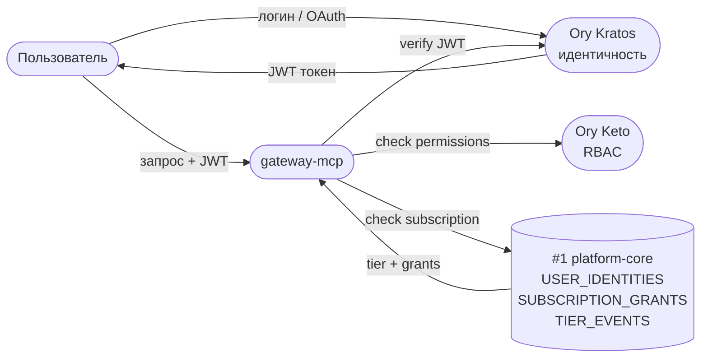
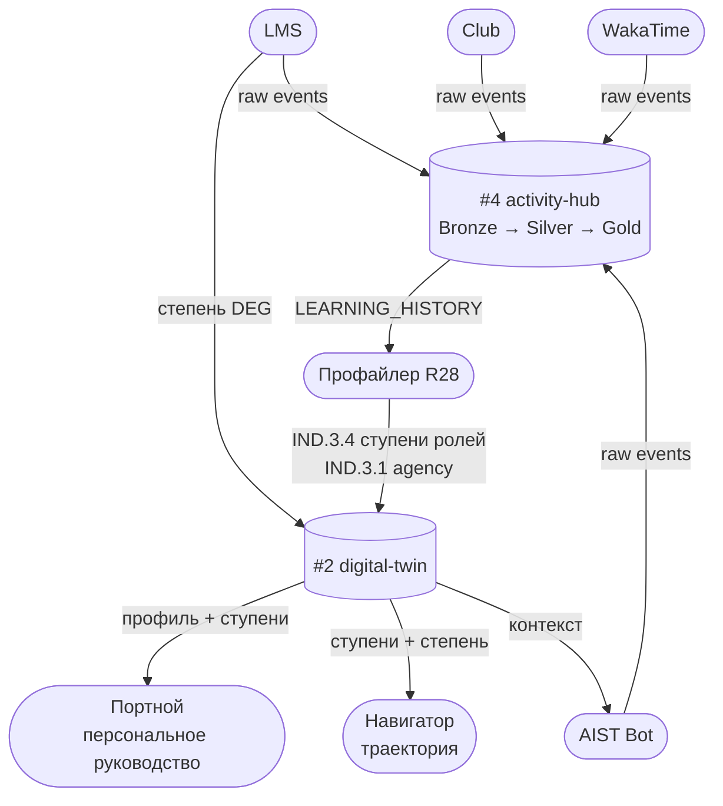
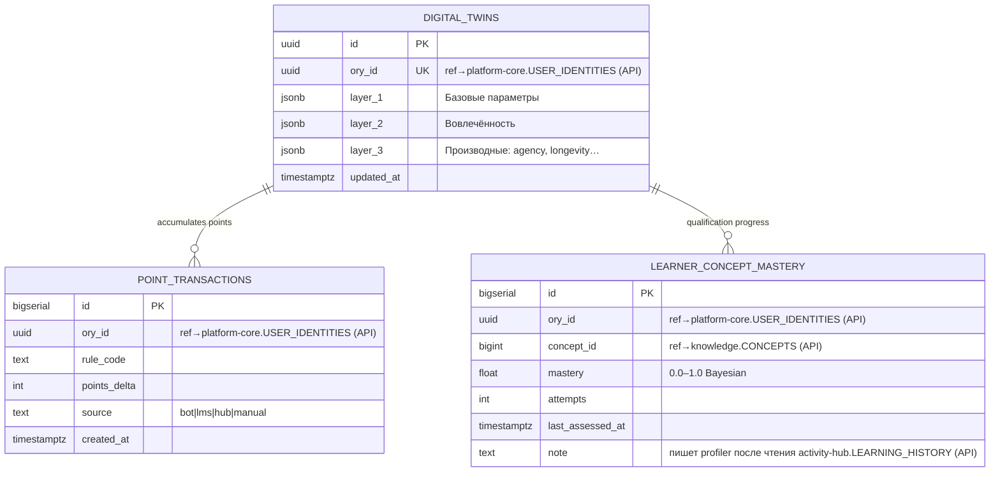
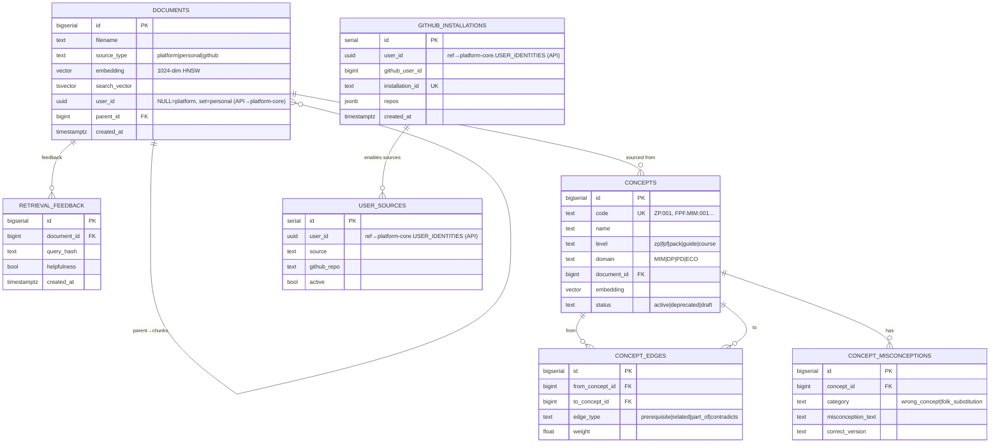
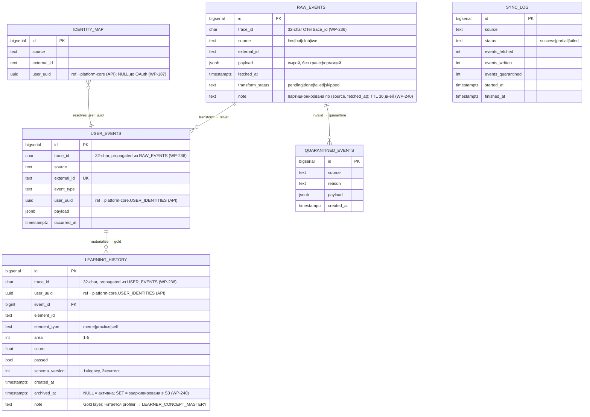
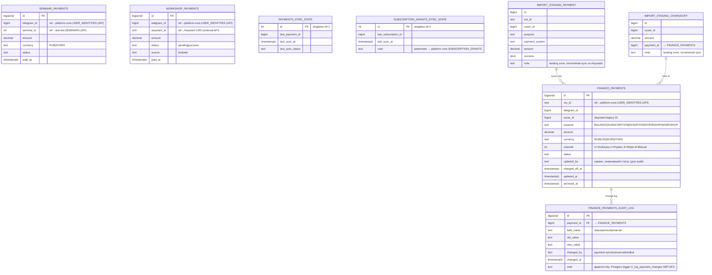
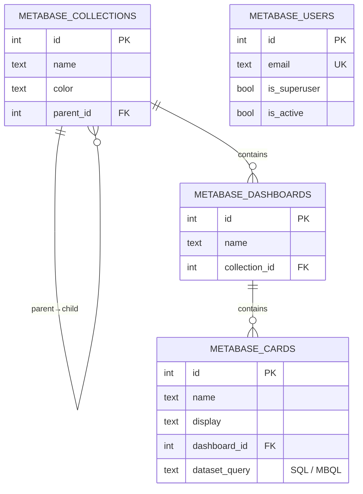

# DP.ARCH.004 — Архитектура данных Neon

---

<details open>
<summary><b>1. Контекст и статус</b></summary>

**Зачем этот документ:** мы проектируем новую архитектуру всех систем платформы Aisystant. Структура баз данных — фундамент: от неё зависит безопасность, независимость команд, масштабируемость и возможность замены отдельных сервисов. Этот документ — source-of-truth по тому, какие данные где живут, как сервисы связаны и какие проблемы ещё нужно решить.

**Текущее состояние (апр 2026):** все таблицы живут в одной базе `platform` в Neon. Разделение на 7 баз — следующий РП (~20-40h, не начат).

**Что зафиксировано:**
- Принципы разделения данных (7 инвариантных правил)
- Карта 7 баз + внешние системы и их связи
- ERD всех таблиц включая новые (audit log, trace_id, тиры, шифрование токенов)
- Принятые архитектурные решения по безопасности, наблюдаемости, масштабированию

---

**Как читать (для команды):**

Ссылка на документ: **https://github.com/TserenTserenov/PACK-digital-platform/blob/main/pack/digital-platform/02-domain-entities/DP.ARCH.004-neon-data-architecture.md**

**В браузере (GitHub):** разделы открываются кликом на заголовок ▶ / ▼.

**В VS Code:** открыть файл → нажать `Cmd+Shift+V` (Mac) или `Ctrl+Shift+V` (Windows/Linux) → откроется Markdown Preview с интерактивными спойлерами.

**Навигация:** §3 Карта баз — быстрый ориентир. Нужна конкретная таблица → §8 Справочник (Ctrl/Cmd+F по имени таблицы). Нужно понять связи — §4 Диаграмма или §6 кто читает/пишет.

</details>

---

<details open>
<summary><b>2. Принципы</b></summary>

**П1. 1 сервис = 1 база** (не схема)
Каждый сервис имеет собственную БД с собственными credentials. Это гарантирует, что компрометация одного сервиса не открывает данные других.

**П2. FK только внутри одной базы**
Ссылки между сервисами — только `ory_id`/`telegram_id` без FK constraint. Это позволяет деплоить и мигрировать каждую базу независимо.

**П3. Схема = namespace для роли-администратора**
Внутри базы схемы разграничивают доступ ролей (финансист видит `finance.*`), а не изолируют сервисы — чтобы не создавать ложное ощущение безопасности.

**П4. `ory_id` — глобальный ключ для платформ-сервисов**
Платформ-базы хранят `ory_id` без FK — Ory Kratos остаётся единственным source of truth идентичности. Бот до OAuth работает по `telegram chat_id`; разрешение `chat_id → ory_id` — через `activity-hub.IDENTITY_MAP` (WP-187).

**П5. Activity Hub — проектировать под замену**
OAuth-конфигурация (`USER_INTEGRATIONS`) хранится в `platform-core` — чтобы при смене движка событий (ClickHouse/TimescaleDB) не потерять настройки интеграций.

**П6. Платежи — изолированный реестр**
`payment-registry` — единственная база с финансовыми транзакциями. Metabase читает только через `metabase_reader` с RLS (агрегаты без PII), прямого доступа у других сервисов нет.

**П7. `SUBSCRIPTION_GRANTS` в `platform-core` — gateway-паттерн**
`payment-registry` синхронизирует гранты в `platform-core` через cron (push-based sync). Все сервисы проверяют права только здесь — единая точка авторизации, не дублирующая логику.

</details>

---

<details open>
<summary><b>3. Карта баз данных</b></summary>

```
Neon Project: aisystant
│
├── DB #1: platform-core   ← USER_IDENTITIES + SUBSCRIPTION_GRANTS
│                             + GITHUB_CONNECTIONS + GOOGLE_CALENDAR_CONNECTIONS
│                             + USER_INTEGRATIONS + BACKEND_REGISTRY
│                             + directus.* (~15 таблиц)
│
├── DB #2: digital-twin    ← DIGITAL_TWINS + POINT_TRANSACTIONS
│                             + LEARNER_CONCEPT_MASTERY
│
├── DB #3: knowledge       ← DOCUMENTS + CONCEPTS + CONCEPT_EDGES
│                             + CONCEPT_MISCONCEPTIONS + RETRIEVAL_FEEDBACK
│                             + GITHUB_INSTALLATIONS + USER_SOURCES
│
├── DB #4: activity-hub    ← RAW_EVENTS (partitioned) + USER_EVENTS
│                             + LEARNING_HISTORY (Gold)
│                             + IDENTITY_MAP + SYNC_LOG + QUARANTINED_EVENTS
│                             ⚠ кандидат на замену ClickHouse/TimescaleDB
│
├── DB #5: payment-registry ← FINANCE_PAYMENTS + FINANCE_PAYMENTS_AUDIT_LOG
│                             + SEMINAR_PAYMENTS + WORKSHOP_PAYMENTS
│                             + PAYMENTS_SYNC_STATE + SUBSCRIPTION_GRANTS_SYNC_STATE
│                             + IMPORT_STAGING_PAYMENT + IMPORT_STAGING_CHARGEOFF
│
├── DB #6: aist-bot        ← USER_STATE + QA_HISTORY + NOTIFICATION_LOG
│                             + BOT_SUBSCRIPTIONS + SEMINARS + COMMUNITY_MEMBERS
│                             + SERVICE_USAGE + USER_ACCESS + FEEDBACK_TRIAGE
│                             + ORY_TOKENS + DT_TOKENS
│
└── DB #7: metabase        ← ~171 служебная таблица Metabase
                              читает payment-registry (metabase_reader + RLS)
                              читает activity-hub (read-only)

Вне Neon:
  Ory Kratos   ← идентичность, source of truth по ory_id
  Ory Keto     ← access control (роли/разрешения); данные в Neon не хранит
  Langfuse     ← AI observability (traces, evals); внешний сервис
  LMS          ← учебная платформа Aisystant; read-only, синхронизация через staging
  Club         ← сообщество; события → #4 activity-hub (source='club')
  Web App      ← Vue.js клиент; серверного state в Neon нет
  CF Workers   ← gateway-mcp, knowledge-mcp; stateless, пишут/читают в Neon по API
  Railway      ← хостинг сервисов; инфра-уровень, данных в Neon не хранит
  WakaTime     ← коллектор активности; события → #4 activity-hub (source='iwe')
  GitHub App   ← коллектор репо; установки → #3 GITHUB_INSTALLATIONS

⚠ Текущее состояние (апр 2026): все таблицы живут в одной базе `platform` в Neon.
  Разделение на 7 баз — следующий РП (~20-40h, не начат).
```

</details>

---

<details open>
<summary><b>4. Диаграммы связей</b></summary>

Три схемы по фокусу. Все стрелки — API / события / cron, не FK.

---

### 4.1 Карта систем (уровень платформы)

Кто что использует. Без деталей потоков.

```
Клиенты              Сервисный слой           Neon (данные)
─────────────────    ──────────────────────   ──────────────────────
Web App (Vue)    ─┐
AIST Bot         ─┤─→ gateway-mcp        ──→ #1 platform-core
IWE / Claude Code─┤    (CF Worker,            (идентичность, тиры,
Claude / ChatGPT ─┘    auth + fan-out)         подписки)
                          │
                    ┌─────┴──────────┐
                    ↓                ↓
              knowledge-mcp    digital-twin-mcp ──→ #2 digital-twin
              personal-        (ЦД, ступени,        (ЦД, роли, степень)
              knowledge-mcp    степень)
                    │
                    ↓
               #3 knowledge
              (документы, граф)

Профайлер R28 ────────────────────────────→ #2 digital-twin
(ежедневный расчёт IND.3.*)               (пишет ступени ролей)

Навигатор, Портной ───────────────────────→ #2 digital-twin
(персональное руководство)                (читают профиль)

LMS + Club + WakaTime + Bot ──────────────→ #4 activity-hub
(коллекторы событий)                      (RAW→USER→LEARNING)

Stripe / YooKassa / TG Stars ─────────────→ #5 payment-registry
Bot (платежи)                              (транзакции, audit log)

Directus (CRM-интерфейс) ─────────────────→ #5 payment-registry
(просмотр и ручное управление платежами)

Metabase (BI) ────────────────────────────→ #5 payment-registry
                                           → #4 activity-hub
                                           (только чтение, RLS)
```

---

### 4.2 Поток идентичности и доступа



---

### 4.3 Поток данных: события → ЦД → персональное руководство



---

### 4.4 Реестр всех систем

| Система | Статус | Читает из Neon | Пишет в Neon |
|---------|--------|---------------|-------------|
| Web App | ✅ | DT, KN (через GW) | events → AH |
| AIST Bot | ✅ | PC, DT, AB | AB, AH, PR, DT |
| IWE / Claude Code | ✅ | KN, DT (через GW) | KN |
| gateway-mcp | ✅ | PC (subscription) | — |
| knowledge-mcp | ✅ | KN | KN |
| digital-twin-mcp | ✅ | DT | DT |
| personal-knowledge-mcp | ✅ | KN | KN |
| Профайлер R28 | ✅ | AH | DT (IND.3.*) |
| Навигатор | ✅ | DT | — |
| Портной | ✅ | DT | — |
| ДЗ-чекер | ✅ | — | AH, DT |
| Directus (CRM UI) | ✅ | PR | PR (ручные правки) |
| Metabase (BI) | ✅ | PR, AH (RO) | — |
| Ory Kratos | ✅ внешний | PC (sync) | PC (identity) |
| Ory Keto | ✅ внешний | — | — (own store) |
| LMS Aisystant | ✅ внешний | — | AH, DT (DEG) |
| Discourse Club | ✅ внешний | — | AH |
| WakaTime | ✅ внешний | — | AH |
| Stripe / YooKassa / TG Stars | ✅ внешний | — | PR |
| Langfuse | ✅ внешний | — | — (own store) |
| Nudge / Уведомления | 🟡 в разработке | DT, AH | AH |
| Composer MCP (FSM) | 🟡 в разработке | AB | AB |
| Epistemic Graph | 🔲 запланирован | KN | KN |
| CRM (сервис, не только UI) | 🔲 запланирован | PC, PR | AH |
| Event Bus / Dispatcher | 🔲 запланирован | AH | AH |
| AI Training Pipeline | 🔲 запланирован | AH, KN | — |
| Team Service | 🔲 запланирован | PC | AH |

</details>

---

<details>
<summary><b>5. ERD по базам данных</b></summary>

> Связи между базами помечены `(API)` с указанием целевой базы.

---

### DB #1: platform-core

Ядро платформы: идентичность, подписки, OAuth-соединения, реестр персональных MCP.
Gateway-паттерн: все сервисы проверяют права только здесь.

```mermaid
erDiagram
    USER_IDENTITIES {
        uuid        ory_id          PK  "source: Ory Kratos"
        bigint      telegram_id     UK
        bigint      lms_id
        text        region          "ru|world"
        text        tier            "T0|T1|T2|T3|T4 — конфигурация доступа к платформе (DP.D.050)"
        text        mentor_tier     "NULL|TM1|TM2|TM3"
        text        admin_tier      "NULL|TA1|TA2|TA3|TA4"
        bool        is_developer    "TD1"
        timestamptz created_at
    }

    TIER_EVENTS {
        bigserial   id              PK
        uuid        ory_id          "→ USER_IDENTITIES"
        text        from_tier
        text        to_tier
        text        reason          "ory_registration|subscription|dt_complete|github_connect|manual"
        timestamptz created_at
        text        note            "платформенный лог переходов тиров (DP.ARCH.002)"
    }

    SUBSCRIPTION_GRANTS {
        uuid        id              PK
        uuid        ory_id          "→ USER_IDENTITIES"
        bigint      telegram_id
        text        product         "br = Бесконечное развитие"
        text        source          "payment|manual|marketing|trial"
        timestamptz valid_from
        timestamptz valid_until
        timestamptz revoked_at
        text        note            "поддерживается payment-registry subscription-sync cron"
    }

    GITHUB_CONNECTIONS {
        serial      id              PK
        uuid        ory_id          "→ USER_IDENTITIES"
        bigint      telegram_id
        text        github_username
        bytea       access_token    "Fernet-encrypted (WP-234)"
        bytea       refresh_token   "Fernet-encrypted (WP-234)"
        text        token_nonce
        text        knowledge_repo
        text        strategy_repo
        text        default_branch
        timestamptz connected_at
        text        note            "dual-write: токен также в USER_INTEGRATIONS для коллекторов"
    }

    GOOGLE_CALENDAR_CONNECTIONS {
        serial      id              PK
        uuid        ory_id          "→ USER_IDENTITIES"
        bigint      telegram_id
        bytea       access_token    "Fernet-encrypted (WP-234)"
        bytea       refresh_token   "Fernet-encrypted (WP-234)"
        text        token_nonce
        text        calendar_id
        text        email
        timestamptz connected_at
    }

    USER_INTEGRATIONS {
        serial      id              PK
        uuid        user_uuid       "→ USER_IDENTITIES"
        text        service         "github|wakatime|google_calendar"
        bytea       access_token    "Fernet-encrypted (WP-234)"
        bytea       refresh_token   "Fernet-encrypted (WP-234)"
        text        token_nonce
        timestamptz token_expires_at
        text        scope
        jsonb       metadata
        timestamptz connected_at
        text        note            "source of truth для activity-hub collectors; GitHub: dual-write из GITHUB_CONNECTIONS"
    }

    BACKEND_REGISTRY {
        serial      id              PK
        uuid        ory_id          "→ USER_IDENTITIES"
        text        backend_url     "validated: https only, no RFC1918, max 512 chars (WP-239)"
        text        tool_prefix
        text        name
        text        status          "pending_validation|active|failed"
        text        knowledge_gate_result "pending|passed|partial|failed"
        timestamptz created_at
    }

    USER_IDENTITIES ||--o{ SUBSCRIPTION_GRANTS : "has"
    USER_IDENTITIES ||--o{ GITHUB_CONNECTIONS : "connects GitHub"
    USER_IDENTITIES ||--o{ GOOGLE_CALENDAR_CONNECTIONS : "connects GCal"
    USER_IDENTITIES ||--o{ USER_INTEGRATIONS : "service integrations"
    USER_IDENTITIES ||--o{ BACKEND_REGISTRY : "personal MCPs"
    USER_IDENTITIES ||--o{ TIER_EVENTS : "tier history"
```



---

### DB #2: digital-twin

Цифровой двойник пользователя. Writers: dt-mcp, profiler cron, бот (только через DT-MCP API).



---

### DB #3: knowledge

Документы платформы и пользователей, граф концептов, источники для индексации.



---

### DB #4: activity-hub

Medallion-архитектура: Bronze (raw) → Silver (user_events) → Gold (learning_history).
Кандидат на замену ClickHouse/TimescaleDB при росте объёма.



---

### DB #5: payment-registry

Единственная база с финансовыми транзакциями.
Metabase читает через `metabase_reader` (RLS, только агрегаты без PII).



---

### DB #6: aist-bot

Только бот. Telegram-first: основной ключ — `chat_id`. Не содержит платформенных данных и финансовых транзакций.

```mermaid
erDiagram
    USER_STATE {
        bigint      chat_id         PK  "Telegram chat_id"
        text        current_state   "FSM state"
        jsonb       data            "FSM context"
        bool        is_inactive     "true если нет активности >90 дней (WP-240)"
        timestamptz trial_started_at
        timestamptz last_active_date
        int         active_days_total
        text        note            "тир — в platform-core.USER_IDENTITIES (не здесь)"
    }

    TIER_EVENTS {
        bigserial   id              PK
        bigint      chat_id         FK
        text        from_tier       "T0|T1|T2|T3|T4"
        text        to_tier
        text        reason          "ory_registration|subscription|dt_complete|github_connect|manual"
        timestamptz created_at
        text        note            "история переходов тиров; 4-осевая модель: T+TM+TA+TD (DP.ARCH.002)"
    }

    QA_HISTORY {
        bigserial   id              PK
        bigint      chat_id         FK
        text        question
        text        answer
        bool        helpful
        jsonb       mcp_sources
        timestamptz created_at
        text        note            "TTL 180 дней (WP-240)"
    }

    NOTIFICATION_LOG {
        bigserial   id              PK
        bigint      chat_id
        text        notification_type
        text        idempotency_key UK
        jsonb       payload
        timestamptz created_at
        text        note            "TTL 30 дней (WP-240)"
    }

    BOT_SUBSCRIPTIONS {
        bigserial   id              PK
        bigint      chat_id
        text        status          "active|inactive"
        text        telegram_payment_charge_id
        int         stars_amount
        timestamptz started_at
        timestamptz expires_at
        text        note            "Telegram Stars billing (бот-уровень); платформ-подписка → platform-core"
    }

    SEMINARS {
        serial      id              PK
        text        title
        decimal     price_rub
        int         price_stars
        bigint      tg_group_id
        date        event_date
        text        note            "каталог; оплата → payment-registry.SEMINAR_PAYMENTS"
    }

    COMMUNITY_MEMBERS {
        bigserial   id              PK
        bigint      telegram_id
        bigint      chat_id
        text        username
        timestamptz joined_at
        timestamptz left_at
    }

    SERVICE_USAGE {
        bigserial   id              PK
        bigint      user_id         "Telegram ID"
        text        service_id
        timestamptz created_at
    }

    USER_ACCESS {
        bigserial   id              PK
        bigint      user_id         "Telegram ID"
        text        access_type
        text        resource_id
        timestamptz expires_at
    }

    FEEDBACK_TRIAGE {
        bigserial   id              PK
        bigint      chat_id
        text        category
        text        status          "new|classified|resolved"
        text        source          "bot"
        timestamptz created_at
        text        note            "только бот-фидбек; кросс-канальный → activity-hub"
    }

    ORY_TOKENS {
        bigint      chat_id         PK  "Telegram chat_id"
        bytea       access_token    "Fernet-encrypted (WP-234)"
        bytea       refresh_token   "Fernet-encrypted (WP-234)"
        text        token_nonce
        timestamptz expires_at
        text        ory_id
        timestamptz updated_at
        text        note            "персистентность Ory OAuth-сессии бота; refresh каждые 10 мин"
    }

    DT_TOKENS {
        bigint      chat_id         PK  "Telegram chat_id"
        bytea       access_token    "Fernet-encrypted (WP-234)"
        bytea       refresh_token   "Fernet-encrypted (WP-234)"
        text        token_nonce
        timestamptz expires_at
        text        dt_user_id
        timestamptz updated_at
        text        note            "персистентность DT OAuth-сессии бота; refresh каждые 10 мин"
    }

    USER_STATE ||--o{ QA_HISTORY : "conversation"
    USER_STATE ||--o{ NOTIFICATION_LOG : "notifications"
    USER_STATE ||--o{ BOT_SUBSCRIPTIONS : "TG Stars billing"
    USER_STATE ||--o{ TIER_EVENTS : "tier history"
    SEMINARS }o--o{ COMMUNITY_MEMBERS : "members"
```



---

### DB #7: metabase

Служебные таблицы Metabase BI (~171 таблица). Не хранит прикладные данные платформы.



</details>

---

<details>
<summary><b>6. Кто читает / кто пишет</b></summary>

| База | Writers | Readers |
|------|---------|---------|
| #1 platform-core | Ory callback, OAuth flows, `subscription-sync` cron | gateway-mcp (авторизация каждого запроса), все сервисы через API |
| #2 digital-twin | dt-mcp, profiler cron (из #4 activity-hub.LEARNING_HISTORY) | dt-mcp, бот `/twin`, knowledge-mcp |
| #3 knowledge | knowledge-mcp ingest, GitHub webhook | knowledge-mcp search, dt-mcp |
| #4 activity-hub | collectors (lms/bot/club/iwe), transform-worker, бот | transform-worker, profiler, Metabase (RO) |
| #5 payment-registry | `incremental-sync.sh` cron, бот (seminar/workshop via API) | Metabase (`metabase_reader` + RLS), `subscription-sync` cron |
| #6 aist-bot | только бот | только бот |
| #7 metabase | Metabase internal | Metabase UI |

</details>

---

<details>
<summary><b>7. Пояснения</b></summary>

### USER_INTEGRATIONS vs GITHUB_CONNECTIONS

Обе таблицы хранят GitHub OAuth-токен одного пользователя — намеренный **dual-write**.

| | GITHUB_CONNECTIONS (platform-core) | USER_INTEGRATIONS (platform-core) |
|---|---|---|
| **Назначение** | Конфигурация публикации: target_repo, notes_path, branches | OAuth-конфиг для коллекторов: WakaTime, IWE Adapter |
| **Потребитель** | Бот-издатель заметок | activity-hub collectors |

`WAKATIME` — только в `USER_INTEGRATIONS`. `GOOGLE_CALENDAR` — только в `GOOGLE_CALENDAR_CONNECTIONS`.

---

### ORY_TOKENS и DT_TOKENS в aist-bot

Это **персистентность бот-сессий**, а не кеш платформы:
- Ключ — `chat_id` (Telegram): бот работает в Telegram-контексте
- Хранятся для переживания редеплоев бота
- `ory_tokens` — токены для вызова Gateway MCP (Ory OAuth)
- `dt_tokens` — токены для вызова DT API
- Токены **зашифрованы** (Fernet, WP-234), в открытом виде в БД не хранятся

---

### LEARNING_HISTORY vs LEARNER_CONCEPT_MASTERY

| | LEARNING_HISTORY (activity-hub) | LEARNER_CONCEPT_MASTERY (digital-twin) |
|---|---|---|
| **Что хранит** | Факты: "прошёл мем X, score 0.8" | Агрегат: "освоен концепт ZP.001 на 85%" |
| **Кто пишет** | transform-worker из USER_EVENTS | profiler (читает LEARNING_HISTORY через API) |

Поток: RAW_EVENTS → USER_EVENTS → LEARNING_HISTORY → profiler API → LEARNER_CONCEPT_MASTERY.
Квалификация "Ученик" и уровни до неё — автоматически из mastery. Выше — методсовет МИМ (ручное).

---

### Кеш авторизации gateway-mcp

`checkSubscription()` в gateway-mcp не обращается к Neon на каждый запрос — результат кешируется в **Cloudflare KV** с TTL 5 мин (WP-235). JWKS также кешируется in-memory в Workers isolate.

</details>

---

<details>
<summary><b>8. Справочник таблиц</b></summary>

> **Статус:** ✅ Существует в `platform` (единая база, WP-232) | ⚠️ Перенести при разделении | 🆕 Создать

### #1 platform-core

| Таблица | Назначение | Статус | Источник |
|---------|-----------|--------|----------|
| USER_IDENTITIES | Маппинг ory_id ↔ telegram_id ↔ lms_id. Только то, чего Ory не знает. | ✅ | `public.user_identities`, WP-232 |
| SUBSCRIPTION_GRANTS | Реестр активных прав подписки. Gateway для всех сервисов. | ✅ | `public.subscription_grants`, WP-231 |
| GITHUB_CONNECTIONS | GitHub OAuth + конфиг публикации (репо, ветки). | ✅ | `public.github_connections`, WP-187 |
| GOOGLE_CALENDAR_CONNECTIONS | Google Calendar OAuth для бота. | ✅ | `public.google_calendar_connections`, WP-232 |
| USER_INTEGRATIONS | OAuth-конфиг для activity-hub collectors (GitHub, WakaTime). | ⚠️ Перенести | Сейчас в `development.user_integrations` |
| BACKEND_REGISTRY | Реестр персональных MCP-бэкендов пользователей. | ✅ | `knowledge.backend_registry`, WP-187/189 |
| TIER_EVENTS | Лог переходов тиров (T0→T1 при регистрации и т.д.). Платформенный, читается всеми сервисами. | 🆕 Перенести из aist-bot | Сейчас в `development.tier_events` (aist-bot) |

### #2 digital-twin

| Таблица | Назначение | Статус | Источник |
|---------|-----------|--------|----------|
| DIGITAL_TWINS | Цифровой двойник: 3 слоя (базовые / вовлечённость / производные). | ✅ | `public.digital_twins`, WP-227 |
| POINT_TRANSACTIONS | Лог начислений/списаний баллов активности. | ✅ | `points.point_transactions`, WP-121 |
| LEARNER_CONCEPT_MASTERY | Степень освоения концептов (0.0–1.0). Основа для квалификации "Ученик". | ✅ | `concept_graph.learner_concept_mastery`, WP-151 |

### #3 knowledge

| Таблица | Назначение | Статус | Источник |
|---------|-----------|--------|----------|
| DOCUMENTS | Документы + векторные эмбеддинги для semantic search. | ✅ | `knowledge.documents`, knowledge-mcp |
| RETRIEVAL_FEEDBACK | Обратная связь по релевантности документов. | ✅ | `knowledge.retrieval_feedback`, knowledge-mcp |
| CONCEPTS | Граф концептов платформы (ZP, FPF, Pack, курсы). | ✅ | `concept_graph.concepts`, WP-170 |
| CONCEPT_EDGES | Рёбра графа: prerequisite, related, part_of, contradicts. | ✅ | `concept_graph.concept_edges` |
| CONCEPT_MISCONCEPTIONS | Типовые заблуждения по концептам. | ✅ | `concept_graph.concept_misconceptions` |
| GITHUB_INSTALLATIONS | GitHub App installations для индексации репо. | ✅ | `knowledge.github_installations`, WP-187 |
| USER_SOURCES | Источники индексации (GitHub репо, активные/нет). | ✅ | `knowledge.user_sources`, knowledge-mcp |

### #4 activity-hub

| Таблица | Назначение | Статус | Источник |
|---------|-----------|--------|----------|
| RAW_EVENTS | Bronze: сырые события, партиционированы по (source, fetched_at). TTL 30д. | ✅ | `development.raw_events`, WP-109 Ф8.1 |
| USER_EVENTS | Silver: нормализованные события с атрибуцией пользователя. TTL 90д. | ✅ | `development.user_events`, WP-109 |
| LEARNING_HISTORY | Gold: факты обучения. Читается profiler. Archive в S3 после 5 лет. | ⚠️ Перенести | Сейчас в aist_bot (миграция 007) |
| IDENTITY_MAP | chat_id → ory_id; NULL до OAuth. | ✅ | `development.identity_map`, WP-109 |
| SYNC_LOG | Журнал запусков коллекторов. TTL 30д. | ✅ | `development.sync_log`, WP-109 |
| QUARANTINED_EVENTS | Карантин для невалидных событий. | ✅ | `development.quarantined_events`, WP-109 |

### #5 payment-registry

| Таблица | Назначение | Статус | Источник |
|---------|-----------|--------|----------|
| FINANCE_PAYMENTS | Реестр всех транзакций (YooKassa, Stripe, ручные). Permanent. | ✅ | `public.finance_payments`, WP-183. Данные из Aisystant CRM (35 879 строк) |
| FINANCE_PAYMENTS_AUDIT_LOG | Append-only лог изменений статуса. 7 лет. | 🆕 Создать | WP-237 |
| SEMINAR_PAYMENTS | Платежи за семинары через бот. | ⚠️ Перенести | Сейчас в aist_bot (миграция 011) |
| WORKSHOP_PAYMENTS | Платежи за воркшопы. Содержит aisystant_id. | ⚠️ Перенести | Сейчас в aist_bot (миграция 009) |
| PAYMENTS_SYNC_STATE | Ватерmarк импорта из Aisystant. | ✅ | `public.finance_payments_sync_state`, WP-183 |
| SUBSCRIPTION_GRANTS_SYNC_STATE | Ватерmarк синхронизации грантов. | ✅ | WP-231 |
| IMPORT_STAGING_PAYMENT | Landing zone импорта платежей из Aisystant. | ✅ | WP-183 (миграция 005) |
| IMPORT_STAGING_CHARGEOFF | Landing zone списаний. | ✅ | WP-183 (миграция 005) |

### #6 aist-bot

| Таблица | Назначение | Статус | Источник |
|---------|-----------|--------|----------|
| USER_STATE | FSM-состояние бота + счётчик активных дней, триал. ⚠️ Колонки tier/mentor_tier убрать после переноса в platform-core | ✅ | `development.user_state`, первая версия бота |
| QA_HISTORY | История вопросов/ответов. TTL 180д. | ✅ | `public.qa_history`, WP-132 |
| NOTIFICATION_LOG | Журнал уведомлений с idempotency_key. TTL 30д. | ✅ | `public.notification_log`, WP-232 |
| BOT_SUBSCRIPTIONS | Telegram Stars подписки (бот-уровень). | ⚠️ Уточнить | Возможно заменена `public.subscriptions` (WP-232) |
| SEMINARS | Каталог семинаров. Оплата → payment-registry. | ✅ | aist_bot миграция 011 |
| COMMUNITY_MEMBERS | Участники Telegram-сообщества. | ✅ | aist_bot миграция 009 |
| SERVICE_USAGE | Счётчик использования сервисов бота. | ✅ | aist_bot миграция 003 |
| USER_ACCESS | Временные права (выданные ботом, с expiry). | ✅ | aist_bot миграция 002 |
| FEEDBACK_TRIAGE | Фидбек из бота (source='bot'). | ✅ | aist_bot миграция 008 |
| ORY_TOKENS | Ory OAuth-токены бота. Зашифрованы Fernet. | ✅ | `public.ory_tokens`, WP-209. ⚠️ Сейчас plaintext → WP-234 |
| DT_TOKENS | DT OAuth-токены бота. Зашифрованы Fernet. | ✅ | `public.dt_tokens`, WP-82. ⚠️ Сейчас plaintext → WP-234 |

### #7 metabase

| Таблица | Назначение | Статус | Источник |
|---------|-----------|--------|----------|
| METABASE_COLLECTIONS | Папки дашбордов. | ✅ | Управляется Metabase (~171 таблица) |
| METABASE_DASHBOARDS | Дашборды (финансы, события). | ✅ | WP-183 (2 дашборда) |
| METABASE_CARDS | Questions (8 штук). | ✅ | WP-183 |
| METABASE_USERS | Пользователи Metabase (не Ory). | ✅ | Управляется Metabase |

</details>

---

<details>
<summary><b>9. Архитектурные решения</b></summary>

> Принятые решения по проблемам, выявленным при ArchGate-ревью. Все изменения уже отражены в ERD выше (раздел 5) и справочнике таблиц (раздел 8).

---

### WP-234 — Шифрование OAuth-токенов (aist-bot)

**Проблема:** `access_token` и `refresh_token` в ORY_TOKENS, DT_TOKENS, GITHUB_CONNECTIONS, USER_INTEGRATIONS хранились как TEXT. При компрометации базы — все OAuth-сессии утекают. Подтверждено в коде: `cryptography` отсутствует в `requirements.txt`.

**Решение:** Python Fernet (AES-128-CBC + HMAC-SHA256). Тип колонок: TEXT → BYTEA. Добавлена колонка `token_nonce TEXT`. Ключ `FERNET_KEY` из env (Railway secrets). Scheduler проверяет `updated_at < now() - 10 min` → принудительный refresh.

**Трудозатраты:** ~16h. Приоритет: критический.

---

### WP-235 — Кеш авторизации (gateway-mcp)

**Проблема:** `checkSubscription()` в `gateway-mcp/src/index.ts` делает SELECT в Neon на каждый запрос. Подтверждено в коде. При 10k пользователей = тысячи DB-запросов в минуту.

**Решение:** Cloudflare KV с TTL 5 мин. In-memory Map не подходит (Workers stateless, разные isolates → cache miss 80%+). При отзыве подписки — явная инвалидация `kv.delete(key)`.

**Трудозатраты:** ~12h. Приоритет: высокий.

---

### WP-236 — Correlation ID в activity-hub

**Проблема:** RAW_EVENTS, USER_EVENTS, LEARNING_HISTORY не имели `trace_id`. Нельзя проследить путь события bronze→silver→gold. Подтверждено в миграциях.

**Решение:** OpenTelemetry trace_id (CHAR(32), 128-bit hex). Генерируется при ingestion в RAW_EVENTS, propagated transform-worker в USER_EVENTS и LEARNING_HISTORY. Интегрируется с Langfuse.

**Трудозатраты:** ~20h. Приоритет: высокий.

---

### WP-237 — Audit trail для FINANCE_PAYMENTS

**Проблема:** Нет истории изменений статуса платежа. Нельзя ответить кто и когда изменил статус.

**Решение:** Новая таблица `FINANCE_PAYMENTS_AUDIT_LOG` + Postgres trigger `tr_log_payment_changes`. Срабатывает на UPDATE, пишет в лог автоматически. `changed_by` = имя сервиса. Retention: 7 лет (compliance).

**Трудозатраты:** ~14h. Приоритет: высокий.

---

### WP-238 — RLS для Metabase

**Проблема:** Metabase читала FINANCE_PAYMENTS без ограничений. При компрометации — все финансовые данные открыты.

**Решение:** Роль `metabase_reader` + агрегированные views без PII. `REVOKE ALL ON FINANCE_PAYMENTS FROM metabase_reader`. RLS policy `USING (FALSE)` блокирует прямой доступ к таблице.

**Трудозатраты:** ~8h. Приоритет: средний.

---

### WP-239 — SSRF защита BACKEND_REGISTRY

**Проблема:** Пользователи регистрируют кастомные MCP-URL без валидации → SSRF риск.

**Решение:** Валидация при записи: только `https://`, запрет RFC1918 (127.x, 10.x, 172.16-31.x, 192.168.x, 169.254.x), запрет портов 22/23/25/135/139/445/3389, максимум 512 символов. Отражено в note поля `backend_url` в ERD.

**Трудозатраты:** ~10h. Приоритет: средний.

---

### WP-240 — Retention policy

**Проблема:** Таблицы растут бесконечно. GDPR требует права на удаление данных.

**Решение:** pg_partman DROP для RAW_EVENTS (TTL 30д). Daily cron для остальных. Retention по таблицам:

| Таблица | TTL | Механизм |
|---------|-----|----------|
| RAW_EVENTS | 30 дней | pg_partman DROP |
| USER_EVENTS | 90 дней | DELETE cron |
| LEARNING_HISTORY | Постоянно | Archive S3 после 5 лет |
| FINANCE_PAYMENTS | Постоянно | Annual archive |
| FINANCE_PAYMENTS_AUDIT_LOG | 7 лет | Archive (compliance) |
| QA_HISTORY | 180 дней | DELETE cron |
| NOTIFICATION_LOG | 30 дней | DELETE cron |
| SYNC_LOG | 30 дней | DELETE cron |
| USER_STATE (неактивные) | 90 дней | soft-delete (is_inactive=true) |

**Трудозатраты:** ~16h. Приоритет: средний.

---

### WP-241 — Backup / DR

**Проблема:** Не определены RPO/RTO. Neon PITR 7 дней недостаточно для payment-registry (compliance).

**Решение:** Neon PITR per-database + pg_dump в S3 через unpooled endpoint.

| База | RPO | RTO | Механизм |
|------|-----|-----|----------|
| platform-core | 1h | 15 мин | PITR 7d + S3 daily |
| payment-registry | 15 мин | 30 мин | PITR **30d** (upgrade) + S3 каждые 6h |
| digital-twin | 1h | 30 мин | PITR 7d + S3 daily |
| activity-hub | 24h | 1h | PITR 7d (события воспроизводимы) |
| knowledge | 7 дней | 2h | S3 weekly (знания в git) |
| aist-bot | 24h | 2h | PITR 7d |

**Трудозатраты:** ~18h. Приоритет: средний.

</details>

---

<details open>
<summary><b>10. Сводная таблица РП</b></summary>

> Все перечисленные РП **ещё не выполнены** — это план работ, необходимый для перехода к целевой архитектуре. Текущее состояние: одна база `platform` (WP-232). Разделение и реализация решений ниже — следующие шаги.

| РП | Что нужно сделать | Оценка | Приоритет |
|----|------------------|--------|-----------|
| WP-234 | Зашифровать OAuth-токены в #6 aist-bot (Fernet, BYTEA) | 16h | критический |
| WP-235 | Добавить кеш авторизации в gateway-mcp (Cloudflare KV, TTL 5 мин) | 8h | высокий |
| WP-236 | Добавить trace_id в #4 activity-hub (RAW→USER→LEARNING, OTel) | 12h | высокий |
| WP-237 | Создать audit trail для #5 payment-registry (таблица + Postgres trigger) | 10h | высокий |
| WP-238 | Настроить RLS для Metabase → #5 payment-registry (роль + views без PII) | 6h | средний |
| WP-239 | Добавить валидацию URL в #1 platform-core BACKEND_REGISTRY (SSRF защита) | 6h | средний |
| WP-240 | Настроить retention policy для всех баз (pg_partman + cron + S3 archive) | 16h | средний |
| WP-241 | Настроить backup / DR (PITR per-database + pg_dump → S3) | 14h | средний |
| WP-215 | Разделение инфраструктуры мир/Россия: реализовать эту схему в двух инстансах, найти альтернативу Neon для РФ-контура (Neon — US-hosted, GDPR/152-ФЗ), определить стратегию синхронизации | ~40h | высокий |
| | **Итого** | **~128h** | |

**Критический путь:**
1. WP-234 + WP-235 — безопасность и авторизация (параллельно, ~2 нед)
2. WP-236 + WP-237 + WP-238 + WP-239 — данные и compliance (параллельно, ~2 нед)
3. WP-240 + WP-241 — операционная надёжность (~1 нед)
4. WP-215 — региональное разделение (блокирует production для РФ-пользователей)

</details>
