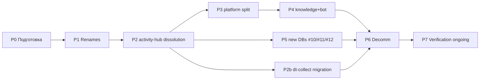

# DP.ROADMAP.001 — План миграции Neon 9 → 12 БД

**Этот документ = артефакт WP-253 Ф1.** Разворачивает §8 DP.ARCH.004 v2 в операционный план с фазами, gating-критериями, rollback-процедурами, координацией child-WP.

**Базовые инварианты (не нарушать):**
- **Red line MVP 1 мая** — до первой когорты не трогать live БД. Все работы этого документа начинаются **после** MVP live + 5 команд onboarded.
- **Zero data loss** — любое переименование/расщепление проходит через shadow-copy и двойную верификацию `COUNT(*)` + sample-sanity.
- **OwnerIntegrity** — факт пишется только туда, где его владелец (DP.D.052).
- **Rollback-first design** — каждая фаза имеет документированный откат ДО начала выполнения.

---

## 1. Зачем

Текущая архитектура 9 БД (v1, 14 апр 2026) имеет 3 структурных проблемы, выявленных Ф24 Андрея и каноном WP-257:

1. **Монолитный ЦД** — `digital-twin` смешивал декларативные данные пользователя (ответы, настройки), расчётные показатели (baseline, potential) и runtime-контексты агентов. Разный writer — разный владелец (DP.D.052).
2. **Activity-hub как контейнер-смесь** — события публикаций, лиды, начисления и сообщества складывались в одну БД «событий». Нарушение Event ≠ Container: лид-событие и награда-событие живут в разных BC с разными retention/PII.
3. **Health и Metabase внутри Neon** — health-данные должны быть во внешнем SaaS (HD «Internal health ≠ Public status page»), Metabase — read-replica, не отдельная БД.

Результат миграции — 12 БД с **single writer-owner** на каждую, ясными outbox-проекциями между BC, без SaaS-функций внутри Neon.

## 2. Исходное состояние (baseline, 22 апр 2026)

9 БД в Neon Production:

| # v1 | DB name (физ.) | Writer | Данные | Состояние |
|---|---|---|---|---|
| 1 | `platform` | boot init + billing | аккаунты, подписки-контракты, конфиг | live |
| 2 | `knowledge` | knowledge-mcp indexer | эмбеддинги Pack платформы + личные коллекции | live |
| 3 | `activity-hub` | все сервисы (RAW events) | события+проекции обучения, публикаций, лидов | live, шумный |
| 4 | `payment-registry` | payment-receiver | платёжные транзакции, баллы | live |
| 5 | `digital-twin` | Портной AI | baseline/potential/stage пользователя | live |
| 6 | `aist-bot` | telegram-bot | feed, learning objects, FSM state | live |
| 7 | `metabase` | Metabase self-host | BI-метаданные | live (убрать) |
| 8 | `health` | uptime probes | pings, incidents | live (убрать) |
| 9 | `content-pipeline` | content-worker | публикации text→TG | WP-155 MVP |

## 3. Целевое состояние (goal)

12 БД Neon + 2 внешних SaaS + LMS legacy (подробно — DP.ARCH.004 v2 §1).

| # v2 | Имя | Категория WP-257 | Writer |
|---|---|---|---|
| 1 | `persona` | Персона | пользователь + personal-indexer |
| 2 | `journal` | Память.Observed | activity-hub runtime (события) |
| 3 | `payment` | Память.Observed (finance) | payment-receiver |
| 4 | `subscription` | Catalog + Персона.grant | billing + admin |
| 5 | `indicators` | Память.Derived | Портной AI |
| 6 | `learning` | Domain (обучение) | learning-engine + bot |
| 7 | `knowledge-platform` | Platform-knowledge | knowledge-mcp indexer |
| 8 | `reference` | Catalog | admin (config) |
| 9 | `publication` | Domain (контент) | content-worker |
| 10 | `community` | Relational | community-engine (WP-256) |
| 11 | `lead` | Proto-Persona | marketing (funnel events) |
| 12 | `rewards` | Domain (мотивация) | rewards-engine (points + badges + qualification) |

Вне Neon: `metabase` → read-replica, `health` → Better Uptime SaaS, LMS Aisystant → read-only bridge.

## 4. Принципы миграции

| # | Принцип | Практика |
|---|---|---|
| П1 | Shadow-copy + dual-write перед cut-over | Новая БД получает writes параллельно со старой ≥14 дней, после — читатели переключаются |
| П2 | Атомарная единица — per-table-per-DB | DDL, data copy, writer/reader switch выполняются для одной таблицы за раз |
| П3 | Backwards-compat window 30 дней | Старая БД остаётся в read-only 30 дней после cut-over для forensics |
| П4 | Pre-change verification query | До DDL запускается golden-query (COUNT + sample rows) на обеих схемах |
| П5 | Rollback задокументирован до старта фазы | Reverse DDL + reverse config + critical-path smoke подготовлены как артефакт |
| П6 | Outbox для cross-BC событий | События между BC не через JOIN, а через outbox → projection → consumer inbox |
| П7 | Connection strings в 1 месте | Все env vars живут в секрет-менеджере, не в коде; миграция = обновление секретов |
| П8 | Coordination через WP-253 | Ни одна child-WP не трогает соседнюю БД без согласования в DP.ROADMAP.001 |

---

## 5. Фазы

Каждая фаза имеет: **вход** (entry gate), **содержание** (что делается), **выход** (exit gate), **откат** (rollback), **бюджет**, **владелец**.

### 5.0 P0 — Подготовка (до 10 мая, 3h)

**Вход:**
- DP.ARCH.004 v2.3 approved (done 22 апр + Ф27/Ф30 patches).
- DP.ROADMAP.001 (этот документ) approved через ArchGate v3 (DONE 26 апр, PASS — см. §16).
- MVP 1 мая — live, ≥5 команд onboarded.
- 3 ответа Андрея (§16): L2.5 sandbox-test до P2 / temporal slack / Metabase механизм.

**Содержание:**
1. Проверить лимиты Neon: может ли текущий план держать 12 БД. Если нет — upgrade tier.
2. Собрать inventory connection strings: все `DATABASE_URL`-like переменные across code (GitHub Actions secrets, Railway envs, `.env` файлы). Фиксация в `DS-my-strategy/inbox/WP-253-neon-connection-inventory.md`.
3. Подготовить tooling:
   - `neon-migrate.sh` — обёртка над `pg_dump | pg_restore` для per-table copy между БД Neon.
   - `dual-write-shim.ts` — middleware для двойной записи в старую+новую БД.
   - `count-parity.sql` — generic скрипт сверки `COUNT(*)` + `MD5(concat(*))` на выборке.
4. Pack-level approve: DP.ROADMAP.001 → review Андрея → фиксация в pack-manifest.

**Выход:**
- [ ] Neon tier вмещает 12 БД (проверено, коммит upgrade если нужен).
- [ ] Inventory connection strings полный (≥1 consumer для каждого writer).
- [ ] Tooling локально работает на sandbox-БД.
- [ ] DP.ROADMAP.001 approved (в pack-manifest.md + WP-253 Ф1 ✅).

**Откат:** не применим — только подготовка, без изменений live.

**Владелец:** Tseren (Pack) + Паша (infra).

---

### 5.1 P1 — Низкорисковые переименования (май, 4h)

**Объём:** `digital-twin` → `indicators` (#5), `content-pipeline` → `publication` (#9). Эти две БД — single-writer, без split, без dissolution. Поэтому идут первыми.

**Вход:**
- P0 DONE.
- WP-227 /twin 96.2 прод стабилен 7 дней.
- WP-155 content-pipeline MVP live ≥14 дней.

**Содержание (за каждую БД):**
1. Создать новую БД с целевым именем в Neon (пустую).
2. Развернуть `pg_dump old_db | pg_restore new_db`.
3. Проверить parity: `count-parity.sql` на ≥3 ключевых таблицах. Passed = COUNT идентичен + MD5 sample match.
4. Обновить connection strings в потребителях (по inventory). **Сначала** — в staging env, smoke-test 24h. **Потом** — production.
5. После 7 дней стабильной работы на новом имени — перевести старую БД в read-only (Neon admin).
6. После 30 дней — удалить старую БД.

**Выход:**
- [ ] Новые БД `indicators`, `publication` принимают writes, старые переведены в read-only.
- [ ] Все MCP-серверы, боты, Portfolio tools используют новые имена (grep по коду = 0 legacy references).
- [ ] Parity ровно 7 дней post-cut-over — без расхождений.

**Откат (rollback):**
- Вернуть connection strings на старую БД (обратный патч готов в P0).
- Удалить новую пустую БД.
- Срок отката: ≤15 мин после обнаружения проблемы (в окне 7 дней dual-read).

**Бюджет:** 4h (2h на БД × 2).

**Владелец:** WP-227 (twin), WP-155 (publication).

---

### 5.2 P2 — Роспуск `activity-hub` (май-июнь, 12h)

**Объём:** `activity-hub` → #2 journal + outbox проекции в #9 publication + #11 lead + #12 rewards. Самая сложная фаза из-за множественных consumers.

**Вход:**
- P1 DONE.
- Новые БД `#11 lead` и `#12 rewards` созданы пустыми.
- Outbox pattern реализован (библиотека `outbox-relay.ts` или эквивалент).
- **WP-212 B7.3.1 PII классификация journal events approved** (ArchGate v3 митигация Безопасность ⚠️ Решение 1, 26 апр) — поля `commit_message`, `device_fingerprint`, `user_id`, `file_paths`, `ip` маркированы как PII; retention 90d default + masking; RLS на `journal.event` + service role only для cross-user.
- **Sandbox-тест L2.5 outbox-replay** на postgresql@16 — ✅ **DONE 25 апр** (`DS-IT-systems/neon-migrations/sandbox/L2.5-outbox-replay/`, 11/11 assertions PASS).

**Содержание:**
1. **Создать `journal` (#2)** — новая БД, табличная схема = events из activity-hub RAW.
2. **Создать outbox-реле** — writer activity-hub параллельно пишет в `journal.event` + собственный outbox.
3. **Backfill journal** — скопировать историю events из activity-hub в journal (чистый insert по timestamp).
4. **Создать projections:**
   - `publication.*` — события публикаций (из old `activity-hub.publication_event`) — WP-155 consumer.
   - `lead.*` — funnel events (из `activity-hub.funnel_event`) — WP-188 consumer.
   - `rewards.*` — начисления баллов/бейджей (из `activity-hub.reward_event`) — WP-121 consumer.
5. **Cut-over readers** — все consumers переключаются на новые БД (по одной за раз, с smoke-test).
6. **Writer off** — после 14 дней dual-write все writers переключаются на `journal` + outbox.
7. **Drop activity-hub** — после 30 дней read-only.

**Выход:**
- [ ] `journal` принимает все events (прежде activity-hub RAW).
- [ ] `publication`, `lead`, `rewards` получают projections через outbox.
- [ ] activity-hub в read-only, writes = 0, readers = 0.
- [ ] Parity журнала и проекций: `COUNT(journal.event WHERE type='publication') == COUNT(publication.event)` в окне ≥24h.

**Откат:**
- Если проекция разошлась — остановить outbox-реле, восстановить reader на activity-hub, исследовать расхождение.
- Если journal упал — вернуть writers на activity-hub, пересобрать journal из activity-hub backup.
- Критический путь: ≤1 час с момента обнаружения до отката.

**Бюджет:** 12h (3h journal создание + backfill, 4h outbox + 3 projections, 2h cut-over readers, 3h verification + документирование).

**Владелец:** WP-253 (координация), consumers — WP-155, WP-188, WP-121.

---

### 5.2b P2b — dt-collect миграция на event-gateway (июнь, 8-10h)

**Контекст.** Скрипт `FMT-exocortex-template/roles/synchronizer/scripts/dt-collect.sh` (в связке с `dt-collect-neon.py`) писал активность пользователя напрямую в `digital-twin.public.digital_twins` + `development.user_events` через `psycopg2.connect(NEON_URL)`. Это L3-утечка: FMT-шаблон требовал от конечных пользователей производственных секретов платформы (`NEON_URL`, `DT_USER_ID`). 24 апр 2026 инцидент по запросу пользователя boberru@gmail.com — scope-fix: скрипт помечен author-only, scheduler guard пропускает без env автора. Сам writer остаётся переходным артефактом до этой фазы.

**Вход:**
- P2 DONE (`journal` #2 принимает events, outbox-реле работает).
- event-gateway (POST endpoint в Activity Hub runtime) live, принимает service-token auth.
- ArchGate решение по auth: `service-token` для cron vs `OAuth-for-cron` (Ory не даёт long-lived refresh для скриптов) — решено **до** фазы, в P0 extension.
- B7.3 ответ на Security Gate по классам PII (git commit messages, WakaTime project names, file paths, device fingerprint) — approved.

**Содержание:**
1. **IntegrationGate (Pack):**
   - `DP.SC.NNN` — обещание endpoint `POST /hub/events`: триггер (cron дергает), входы (batch of events: type, timestamp, payload, user_id, device_id), выходы (200 ok / 4xx rejected / 5xx retry), время отклика (≤500ms p95), инвариант (Single-Event Ledger — событие immutable, отмена = обратное событие), режим отказа (503 → exponential backoff клиента, не потерять event).
   - Минимум 3 сценария: (a) dt-collect cron на ноутбуке пишет git-commits каждые 15 мин; (b) iwe-collector стандалон пишет WakaTime heartbeat-ы раз в час; (c) веб-UI (будущее) пишет user action event в реальном времени.
   - Роль — `DP.ROLE.NNN Синхронизатор` обновление: убрать прямое подключение к БД из обязанностей, добавить «клиент event-gateway».
2. **Security Gate B7.3:**
   - Классификация PII: `commit_message` → PII (может содержать имена, токены); `waka_project` → public; `device_fingerprint` → PII; `user_id` → PII; `file_paths` → potentially PII (.env, personal Pack имена).
   - Retention: журнал Observed — 180 дней default, PII-поля маскируются после 90 дней (replace на `[MASKED_PII]` по cron).
   - RLS на `journal.event` — пользователь читает только свои events через gateway, cross-user read возможен только для service role (Портной, Оценщик).
3. **ArchGate — auth для cron:**
   - Вариант 1: service-token hash в `~/.config/aist/env`, gateway валидирует + rate-limit. Простой, но токен долгоживущий на пользовательской машине = риск утечки.
   - Вариант 2: OAuth-for-cron через Ory — device flow с refresh token → refresh через Ory endpoint. Сложнее, но unified с подпиской.
   - Решение фазы: ArchGate ЭМОГССБ ≥8, фиксация в `DP.ADR.NNN`.
4. **Вариант A vs B по dt-collect (архитектурное решение фазы):**
   - **Вариант A — атомарные события.** Cron пишет per-commit events + per-session events + WakaTime heartbeats. Портной позже агрегирует в `indicators.*` (snapshot). Соответствует О/С/Р/К маркерам DP.ARCH.004 v2.2 (events = О-Observed, baseline = С-Snapshot derived).
   - **Вариант B — удалить writer вовсе.** Git-сигнал уже есть в `activity-hub` через `/webhook/github/workbook` (HMAC). WakaTime интегрируется отдельным server-side pull-ом. Cron-скрипт убирается совсем.
   - Решение — на исполнении фазы после ревизии сигналов. Baseline prediction: B предпочтительнее (меньше клиентского кода, OwnerIntegrity сильнее).
5. **Реализация (если вариант A выбран):**
   - REST endpoint `POST /hub/events` в Activity Hub — middleware auth + schema validation + outbox write.
   - Переписать `dt-collect-neon.py` на HTTPS-клиент (без psycopg2): batch POST + retry + дедупликация по `client_event_id`.
   - Убрать `psycopg2-binary` из зависимостей `FMT-exocortex-template/roles/synchronizer/requirements.txt`.
   - Убрать author-only маркер из `dt-collect.sh` (header + scheduler guard) — скрипт возвращается в штатное расписание для всех пользователей.
6. **Реализация (если вариант B выбран):**
   - Удалить `dt-collect.sh`, `dt-collect-neon.py` из FMT-шаблона.
   - Убрать запись в `scheduler.sh`.
   - GitHub webhook остаётся как primary signal для commits. WakaTime backfill (если нужно) — отдельный server-side worker.
7. **Верификация:**
   - Вариант A: client smoke-test — отправить 100 events с тестового окружения, проверить `journal.event` COUNT + latency p95.
   - Вариант B: grep-verification — ни одной ссылки на `NEON_URL` в `FMT-exocortex-template/`, ни одного вызова `psycopg2` в `roles/synchronizer/`.

**Выход:**
- [ ] `FMT-exocortex-template/roles/synchronizer/` не требует `NEON_URL` / `DT_USER_ID` от пользователя.
- [ ] Activity Hub принимает events через `POST /hub/events` с service-token (или OAuth-for-cron).
- [ ] Для всех пользователей IWE (не только автора) активность пишется в `journal` — или скрипт удалён (вариант B).
- [ ] SC, IntegrationGate, ArchGate артефакты в Pack.

**Откат:**
- L1: revert auth middleware — endpoint принимает все requests (только для rollback window).
- L2: вернуть psycopg2-клиент из git history + author-only маркер — скрипт снова работает только у автора.
- Срок: ≤30 дней после cut-over старая ветка сохраняется за feature flag `USE_LEGACY_PSYCOPG2_WRITER=1`.

**Бюджет:** 8-10h (2h SC+IntegrationGate, 1h B7.3, 1h ArchGate auth, 3-4h endpoint+client реализация или удаление, 1h верификация+документирование).

**Владелец:** WP-253 (координация фазы), WP-109 Activity Hub (server-side endpoint), WP-139 IWE metrics sync (client переписывание).

---

### 5.3 P3 — Расщепление `platform` (июнь, 8h)

**Объём:** `platform` (v1 #1) → `persona` (#1 new), `subscription` (#4 new), `reference` (#8 new).

**Вход:**
- P2 DONE (activity-hub dissolved).
- WP-212 B7.3.1 data classification map approved (PII/payment_credentials/public × L2/L3).
- WP-246 stars subscriptions Ф1 live (читает subscription_grants).

**Содержание:**
1. **Создать `persona` (#1 new)** — пустая БД с целевой схемой (persona tables: declaration, preferences, captures-mirror, indexes).
2. **Создать `subscription` (#4 new)** — схема для subscription_grants, pre_grants, tier_events (split из Р-W17-1).
3. **Создать `reference` (#8 new)** — схема для tariffs, qualification_levels, config.
4. **Migrate persona tables:** account, user_profile, preferences, captures → persona БД.
5. **Migrate subscription tables:** subscription_grants, pre_grants, payment_methods → subscription БД.
6. **Migrate reference tables:** tariffs, config, qualification_levels → reference БД.
7. **Update writers:**
   - payment-receiver пишет в `subscription.subscription_grants` (было `platform`).
   - admin-config пишет в `reference.*`.
   - bot/web пишут в `persona.*`.
8. **Dual-write + 14 дней + cut-over**.

**Выход:**
- [ ] 3 новые БД live, старая `platform` в read-only.
- [ ] Каждый writer имеет единственную целевую БД (нет cross-DB writes).
- [ ] gateway-mcp, bot handler, payment-receiver используют только новые connection strings.

**Откат:**
- Сохраняется dual-write — на 14-дневном окне возврат = смена env var.
- Если dual-write сломался — revert writers, сохранить снимки обеих БД для anomaly detection.

**Бюджет:** 8h (3h DDL + copy, 3h writers update, 2h verification).

**Владелец:** WP-246 (subscription), WP-253 (координация), Tseren (persona).

---

### 5.4 P4 — `knowledge` split + `aist-bot` миграция (июнь-июль, 10h)

**Объём:**
- `knowledge` (v1 #2) → `persona.index_*` (личные коллекции) + `knowledge-platform` (#7 new, платформенные).
- `aist-bot` (v1 #6) → `learning` (#6 new) + events в `journal` (#2) + FSM в Redis (ephemeral, вне Neon).

**Вход:**
- P3 DONE (persona существует и принимает writes).
- WP-187 Ф-M.1 stable (lazy-heal работает).
- WP-254 Ф0 ArchGate DONE (learning.* in own DB vs platform.learning).

**Содержание:**

**Knowledge split:**
1. Индексатор определяет owner по collection_name: `personal_*` → `persona`, `platform_*` → `knowledge-platform`.
2. Новая БД `knowledge-platform` получает все платформенные эмбеддинги (миграция pg_dump с фильтром).
3. Персональные эмбеддинги мигрируют в `persona.index_*` (таблицы с owner_user_id FK).
4. MCP knowledge tools читают обе БД через gateway.

**aist-bot миграция:**
1. Создать `learning` (#6 new) — schema для курсов, уроков, прогресса, домашки (см. WP-254).
2. Миграция 9 учебных объектов из `aist-bot.public.*` → `learning.*`.
3. Feed engine (генератор дайджестов) переключается на `learning` как source.
4. Events (feed_session, lesson_opened) через outbox → `journal.event`.
5. FSM state ботa → Redis (не Neon). `aist-bot.fsm_state` удаляется.

**Выход:**
- [ ] knowledge (v1) в read-only, эмбеддинги в persona и knowledge-platform.
- [ ] aist-bot runtime тянет feed из `learning`, события уходят в `journal`, FSM — в Redis.
- [ ] `aist-bot` (legacy DB) содержит только архивные данные, writes = 0.

**Откат:**
- Knowledge: revert MCP tools config — читают из `knowledge` (v1). Dual-write ещё идёт 7 дней.
- aist-bot: FSM rollback — вернуть на БД, отключить Redis. Учебные объекты — revert reader config.
- Feed digest bug (WP-254 Ф5b): verify ≥1 user получает дайджест перед full cut-over.

**Бюджет:** 10h (3h knowledge split, 5h aist-bot (WP-254 Ф1-Ф5), 2h verification + dual-write windows).

**Владелец:** WP-187 (knowledge), WP-254 (learning), Паша (Redis).

---

### 5.5 P5 — Создание #10/#11/#12 (июль, 8h)

**Объём:** 3 новые БД — `community` (#10), `lead` (#11), `rewards` (#12). К P5 у них уже есть projections из P2 (lead, rewards). Но сами БД как целевые writers появляются здесь.

**Вход:**
- P2 DONE (projections работают).
- WP-256 ArchGate DONE (community-engine: расширять PACK-MIM vs новый PACK).
- WP-188 sales funnel MVP live (источник lead events).
- WP-121 Ф2 calculate_points (источник rewards events).

**Содержание:**

**#10 community:**
1. Создать БД с 5 таблицами взаимной поддержки (help_request, help_response, community_event, initiative, contribution — Ф25 правка 4).
2. Community-engine (WP-256) пишет directly в `community` (не через journal).
3. События сообщества проецируются в `journal.event` через outbox (для общей хронологии).

**#11 lead:**
1. Proto-Persona записи (email → funnel_stage → touchpoints).
2. Marketing-funnel (UTM, web landing) пишет directly.
3. Claim-flow: Proto-Persona → Персона при регистрации (перенос записи в `persona` + пометка `claimed_from_lead_id`).

**#12 rewards:**
1. Консолидация: points_balance + badges + qualifications.
2. Writers: rewards-engine (начисления), admin (manual grants), Methodsovet (qualification assignments).
3. Projection в `persona.reward_summary` для быстрого чтения профиля.

**Выход:**
- [ ] 3 новые БД в production, имеют собственных writers.
- [ ] Projections из `journal` и в `journal` работают.
- [ ] Claim-flow lead→persona протестирован (≥1 реальный пользователь прошёл).

**Откат:**
- #10 community изолирован — при проблеме просто приостановить community-engine.
- #11 lead: revert marketing-funnel writer на activity-hub (если P2 ещё в 30-дневном окне).
- #12 rewards: revert points calculation на старую таблицу, сохранить новые rewards в отдельной quarantine-схеме до расследования.

**Бюджет:** 8h (3h community schema+writer, 2h lead+claim-flow, 2h rewards consolidation, 1h verification).

**Владелец:** WP-256 (community), WP-188 (lead), WP-121/WP-224 (rewards).

---

### 5.6 P6 — Decommissioning (август, 4h)

**Объём:** удаление БД, ставших пустыми или вынесенных в SaaS.

**Вход:** P1-P5 DONE, backwards-compat windows (30 дней) истекли.

**Содержание:**
1. **metabase** → развернуть read-replica над #1/#2/#4/#5/#6/#7/#9/#12 для BI-запросов. Удалить отдельную `metabase` БД.
2. **health** → мигрировать probes в Better Uptime SaaS (WP-244). Удалить `health` БД.
3. **activity-hub** → drop (после P2 + 30 дней).
4. **platform** (v1) → drop (после P3 + 30 дней).
5. **knowledge** (v1) → drop (после P4 + 30 дней).
6. **aist-bot** (v1) → drop (после P4 + 30 дней). Архив через pg_dump в холодное хранилище.
7. **digital-twin**, **content-pipeline** (v1) → drop (после P1 + 30 дней).

**Выход:**
- [ ] Neon admin dashboard показывает ровно 12 БД + health=0 + metabase=0.
- [ ] Pack-манифест не содержит ссылок на legacy DB имена.
- [ ] Better Uptime SaaS активен и мониторит 8 live сервисов (DP.SC.*).

**Откат:** archive pg_dump каждой удалённой БД хранится 90 дней. Restoration возможна, но не предусмотрена как routine — drop = final.

**Бюджет:** 4h.

**Владелец:** Паша (DBA) + WP-244 (health SaaS) + Tseren (grep-verification).

---

### 5.7 P7 — Verification ongoing (постоянно после P6)

**Объём:** drift-детектор Pack↔БД↔DS + weekly review.

**Содержание:**
1. Скрипт `check-entity-binding.py` (из WP-228 PMB S15b.4) запускается еженедельно:
   - Для каждой Pack-сущности (DP.ARCH.00X) — проверить наличие в БД (connection + table).
   - Для каждой БД из §1 — проверить наличие соответствующей Pack-сущности.
   - Для каждого MAP.001/MAP.002 записи — проверить backing DB существует.
2. Drift report → `DS-my-strategy/current/Weekly Neon Drift Report.md`.
3. Weekly review: автор смотрит drift report на Week-Open, при >0 расхождений — инцидент.

**Выход:** zero drift report в 4+ consecutive weeks после P6.

**Владелец:** Tseren + автоматизация.

---

## 6. Матрица зависимостей (DAG)



**Критический путь:** P0 → P1 → P2 → P3 → P4 → P6 (≥34h). P5 и P2b параллельны P3/P4.

**Параллелизация:** P1 (renames) и ранние подготовительные шаги P2 (journal schema) могут идти одновременно; P5 (new DBs) и P2b (dt-collect migration) начинаются после P2, независимо от P3/P4.

**Phase checkpoint (ArchGate v3 митигация Эволюционируемость ⚠️ Решение 1, 26 апр):** между фазами — go/no-go gate (≤30 мин ритуал):
- ✅ Drift `count-parity.sql` <0.1% за 7 дней;
- ✅ Rollback playbook L1+L2 проверены на sandbox для следующей фазы;
- ✅ Все child-WP писатели/читатели ack'нули готовность.

→ Не выполнен хоть один = СТОП до фикса. Альтернатива A3 (P5↔P4 swap) активируется на checkpoint при готовности WP-188 (sales funnel) раньше WP-187 Ф-M.1 (knowledge split).

---

## 7. Риски и митигации

| # | Риск | Вероятность | Удар | Митигация |
|---|---|---|---|---|
| R1 | Neon tier не вмещает 12 БД | низкая | средний (upgrade $) | P0 проверка, бюджет upgrade заложен |
| R2 | Dual-write дрифт (стало расходиться между old и new) | средняя | высокий (data loss) | Parity query каждые 24h, alerting при расхождении >0.1% |
| R3 | Connection string missed inventory (какой-то legacy сервис остался на старой БД) | средняя | средний (read stale) | P0 inventory + post-cut-over grep + 30-day read-only window |
| R4 | Outbox-реле потеряло сообщения | низкая | высокий | Idempotent consumer + watermark replay + manual reconciliation SQL |
| R5 | Cross-BC JOIN отсутствует после split (сервис сломался) | средняя | средний | Outbox + projection до cut-over, не после |
| R6 | Retention/GDPR нарушено после split (данные разбросаны) | средняя | высокий (комплаенс) | WP-212 B7.3.1 data classification перед P3, WP-240 retention policies |
| R7 | Cut-over в нерабочие часы нарушил production | средняя | средний | Все cut-over — рабочие часы, Tseren+Паша online, rollback ≤15 мин |
| R8 | FSM в Redis теряется при рестарте (aist-bot) | низкая | низкий (UX hiccup) | Redis persistence on + acceptable loss window 5 min |
| R9 | LMS bridge разорван при переименовании aist-bot | низкая | высокий (учебные объекты недоступны) | WP-254 Ф0 контракт bridge формализован до P4 |
| R10 | Ø rollback рассчитан на одну фазу, а сломалось каскадом | низкая | высокий | 30-дневные окна dual-read, НЕ удалять старые БД раньше времени |
| R11 | Anthropic MCP schema breaking changes во время P4 (knowledge-mcp) | низкая | высокий (переделка) | Weekly monitoring Anthropic releases, pin MCP lib версии на время P4 |
| R12 | Ключевой исполнитель (Tseren/Паша) out-of-office в cut-over окне | средняя | высокий (затор) | P0 согласование окон cut-over с календарём исполнителей, +2 недели slack в Timeline |
| R13 | Neon tier upgrade cost превышает бюджет | низкая | низкий | P0 явный расчёт storage/compute delta для 12 vs 9 БД, approval до P1 |
| R14 | Orphaned connection strings в `.github/workflows/*.yml` или одноразовых скриптах не попали в inventory | средняя | средний | P0 inventory покрывает не только код, но и CI YAML + shell-скрипты в `/scripts/` |
| R15 | L3-утечка: FMT-шаблон требует секретов автора платформы (NEON_URL/DT_USER_ID) | **материализовался 24 апр** (boberru) | средний (user confusion, security posture) | Scope-fix 24 апр: author-only маркер + scheduler guard. Системная замена — P2b |
| R16 | Cron-скрипт на пользовательской машине утечёт service-token в `~/.config/aist/env` | средняя | средний (spoofed events от пользователя) | P2b ArchGate выбирает OAuth-for-cron ИЛИ короткоживущий rotated service-token |

---

## 8. Координация с child-WP

| Child WP | Роль в миграции | Фаза | Зависимость |
|---|---|---|---|
| **WP-155** content-pipeline | Переименование → `publication` (#9) | P1 | Требует MVP live 14 дней |
| **WP-227** /twin | Переименование `digital-twin` → `indicators` (#5) | P1 | Требует /twin прод стабилен 7 дней |
| **WP-246** stars subscriptions | Writer для `subscription` (#4) | P3 | Требует P2 DONE |
| **WP-187** gateway-mcp | Consumer new БД (`persona`, `subscription`, `knowledge-platform`) | P3, P4 | Lazy-heal уже stable |
| **WP-254** learning migration | 9 учебных объектов #6 aist-bot → #6 learning | P4 | ArchGate Ф0 DONE до старта |
| **WP-256** random coffee | Writer для `community` (#10) | P5 | ArchGate: PACK-MIM vs PACK-community |
| **WP-188** sales funnel | Writer для `lead` (#11) | P5 | Требует marketing-funnel MVP live |
| **WP-121** points calculation | Writer для `rewards` (#12) | P5 | Требует Ф2 calculate_points |
| **WP-244** health SaaS | Decommission `health` DB | P6 | Better Uptime провайдер выбран |
| **WP-212** B7.3.1 | Data classification map | P3 entry | Должна быть approved до split platform |
| **WP-139** iwe-metrics-sync | Клиент event-gateway: переписать `dt-collect-neon.py` или удалить | P2b | Ф1/Ф6.1/Ф8 blocked до P2b DONE |
| **WP-109** activity-hub | Server-side endpoint `POST /hub/events` + service-token auth | P2b | journal live (P2 DONE) |
| **WP-253** этот план | Общая координация + drift детектор | P7 | Ongoing |

**Правило координации:** ни одна child-WP не trigger-ит cut-over без разрешения WP-253. Разрешение = строка в статусе фазы `ready-to-cutover: yes` + verification query passed.

---

## 9. Стратегия cut-over

**Паттерн:** dual-write + shadow-read + atomic reader switch.

**Адаптивные окна (ArchGate v3 Решение 2 A3, 26 апр):**

| Профиль фазы | dual-write | read-only | drop | Применимо |
|--------------|:-:|:-:|:-:|---|
| Низкорискованный (renames, single-writer) | 7d | 14d | 30d | P1 (`indicators`, `publication`) |
| Высокорискованный (split, multi-consumer, cross-BC JOIN) | 14d | 30d | 60d | P2, P2b, P3, P4 |
| Новые БД (greenfield) | — | — | — | P5 (нет old БД для cut-over) |

Адаптивность даёт реалистичный compromise: ~9 мес parallel legacy/new (60d × 12 БД сериализованно) → ~6 мес для high-risk + 3 мес для low-risk.

```
                 время →
T0   T+7d   T+14d        T+30d       T+60d
 │     │      │            │           │
 │   writers  │         old DB       drop
 │   dual-    │      → read-only      old
 │   write    │                       DB
 │   ON       │
 │            │
 │    readers shadow-read
 │    (сверка результатов old vs new)
 │
 atomic reader switch
```

**Per-cut-over playbook:**
1. T0: новая БД пустая, создана.
2. T0: writers начинают dual-write (через shim или handler в коде).
3. T0→T+7d: readers работают со **старой** БД; параллельно shadow-read из новой + сверка.
4. T+7d: если parity стабильна — **atomic reader switch** (env var + rolling restart).
5. T+7d→T+14d: writers продолжают dual-write как safety-net.
6. T+14d: writers выключают dual-write на старую БД (только новая).
7. T+30d: старая БД в read-only (Neon admin).
8. T+60d: drop старой БД (в P6).

**Atomic reader switch** = обновление env var + restart сервиса за одно деплой-окно, без down-time (rolling restart через ≥2 инстанса или blue/green при single instance).

---

## 10. Rollback playbook

**Уровни отката:**

| Уровень | Окно | Сложность | Применимо |
|---|---|---|---|
| L1: revert env var | ≤15 мин | тривиально | atomic reader switch провалился |
| L2: revert writers dual-write | ≤1 час | стандартно | расхождение обнаружено после cut-over |
| **L2.5: outbox-replay** | **≤2 часа** | **средне** | **multi-consumer drift 0.5–1% (P2: 3 projections; P3: persona+subscription+reference)** |
| L3: restore из Neon backup | ≤4 часа | сложно | новая БД повреждена, дрифт >1% |
| L4: restore full snapshot | ≤24 часа | критично | обе БД (old+new) в неконсистентном состоянии |

**Playbook L1 (revert env var):**
```bash
# В каждом сервисе:
railway variables set DATABASE_URL=$OLD_DB_URL --service <name>
railway redeploy --service <name>
# Проверка: /health endpoint отвечает + ключевая операция работает
```

**Playbook L2 (revert writer):**
1. Остановить deploy новой версии writer (если в процессе).
2. Rollback deploy: `railway rollback --service <writer>` до предыдущей стабильной версии.
3. Writer пишет только в старую БД.
4. Новая БД в read-only до расследования.

**Playbook L2.5 (outbox-replay) — добавлен ArchGate v3 26 апр; sandbox PASS 25 апр:**
1. Зафиксировать watermark (last_processed_event_id) во всех projection consumers.
2. Запустить `outbox-replay.py --since=<watermark> --consumer=<name>` — повторно прокачать события из `journal.outbox` в проблемный consumer.
3. Reconciliation SQL: `count-parity.sql --table=<projection>` — должен показать дельта = 0 после replay.
4. Если дельта ≠ 0 после replay → эскалация в L3 (Neon backup).
5. **Sandbox-prerequisite:** ✅ **DONE 25 апр 2026** — `DS-IT-systems/neon-migrations/sandbox/L2.5-outbox-replay/` (11/11 assertions PASS, 22ms duration на 1000 событий с drift 0.5%, idempotency проверена).
6. **Production-скрипт:** ✅ **DONE 25 апр 2026** — `DS-IT-systems/neon-migrations/scripts/outbox_replay.py` (advisory lock с timeout 5 min, server-side cursor для chunking, 3 consumer-функции для rewards/publication/lead, replay_log в schema consumer'а).
7. **Runbook для SRE:** ✅ **DONE 25 апр 2026** — `DS-ecosystem-development/.../Runbooks/DP.RUNBOOK.002-l2.5-outbox-replay.md` (8 разделов: триггер → pre-flight → procedure → rollback → post-mortem → escalation).

**Playbook L3 (Neon backup):**
1. `neon branch create --name rollback-<date>` из point-in-time recovery (PITR) до момента миграции.
2. Обновить connection strings на rollback branch.
3. После расследования — merge исправленной миграции на main branch.

**Playbook L4 (full snapshot restore):**
Не предусмотрено в автоматике. Escalation: Tseren + Паша + Neon support. SLA: ≤24h.

---

## 11. Инструментарий

| Инструмент | Назначение | Локация |
|---|---|---|
| `neon-migrate.sh` | pg_dump/restore между БД Neon | `DS-IT-systems/neon-migrations/scripts/` (P0) |
| `dual-write-shim.ts` | TypeScript middleware для двойной записи | `gateway-mcp/src/lib/` |
| `count-parity.sql` | Сверка COUNT + MD5 | `DS-IT-systems/neon-migrations/scripts/` ✅ создан 25 апр |
| `outbox-relay` | Реле событий old → new через outbox | отдельный сервис (Railway) |
| `outbox_replay.py` | Повторная прокачка событий из watermark (Playbook L2.5) | `DS-IT-systems/neon-migrations/scripts/` ✅ создан 25 апр (sandbox PASS) |
| `check-entity-binding.py` | Drift-детектор Pack↔БД↔DS | `DS-IT-systems/neon-migrations/scripts/` (P0) |
| `connection-inventory.yaml` | Реестр всех connection strings | `DS-my-strategy/inbox/WP-253-neon-connection-inventory.md` |
| **Runbook L2.5** | Procedure для SRE | `DS-ecosystem-development/.../Runbooks/DP.RUNBOOK.002-l2.5-outbox-replay.md` ✅ создан 25 апр |

**Convention (25 апр):** scripts (исполняемое) → `DS-IT-systems/neon-migrations/scripts/` (рядом с DDL и sandbox, отдельный git-репо, DS/instrument). Runbooks (документ для SRE) → `DS-ecosystem-development/.../Runbooks/` (governance, DS/governance). Routing-фикс относительно прежней формулировки «всё в DS-ecosystem-development/scripts/neon/» — code не должен жить в governance-репо.

Инструменты создаются в P0. Все — идемпотентные, с `--dry-run` флагом.

---

## 12. Success criteria

Миграция DONE, если **все** выполнены:

- [ ] 12 БД live в Neon согласно DP.ARCH.004 v2 §1 (точные имена, точные writers).
- [ ] 0 legacy connection strings (grep по всей кодовой базе IWE).
- [ ] Health DB удалена, Better Uptime работает и алертит по сервисам DP.SC.*.
- [ ] Metabase работает на read-replica (не отдельная БД).
- [ ] `check-entity-binding.py` даёт 0 drift 4 недели подряд.
- [ ] Pack-manifest + MAP.001 ссылки валидны.
- [ ] WP-212 B7.3.1 data classification applied: PII/payment_credentials маркированы в каждой БД где хранятся.
- [ ] Retention policies (WP-240) применены для append-only таблиц (`journal.event`, `publication.event`, `lead.funnel_event`).
- [ ] Документирован post-mortem: inhe какие фазы вызывали откат, какие — нет, lesson learned.

---

## 13. Открытые вопросы

1. **Timing MVP → P1.** «14 дней стабильной работы content-pipeline» — достаточно ли? Или лучше 30 дней? Решение — после sprint 1 MVP.
2. **Redis для FSM aist-bot.** Self-host Redis или Upstash/Railway Redis? Стоимость vs надёжность. P0 определяет.
3. **Outbox implementation.** Своя lib или библиотека (pgmq/river)? ArchGate в P2 entry.
4. ~~**Metabase read-replica.**~~ ✅ RESOLVED 25 апр (Tseren): (c) direct read-only ×12 БД для MVP P6, (a) logical replication Phase 2 при росте нагрузки/внешних BI.
5. **Backup retention.** 90 дней для dropped DBs — достаточно ли? Согласовать с юрдоком (WP-212 B8.0).
6. **Cross-DB JOIN замена.** Где неизбежны JOIN между БД — использовать projection или API gateway? Per-case в каждой фазе.
7. **Cost projection.** 12 БД в Neon vs 9 — дельта цены? P0 калькуляция.

---

## 14. Timeline (оптимистичный)

| Фаза | Дата | Длительность | Бюджет |
|---|---|---|---|
| P0 Подготовка | 1-10 мая | 10 дней (календарно) | 3h |
| P1 Renames | 10-24 мая | 14 дней (cut-over windows) | 4h |
| P2 activity-hub dissolution | 20 мая - 20 июня | 1 мес | 12h |
| P2b dt-collect migration | 10-25 июня | 2 недели | 8-10h |
| P3 platform split | 15 июня - 15 июля | 1 мес | 8h |
| P4 knowledge + bot | 1 июля - 1 августа | 1 мес | 10h |
| P5 new DBs | 15 июля - 15 августа | 1 мес | 8h |
| P6 Decomm | 15-30 августа | 2 недели | 4h |
| P7 Verification | 1 сентября+ | ongoing | 0.5h/week |
| **Итого active work** | **1 мая - 30 августа** + **+2-3 нед slack (25 апр решение)** | **~4-4.5 мес** | **~49h** |

**Финиш с встроенным slack (RESOLVED 25 апр §15.2):** **октябрь-ноябрь 2026.** Дополнительные +2-3 недели явно заложены поверх оптимистичного плана как митигация R12 (исполнитель OOO в cut-over окне) при 20+ параллельных WP. Не «пессимистичный сдвиг» — рабочая базовая линия.

---

## 15. Deferred к ArchGate review

ArchGate v3 проведён 26 апр (§16). Все 3 пункта закрыты 25 апр (Tseren — без эскалации Андрею):

1. ~~**L3 rollback playbook для P2-P4.**~~ ✅ RESOLVED: добавлен Playbook L2.5 (outbox-replay) в §10 с sandbox-prerequisite на postgresql@16 до старта P2.
2. ~~**Temporal slack в P2-P3.**~~ ✅ RESOLVED 25 апр: принят +2-3 нед явно. Timeline §14 finish сдвинут на октябрь-ноябрь 2026.
3. ~~**Metabase read-replica механизм (P6).**~~ ✅ RESOLVED 25 апр: (c) direct read-only ×12 БД для MVP, (a) logical replication Phase 2 при росте нагрузки/внешних BI.

---

## 16. ArchGate v3 verdict (26 апр 2026)

**Вход:** [`inbox/WP-253-F1-archgate-prep.md`](../../../../DS-my-strategy/inbox/WP-253-F1-archgate-prep.md) — 4 миграционных решения. Target state DP.ARCH.004 v2.3 read-only (Правило 22).

**Критические характеристики:** Безопасность + Эволюционируемость.

### Профиль ЭМОГССБ (батч 4 решений)

| # | Решение | Принятый вариант | Профиль | Вердикт |
|---|---------|------------------|---------|---------|
| 1 | Phase order P0→P7 | Baseline (gating важнее −1 мес от A2 parallel) | 5✅ 3⚠️ (Э+Г+Б) | ПРОХОДИТ |
| 2 | Cut-over windows | **A3 адаптивные**: 7d/14d/30d для P1, 14d/30d/60d для P2-P4 | 8✅ 0⚠️ | ПРОХОДИТ |
| 3 | Rollback playbook | **A2 +L2.5 outbox-replay** (sandbox-тест ~2h до P2) | 7✅ 1⚠️ (О) | ПРОХОДИТ |
| 4a | L3 playbook P2-P4 | Закрыто принятием A2 в #3 | — | RESOLVED |
| 4b | Temporal slack | Принят явно: finish октябрь-ноябрь (R12 митигация) | 3✅ 0⚠️ | **RESOLVED 25 апр** (Tseren — без эскалации Андрею) |
| 4c | Metabase механизм | (c) direct read-only ×12 для MVP, (a) Phase 2 | 4✅ 1⚠️ (Э) | **RESOLVED 25 апр** (Tseren — без эскалации Андрею) |

**Вето-фильтр (conjunctive screening):**
- Правило 1 (критические Э+Б): обе ⚠️, не ❌ — не сработало.
- Правило 2 (≥2 блокеров ❌): 0 блокеров — не сработало.
- Правило 3 (≥4⚠️ и 0✅): свод 5⚠️ × 27✅ — не сработало.

→ **PASS.**

### L2 доменные расширения (информативно)

- **L2.1 Переносимость данных** ✅ — DDL vanilla Postgres, pg_dump через unpooled, gen_random_uuid стандартный.
- **L2.6 Сохранность знаний** ✅ — Neon PITR per-DB (WP-241), retention WP-240, drift-детектор Ф6, rollback L1-L4 + L2.5.

### Митигации (внесены в Roadmap)

| Хар-ка | Где | Что |
|--------|-----|-----|
| Безопасность ⚠️ Решение 1 | §5.2 P2 entry | B7.3.1 PII классификация **journal events** добавлена как entry-gate для P2 (не только P3) |
| Эволюционируемость ⚠️ Решение 1 | §6 DAG | Checkpoint между фазами: drift <0.1% + L1-L2 PASS как go/no-go gate |
| — Решение 2 | §9 cut-over | Адаптивные окна (P1: 7d/14d/30d; P2-P4: 14d/30d/60d) |
| Безопасность ⚠️ Решение 3 | §10 rollback | Уровень L2.5 outbox-replay добавлен (≤2h, multi-consumer drift 0.5-1%) |
| Обучаемость ⚠️ Решение 3 | §10 + §11 | Sandbox-тест L2.5 на postgresql@16 (1000 событий) — entry для P2 |
| Эволюционируемость ⚠️ Решение 4c | §15 + §13 #4 | (c) MVP принят, Phase 2 (a) при росте нагрузки/внешних BI |

### 3 решения автора 25 апр (RESOLVED — без эскалации Андрею)

1. **L2.5 outbox-replay sandbox-тест до P2 — ПРИНЯТО.** +3-4h до P2 (1-2h доку + 2h sandbox-тест на postgresql@16, 1000 событий с искусственным drift 0.5%). Аргумент: цена страховки 3-4h vs 4h downtime + post-mortem под давлением.
2. **Temporal slack +2-3 нед — ПРИНЯТО.** Timeline §14 finish сдвигается на октябрь-ноябрь 2026. Аргумент: эмпирически (W17 off-plan ~7h на skeleton) оптимистичные оценки слайдают; буфер встроен явно.
3. **Metabase для P6 — ПРИНЯТО (c) direct read-only ×12, (a) Phase 2.** Аргумент: простейшее работающее, vendor-agnostic, ~1h конфигурации. (a) активируется при росте нагрузки или подключении внешних BI.

→ §13 открытые вопросы #4 закрыт; §15 Deferred всех 3 пунктов = RESOLVED.

---

## 17. История

| Версия | Дата | Описание |
|---|---|---|
| v0.1 draft | 22 апр 2026 | Первая версия после Ф25 DONE. Скелет 7 фаз, матрица рисков, координация child-WP. Ждёт ArchGate + ревью Андрея. |
| v0.2 draft | 24 апр 2026 | +P2b «dt-collect миграция на event-gateway». Триггер — L3-утечка scope в FMT (boberru инцидент 24 апр, scope-fix DONE). Системная замена psycopg2-writer на REST endpoint через Activity Hub. +R15/R16 риски, +WP-139/WP-109 координация, +DAG node P2b. Бюджет фазы 8-10h, активация после P2. |
| v0.3 ArchGate PASS | 26 апр 2026 | Батчевый ArchGate v3 на 4 миграционных решениях — PASS с условием A2 в Решении 3 (L2.5 outbox-replay). 5 митигаций внесены: B7.3.1 entry для P2, DAG checkpoint, адаптивные cut-over окна, L2.5 уровень rollback, sandbox-тест. 3 вопроса для Андрея в §16. Status WP-253 Ф1 → DONE. |
| v0.4 решения закрыты | 25 апр 2026 | Tseren принял все 3 OPEN-решения автономно (без эскалации Андрею): L2.5 sandbox до P2, temporal slack +2-3 нед (finish окт-нояб), Metabase (c) MVP / (a) Phase 2. Roadmap полностью разблокирован для исполнения. Timeline §14 finish сдвинут на октябрь-ноябрь. |
| v0.5 P0 prep done | 25 апр 2026 | L2.5 production-toolchain готов: (1) `outbox_replay.py` production-script с advisory lock timeout 5 min + chunking; (2) `count-parity.sql` для drift-детектора; (3) DP.RUNBOOK.002-l2.5-outbox-replay.md procedure для SRE; (4) routing-фикс §11 (`DS-IT-systems/neon-migrations/scripts/` для code, `DS-ecosystem-development/.../Runbooks/` для документов). Pack convention: code в DS/instrument, runbooks в DS/governance. |
