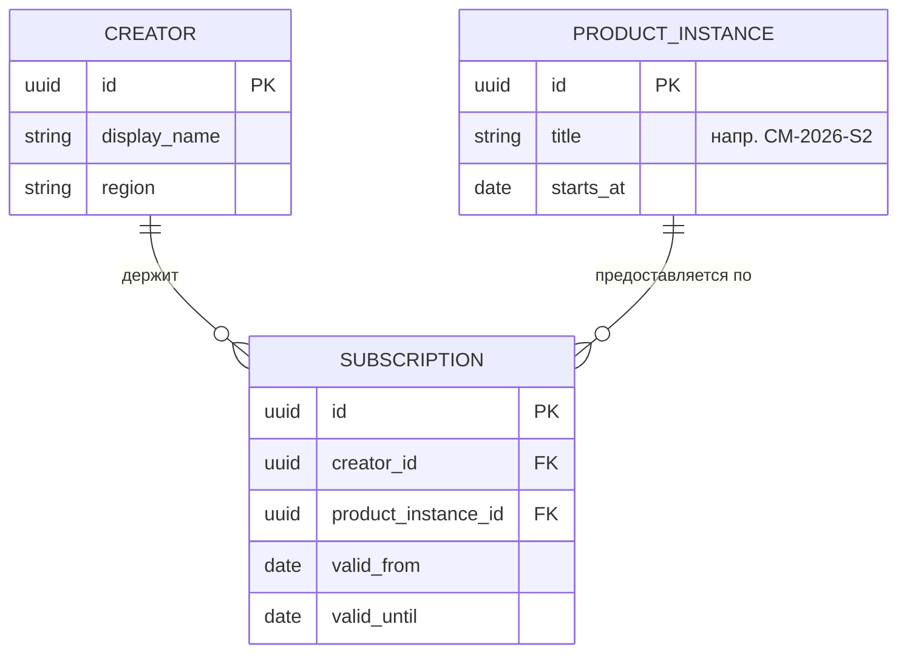

# DP.METHOD.040 — Метод ER-моделирования

> **see DP.ARCH.004, WP-228 Ф9**
> Применяется при: проектировании новой БД, ревизии существующей схемы, переделке ER-диаграмм после замечания «показано не то».

## §1 Принципы

1. **ER ≠ Физ.схема БД** (→ `.claude/rules/distinctions.md`). ER — концептуальная модель сущностей физ.мира. Физ.схема — таблицы, колонки, индексы, FK. Первое предшествует второму; второе выводится из первого по правилам §3.
2. **Сущность на ER = объект физ.мира**, на который можно «показать пальцем» и которому можно дать имя собственное. Человек. Договор. Сервер. Курс. Платёж.
3. **Отношение ≠ сущность.** Интеграция, сессия, запрос, подключение — это связи между объектами. На ER — линия, не узел. Только если у отношения есть самостоятельные атрибуты, время жизни и идентичность (M:N-связка с историей, контракт с условиями) — его поднимают до сущности.
4. **Экземпляр, а не абстракция.** Продукт — физ.объект, если это **конкретный** курс «СМ-2026-S2» или семинар «Подписка-план 19.04.2026 в 15:00». Абстрактный `Product`-каталог — техническая абстракция, не физ.объект.
5. **Слабая сущность → составной PK.** Если сущность существует только в контексте родителя (позиция заказа, элемент списка) — её PK включает PK родителя.
6. **Наследование на ER → один из трёх паттернов в физ.схеме** (§3.4).
7. **Технические таблицы (audit_log, sessions, request_cache) НЕ входят в ER концептуального уровня.** Они появляются только на физической схеме.

## §2 Нотация

Используется **notation Chen** (не Crow's foot). Причина: Chen различает атрибуты сущности и атрибуты связи, что помогает при §3 трансформации.

**Элементы:**
- **Прямоугольник** — сущность (объект физ.мира).
- **Ромб** — связь (relationship).
- **Овал** — атрибут.
- **Двойной овал** — многозначный атрибут.
- **Подчёркнутый атрибут** — ключевой.
- **Двойной прямоугольник** — слабая сущность.
- **Двойной ромб** — идентифицирующая связь (для слабой сущности).
- **Кардинальность** — на линии связи: `1`, `N`, `(min, max)`.

**Mermaid-эквивалент (для встраивания в документацию):**

Mermaid упрощает нотацию (не различает ромб), но пригоден для концептуального уровня при соблюдении §1.

## §3 Правила трансформации ER → RDBMS

### §3.1 Сущность → Таблица
Каждая сущность становится таблицей. Атрибуты → колонки. Ключевой атрибут → PK.

### §3.2 Связь 1:1
- Если обязательная с обеих сторон → слить в одну таблицу.
- Если опциональная с одной стороны → FK в таблице опциональной стороны (NULL допустим).

### §3.3 Связь 1:N
FK в таблице на стороне N. Без промежуточных таблиц.

### §3.4 Связь M:N
Промежуточная таблица-связка с составным PK из FK обеих сторон. **Это техническая таблица, на концептуальной ER не показывается как сущность, только как ромб с кардинальностью N:M.** На физической схеме появляется.

Пример: `Creator M:N Role` → физ.схема `creators`, `roles`, `role_assignments(creator_id, role_code, valid_from)`.

### §3.5 Наследование (IS-A)
Три паттерна физ.схемы:
- **STI (Single Table Inheritance)** — одна таблица для всех подклассов + дискриминатор-колонка. Годится при тонких подклассах и большинстве общих атрибутов.
- **CTI (Class Table Inheritance)** — родительская таблица + по одной таблице на подкласс с FK на родителя. Годится при существенно разных атрибутах.
- **Table-per-class** — по одной таблице на подкласс без родительской. Годится при несвязанных подклассах.

Выбор — по ADR в документе архитектуры соответствующей БД.

### §3.6 Слабая сущность
Составной PK из FK родителя + локального ключа. CASCADE DELETE.

### §3.7 Многозначный атрибут
Выносится в отдельную таблицу с FK на исходную сущность.

## §4 Чек-лист проверки ER-диаграммы

Перед публикацией ER-диаграммы пройти:

- [ ] **Каждая сущность — объект физ.мира.** Тест: «Можно ли экземпляру дать имя собственное и показать пальцем?» Нет → это не сущность, удалить или превратить в связь.
- [ ] **Нет технических таблиц.** Нет `audit_log`, `user_sessions`, `request_cache`, `migrations`, `health_checks` как сущностей. Если они есть в физ.схеме — они появляются только на схеме, не на концептуальной ER.
- [ ] **Нет промежуточных M:N-таблиц как сущностей.** `role_assignments` → ромб «имеет роль» между Creator и Role, не узел.
- [ ] **Абстрактные каталоги конкретизированы.** Вместо `Product` → `ProductInstance` с примером имени («СМ-2026-S2»). Вместо `Subscription` (тип) → `Subscription` (экземпляр-контракт с датами).
- [ ] **Каждая сущность имеет хотя бы одну связь** (иначе — изолированный узел, либо связь не показана, либо сущность не относится к этой ER).
- [ ] **Кардинальности проставлены** на всех связях.
- [ ] **Если ER покрывает bounded context — BC обозначен.** Напр. «BC: Identity & Access».

## §5 Антипаттерны

1. **«Техническая ER».** На диаграмме `USER_SESSIONS`, `AUDIT_EVENTS`, `INTEGRATION_ATTEMPTS`. Это не сущности домена. → Удалить, оставить только для физ.схемы.
2. **«Абстрактный каталог».** На диаграмме `PRODUCT` без понимания, что это — тип курса или конкретный запуск. → Разнести: `ProductType` (мета) и `ProductInstance` (запуск с датой).
3. **«Отношение как сущность».** `INTEGRATION` — это связь «Creator ↔ External Service», не узел. → Линия между `CREATOR` и `EXTERNAL_SERVICE` с атрибутами связи (provider, scope).
4. **«Одна ER на всё».** Попытка уместить 12 БД на одну ER (согласно [DP.ARCH.004](../02-domain-entities/DP.ARCH.004-neon-data-architecture.md) §1 v2.3). → Одна ER на BC (bounded context), обзорная картинка §4.0 показывает кластеры, не детали.
5. **«Смешивание уровней».** На одной диаграмме объект «Человек» и таблица `users` (prefix snake_case). → Концептуальная ER: имена сущностей ПРОПИСНЫЕ/CamelCase, доменный язык (Creator, не user). Физ.схема: snake_case таблицы.

## §6 Области применения в платформе

| Документ | Уровень | Что показывает |
|----------|---------|----------------|
| `DP.ARCH.004 §4.0` | Обзор | 12 БД как кластеры + связи между ними (по одному узлу на БД, без таблиц) — согласно §1 v2.3 |
| `DP.ARCH.004 §5` | Концептуальная ER | Одна ER на BC (Identity & Access, Payment, Activity, etc.) — только физ.объекты |
| `DP.ARCH.004 §8` | Физ.схема | Таблицы с колонками, FK, типами (Writers/Readers) |

## §7 Как применять

1. При **новой БД:** сначала §5 (концептуальная ER), потом §8 (физ.схема) по правилам §3. НЕ наоборот.
2. При **ревизии:** проверить §4 чек-лист. Если есть ❌ — переделать ER, физ.схему оставить как есть.
3. При **росте** (новая сущность): сначала добавить на концептуальную ER, проверить §4, потом — миграция физ.схемы.

## §8 Связи

- Источник замечания: ИТ-встреча 19 апр 2026, Андрей.
- Различения: `.claude/rules/distinctions.md` AUTHOR (ER ≠ Физ.схема; Объект ≠ Отношение).
- Применение: `DP.ARCH.004-neon-data-architecture.md` §4.0 и §5 (переделка в WP-228 Ф8-Ф9).
- Решения: `DP.ARCH.004-decisions.md` ADR-003.
